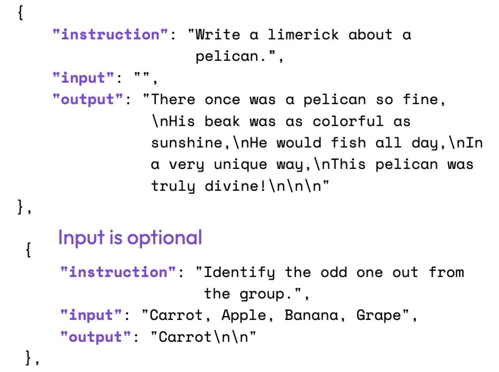
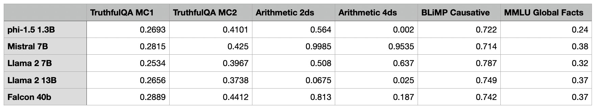
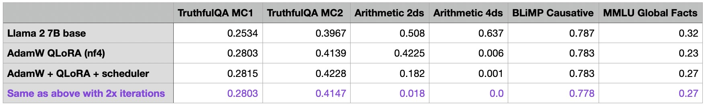
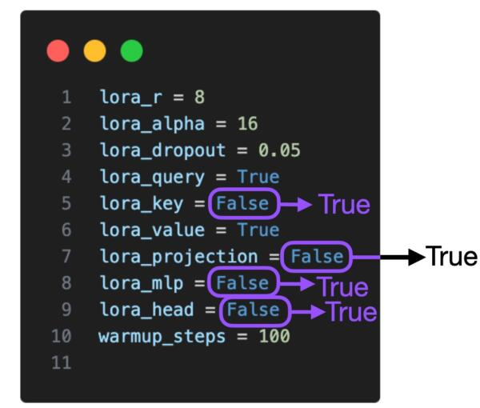

# 使用LoRA和QLoRA微调LLMs：数百次实验的见解

# 提要
`LoRA`是用于训练自定义`LLM`的最广泛使用、参数效率最高的微调技术之一。从使用`QLoRA`节省内存到选择最佳 `LoRA`设置，本文为有兴趣应用它的人提供了实用的见解。

# 引言：充分利用LoRA
在过去的几个月里，我已经进行了数百次涉及`LoRA`的实验。几周前，我花时间深入研究了一些`LoRA`超参数的选择。

这更像是一本按顺序呈现的实验日记。我希望它对一些人有用。具体来说，我的目标是解决有关`QLoRA`的价值、是否用`SGD`替换`AdamW`、`scheduler`的潜在用途以及如何调整`LoRA`超参数的问题。

实验方面有很多内容需要讨论，因此我将简要介绍`LoRA`。

简而言之，`LoRA`是`Low-Rank Adaptation`的缩写（[Hu et al 2021](https://arxiv.org/abs/2106.09685)），他在模型中添加少量可训练参数，而原始模型参数保持冻结。

`LoRA`将权重矩阵分解为两个较小的权重矩阵，如下图所示，以以更有效的参数方式近似于完全监督微调。

有关`LoRA`的更多详细信息，请参阅我的深度解析文章[Parameter-Efficient LLM Finetuning With Low-Rank Adaptation (LoRA)](https://lightning.ai/pages/community/tutorial/lora-llm/)

我们将在本文中讨论以下主题：
1. 评估任务和数据集
2. 代码框架
3. 选择良好的基础模型
4. 评估`LoRA`默认值
5. 使用`QLoRA`节省内存
6. 学习率调度（`scheduler`）计划和`SGD`
7. 多次迭代数据集
8. `LoRA`超参数调节（一）：训练所有层的`LoRA`
9. `LoRA`超参数调节（二）：增加`R`
10. `LoRA`超参数调节（三）：更改`Alpha`
11.  `LoRA`超参数调节（四）：非常大的`R`
12. 排行榜展示
13. 结论
# 评估任务和数据集
本文的重点是选择最佳参数。为了保持在合理的范围内，我保持数据集固定，并仅专注于`LLMs`的监督指令微调（`SFT`）

对于模型评估，我从`Eleuther AI`的[评估工具](https://github.com/EleutherAI/lm-evaluation-harness/tree/master)中选择了一小部分任务，包括[TruthfulQA](https://github.com/sylinrl/TruthfulQA)、[BLiMP Causative](https://github.com/alexwarstadt/blimp)、 [MMLU Global Facts](https://github.com/hendrycks/test)以及具有两位数（算术 2ds）和四位数字（算术 4ds）的简单算术任务。

在每个基准测试中，模型性能得分都标准化在0和1之间，其中1是满分。`TruthfulQA`展示两个分数，定义如下：
 - MSC1：给定一个问题和4~5个答案选项，选择唯一正确的答案。模型选择的答案是它认为完成问题的对数概率最高的答案选项，与其他答案选项无关。得分即为所有问题的简单准确率。
 - MSC2：给定一个问题和多个真/假参考答案，得分就是分配给一组真答案的归一化总概率。

作为参考，175B GPT-3模型的`TruthfulQA` MC1和MC2值分别为0.21和0.33。

下面通过两个例子来说明算术2ds和算术4ds之间的区别：

 - 算术2ds：“59减38等于多少”。“21”
 - 算术4ds：“2762加2751等于多少”。“5513”

如上所述，我保持数据集固定，使用经过充分研究或相当常用的[Alpaca 数据集](https://github.com/gururise/AlpacaDataCleaned)进行监督指令微调。当然，还有许多其他数据集可用于指令微调，包括`LIMA`、`Dolly`、`LongForm`、`FLAN`等。当然，探索多个数据集和数据集混合的训练将是未来研究的一个有趣的主题。

Alpaca数据集由大约50k个用于训练的指令-响应对组成，输入长度的中位数为110个token（使用Llama 2 [SentencePiece](https://github.com/google/sentencepiece) tokenizer），如下面的直方图所示。


数据集任务本身的结构如下图所示。


# 代码框架
我在本文中使用的自定义`LLM`微调代码基于开源的[Lit-GPT存储库](https://github.com/Lightning-AI/lit-gpt)。为了使本文保持简短，我不会详细介绍使用细节，但您可以在[此处的](https://github.com/Lightning-AI/lit-gpt/tree/main/tutorials)`Lit-GPT`教程部分找到更详细的介绍。

简单来说，用法如下：

（1）克隆存储库并安装依赖
```shell
git clone https://github.com/Lightning-AI/lit-gpt 

cd lit-gpt 

pip install -rrequirements.txt
```

（2）下载模型权重文件
```shell
python scripts/download.py \
  --repo_id mistralai/Mistral-7B-Instruct-v0.1

python scripts/convert_hf_checkpoint.py \
  --checkpoint_dir checkpoints/mistralai/Mistral-7B-Instruct-v0.1
```

（3）准备数据集
```shell
python scripts/prepare_alpaca.py \
  --checkpoint_dir checkpoints/mistralai/Mistral-7B-Instruct-v0.1

# 也可以加载本地CSV文件
python scripts/prepare_csv.py \
  --csv_dir MyDataset.csv \
  --checkpoint_dir checkpoints/mistralai/Mistral-7B-Instruct-v0.1
```

（4）微调
```shell
python finetune/lora.py \
  --checkpoint_dir checkpoints/mistralai/Mistral-7B-Instruct-v0.1/ \
  --precision bf16-true
```

（5）合并`LoRA`权重
```shell
python scripts/merge_lora.py \
  --checkpoint_dir "checkpoints/mistralai/Mistral-7B-Instruct-v0.1" \
  --lora_path "out/lora/alpaca/Mistral-7B-Instruct-v0.1/lit_model_lora_finetuned.pth" \
  --out_dir "out/lora_merged/Mistral-7B-Instruct-v0.1/"

cp checkpoints/mistralai/Mistral-7B-Instruct-v0.1/*.json \
  out/lora_merged/Mistral-7B-Instruct-v0.1/
```

（6）评估
```shell
python eval/lm_eval_harness.py \
  --checkpoint_dir "out/lora_merged/Mistral-7B-Instruct-v0.1/" \
  --eval_tasks "[arithmetic_2ds, ..., truthfulqa_mc]" \
  --precision "bf16-true" \
  --batch_size 4 \
  --num_fewshot 0 \
  --save_filepath "results.json"
```

（7）推理
```shell
python chat/base.py \ 
  --checkpoint_dir "out/lora_merged/Mistral-7B-Instruct-v0.1/"
```

# 选择一个好的基础模型
 - 第一个任务是为`LoRA`实验选择一个合适的基础模型。为此，我重点关注尚未进行指令微调的模型：[phi-1.5 1.3B](https://arxiv.org/abs/2309.05463)、[Mistral 7B](https://arxiv.org/abs/2310.06825)、[Llama 2 7B](https://arxiv.org/abs/2307.09288)、[Llama 2 13B]和[Falcon 40B](https://falconllm.tii.ae/)。请注意，所有实验均在单个A100 GPU上运行。

从上表中我们可以看到，`Mistral 7B`模型在数学基准测试中表现非常出色。与此同时，`phi-1.5 1.3B`型号由于其相对较小的尺寸，展示了令人印象深刻的`TruthfulQA`MC2性能。由于某种原因，`Llama 2 13B`在算术基准测试中表现不佳，而较小的`Llama 2 7B`在该领域表现明显优于它。

由于研究人员和实践者目前推测`phi-1.5 1.3B`和`Mistral 7B`可能已经接受过基准测试数据的训练，因此我选择不在我的实验中使用它们。此外，我相信选择剩余模型中最小的模型将提供最大的改进空间，同时保持较低的硬件要求。因此，本文的其余部分将重点关注`Llama 2 7B`。

# 评估LoRA默认值
首先，我使用以下默认设置评估了`LoRA`微调模型（这些设置可以在[finetune/lora.py](https://github.com/Lightning-AI/lit-gpt/blob/bf60124fa72a56436c7d4fecc093c7fc48e84433/finetune/lora.py#L38)脚本中更改）：
```python
learning_rate = 3e-4
batch_size = 128
micro_batch_size = 1
max_iters = 50000  # train dataset size
weight_decay = 0.01
lora_r = 8
lora_alpha = 16
lora_dropout = 0.05
lora_query = True
lora_key = False
lora_value = True
lora_projection = False
lora_mlp = False
lora_head = False
warmup_steps = 100
```
（请注意，batch size为128，但我们使用batch size为1的梯度累积来节省内存；这回产生与batch size为128的常规训练完全相同的训练轨迹。如果您对梯度累积的工作感到好奇，请参阅我的文章[Finetuning LLMs on a Single GPU Using Gradient Accumulation](https://lightning.ai/blog/gradient-accumulation/)）

此配置在总共6,738,415,616个可训练参数中训练了4,194,304个`LoRA`参数，在我的机器上使用单个A100花费了大约1.8小时。最大内存使用量为21.33GB。

为了衡量方差，我重复实验了3次，以观察模型性能波动。

正如我们在上表中看到的，各模型之间的性能非常一致和稳定。还值得注意的是，`LoRA default`模型在算术方面变的非常糟糕，但这可能是可以预料的，因为据我所知，`Alpaca`不包含任何算术任务。

另外，我还看了`Meta`使用`RLHF`进行指令微调的`Llama2 7B`版本。从下表中我们可以看出，`Meta`的`Llama 2 Chat`模型的算术性能也较差。然而，`Chat`模型在其他基准测试（`BLiMP`除外）上有了很大改进，我们可以将其用做`LoRA`微调的参考。


# 使用QLoRA节省内存
在开始调整`LoRA`超参数之前，我想探索`QLoRA`（[Dettmers 等人](https://arxiv.org/abs/2305.14314)流行的量化 `LoRA`技术）提供的建模性能和内存节省之间的权衡。

我们可以通过`Lit-GPT`中的`--quantize`标志（此处为4位普通浮点类型） 启用`QLoRA`，如下所示：

另外，我还尝试了4位浮点精度作为对照。以下是对训练时间和最大内存使用量的影响：

默认`LoRA`（使用`bfloat-16`）：
 - 训练时间：6685.75s
 - 使用内存：21.33GB

`QLoRA`通过`--quantize "bnb.nf4"`：
 - 训练时间：10059.53s
 - 使用内存：14.18GB

`QLoRA`通过`--quantize "bnb.fp4"`：
 - 训练时间：9334.45s
 - 使用内存：14.19GB

可以看到`QLoRA`将内存需求减少了近6GB。然而，代价是训练时间慢了30%，由于额外的量化和反量化步骤，这是可以预料的。

接下来我们看看`QLoRA`训练对模型性能有什么影响：

从上表可以看出，与普通`LoRA`相比，`QLoRA`对模型性能的影响较小。该模型在算术基准上有所改进，但在 `MMLU Global Facts`基准上有所下降。

由于所节省的内存相当可观（通常超过了更长的训练时间，因为它允许用户在较小的 GPU 上运行模型），因此我将在本文的剩余部分使用`QLoRA`。

# 学习率调度（`scheduler`）计划和`SGD`
我在之前的所有实验中都使用了`AdamW`优化器，因为它是`LLM`训练的常见选择。然而，众所周知，`AdamW`优化器可能非常占用内存。这是因为它会为每个模型参数引入两个额外的参数（矩`m`和`v`）。大型语言模型（`LLM`）有很多模型参数，例如我们的`Llama 2`模型就有 70 亿个模型参数。

本节探讨是否值得将`AdamW`替换为`SGD`优化器。然而，对于`SGD`优化器来说，引入学习率调度器尤为重要。我选择了余弦退火计划，该计划会降低每个`batch`更新后的学习率。


如果您对在`PyTorch`中使用学习率调度程序的更多细节感兴趣，我在[这里](https://lightning.ai/courses/deep-learning-fundamentals/unit-6-overview-essential-deep-learning-tips-tricks/unit-6.2-learning-rates-and-learning-rate-schedulers/)有一个关于它的讲座。

不幸的是，将`AdamW`替换为`SGD`仅节省了少量内存。
 - `AdamW`：14.18 GB
 - `SGD`：14.15 GB

这可能是因为大部分内存都花在大型矩阵乘法上，而不是在内存中保留其他参数。

但这种微小的差异或许是意料之中的。使用当前选择的`LoRA`配置 (`r=8`)，我们有4,194,304个可训练参数。如果 `AdamW`为每个模型参数添加`2`个附加值（存储在16位浮点数中），则我们有$4194304 \times  2 \times 16\ bit = 134.22\ megabits = 16.78\ megabytes$。

当我们将`LoRA`的`r`增加到256时，我们可以观察到更大的差异，我们稍后会这样做。在$r = 256$的情况下，我们有648,871,936个可训练参数，使用与上述相同的计算，会节省2.6GB的空间。实际测量结果存在3.4GB的差异，这可能是由于存储和复制优化器状态方面的一些额外开销造成的。

对于少量可训练参数，例如在`LoRA`和较低`r(rank)`值的情况下，将`AdamW`与`SGD`交换的内存增益可能非常小，与预训练相反，在预训练中我们训练更大的参数数量，此时`SGD`的优势将会突出来。

尽管`SGD`在这里没有为我们提供显著的内存节省，但我们仍然快速的看一下最终的模型性能：

看来，`SGD`优化器的性能与`AdamW`不相上下。有趣的是，在`AdamW`中加入调度程序后，`TruthfulQA`MC2 和 `MMLU Global Facts`的性能有所提高，但算术性能却有所下降。(注：`TruthfulQA` MC2 是一个广受认可的基准，在其他公开排行榜中也有体现)。目前，我们不会过多强调算术性能，而是使用带有调度程序的`AdamW`进行其余实验。

如果你想重现这些实验，我发现最佳的`AdamW`学习率为 3e-4，衰减率为`0.01`。最佳 SGD 学习率为`0.1`，动量为 `0.9`。在这两种情况下，我都使用了额外的100步学习率预热。

(基于这些实验，余弦调度器已被添加到 Lit-GPT 中，并在[默认情况下启用](https://github.com/Lightning-AI/lit-gpt/pull/626)）。

# 多次迭代数据集
到目前为止，我已经用50k次迭代训练了所有模型（`Alpaca`数据集有50k训练样本）。进一步的问题是我们是否可以通过多次迭代训练集来提高模型性能，因此我以100k迭代运行了之前的实验：

有趣的是，迭代次数增加导致性能全面下降。算术基准的下降最为明显。我的假设是，Alpaca 数据集不包含任何相关的算术任务，当模型更专注于其他任务时，就会主动放弃学习基本算术。

总之，如果我说这一结果不受欢迎，那是在撒谎。这样，我就可以在本文的剩余部分继续进行较短的 50k 次迭代实验。

# `LoRA`超参数调节（一）：训练所有层的`LoRA`
现在，我们已经探索了有关`LoRA`微调脚本的基本设置，让我们把注意力转向`LoRA`超参数本身。默认情况下，`LoRA`只针对多头自注意模块中的关键矩阵和查询矩阵启用。现在，我们也为值矩阵、投影层和线性层启用了 `LoRA`。


# `LoRA`超参数调节（二）：增加`R`
最重要的`LoRA`参数之一是`r`，它决定了`LoRA`矩阵的秩或维度，直接影响模型的复杂性和容量。较高的`r`意味着更强的表现力，但会导致过拟合，而较低的`r`则会以牺牲表现力为代价减少过拟合。在所有层都启用`LoRA`的情况下，我们将`r`从`8`增加到`16`，看看这对性能有什么影响：

我们可以看到，仅仅增加`r`本身就会使结果变得更糟，那么到底发生了什么呢？让我们在下一节一探究竟。

#  `LoRA`超参数调节（三）：更改`Alpha`
在上一节中，我们增加了矩阵秩`r`，而`LoRA`的`alpha`参数保持不变。`α`越高，低秩结构或正则化就越受重视，而`α`越低，低秩结构或正则化的影响就越小，从而使模型更依赖于原始参数。调整`α`有助于在拟合数据和通过正则化模型防止过拟合之间取得平衡。

根据经验，在微调`LLM`时，通常选择两倍于`rank(r)`的`alpha`值（注意，这在处理扩散模型时有所不同）。让我们试一试，看看当我们将`alpha`增加两倍时会发生什么：


正如我们所看到的，将`alpha`值增加到32，可以得到迄今为止最好的模型！不过，我们也是通过增加需要训练的参数数量才获得了这一改进：

`r = 8`：
 - 可训练参数数量：20,277,248
 - 不可训练参数数量：6,738,415,616
 - 使用内存：16.42 GB

`r=16`：
 - 可训练参数数量：40,554,496
 - 不可训练参数数量：6,738,415,616
 - 使用内存：16.47 GB

不过，可训练参数的数量仍然很少，不会对峰值内存需求产生明显影响。

总之，我们现在终于开始有所收获，并以更明显的幅度提高了模型性能。那么，让我们继续努力，看看通过增加`rank`和`alpha`，我们还能将其提升到什么程度：

我还用特别大的`rank`（512、1024 和 2048)进行了额外的实验，但结果较差。有些实验在训练过程中甚至没有收敛，因此我没有将它们添加到表格中。

到目前为止，我们可以注意到，最后一行中`r=256`和`alpha=512`模型的整体性能是最好的。作为额外的对照实验，我重复了`alpha`值为1的运行，并注意到较大的`alpha`值确实是获得良好性能的必要条件：

我还重复了`alpha`为16和32的实验，观察到与选择`alpha`为2倍`rank`相比，性能同样较差。

# `LoRA`超参数调节（四）：非常大的`R`
在本文的最后一次调整实验中，我想进一步优化上一节中最佳模型的`alpha`值（r=256，最后一行），因为我怀疑这个值可能有点太大了。

从上表可以看出，在提高`r`时，选择较大的`alpha`值似乎至关重要。

对于`r=256`和`a=512`的`QLoRA`模型，我们的模型显然比基础模型有了显著的改进。与基础模型相比，微调模型唯一表现不佳的地方是四位数算术。不过，考虑到`Alpaca`数据集可能不包含此类训练示例，这也是可以理解的。

在上文，我们已经看到，将`alpha`选为`rank`的2倍（例如`r=256`和`alpha=512`）的常见建议确实产生了最佳结果，而较小的`alpha`值导致了较差的结果。但是，如果将`alpha`值提高到 `rank`两倍以上的值呢？


根据上表提供的结果，选择`alpha`，使其超过 "两倍于`rank` "的建议，也会使基准结果变得更糟。

# 排行榜展示
我们知道，在机器学习中，我们不应该多次使用测试集。否则，我们就有可能过度优化特定任务。因此，我们建议在最终的独立数据集上验证模型。

巧合的是，目前正在进行的[NeurIPS LLM Efficiency challenge](https://llm-efficiency-challenge.github.io/)的重点是在单个GPU上对`LLM`进行微调。由于我很想知道 `Llama-2 7B`基本模型与我们在`Alpaca`上微调的最佳`LoRA`模型的对比情况，因此我向他们的排行榜提交了基本模型和微调模型。


我们可以看到，`(Q)LoRA`微调的训练时间为10522.77 秒（约3小时)，在`r=256`设置下需要`19.24 GB GPU`内存，它提高了几个基准的性能，但不是所有基准。如果考虑`Alpaca`之外的其他微调数据集，并考虑`RLHF`等对齐技术，性能还有可能提高。

# 结论
本文探讨了我们在使用`LoRA`训练自定义`LLM`时可以调整的各种参数。我们发现，`QLoRA`虽然会增加运行时间成本，但却能极大地节省内存。此外，虽然学习率调度计划也有好处，但在`AdamW`和`SGD`优化器之间进行选择几乎没有什么区别。对数据集进行多次迭代会使结果更糟。通过优化`LoRA`设置（包括rank）可以获得最佳性价比。提高`rank`会带来更多的可训练参数，这可能会导致更高的过拟合程度和运行时间成本。不过，在增加`rank`时，选择适当的`alpha`值非常重要。

本文并非详尽无遗，因为我没有时间和资源去探索所有可能的配置。此外，未来还可以通过考虑其他数据集和模型来实现改进。

我希望您能从中获得启示，并将其应用到您的项目中。我尽量减少了关于`LoR`、学习率调度计划、梯度累积等各种概念的背景信息和解释，以免这篇文章变得过于冗长。不过，如果你有任何问题或疑虑，我非常乐意与你聊天。