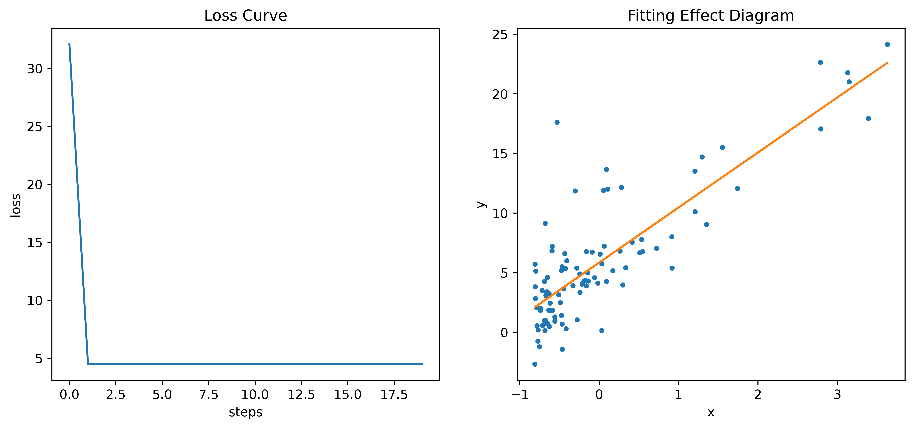

# 梯度下降算法在线性回归中的应用

## 线性回归符号约定

一元线性回归常见表达式：
$$
y = kx+b
$$
将上式中的$y$变为$h_\theta(x)$，$b$变为$\theta_0$，$a$变为$\theta_1$，$x$变为$x_1$，则变为：
$$
h_\theta(x) = \theta_0 + \theta _1 x_1
$$
为了数学表达规范，在$\theta_0$后面乘上$x_0$，并且令$x_0 = 1$则变为：
$$
h_\theta(x) = \theta_0 x_0 + \theta_1x_1
$$
将上述式子推广到多元，就得到了：
$$
h_\theta(x) = \theta_0x_0 + \theta_1x_1 + \theta_2x_2 + \cdots + \theta_nx_n
$$
写成求和符的形式：
$$
h_\theta(x) = \sum^{n}_{i=0}\theta_ix_i
$$
写向量相乘的形式（在不进行说明的情况下，向量为列向量）：
$$
h_\theta(x) = \theta^Tx\\
\theta^T = 
\begin{bmatrix}
\theta_0, \theta_1,\theta_2,\cdots,\theta_n
\end{bmatrix}\\
x = 
\begin{bmatrix}
x_0\\
x_1\\
x_2\\
\vdots\\
x_n
\end{bmatrix}\\
$$
请注意，$x_0$是==始终等于1==的，这一项表示线性函数的常数项。总结一下上面的形式，得到线性回归的==假设函数==：
$$
h_{\theta}(x) = \sum^{n}_{i=0}\theta_ix_i = \theta^Tx
$$
线性回归的==损失函数==定义为预测值$h_\theta(x)$与目标值$y$之间差值的平方，数学表达式为：
$$
L(\theta) = (h_\theta(x) - y)^2
$$
上面的损失函数用来计算单个点与真实值的偏差，那么对于全部数据的损失则通过==代价函数==来计算，数学表达式为：
$$
\begin{align}
J(\theta) &= \frac{1}{2}\frac{1}{m}\sum^{m}_{i=1}(h_\theta(x^{(i)}) - y^{(i)})^2\\
&=\frac{1}{2m}\sum^{m}_{i=1}(h_\theta(x^{(i)}) - y^{(i)})^2
\end{align}
$$

其中，$m$表示样本数量，$x^{(i)}$表示第$i$个样本，是一个列向量。抛开前面的$\frac{1}{2}$，实际上就是在计算所有样本预测值与目标值之间差值平方和的均值。至于为什么要多乘$\frac{1}{2}$​，是为了后面对代价函数求导的时候简化计算，等到后面大家就知道了。

## 梯度下降法

关于梯度下降算法的数学推导这里就不做太多的解释，直接以一个例子来说明。比如求
$$
J(\theta) = \theta^2 + 2\theta + 5
$$
最小值。

则梯度为$J(\theta)$对$\theta$​的==偏导==：
$$
\nabla J(\theta) = \frac{\partial J(\theta)}{\theta} = 2\theta+2
$$
给定学习率$\alpha=0.06$，$\theta$随机初始化为3（下式中$\theta$的上标$(i)$表示$\theta$第$i$次迭代后的数值），则梯度下降算法的第一次迭代：
$$
\begin{align}
\theta^{(1)} &= \theta^{(0)} - \alpha\nabla J(\theta^{(0)})\\
&=3 - 0.06 \times (2 \times 3 + 2)\\
&=2.52
\end{align}
$$
第二次迭代：
$$
\begin{align}
\theta^{(2)} &= \theta^{(1)} - \alpha\nabla J(\theta^{(1)})\\
&=2.52 - 0.06 \times (2 \times 2.52 + 2)\\
&=2.0976
\end{align}
$$
后面的我就不继续写了，经过一定次数的迭代，函数的值会持续变小，最终会收敛到最小值（注意！因为这里是一个比较简单的凹函数，所以我用了最小值的概率。实际上在大部分情况下应该为极值，因为对于复杂的问题，很难得到全局最值，只能得到局部最值，也就是极值）

## 梯度下降算法求解线性回归

从上面整理的线性回归==代价函数$J(\theta)$==来看，代价函数$J(\theta)$越小，说明函数拟合的越好。那么我们使用梯度下降算法，让代价函数损失最小化。假设目标函数是多元线性回归，也就是存在多个$\theta$，且$\theta$的数量为$j$个，$\theta_j$表示第$j$个$\theta$的值。
$$
\begin{align}
\frac{\partial}{\partial\theta_j}J(\theta) &= \frac{\partial}{\partial\theta_j} \frac{1}{2m}\sum^{m}_{i=1}(h_\theta(x^{(i)}) - y^{(i)})^2\\
&=\frac{1}{2m} \times \left[ 2 \times \sum_{i=1}^{m}\left(h_\theta(x^{(i)}) - y^{(i)}\right)\right] \times \frac{\partial}{\partial \theta_j} \left(h_\theta(x^{(i)}) - y^{(i)}\right)\\
&=\frac{1}{2m} \times \left[ 2 \times \sum_{i=1}^{m}\left(h_\theta(x^{(i)}) - y^{(i)}\right)\right] \times \frac{\partial}{\partial \theta_j} \left(\sum_{j=0}^{n}\theta_jx_j^{(i)} - y^{(i)}\right)\\
&=\frac{1}{m}\sum_{i=1}^{m}\left[\left(h_\theta(x^{(i)}) - y^{(i)}\right)x_j^{(i)}\right]
\end{align}
$$
根据梯度下降算法公式，迭代公式为：
$$
\theta_j := \theta_j + \alpha\frac{1}{m}\left[\left(y^{(i)}-h_\theta(x^{(i)})\right)x_j^{(i)}\right]
$$
上面的$:=$符号表示先算右边的式子，算完后赋值给左边的变量。注意：左边和右边的$\theta_i$值并不相等，右边是迭代前的$\theta_i$值，左边的迭代后$\theta_i$的值。

### python代码实现

- 导入必要包

```python
import numpy as np
import statsmodels.api as sm
from tqdm.notebook import tqdm
import matplotlib.pyplot as plt
from sklearn.datasets import fetch_california_housing, make_regression
```

- 加载数据函数

```python
def load_data(data_path):
    data = np.loadtxt(data_path,delimiter=',')
    n = data.shape[1]-1
    data_x = data[:,0:n]
    data_y = data[:,-1].reshape(-1,1)
    return data_x,data_y
```

- 特征标准化函数

```python
def data_std(data_x):
    mu = np.average(data_x, axis=0)
    sigma = np.std(data_x, axis=0, ddof=1)
    data_x = (data_x-mu)/sigma
    return data_x, mu, sigma
```

- 特征标准化的必要性：当特征的尺度差异很大时，代价函数的等高线图可能是一个狭长的椭圆形。在这种情况下，如果使用未经标准化的数据，梯度下降可能需要很多迭代才能到达最小值点，因为更新步长会在不同维度上不均衡。标准化可以使得各特征具有相似的尺度，从而使梯度下降更快地收敛。
- 损失函数

```python
def compute_loss(data_x, data_y, theta):
    row_num = data_x.shape[0]
    return np.sum(np.power(np.dot(data_x,theta)-data_y,2))/(2*row_num)
```

- 线性回归函数

```python
def linear_reg(data_x, data_y, theta, alpha, steps):
    loss_list = []
    temp_ones = np.ones(data_x.shape[0]).transpose()
    data_x = np.insert(data_x, 0, values=temp_ones, axis=1)
    row_num, col_num = data_x.shape
    for step in tqdm(range(steps)):
        loss_list.append(compute_loss(data_x, data_y, theta))
        for i in range(col_num):
            theta[i] = theta[i]+(alpha/row_num)*(np.sum(data_y - np.dot(data_x, theta)*data_x[:,i].reshape(-1,1)))
    return theta, loss_list
```

- ==关键行为==：在$x$数据前添加全1列（即上文提到的$x_0 = 1$），作为常数项；更新权重参数。
- 函数调用

```python
data_x, data_y = load_data('/kaggle/input/studyml/data1.txt')
data_x, mu, sigma = data_std(data_x)
# 初始化权重
theta = np.zeros(data_x.shape[1]+1).reshape(-1,1)
steps = 400
alpha = 0.0065
theta, loss = linear_reg(data_x, data_y, theta, alpha, steps)
print(theta)
# 打印结果：[[5.4091][5.4535]]
```

- ==关键行为==：特征标准化；全零初始化权重（注意要记得常数项）；设定学习率；设定迭代次数；打印最终权重参数。
- 绘制Loss曲线（左）和拟合效果图（右）

```python
plt.figure(figsize=(12,5),dpi=600)
plt.subplot(1,2,1)
plt.title("Loss Curve")
plt.xlabel("steps")
plt.ylabel("loss")
plt.plot(loss)
plt.subplot(1,2,2)
plt.plot(data_x, data_y, ".")
plt.plot(data_x, theta[0]+theta[1]*data_x)
plt.title("Fitting Effect Diagram")
plt.xlabel("x")
plt.ylabel("y")
plt.show()
```


## 梯度下降算法求解岭回归

岭回归在线性回归的基础上引入了L2正则化，用于惩罚大的回归系数。减轻了多重共线性和过拟合的影响，是一种更为稳健的回归技术，尤其适用于特征间存在高度相关性或特征数量大于样本数量的情况。

岭回归的目标函数变为：
$$
\begin{align}
J(\theta) &= \frac{1}{2m}\sum^m_{i=1}\left(h_\theta(x^{(i)} - y^{(i)}\right)^2 + \lambda \lVert \theta \rVert_2^2\\
&=\frac{1}{2m}\sum^m_{i=1}\left(h_\theta(x^{(i)} - y^{(i)}\right)^2 + \lambda\sum_{j=0}^n\theta_j^2
\end{align}
$$
目标函数对$\theta$的偏导数：
$$
\begin{align}
\frac{\partial}{\partial\theta_j}J(\theta) &= \frac{\partial}{\partial\theta_j} \frac{1}{2m}\sum^{m}_{i=1}(h_\theta(x^{(i)}) - y^{(i)})^2 + \lambda\sum_{j=0}^n\theta_j^2\\
&=\frac{1}{m}\sum_{i=1}^{m}\left[\left(h_\theta(x^{(i)}) - y^{(i)}\right)x_j^{(i)}\right] + 2\lambda\theta_j
\end{align}
$$


根据梯度下降算法公式，迭代公式为：
$$
\theta_j := \theta_j + \alpha\frac{1}{m}\left[\left(y^{(i)} - h_\theta(x^{(i)}) \right)x_j^{(i)}\right] -2\lambda\theta_j
$$

### python代码实现

- 岭回归函数

```python
def ridge_reg(data_x, data_y, theta, alpha, steps, lamda=0.02):
    loss_list = []
    temp_ones = np.ones(data_x.shape[0]).transpose()
    data_x = np.insert(data_x, 0, values=temp_ones, axis=1)
    row_num, col_num = data_x.shape
    for step in tqdm(range(steps)):
        loss_list.append(compute_loss(data_x, data_y, theta))
        for i in range(col_num):
            theta[i] = theta[i]+(alpha/row_num)*(np.sum(data_y - np.dot(data_x, theta)*data_x[:,i].reshape(-1,1))) - 2*lamda*theta[i]
    return theta, loss_list
```

- 函数调用

```python
data_x, data_y = load_data('/kaggle/input/studyml/data1.txt')
data_x, mu, sigma = data_std(data_x)
theta = np.zeros(data_x.shape[1]+1).reshape(-1,1)
steps = 400
alpha = 0.0065
theta, loss = ridge_reg(data_x, data_y, theta, alpha, steps, lamda=0.001)
print(theta)
# 打印结果：[[4.3183][4.3486]]
```

- 绘制Loss曲线（左）和拟合效果图（右）

```python
plt.figure(figsize=(12,5),dpi=600)
plt.subplot(1,2,1)
plt.plot(loss)
plt.title("Loss Curve")
plt.xlabel("steps")
plt.ylabel("loss")
plt.subplot(1,2,2)
plt.plot(data_x, data_y, ".")
plt.plot(data_x, theta[0]+theta[1]*data_x)
plt.title("Fitting Effect Diagram")
plt.xlabel("x")
plt.ylabel("y")
```


## 梯度下降算法求解LASSON回归

Lasso回归使用L1正则化，在损失函数中添加了所有权重绝对值的和的惩罚项。可以将一些特征的权重精确地缩减到零。

LASSON回归目标函数变为：
$$
\begin{align}
J(\theta) &= \frac{1}{2m}\sum^m_{i=1}\left(h_\theta(x^{(i)} - y^{(i)}\right)^2 + \lambda |\theta|_1\\
\end{align}
$$
在前面我们说过添加$\frac{1}{2m}$是为了数学上的便利，并非必要。即使没有前面的系数，目标函数仍然有效，因为优化算法（梯度下降）寻找的是目标函数的最小值点，而乘以一个正的常数并不改变函数的最小值位置。换句话说，无论目标函数乘以什么正的常数，最小化该目标函数所得到的参数$\theta$是相同的。为了数学表达式的简洁性，去掉前面的$\frac{1}{2m}$，因为括号平方里面的减数与被减数可以对调，再将$h_{\theta}$展开为一般式，得到了下面简化后的目标函数。
$$
J(\theta) = \sum^m_{i=1}\left(y^{(i)} - \sum_{j=0}^n\theta_jx_j^{(i)}\right)^2 + \lambda\sum_{j=0}^n|\theta_j|
$$
先对加号前面的部分进行求导：
$$
\begin{align}
\frac{\partial}{\partial\theta_k}RSS(\theta) &= \frac{\partial}{\partial\theta_k}\sum^m_{i=1}\left(y^{(i)} - \sum_{j=0}^n\theta_jx_j^{(i)}\right)^2\\
&=2 \sum_{i=1}^{m} \left(y^{(i)} - \sum_{j=0}^n\theta_jx_j^{(i)}\right)(-x_k^{(i)})\\
&=-2 \sum_{i=1}^{m} \left(x_k^{(i)}y^{(i)}- x_k^{(i)}\sum_{j=0}^{n}\theta_jx_j^{(i)}\right)\\
&=-2 \sum_{i=1}^{m} \left[x_k^{(i)}y^{(i)} - x_k^{(i)} \sum_{j=0,j\neq k}^n\left(\theta_jx_j^{(i)} + \theta_kx_k^{(i)}\right)\right]\\
&=-2 \sum_{i=1}^{m} \left[x_k^{(i)}y^{(i)} - \left(x_k^{(i)} \sum_{j=0,j\neq k}^n \theta_jx_j^{(i)}\right) - \theta_k\left(x_k^{(i)}\right)^2\right]\\
&=-2\sum_{i=1}^{m}\left[x_k^{(i)}\left(y^{(i)} - \sum_{j=0,j\neq k}^n\theta_jx_j^{(i)}\right)\right] + 2\theta_k\sum_{i=1}^m\left(x_k^{(i)}\right)
\end{align}
$$
令：
$$
\begin{align}
p_k &= \sum_{i=1}^m\left[x_k^{(i)}\left(y^{(i)} - \sum_{j=0,j\neq k}^n \theta_jx_j^{(i)}\right)\right]\\
z_k &= \sum_{i=1}^m\left(x_k^{(i)}\right)^2
\end{align}
$$
则：
$$
\frac{\partial}{\partial\theta_k}RSS(\theta) = -2p_k + 2\theta_kz_k
$$
现在对加号后面的L1正则化求偏导：
$$
\frac{\partial}{\partial\theta_k}R(\theta) =\frac{\partial}{\partial\theta_k}\lambda\sum_{j=0}^{n}|\theta_j|=
\begin{cases}
-\lambda & \theta_x<0\\
[-\lambda, \lambda]& \theta_k = 0\\
\lambda & \theta_k > 0
\end{cases}
$$
则$J(\theta)$对$\theta$的偏导数为：
$$
\frac{\partial}{\partial\theta_k}J(\theta) = -2p_k + 2\theta_kz_k +
\begin{cases}
-\lambda & \theta_x<0\\
[-\lambda, \lambda]& \theta_k = 0\\
\lambda & \theta_k > 0
\end{cases}
 = 
 \begin{cases}
-2p_k + 2\theta_kz_k - \lambda & \theta_x<0\\
[-2p_k - \lambda, -2p_k + \lambda] & \theta_k = 0\\
-2p_k + 2\theta_kz_k + \lambda & \theta_k > 0\\
\end{cases}
$$
令：
$$
\frac{\partial}{\partial\theta_k}J(\theta) = 0
$$
得：
$$
\theta_k = 
\begin{cases}
\frac{p_k + \frac{\lambda}{2}}{z_k} & p_k < -\frac{\lambda}{2}\\
0 & -\frac{\lambda}{2} \leq p_k \leq \frac{\lambda}{2}\\
\frac{p_k - \frac{\lambda}{2}}{z_k} & p_k > \frac{\lambda}{2}
\end{cases}
$$

### python代码实现

- LASSO回归

```python
def lasso_reg(data_x, data_y, theta, alpha, steps, lamda=0.02):
    temp_ones = np.ones(data_x.shape[0]).transpose()
    data_x = np.insert(data_x, 0, values=temp_ones, axis=1)
    row_num, col_num = data_x.shape
    loss_list = []
    for step in range(steps):
        loss_list.append(compute_loss(data_x, data_y, theta))
        for k in range(col_num):
            z_k = np.sum(data_x[:,k]**2)
            p_k = 0
            for i in range(row_num):
                temp = np.sum([data_x[i,j]*theta[j] for j in range(col_num) if j != k])
                p_k = p_k + data_x[i,k] * (data_y[i] - temp)
            if p_k+(lamda/2) < 0:
                theta[k] = (p_k + (lamda/2))/z_k
            elif p_k-(lamda/2) > 0:
                theta[k] = (p_k - (lamda/2))/z_k
            else:
                theta[k] = 0
    return theta, loss_list
```

- 函数调用

```python
data_x, data_y = load_data('/kaggle/input/studyml/data1.txt')
data_x, mu, sigma = data_std(data_x)
# 变成列向量
theta = np.zeros(data_x.shape[1]+1).reshape(-1,1)
steps = 20
alpha = 0.0001
theta, loss = lasso_reg(data_x, data_y, theta, alpha, steps, lamda=0.02)
print(theta)
# 打印结果：[[5.8390, 4.6167]]
```

- 绘制Loss曲线（左）和拟合效果图（右）

```python
plt.figure(figsize=(12,5),dpi=600)
plt.subplot(1,2,1)
plt.plot(loss)
plt.title("Loss Curve")
plt.xlabel("steps")
plt.ylabel("loss")
plt.subplot(1,2,2)
plt.plot(data_x, data_y, ".")
plt.plot(data_x, theta[0]+theta[1]*data_x)
plt.title("Fitting Effect Diagram")
plt.xlabel("x")
plt.ylabel("y")
```



## 岭回归和LASSON回归对比

- 岭回归：
  - 岭回归使用L2正则化，即在损失函数中添加了所有权重的平方和的惩罚项。
  - 这意味着如果一个权重很大，它的平方会更大，从而对损失函数的贡献也更大，导致优化过程倾向于选择较小的权重值。
  - 岭回归可以减少权重的大小，但不会将它们精确地缩减到零，这意味着所有特征都会被保留，只是其影响可能被减弱。
  - 岭回归有助于处理多重共线性（当自变量之间存在强相关性时）的问题，因为它会平均分配这些变量的影响。
- LASSON回归：
  - Lasso回归使用L1正则化，即在损失函数中添加了所有权重绝对值的和的惩罚项。
  - 由于L1正则化是基于绝对值，它有“稀疏化”效应，意味着它可以将一些特征的权重精确地缩减到零，从而实现特征选择。
  - Lasso回归能够识别并消除不重要的特征，这在高维数据集中尤其有用，因为它可以帮助模型专注于最相关的特征。
  - 当特征数量大于样本数量时，Lasso回归仍然可以给出有意义的结果，而岭回归则可能表现不佳。

总结来说，如果你关心的是特征选择并且想要简化模型，Lasso回归可能是更好的选择。如果你更关心处理多重共线性和保持所有特征的信息，那么岭回归可能更适合。在实践中，通常会通过交叉验证来调整正则化参数，并根据具体任务的需求来选择合适的回归方法。

## 最小二乘法

最小二乘法是一种统计学方法，用于通过最小化误差平方和来找到数据的最佳函数匹配。最小二乘法的目标函数为：
$$
\begin{align}
J(\theta) &= \frac{1}{2}\sum^m_{i=1} \left(h_{\theta}\left(x^{(i)}\right) - y^{(i)}\right)^2
\end{align}
$$

写成矩阵相乘的形式为：
$$
J(\theta) = \frac{1}{2}(X\theta - y)^T(X\theta - y)\\
(ab)^T = b^Ta^T \Rightarrow (X\theta - y)^T = (\theta^TX^T - y^T)\\
J(\theta) = \frac{1}{2}(\theta^TX^T - y^T)(X\theta - y)\\
J(\theta) = \frac{1}{2}(\theta^TX^TX\theta - \theta^TX^Ty - y^TX\theta + y^Ty)
$$
则$J(\theta)$对$\theta$的偏导为：
$$
\nabla_\theta J(\theta) =\frac{1}{2} \times \frac{\partial}{\partial\theta}\left[(\theta^TX^TX\theta - \theta^TX^Ty - y^TX\theta + y^Ty)\right]\\
\frac{\partial(x^TAx)}{\partial x} = 2Ax \Rightarrow \frac{\partial(\theta^TX^TX\theta)}{\partial \theta} = 2X^TX\theta\\
\frac{\partial(x^TA)}{\partial x} = A \Rightarrow \frac{\partial(\theta^TX^Ty)}{\partial \theta} = X^Ty\\
\frac{\partial(Ax)}{\partial x} = A^T \Rightarrow \frac{\partial(y^TX\theta)}{\partial \theta} = (y^TX)^T\\
\nabla_\theta J(\theta) = \frac{1}{2}(2X^TX\theta - X^Ty - (y^TX)^T) = X^TX\theta - X^Ty
$$
令：
$$
\nabla_\theta J(\theta) = 0\\
X^TX\theta - X^Ty = 0\\
A^{-1}A=1 \Rightarrow (X^TX)^{-1}X^TX\theta = (X^TX)^{-1}X^Ty\\
\theta = (X^TX)^{-1}X^Ty
$$

### python代码实现

- 最小二乘法

```python
def least_squares(data_x, data_y):
    temp_ones = np.ones(data_x.shape[0]).transpose()
    data_x = np.insert(data_x, 0, values=temp_ones, axis=1)
    theta = np.linalg.inv(data_x.T.dot(data_x)).dot(data_x.T).dot(data_y)
    return theta
```

- 调用函数

```python
data_x, data_y = load_data('/kaggle/input/studyml/data1.txt')
data_x, mu, sigma = data_std(data_x)
theta = least_squares(data_x, data_y)
print(theta)
# 打印结果：[[5.8391],[4.6169]]
```

- 绘制拟合效果图

```python
plt.figure(figsize=(6,3),dpi=600)
plt.plot(data_x, data_y, ".")
plt.plot(data_x, theta[0]+theta[1]*data_x)
plt.title("Fitting Effect Diagram")
plt.xlabel("x")
plt.ylabel("y")
```


- 使用`statsmodels`库验证结果

```python
sm_x = sm.add_constant(data_x)
reg = sm.OLS(data_y, sm_x).fit()
print(reg.summary())
```

输出：

```python
                            OLS Regression Results                            
==============================================================================
Dep. Variable:                      y   R-squared:                       0.702
Model:                            OLS   Adj. R-squared:                  0.699
Method:                 Least Squares   F-statistic:                     223.8
Date:                Thu, 18 Jul 2024   Prob (F-statistic):           1.02e-26
Time:                        03:51:01   Log-Likelihood:                -243.95
No. Observations:                  97   AIC:                             491.9
Df Residuals:                      95   BIC:                             497.1
Df Model:                           1                                         
Covariance Type:            nonrobust                                         
==============================================================================
                 coef    std err          t      P>|t|      [0.025      0.975]
------------------------------------------------------------------------------
const          5.8391      0.307     19.020      0.000       5.230       6.449
x1             4.6169      0.309     14.961      0.000       4.004       5.230
==============================================================================
Omnibus:                       39.986   Durbin-Watson:                   0.994
Prob(Omnibus):                  0.000   Jarque-Bera (JB):              108.142
Skew:                           1.455   Prob(JB):                     3.29e-24
Kurtosis:                       7.276   Cond. No.                         1.01
==============================================================================

Notes:
[1] Standard Errors assume that the covariance matrix of the errors is correctly specified.
```

