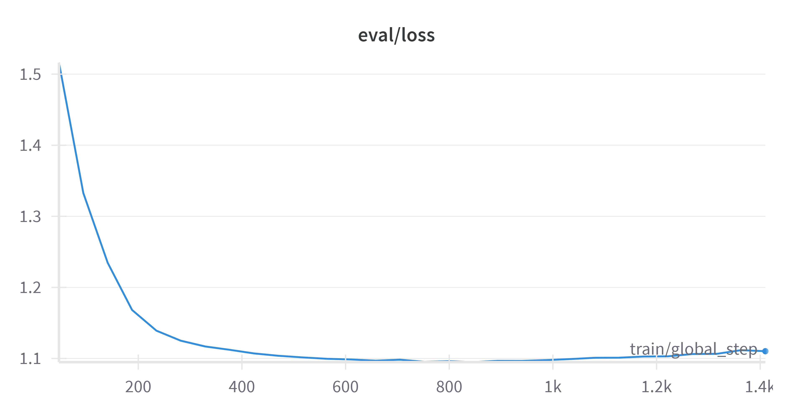
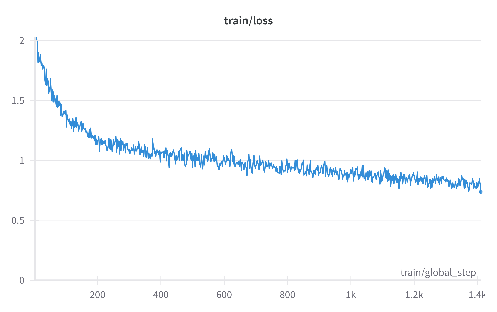

# Phinetuning 2.0

## 前言

就在不久前，微软正式发布了一个 27 亿参数的语言模型——Phi-2。这是一种文本到文本的人工智能程序，具有出色的推理和语言理解能力。同时，微软研究院也在官方 X 平台上声称：“Phi-2 的性能优于其他现有的小型语言模型，但它足够小，可以在笔记本电脑或者移动设备上运行”。

微软通过时下一些如 Big Bench Hard (BBH)、常识推理（PIQA、WinoGrande、ARC easy 和 Challenge、SIQA）、语言理解（HellaSwag、OpenBookQA、MMLU（5-shot）、SQuADv2、BoolQ）、数学（GSM8k）和编码（HumanEval）等基准测试，将 Phi-2 与 7B 和 13B 参数的 Mistral 和 Llama-2 进行了比较。

最终得出仅拥有 27 亿个参数的 Phi-2 ，超越了 Mistral 7B 和 Llama-2 7B 以及 13B 模型的性能。值得注意的是，与大它 25 倍的 Llama-2-70B 模型相比，Phi-2 还在多步推理任务（即编码和数学）上实现了更好的性能。

**本教程将基于谜语数据集使用QLoRA 微调Phi-2模型。**

## 模型微调

 - ``Phi-2``模型``Huggingface``[开源地址](https://huggingface.co/microsoft/phi-2)，谜语数据集``Huggingface``[开源地址](https://huggingface.co/datasets/g-ronimo/riddles_evolved)
 - 下面所有代码均在``kaggle``平台，``GPU``为``T4 × 2``环境下运行。

### 搭建环境

 - 微调需要安装库``transformers``、``peft``、``datasets``、``evaluate``、``einops``、``bitsandbytes``
```python
from IPython.display import clear_output
!pip install -U transformers peft datasets evaluate einops bitsandbytes -q
!pip install accelerate==0.21.0 -q
clear_output()
```
 - 导入必要库
```python
import os
import torch
from datasets import load_dataset
from peft import PeftModel
from transformers import AutoModelForCausalLM, AutoTokenizer, BitsAndBytesConfig
clear_output()
```
### 数据预处理

#### 加载数据

 - 加载数据集，并拆分训练、测试集，打印示例。
```python
dataset = load_dataset("g-ronimo/riddles_evolved")
dataset = dataset["train"].train_test_split(test_size=0.1)
clear_output()
dataset["train"][0]
```
```python
{'number': 286,
 'messages': ["Born in despair, fed with mud, soon I'll bloom into beauty for the good.",
  'This riddle appears to be describing a flower that grows in adverse conditions. Here\'s a step-by-step explanation:\n\n1. "Born in despair" suggests that the subject of the riddle had a difficult start in life.\n2. "Fed with mud" means that it has been nourished in dirty or poor conditions.\n3. "Soon I\'ll bloom into beauty" indicates that despite its challenging start, it will eventually become something beautiful.\n4. "Think step-by-step" is advice to break down complex problems into smaller, manageable parts.\n5. "Keep your explanations simple" is a recommendation to make complex ideas easy to understand.\n6. "Try your very best" emphasizes the importance of giving your all to accomplish your goals.\n7. "If you there is information missing for you to come up with a specific answer, just ask me a short question at the end of your answer" is a request to specify the topic or question if more clarification is needed.\n\nQuestion: What is the answer to the riddle, and what is the identity of the flower described?',
  'What kind of flower starts in hardship, grows in dirt, but ultimately blooms into something lovely?',
  'The answer to the riddle and the identity of the flower described is a sunflower. Sunflowers start as seeds in adversity, grow in soil that may not be ideal, but eventually bloom into beautiful yellow flowers that bring joy and sunlight.']}
```
#### 应用ChatML格式并标记数据集

 - 首先使用 ChatML 格式组织对话，然后对它们进行标记。设置数据集非常重要，以便模型学会像``assistant``一样回答，而不是像``user``一样提出问题。为此，我们将忽略索引的标记（``labels``）设置为-100。
 - **注意**：如果您熟悉``QLoRA``库，您会注意到原始的``guanaco``模型是针对问题和答案进行训练的（[qlora.py](https://github.com/artidoro/qlora/blob/main/qlora.py) 中默认为``train_on_source=False``）。这些模型经过原始对话文本的训练，表现良好。不过，在谜语中只关注``assistant``的部分才是正确的训练方法。
```python
import os
from functools import partial

# ChatML格式
templates = [
    "<|im_start|>assistant\n{msg}<|im_end|>",      # message by assistant
    "<|im_start|>user\n{msg}<|im_end|>",           # message by user
]

# 在损失计算期间，使用此特殊索引来忽略某些标记。
IGNORE_INDEX = -100

def tokenize(input, max_length):
    input_ids, attention_mask, labels = [], [], []

    # 遍历数据集中的每个消息
    for i, msg in enumerate(input["messages"]):

        # 检查消息是来自user还是assistant，应用ChatML模板
        isHuman = i%2==0
        msg_chatml = templates[isHuman].format(msg=msg)

        # 标记化所有内容，稍后截断
        msg_tokenized = tokenizer(
          msg_chatml, 
          truncation=False, 
          add_special_tokens=False)

        # 复制标记和注意力掩码而不进行更改
        input_ids += msg_tokenized["input_ids"]
        attention_mask += msg_tokenized["attention_mask"]

        # 为损失计算调整标签：如果是user->IGNORE_INDEX，如果是assistant->input_ids
        # 忽略user消息，仅计算assistant消息的损失，因为这是我们想要学习
        labels += [IGNORE_INDEX]*len(msg_tokenized["input_ids"]) if isHuman else msg_tokenized["input_ids"]

    # 截断至最大长度
    return {
        "input_ids": input_ids[:max_length], 
        "attention_mask": attention_mask[:max_length],
        "labels": labels[:max_length],
    }

dataset_tokenized = dataset.map(
    # 在1024标记处截断样本
    # 对于谜题数据集足够了（最大长度1000标记）
    # 对于其他数据集，必须适应，较高的值需要更多的显存
    partial(tokenize, max_length=1024), 
    batched = False,
    # 多线程
    num_proc = os.cpu_count(),
    # 删除原始列，不再需要
    remove_columns = dataset["train"].column_names
)
```
 - 对于上面不理解的代码内容可以单独运行，比如如何区分``assistant``和``user``。
```python
for i, msg in enumerate(dataset['train'][0]['messages']):
	isHuman = i%2==0
    print(i)
    print(isHuman)
    print(msg)
```
#### 定义collator

 - ``collate``函数的目的是处理和准备用于训练（和评估）的``batch``数据，关键部分是正确填充输入。它通过使用特定标记填充到最长样本的长度来标准化``batch``中每个数据点的长度。 ``input_ids``用``pad token``填充， ``labels``用 ``IGNORE_INDEX``填充（以表明这些``token``不参与损失计算），并且``attention_mask``为0（忽略填充的标记）。
```python
# collate函数 - 将字典列表[{input_ids: [123, ..]}, {..]}转换为一个字典
# 形成batch{input_ids: [..], labels: [..], attention_mask: [..]}
def collate(elements):

    # 从每个元素中提取input_ids，并找出它们中的最大长度
    tokens = [e["input_ids"] for e in elements]
    tokens_maxlen = max([len(t) for t in tokens])

    for i, sample in enumerate(elements):
        input_ids = sample["input_ids"]
        labels = sample["labels"]
        attention_mask = sample["attention_mask"]

        # 计算需要填充以匹配最大标记长度的填充长度
        pad_len = tokens_maxlen-len(input_ids)

        # 用pad标记ID填充'input_ids'，用IGNORE_INDEX填充'labels'，用0填充'attention_mask'
        input_ids.extend( pad_len * [tokenizer.pad_token_id] )
        labels.extend( pad_len * [IGNORE_INDEX] )
        attention_mask.extend( pad_len * [0] )

    # 创建并返回包含elements中所有数据的批次
    batch={
        "input_ids": torch.tensor( [e["input_ids"] for e in elements] ),
        "labels": torch.tensor( [e["labels"] for e in elements] ),
        "attention_mask": torch.tensor( [e["attention_mask"] for e in elements] ),
    }
    return batch
```
### 微调 Phi-2

#### 加载量化模型

 - 因为在kaggle平台，GPU显存有限，所以只能加载量化后的模型。
 - 加载``4-bit``模型和分词器（``tokenizer``）
```python
modelpath = "microsoft/phi-2"
model = AutoModelForCausalLM.from_pretrained(
    modelpath,
    device_map="auto",
    quantization_config=BitsAndBytesConfig(
        load_in_4bit=True,
        bnb_4bit_compute_dtype=torch.bfloat16,
        bnb_4bit_quant_type="nf4",
    ),
    torch_dtype=torch.bfloat16,
    trust_remote_code=True,
)
```
#### 添加ChatML标记

 - 将``ChatML``特殊标记添加到模型和``tokenizer``中。
 - 关于``ChatML``是一种模型能看的懂的语言格式。
```python
# fast tokenizer有时会忽略添加的tokens
tokenizer = AutoTokenizer.from_pretrained(modelpath, use_fast=False)    

# 添加ChatML特殊标记
tokenizer.add_tokens(["<|im_start|>", "<PAD>"])
tokenizer.pad_token = "<PAD>"
tokenizer.add_special_tokens(dict(eos_token="<|im_end|>"))

# 调整模型embeddings大小
model.resize_token_embeddings(
    new_num_tokens=len(tokenizer),
    pad_to_multiple_of=64)
model.config.eos_token_id = tokenizer.eos_token_id
clear_output()
```
#### 准备LoRA适配器

 - ``LoRA``（``Low-Rank Adaptation``）是微调大型模型的有效方法。它仅在训练期间更新模型的选定部分，从而加快过程并节省内存。
```python
from peft import prepare_model_for_kbit_training, LoraConfig, get_peft_model

# lora微调配置
lora_config = LoraConfig(
    r=32,
    lora_alpha=32,
    target_modules = ['fc1', 'fc2', 'Wqkv', 'out_proj'],
    lora_dropout=0.1,
    bias="none",
    modules_to_save = ["lm_head", "embed_tokens"],
    task_type="CAUSAL_LM"
)

# 添加适配器到模型
model = prepare_model_for_kbit_training(model, use_gradient_checkpointing = False)
model = get_peft_model(model, lora_config)
model.config.use_cache = False
```
 - ``lora``微调配置参数说明：
	 -  ``rank``：``LoRA``中的``rank``也会影响可训练参数的数量。较高的``rank``会增加训练参数，这意味着模型灵活性和适应能力提高，但代价是增加计算复杂性。相反，较低的``rank``会减少训练参数，意味着更有效的训练和更少的计算负担，但可能会降低模型灵活性。因此，``rank``的选择代表了模型适应性和计算效率之间的权衡。
	 - ``lora_alpha``：缩放因子，用于调整低秩更新对模型原始权重的影响，即：**模型原始行为的改变程度**。 LoRA 论文指出"tuning alpha is roughly the same as tuning the learning rate"（调整 alpha 与调整学习率大致相同）。关于如何设置``rank``与``lora_alpha``尚未达成共识。一种方法似乎是设置``lora_alpha = r``，这就是我们在这里使用的。
	 - ``target_modules``：使用上述参数，我们仅训练约 **5.1%** 的模型权重。若资源有限，也可以选择仅训练注意力矩阵和输出权重（ ``['Wqkv', 'out_proj']``），在``rank=32``的情况下，参数数量降低到 **4.4%** 。对线性层进行训练应该会提高模型性能，因为它更接近于完全微调，但也会增加适配器大小。
 - 更多参数说明请访问[Huggingface官方文档](https://huggingface.co/docs/peft/main/en/package_reference/lora#peft.LoraConfig)

### 开始训练

 - 部分训练超参数说明：
	 - ``batch_size``：较大的``batch_size``更好，但受到可用VRAM的限制。训练样本越长（在``tokenization``过程中增加 ``max_length``），需要的VRAM就越多。在``max_length``为1024个``token``的示例中，``batch_size``为1是24GB VRAM GPU上的最大值。为了增加有效批量大小， ``gradient_accumulation_steps``设置为16，但缺点是会减慢训练过程。
	 - ``learning_rate``：``2e-5`` 的学习率对此数据集有不错的效果，当然``4e-5``的学习率也可能有效，并且会产生一个不错的模型而不会过度拟合。
	 - ``lr_scheduler_type``：根据``QLoRA``作者Tim Dettmers使用恒定学习率策略的建议，我采用了这种方法，并发现它对于``Phi-2``、``Llama 1/2``和``Mistral``始终有效。
 - 更多训练超参数见[官方文档](https://huggingface.co/docs/transformers/main/en/main_classes/trainer#transformers.TrainingArguments)，设置好训练参数后开始训练。
```python
from transformers import TrainingArguments, Trainer

bs=1         # batch size
ga_steps=16  # gradient acc. steps
epochs=15
lr=0.00001

steps_per_epoch=len(dataset_tokenized["train"])//(bs*ga_steps)

args = TrainingArguments(
    output_dir="out",
    per_device_train_batch_size=bs,
    per_device_eval_batch_size=16,
    evaluation_strategy="steps",
    logging_steps=2,
    eval_steps=steps_per_epoch//2,      # eval twice per epoch
    save_steps=1,         # save once per epoch
    gradient_accumulation_steps=ga_steps,
    num_train_epochs=epochs,
    lr_scheduler_type='constant',
    optim='paged_adamw_32bit',      # val_loss will go NaN with paged_adamw_8bit
    learning_rate=lr,
    group_by_length=False,
    fp16=True,
    metric_for_best_model='eval_loss',
    save_total_limit=1,
#     bf16=False,
    ddp_find_unused_parameters=False,
)

trainer = Trainer(
    model=model,
    tokenizer=tokenizer,
    args=args,
    data_collator=collate,
    train_dataset=dataset_tokenized["train"],
    eval_dataset=dataset_tokenized["test"],
)

trainer.train()
```
### 训练分析

 - 训练集损失

 - 验证集损失


### 模型合并

 - ``LoRA``适配器训练完成以后，需要与原模型进行合并。
```python
modelpath = "microsoft/phi-2"
adapter_path='/kaggle/input/phi-2-finetune/out/checkpoint-846'

save_to="merged"       

base_model = AutoModelForCausalLM.from_pretrained(
    modelpath,
    return_dict=True,
    torch_dtype=torch.bfloat16,
    device_map="auto",
    trust_remote_code=True,
)

tokenizer = AutoTokenizer.from_pretrained(modelpath)

tokenizer.add_tokens(["<|im_start|>", "<PAD>"])
tokenizer.pad_token = "<PAD>"
tokenizer.add_special_tokens(dict(eos_token="<|im_end|>"))
base_model.resize_token_embeddings(
    new_num_tokens=len(tokenizer),
    pad_to_multiple_of=64)
base_model.config.eos_token_id = tokenizer.eos_token_id

model = PeftModel.from_pretrained(base_model, adapter_path)
model = model.merge_and_unload()

model.save_pretrained(save_to, safe_serialization=True, max_shard_size='4GB')
tokenizer.save_pretrained(save_to)

clear_output()
```
## 微调前后对比

 - 先加载一下原模型，输入谜语，看看回答是什么。
```python
torch.set_default_device("cuda")

model = AutoModelForCausalLM.from_pretrained("microsoft/phi-2", torch_dtype="auto", trust_remote_code=True)
tokenizer = AutoTokenizer.from_pretrained("microsoft/phi-2", trust_remote_code=True)

inputs = tokenizer('''What makes a noise like a bell and flies, but cannot be seen? The answer lies in the bright blue sky.''', return_tensors="pt", return_attention_mask=False)

outputs = model.generate(**inputs, max_length=200)
text = tokenizer.batch_decode(outputs)[0]

clear_output()
print(text)
```
**输出：**
In the world of mathematics, we often encounter situations where we need to compare and order numbers. This skill is essential in various fields, including science, engineering, and even everyday life. Let's explore the concept of comparing and ordering numbers using the tones of science, specifically the principles of physics and the states of matter.

Imagine you are in a science lab, conducting an experiment to study the behavior of different substances. You have a set of test tubes filled with various liquids, each representing a different state of matter. The liquids in the test tubes are like numbers, and we can compare and order them based on their properties.
**参考中译：**
在数学世界中，我们经常会遇到需要对数字进行比较和排序的情况。这项技能在科学、工程甚至日常生活等各个领域都至关重要。让我们用科学的视角，特别是物理学原理和物质状态，来探讨数字比较和排序的概念。

想象一下，您正在科学实验室里进行一项实验，研究不同物质的行为。你有一组试管，里面装满了各种液体，每种液体代表一种不同的物质状态。试管中的液体就像数字，我们可以根据它们的性质进行比较和排序。

 - ==可以说是非常糟糕的回答==，我们看看微调后的模型会输出什么。
```python
model = AutoModelForCausalLM.from_pretrained("/kaggle/working/merged", torch_dtype="auto", trust_remote_code=True)
tokenizer = AutoTokenizer.from_pretrained("/kaggle/working/merged", trust_remote_code=True)

inputs = tokenizer('''<|im_start|>What makes a noise like a bell and flies, but cannot be seen? The answer lies in the bright blue sky.<|im_end|>''', return_tensors="pt", return_attention_mask=False)

outputs = model.generate(**inputs, max_length=300)
text = tokenizer.batch_decode(outputs)[0]

clear_output()
print(text)
```
**输出：**
The answer to the riddle is a "bluebird." Bluebirds make a distinctive bell-like sound with their wings, and they are often seen flying in the sky. However, they cannot be seen with the naked eye as they are small birds. If you need more information, please let me know what specific aspect of the answer you would like to know.
**参考中译：**
谜底是 "青鸟"。青鸟用翅膀发出独特的铃铛声，人们经常看到它们在天空中飞翔。不过，由于它们是小型鸟类，肉眼无法看到。如果您需要更多信息，请告诉我您想知道答案的具体方面。
 - 微调后的模型得到了==相对满意的答案==。请注意，这是在``4-bit``量化状态下微调的答案，如果可以在``float32``状态下微调，或许会得到更好的答案。