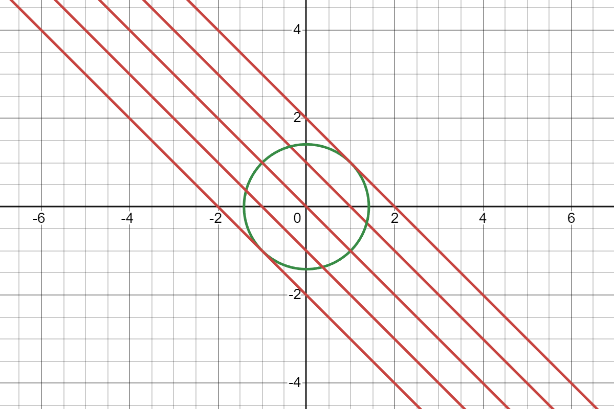
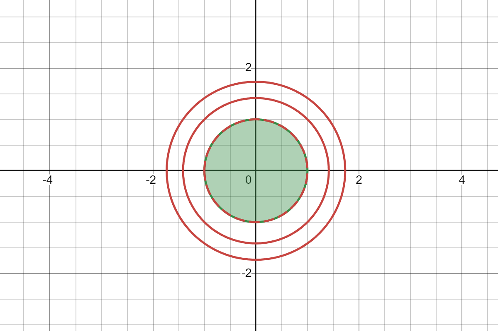
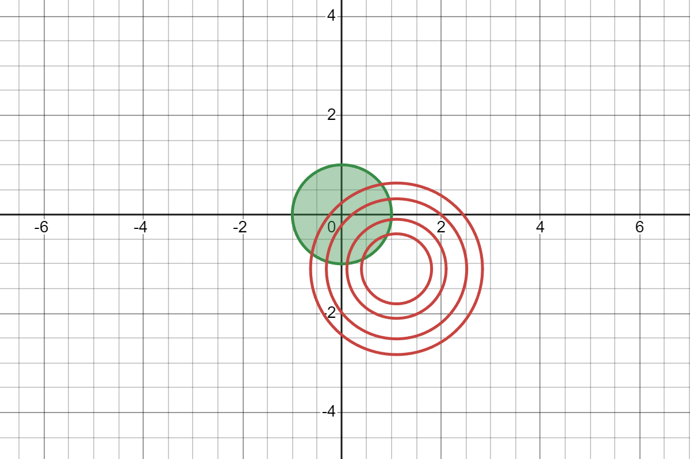
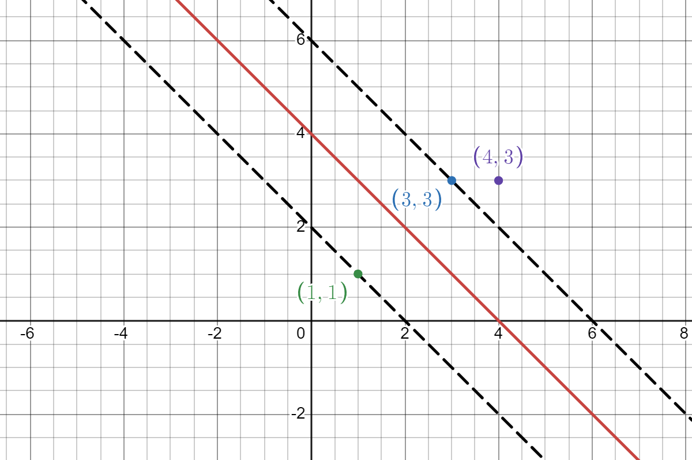

# 从零逐步实现SVM（含公式推导）

## 支持向量机（SVM）相关概念

- 支持向量：支持或支撑平面上把两类类别划分开的超平面的向量点
- 线性可分支持向量机：通过**硬**间隔最大化，学习一个线性分类器
- 线性支持向量机：通过**软**间隔最大，学习一个线性分类器
- 非线性支持向量机：通过**核技巧**，学习一个非线性分类器

## 线性可分支持向量机

- 目标：找到能把不同点分开，并且间隔最大的直线。

### 几何间隔

- 对于1个二元一次方程：

$$
ax+by+c = 0
$$

- 点$(A,B)$到这条直线的距离为：

$$
d = \frac{|aA + bB + c|}{\sqrt{a^2 + b^2}}
$$

- 将上述二元一次方程中的$a,b,...$变为$w_0, w_1, ...$，常数$c$变为$b$，$x$变为$x_0$，$y$变为$x_1$，则原式变为：

$$
w_0x_0 + w_1x_1 + b =0
$$

- 点$(A,B)$，变为$(x_0^{(1)}, x_1^{(1)})$，其中$x_0^{(1)}$表示第1个样本的第0个特征，$x_1^{(1)}$表示第1个样本的第1个特征，此时距离公式变为：

$$
d = \frac{|w_0x_0^{(1)} + w_1x_1^{(1)} + b|}{\sqrt{w_0^2 + w_1^2}}
$$

- 可以看到，距离公式的分母其实就是$w$的二范式，分子写成向量的形式，则距离公式变为：

$$
d^{(i)} = \frac{|w\cdot x^{(i)} + b|}{\lVert w \rVert}
$$

- 在支持向量机中，正样本一般使用$+1$来表示，负样本一般使用$-1$来表示。当距离公式中的分子$w\cdot x^{(i)} + b$为正时，说明此时的样本为正样本，也就是$y=1$，当分子为负时，也就是$y=-1$，那我们就可以在距离公式的前面乘上$y$，将分子中的绝对值符号去掉，为了保持机器学习数学表达式的通用规范，将距离$d$，变为$\gamma$，则此时距离公式变为：

$$
\gamma^{(i)} = y^{(i)}\frac{w \cdot x^{(i)} + b}{\lVert w \rVert}
$$

### 函数间隔

- 这里先给出函数间隔的数学表达式：

$$
\hat{\gamma}^{(i)} = y^{(i)}(w \cdot x^{(i)} + b)
$$

- 可以看到，相较于几何间隔，函数间隔去掉了$w$的二范式，类似于去掉了一个标准化系数。举个例子，现在有一条直线：

$$
2x+y+1 = 0
$$

点$(1,2)$到这条直线的**几何间隔**为：
$$
d = \frac{|2 + 2 + 1|}{\sqrt{5}} = \frac{5}{\sqrt5}
$$
**函数间隔**为：
$$
\hat{d} = |2+2+1| = 5
$$


现在我将这条直线的系数全部扩大两倍：
$$
4x+2y+2 = 0
$$
显然，扩大系数后的直线和没扩大之前的直线是相同的，此时**几何间隔**为：
$$
d = \frac{|4 + 4 + 2|}{\sqrt{20}} = \frac{10}{2\sqrt5} = \frac{5}{\sqrt5}
$$
**函数间隔**为：
$$
\hat{d} = |4 + 4 + 2| = 10
$$

- 可以发现，两条直线的**几何间隔**是相等的，但是**函数间隔**是呈系数扩大倍（2倍）关系的。所以即使是==对于同一条直线，**几何间隔**是不会变的，但是**函数间隔**可以随系数缩放而改变==，这一点非常重要！
- 所以如果我们想让**函数间隔**$\hat{\gamma}$达到1，总归可以通过成倍的缩小或者放大系数来实现这个目的，并且不会改变原本的直线。

### 几何间隔与函数间隔间的关系

- 经过上述推导与证明，我们可以得到**几何间隔**与**函数间隔**之间的关系：

$$
\gamma^{(i)} = \frac{\hat{\gamma}^{(i)}}{\lVert w \rVert}
$$

即：
$$
\gamma = \frac{\hat{\gamma}}{\lVert w \rVert}
$$

### 分离超平面

- 我们希望找到一个最大间隔分离超平面，就可以表示为下面的优化问题：

$$
\mathop{max}\limits_{w,b}\ \ \gamma\\
s.t.\ y^{(i)}\frac{w \cdot x^{(i)} + b}{\lVert w \rVert} \geq \gamma,\ \ i = 1,2,...,m
$$

其中，$m$表示样本数量。

- 根据**几何间隔**与**函数间隔**之间的关系，上式也可以表示为：

$$
\mathop{max}\limits_{w,b}\ \ \frac{\hat{\gamma}}{\lVert w \rVert}\\
s.t.\ y^{(i)}(w \cdot x^{(i)} + b)\geq \hat{\gamma},\ \ i = 1,2,...,m
$$

- 根据前面得到的结论，我们可以令$\hat{\gamma} = 1$，则原式变为：

$$
\mathop{max}\limits_{w,b}\ \ \frac{1}{\lVert w \rVert}\\
s.t.\ y^{(i)}(w \cdot x^{(i)} + b)\geq 1,\ \ i = 1,2,...,m
$$

- 求一个变量的最大值等于求这个变量倒数的最小值，即：

$$
\mathop{max}\limits_{w,b}\ \ \frac{1}{\lVert w \rVert} \Rightarrow \mathop{min}\limits_{w,b}\ \ \lVert w \rVert \Rightarrow \mathop{min}\limits_{w,b}\ \ \lVert w \rVert ^2 \Rightarrow \mathop{min}\limits_{w,b} \ \ \frac{1}{2}\lVert w \rVert ^2
$$

- 为了方便后面使用**拉格朗日乘子法**求解带有**不等式约束条件**的极值问题，将约束条件变为：

$$
s.t.\ 1 - y^{(i)}(w \cdot x^{(i)} + b)\leq 0,\ \ i = 1,2,...,m
$$

- 则最终的优化问题为：

$$
\mathop{min}\limits_{w,b} \ \ \frac{1}{2}\lVert w \rVert ^2 \\
s.t.\ 1 - y^{(i)}(w \cdot x^{(i)} + b)\leq 0,\ \ i = 1,2,...,m
$$

## 拉格朗日乘子法

### 等式约束条件

- 这里先给出求极值的步骤，后面再讲原理。

  - 求$f(x)$的极小值，$s.t.\ h(x) = 0$
  - 构造拉格朗日函数

  $$
  L(x,\alpha) = f(x) + \alpha h(x) \ \ 且\ \ \alpha \geq 0
  $$

  - 求梯度，并令梯度等于$0$，得到解

  $$
  \nabla_xL(x,\alpha) = \nabla_xf(x) + \alpha\nabla_xh(x) = 0
  $$

- 还是举一个具体的例子，对于函数

$$
f(x_1,x_2) = x_1 + x_2
$$

求在：
$$
h(x_1, x_2) = x_1^2 + x_2^2-2=0
$$
的条件下，$f(x_1, x_2)$的极值。

- 构造拉格朗日函数：
  $$
  L(x_1, x_2) = f(x) + \alpha h(x) = x_1 + x_2 + \alpha(x_1^2 + x_2^2 -2)
  $$
  
- 分别求$L$对$x_1, x_2$的偏导，并使其等于0：
  $$
  \frac{\partial L}{\partial x_1} = 1 + 2\alpha x_1 = 0 \Rightarrow x_1 = -\frac{1}{2}\alpha\\
  \frac{\partial L}{\partial x_2} = 1 + 2\alpha x_2 = 0 \Rightarrow x_2 = -\frac{1}{2}\alpha\\
  $$

- 带回约束条件$h(x)$中得：

$$
\frac{1}{4}\alpha^2 + \frac{1}{4}\alpha^2-2=0 \Rightarrow \alpha=2\sqrt2
$$

- 则：

$$
x_1 = x_2 = -\sqrt2
$$


- 为了探究背后的原理，我们将$f(x_1,x_2)$和$h(x_1,x_2)$的图像画出来：



- 从右上到左下的红色直线分别是$f(x_1,x_2)=2,1,0,-1,-2$时的曲线，绿色的圆则是$h(x_1,x_2)$。因为$h(x_1,x_2)$是等式约束，则$x_1,x_2$的取值只能在红色直线与绿色圆的交点。由于我们要求$f(x_1,x_2)$的极值，对$f(x_1,x_2)$求偏导

$$
f(x_1, x_2) = x_1 + x_2\\
\nabla f(x_1,x_2) = 
\begin{pmatrix}
1 \\
1 \\
\end{pmatrix}
$$

- $f(x_1,x_2)$的正梯度方向是右上，与$x_1$轴正半轴呈45度角，则负梯度方向为左下，与$x_1$轴负半轴呈45度角。对$h(x_1,x_2)$求偏导

$$
h(x_1,x_2) = x_1^2 + x_2^2 -2\\
\nabla h(x_1,x_2) = 
\begin{pmatrix}
2x_1 \\
2x_2 \\
\end{pmatrix}
$$

- 可以发现，当$x_1 = x_2 = 1$时，$h(x_1,x_2)$的梯度方向为右上，与$x_1$轴正半轴呈45度角，此时刚好与$f(x_1,x_2)$负梯度方向相反。当$x_1 = x_2 = -1$时，$h(x_1,x_2)$的梯度方向为左下，与$x_1$轴负半轴呈45度角，此时刚好与$f(x_1,x_2)$负梯度方向相同。我们知道，当梯度方向相反时会相互抵消的，而当梯度方向相同时会相互叠加，因为要求的是极小值，那我们希望$h(x_1,x_2)$的梯度方向能和$f(x_1,x_2)$的负梯度方向相同，数学表达式为：

$$
-\nabla f(x_1,x_2) = \alpha \nabla h(x_1,x_2)
$$


- 因为梯度是一个数值，为了让等式相等，引入了$\alpha$系数。回过头来看拉格朗日函数：

$$
L(x,\alpha) = f(x) + \alpha h(x)
$$

令$\nabla L(x,\alpha) = 0$，则：
$$
\nabla L = \nabla f(x) + \alpha \nabla h(x) = 0 \Rightarrow -\nabla f(x_1,x_2) = \alpha \nabla h(x_1,x_2)
$$

- 这就是为什么要构造拉格朗日函数的原因。

### 不等式约束条件

- 对于不等式约束条件，我们依然可以使用在等式约束条件中的方法，但是需要注意的是，不等式约束一定是$\leq 0$的形式，如果是$\geq$的形式，一定要转换成$\leq 0$的形式
- 还是举一个具体的例子，对于函数：

$$
f(x_1,x_2) = x_1^2 + x_2^2
$$

求在：
$$
g(x_1,x_2) = x_1^2 + x_2^2-1 \leq 0
$$
条件下的极值。

构造拉格朗日函数：
$$
L(x_1, x_2) = f(x) + \alpha h(x) = x_1^2 + x_2^2 + \alpha(x_1^2 + x_2^2 -1)
$$

- 分别求$L$对$x_1, x_2$的偏导，并使其等于0：
  $$
  \frac{\partial L}{\partial x_1} = 2x_1 + 2\alpha x_1 = 0 \Rightarrow x_1 = 0\\
  \frac{\partial L}{\partial x_2} = 2x_2 + 2\alpha x_2 = 0 \Rightarrow x_2 = 0\\
  $$

- 将$f(x_1,x_2)$和$h(x_1,x_2)$的图像画出来：



- 上图中红色的圆由内到外分别为$f(x_1,x_2) = 1,2,3$，因为$f(x_1,x_2) = 1$与$h(x_1,x_2)$边界重合，所以上图中使用虚线。图中绿色的区域为$h(x_1,x_2)$​的图像，一般称该区域为可行域。
- 大家可以发现，$f(x_1,x_2)$的极小值点$(0,0)$落在可行域内，这种情况不等式约束实际上是不起作用的，我们只需要让$-\nabla f(x_1,x_2) = 0$就可以得到极小值点。此时$g(x_1,x_2) < 0, -\nabla f(x_1,x_2) = 0$。


- 考虑另一种情况，目标函数：

$$
f(x_1, x_2) = (x_1-1.1)^2 + (x_2+1.1)^2
$$

不等式约束为：
$$
g(x_1,x_2) = x_1^2 + x_2^2-1 \leq 0
$$
求$f(x_1,x_2)$​极值。

- 将$f(x_1,x_2)$和$h(x_1,x_2)$​的图像画出来：



- 图中红色圆由内到外分别为$f(x_1,x_2) = 0.5,1,2,3$，图中绿色的区域为$h(x_1,x_2)$的图像，即可行域。
- 显然，$f(x_1,x_2)$的极小值点为$(1.1,-1.1)$，落在可行域外。此时，约束条件起作用，要考虑$f(x_1,x_2)$在可行域内的极小值点。在极小值点，$g(x_1,x_2)$的梯度和$f(x_1,x_2)$的负梯度同向叠加：

$$
-\nabla f(x_1,x_2) = \alpha \nabla h(x_1,x_2)
$$


- 又因为极小值点在可行域边界上，此时$g(x_1,x_2) = 0$。所以依然使用在上面等式约束中的方法，构造拉格朗日函数进行求解就可以了。

### KKT条件

- 根据上述两种情况，整理一下，当极小值在可行域内时：

$$
g(x^*) = 0\\
-\nabla_x f(x^*) = 0
$$

- 当极小值在可行域外时：

$$
g(x^*) = 0\\
-\nabla_x f(x^*) = \alpha \nabla_x g(x^*)\\
\alpha \geq0
$$

- 其中$x^*$表示极值点
- KKT条件整合了上面的两种情况：

$$
\nabla_x L(x^*,\alpha^*) = 0\\
\alpha^* \geq 0\\
\alpha^*g(x^*) = 0\\
g(x^*) \leq 0
$$

- 上面的表达式中$\alpha^*g(x^*) = 0$实际上有两种含义：
  - 当$g(x^*) < 0$时，$\alpha = 0$，对应了当极小值在可行域内时的情况。
  - 当$g(x^*) = 0$时，$\alpha > 0$，对应了当极小值在可行域外时的情况。 

## 线性可分SVM目标函数求解

- 根据上述分析线性可分SVM目标函数为：

$$
\mathop{min}\limits_{w,b} \ \ \frac{1}{2}\lVert w \rVert ^2 \\
s.t.\ 1 - y^{(i)}(w \cdot x^{(i)} + b)\leq 0,\ \ i = 1,2,...,m
$$


- 对目标函数构建拉格朗日函数：

$$
\begin{align}
L(w,b,\alpha) &= \frac{1}{2}\lVert w \rVert ^2 - \alpha^{(i)}(1 - y^{(i)}(w \cdot x^{(i)} + b))\\
&= \frac{1}{2}\lVert w \rVert ^2 - \sum_{i=1}^{m}\alpha^{(i)}y^{(i)}(w \cdot x^{(i)} + b) + \sum_{i=1}^{m}\alpha^{(i)}
\end{align}
$$

- 考虑拉格朗日函数：

$$
L(x) = f(x) + \alpha g(x)
$$

当$g(x) = 0$时（即极值点落在可行域内）：
$$
L(x) = f(x)
$$
当$g(x) < 0$时（即极值点落在可行域外），因为$\alpha \geq 0$，所以：
$$
L(x) \geq f(x)
$$

- 现在我们最大化$L(x)$：

$$
\mathop{max}\limits_{\alpha} \ \ L(x)
$$

理想情况下该值等于$f(x)$，我们原目标是求解
$$
\mathop{min}\limits_{w,b} \ \ f(x)
$$
所以需要对最大化$L(x)$进行最小化，即：
$$
\mathop{min}\limits_{w,b}\ \mathop{max}\limits_{\alpha} \ \ L(w,b,a)
$$

- 为了方便求解，将原始问题转换为其对偶问题：

$$
\mathop{max}\limits_{\alpha}\ \mathop{min}\limits_{w,b} \ \ L(w,b,a)
$$


- 先求$ \mathop{min}\limits_{w,b} \ \ L(w,b,a)$，对$L(w,b,\alpha)$​进行求导：

$$
L(w,b,\alpha) = \frac{1}{2}\lVert w \rVert ^2 - \sum_{i=1}^{m}\alpha^{(i)}y^{(i)}(w \cdot x^{(i)} + b) + \sum_{i=1}^{m}\alpha^{(i)}
$$


$$
\frac{\partial L}{\partial w} =w - \sum_{i=1}^m\alpha^{(i)}y^{(i)}x^{(i)} = 0 \Rightarrow w = \sum^{m}_{i=1}\alpha^{(i)}y^{(i)}x^{(i)}\\
\frac{\partial L}{\partial b} =-\sum_{i=1}^m \alpha^{(i)}y^{(i)} = 0 \Rightarrow \sum_{i=1}^m \alpha^{(i)}y^{(i)} = 0\\
$$

- 将得到的推导式带回$L(w,b,\alpha)$：

$$
\begin{align}
L(w,b,\alpha) &= \frac{1}{2}\left(\sum_{i=1}^{m}\alpha^{(i)}y^{(i)}x^{(i)}\right) \times \left(\sum_{j=1}^m \alpha^{(j)}y^{(j)}x^{(j)}\right) - \sum_{i=1}^m\alpha^{(i)}y^{(i)}\left[\left(\sum_{j=1}^m\alpha^{(j)}y^{(j)}x^{(j)}\right) \times x^{(i)} + b\right] + \sum_{i=1}^m\alpha^{(i)}\\
&= \frac{1}{2}\sum_{i=1}^m\sum_{j=1}^m\left[\alpha^{(i)}\alpha^{(j)}y^{(i)}y^{(j)}(x^{(i)} \cdot x^{(j)})\right] - \sum_{i=1}^m\sum_{j=1}^m\left[\alpha^{(i)}\alpha^{(j)}y^{(i)}y^{(j)}(x^{(i)} \cdot x^{(j)})\right] - b\sum_{i=1}^m\left[\alpha^{(i)}y^{(i)}\right] + \sum^{m}_{i=1}\alpha^{(i)}\\
&= -\frac{1}{2}\sum_{i=1}^m\sum_{j=1}^m\alpha^{(i)}\alpha^{(j)}y^{(i)}y^{(j)}(x^{(i)} \cdot x^{(j)}) + \sum_{i=1}^m\alpha^{(i)}
\end{align}
$$

- 上面的推导过程中需要注意的地方：
  - $\lVert w \rVert ^2$带入$w$时，为了区分，第1个$w$使用$\sum\limits_{i=1}^m$，第2个$w$使用$\sum^m\limits_{j=1}$
  - $(x^{(i)} \cdot x^{(j)})$是**向量相乘**，这里一定要注意！
  - 因为$\sum\limits_{i=1}^m \alpha^{(i)}y^{(i)} = 0$所以倒数第2步的$-b\sum^m\limits_{i=1}[a^{(i)}y^{(i)}]$​就没有了


- 完成$\mathop{min}\limits_{w,b} \ \ L(w,b,a)$后，再求$\mathop{min}\limits_{w,b} \ \ L(w,b,a)$对$\alpha$极大，即：

$$
\mathop{max}\limits_{\alpha}-\frac{1}{2}\sum_{i=1}^m\sum_{j=1}^m\alpha^{(i)}\alpha^{(j)}y^{(i)}y^{(j)}(x^{(i)} \cdot x^{(j)}) + \sum_{i=1}^m\alpha^{(i)}\\
s.t.\ \ \sum_{i=1}^m\alpha^{(i)}y^{(i)}=0 \ \ \ \alpha^{(i)} \geq 0,\ i=1,2,\cdots,m
$$

- 将符号和前面的$\mathop{max}\limits_{\alpha}$合并，变为：

$$
\mathop{min}\limits_{\alpha} \frac{1}{2}\sum_{i=1}^m\sum_{j=1}^m\alpha^{(i)}\alpha^{(j)}y^{(i)}y^{(j)}(x^{(i)} \cdot x^{(j)}) - \sum_{i=1}^m\alpha^{(i)}\\
s.t.\ \ \sum_{i=1}^m\alpha^{(i)}y^{(i)}=0 \ \ \ \alpha^{(i)} \geq 0,\ i=1,2,\cdots,m
$$

- 若有办法求出$\alpha^{(i)}$则原问题就解决了。现在假设已经求出来了$\alpha^{(i)}$（这里先给出结论，后面再进行推导），那么：

$$
w^* = \sum_{i=1}^m\alpha^{(i)^*}y^{(i)}x^{(i)}
$$

- 其中$\alpha^{(i)^*}$表示第$i$个样本的最优$\alpha$值，$w^*$表示$w$最优值。又因为目标函数的不等式约束条件为：

$$
1 - y^{(i)}(w \cdot x^{(i)} + b)\leq 0,\ \ i = 1,2,...,m
$$

- 最优结果会在边界上取得，所以可以认为：

$$
1 - y^{(i)}(w^* \cdot x^{(i)} + b^*) = 0
$$

- 得到：

$$
b^{*} = y^{(i)} - \sum_{j=1}^m\alpha^{(i)^*}y^{(i)}(x^{(i)} \cdot x^{(j)})
$$

- 则分离超平面为：

$$
w^* \cdot x + b^* = 0
$$

- 分类决策函数为：

$$
f(x) = sign(w^* \cdot x + b^*)
$$

- 其中：

$$
sign(z) = 
\begin{cases}
1,\ \ z \geq 0\\
-1,\ \ z < 0
\end{cases}
$$

## 线性可分支持向量机实例

正例点是$x_1 = (3,3)^T, x_2 = (4,3)^T$，负例点是$x_3 = (1,1)^T$，求线性可分支持向量机

- 根据上面推导出的公式：

$$
\mathop{min}\limits_{\alpha} \frac{1}{2}\sum_{i=1}^m\sum_{j=1}^m\alpha^{(i)}\alpha^{(j)}y^{(i)}y^{(j)}(x^{(i)} \cdot x^{(j)}) - \sum_{i=1}^m\alpha^{(i)}\\
s.t.\ \ \sum_{i=1}^m\alpha^{(i)}y^{(i)}=0 \ \ \ \alpha^{(i)} \geq 0,\ i=1,2,\cdots,m
$$

- 带入数值：

$$
\begin{align}
\mathop{min}\limits_{\alpha} & \frac{1}{2}\sum_{i=1}^m\sum_{j=1}^m\alpha^{(i)}\alpha^{(j)}y^{(i)}y^{(j)}(x^{(i)} \cdot x^{(j)}) - \sum_{i=1}^m\alpha^{(i)}\\
 =& \frac{1}{2}\Big[\alpha^{(1)^2}y^{(1)^2}\times (3 \times 3 + 3\times 3) + \alpha^{(1)}\alpha^{(2)}y^{(1)}y^{(2)} \times(3 \times 4 + 3 \times 3) + \alpha^{(1)}\alpha^{(3)}y^{(1)}y^{(3)} \times (3 \times 1 + 3 \times 1) + \\
& \ \ \ \ \ \alpha^{(2)}\alpha^{(1)}y^{(2)}y^{(1)} \times (4 \times 3 + 3 \times 3) + \alpha^{(2)^2}y^{(2)^2} \times (4 \times 4 + 3 \times 3) + \alpha^{(2)}\alpha^{(3)}y^{(2)}y^{(3)} \times (4 \times 1 + 3 \times 1) + \\
& \ \ \ \ \ \alpha^{(3)}\alpha^{(1)}y^{(3)}y^{(1)} \times (1 \times 3 + 1 \times 3) + \alpha^{(3)}\alpha^{(2)}y^{(3)}y^{(2)} \times (1 \times 4 + 1 \times 3) + \alpha^{(3)^2}y^{(3)^2} \times(1\times 1 + 1\times 3) \Big]\\
& \ \ \ \ \ -\left(\alpha^{(1)} + \alpha^{(2)} + \alpha^{(3)}\right)\\
=& \frac{1}{2}\left(18\alpha^{(1)^2} + 25\alpha^{(2)^2} + 2\alpha^{(3)^2} + 42\alpha^{(1)}\alpha^{(2)} - 12 \alpha^{(1)}\alpha^{(3)} -14\alpha^{(2)}\alpha^{(3)}\right) - \left(\alpha^{(1)} + \alpha^{(2)} + \alpha^{(3)}\right)\\
\end{align}
$$

- 约束条件为：

$$
s.t.\ \ \sum_{i=1}^m\alpha^{(i)}y^{(i)}=0 \ \ \ \alpha^{(i)} \geq 0,\ i=1,2,\cdots,m\\
s.t.\ \ \alpha^{(1)} + \alpha^{(2)} - \alpha^{(3)}=0,\ \ \alpha^{(1)},\alpha^{(2)},\alpha^{(3)} \geq 0
$$

- 根据约束条件得到：

$$
\alpha^{(3)} = \alpha^{(1)} + \alpha^{(2)}
$$

- 代入目标函数（令代入后的目标函数为$S$）：

$$
S(\alpha^{(1)}, \alpha^{(2)}) = 4\alpha^{(1)^2} + \frac{13}{2}\alpha^{(2)^2} + 10\alpha^{(1)}\alpha^{(2)} - 2\alpha^{(1)}-2\alpha^{(2)}
$$

- 为了得到$S$的极值，分别对$\alpha^{(1)}, \alpha^{(2)}$求偏导：

$$
\frac{\partial S}{\partial \alpha^{(1)}} = 8\alpha^{(1)} + 10\alpha^{(2)}-2=0\\
\frac{\partial S}{\partial \alpha^{(2)}} = 13\alpha^{(2)} + 10\alpha^{(1)}-2=0\\
$$

- 联立上面的两个式子，得到：

$$
\alpha^{(1)} = 1.5,\ \ \alpha^{(2)} = -1
$$

- 因为拉格朗日乘子大于等于0，即$\alpha^{(1)},\alpha^{(2)},\alpha^{(3)} \geq 0$，所以$S$的极值肯定不在$(1.5,-1)$处取得，而是应该在边界上，即$\alpha^{(1)} = 0$或$\alpha^{(2)}=0$。对于$\alpha^{(1)} = 0$的情况，代入$\frac{\partial S}{\partial \alpha^{(2)}}$中得：

$$
\alpha^{(1)} = 0 \Rightarrow \alpha^{(2)} = \frac{2}{13} \Rightarrow S(\alpha^{(1)},\alpha^{(2)} )=-\frac{2}{13}
$$

- 对于$\alpha^{(2)} = 0$的情况，代入$\frac{\partial S}{\partial \alpha^{(1)}}$中得：

$$
\alpha^{(2)} = 0 \Rightarrow \alpha^{(1)} = \frac{1}{4} \Rightarrow S(\alpha^{(1)}, \alpha^{(2)} ) = -\frac{1}{4}
$$

- 显然当$\alpha^{(2)} = 0$时，$S$函数的值更小，所以我们应该取：

$$
\alpha^{(2)} = 0, \alpha^{(1) }= \frac{1}{4} \Rightarrow \alpha^{(3)} = \alpha^{(1)} + \alpha^{(2)} = \frac{1}{4}
$$

- 最终结果：

$$
\begin{cases}
\alpha^{(1)} = \frac{1}{4}\\
\alpha^{(2)} = 0\\
\alpha^{(3)} = \frac{1}{4}
\end{cases}
$$

- 根据公式$w$为：

$$
\begin{align}
w &= \sum_{i=1}^m\alpha^{(i)}y^{(i)}x^{(i)} \\
&= \frac{1}{4} \times 1 \times (3,3) + 0 + \frac{1}{4} \times -1 \times (1,1)\\
&=\left(\frac{3}{4}, \frac{3}{4}\right) + \left(-\frac{1}{4}, -\frac{1}{4}\right)\\
&=\left(\frac{1}{2},\frac{1}{2}\right)
\end{align}
$$


- 根据公式$b$为（取$i=1$）：

$$
\begin{align}
b^{*} &= y^{(i)} - \sum_{j=1}^m\alpha^{(j)^*}y^{(j)}(x^{(j)} \cdot x^{(i)})\\
&= 1-\left[\frac{1}{4} \times 1 \times (3 \times 3 + 3 \times 3) + 0 + \frac{1}{4} \times (-1) \times (1 \times 3 + 1\times 3)\right]\\
&=-2
\end{align}
$$

- 分离超平面为：

$$
w^* \cdot x + b^* = 0\\
\frac{1}{2}x_1 + \frac{1}{2}x_2 -2 = 0
$$

- 分离正样本的间隔平面表达式为：

$$
\frac{1}{2}x_1 + \frac{1}{2}x_2 -2 = 1
$$

- 分离负样本的间隔平面表达式为：

$$
\frac{1}{2}x_1 + \frac{1}{2}x_2 -2 = -1
$$


- 可视化点与分离超平面、间隔平面：



- 可以看到点$(3,3),(1,1)$在间隔屏幕上，我们将这样的点称作支撑（支持）向量。

## 线性支持向量机

- 线性支持向量机是为了应对==有些样本点不能满足函数间隔大于1的条件，甚至在错误的一侧==的情况，具体的就是对每个样本点引入松弛变量$\xi$，则约束条件变为：

$$
y^{(i)}(w \cdot x^{(i)} + b) \geq 1 - \xi^{(i)}
$$

- 目标函数变为：

$$
\frac{1}{2}\lVert w \rVert ^2 + C\sum_{i=1}^m\xi^{(i)}
$$

- 则线性支持向量机转换为如下优化问题：

$$
\mathop{min}\limits_{w,b,\xi} \ \ \frac{1}{2}\lVert w \rVert ^2 + C\sum_{i=1}^m\xi^{(i)} \\
s.t.\ \ y^{(i)}(w \cdot x^{(i)} + b) \geq 1 - \xi^{(i)}
$$

- 整理一下，使其满足拉格朗日乘子法应用规则：

$$
\mathop{min}\limits_{w,b,\xi} \ \ \frac{1}{2}\lVert w \rVert ^2 + C\sum_{i=1}^m\xi^{(i)} \\
s.t.\ \ 1 - y^{(i)}(w \cdot x^{(i)} + b) - \xi^{(i)} \leq 0,\ \ i=1,2,\cdots,m\\
-\xi^{(i)} \leq 0,\ \ i=1,2,\cdots,m
$$

## 线性SVM目标函数求解

- 根据上述分析，线性支持向量机目标函数：

$$
\mathop{min}\limits_{w,b,\xi} \ \ \frac{1}{2}\lVert w \rVert ^2 + C\sum_{i=1}^m\xi^{(i)} \\
s.t.\ \ 1 - y^{(i)}(w \cdot x^{(i)} + b) - \xi^{(i)} \leq 0,\ \ i=1,2,\cdots,m\\
-\xi^{(i)} \leq 0,\ \ i=1,2,\cdots,m
$$

- 构造拉格朗日函数：

$$
L(w,b,\xi,\alpha,\mu) = \frac{1}{2}\lVert w \rVert ^2 + C\sum_{i=1}^m\xi^{(i)} + \sum_{i=1}^m\alpha^{(i)}\left(1 - y^{(i)}(w \cdot x^{(i)}) - \xi^{(i)}\right) + \sum_{i=1}^m-\mu^{(i)}\xi^{(i)}
$$

- 上式中$\alpha^{(i)}$和$\mu^{(i)}$都是拉格朗日乘子，为了区分两个拉格朗日乘子，第二个使用$\mu$来代替
- 根据拉格朗日函数对偶性，原始问题的对偶问题是极大极小问题：

$$
\mathop{max}\limits_{\alpha}\ \mathop{min}\limits_{w,b,\xi}\ \ L(w,b,\xi,\alpha,\mu)
$$

- 先求：

$$
\mathop{min}\limits_{w,b,\xi}\ \ L(w,b,\xi,\alpha,\mu)
$$

- 目标函数$L$依次对$w,b,\xi^{(i)}$求偏导：

$$
\nabla_wL(w,b,\xi,\alpha,\mu) = w-\sum_{i=1}^m\alpha^{(i)}y^{(i)}x^{(i)} = 0 \Rightarrow w = \sum_{i=1}^m\alpha^{(i)}y^{(i)}x^{(i)}\\
\nabla_bL(w,b,\xi,\alpha,\mu) = -\sum_{i=1}^m\alpha^{(i)}y^{(i)} = 0 \Rightarrow \sum_{i=1}^m\alpha^{(i)}y^{(i)}=0\\
\nabla_{\xi^{(i)}}\ L(w,b,\xi,\alpha,\mu) = C-\alpha^{(i)} - \mu^{(i)} = 0 \Rightarrow C-\alpha^{(i)}-\mu^{(i)} = 0
$$

- 将上述推导的结果代回目标函数$L$中，得：

$$
\mathop{min}\limits_{w,b,\xi}\ \ L(w,b,\xi,\alpha,\mu) = -\frac{1}{2}\sum_{i=1}^m\sum_{j=1}^m\alpha^{(i)}\alpha^{(j)}y^{(i)}y^{(j)}(x^{(i)} \cdot x^{(j)}) + \sum_{i=1}^m\alpha^{(i)}
$$

- 接下来求$\mathop{min}\limits_{w,b,\xi}\ \ L(w,b,\xi,\alpha,\mu)$对$\alpha$的极大：

$$
\mathop{max}\limits_{\alpha}-\frac{1}{2}\sum_{i=1}^m\sum_{j=1}^m\alpha^{(i)}\alpha^{(j)}y^{(i)}y^{(j)}(x^{(i)} \cdot x^{(j)}) + \sum_{i=1}^m\alpha^{(i)}\\
\Downarrow\\
\mathop{min}\limits_{\alpha}\frac{1}{2}\sum_{i=1}^m\sum_{j=1}^m\alpha^{(i)}\alpha^{(j)}y^{(i)}y^{(j)}(x^{(i)} \cdot x^{(j)}) - \sum_{i=1}^m\alpha^{(i)}\\
$$

- 约束条件为：

$$
s.t.\ 
\begin{cases}
\sum\limits_{j=1}^{m}\alpha^{(i)}y^{(i)} = 0\\
C-\alpha^{(i)} - \mu^{(i)}=0\\
\alpha^{(i)} \geq 0\\
\mu^{(i)} \geq 0
\end{cases}
$$

- 整理一下约束条件，可以写成：

$$
s.t.\ 
\begin{cases}
\sum\limits_{j=1}^{m}\alpha^{(i)}y^{(i)} = 0\\
0 \leq \alpha^{(i)} \leq C,\ i=1,2,...,m\\
\end{cases}
$$

- 总结起来，写到一起就是：

$$
\mathop{min}\limits_{\alpha}\frac{1}{2}\sum_{i=1}^m\sum_{j=1}^m\alpha^{(i)}\alpha^{(j)}y^{(i)}y^{(j)}(x^{(i)} \cdot x^{(j)}) - \sum_{i=1}^m\alpha^{(i)}\\
s.t.\ 
\begin{cases}
\sum\limits_{j=1}^{m}\alpha^{(i)}y^{(i)} = 0\\
0 \leq \alpha^{(i)} \leq C,\ i=1,2,...,m\\
\end{cases}
$$

## 非线性支持向量机

- 核技巧（核方法）：线性不可分的低维特征数据将其映射到高维，就能线性可分。
- 核函数：设$\phi(x):X \rightarrow H$，对所有$x,z \in X$函数$K(x,z)$，满足$K(x,z) = \phi(x) \cdot \phi(z)$
- 核技巧的思想是在学习与预测中只定义核函数$K(x,z)$，而不显示定义映射函数$\phi(x)$
- 在前面的线性支持向量机中，对偶问题的目标函数中$x^{(i)} \cdot x^{(j)}$可使用核函数$k(x^{(i)}\cdot x^{(j)})$来代替，即：

$$
\mathop{min}\limits_{\alpha}\frac{1}{2}\sum_{i=1}^m\sum_{j=1}^m\alpha^{(i)}\alpha^{(j)}y^{(i)}y^{(j)}(x^{(i)} \cdot x^{(j)}) - \sum_{i=1}^m\alpha^{(i)}\\
\Downarrow \\
\mathop{min}\limits_{\alpha}\frac{1}{2}\sum_{i=1}^m\sum_{j=1}^m\alpha^{(i)}\alpha^{(j)}y^{(i)}y^{(j)}k(x^{(i)} \cdot x^{(j)}) - \sum_{i=1}^m\alpha^{(i)}\\
$$

- 常用核函数有两个，多项式核函数：

$$
k(x,z) = (x \cdot z + 1)^p
$$

- 高斯核函数：

$$
k(x,z) = exp(-\frac{\lVert x-z \rVert^2}{z\sigma^2})
$$

- 其中经常被用于实际项目中的还是**高斯核函数**

## SMO算法推导

- 前面我们一直有一个问题没有解决，那就是怎么求$\alpha$。
- SMO算法要解决的问题是：

$$
\mathop{min}\limits_{\alpha}\frac{1}{2}\sum_{i=1}^m\sum_{j=1}^m\alpha^{(i)}\alpha^{(j)}y^{(i)}y^{(j)}K(x^{(i)} \cdot x^{(j)}) - \sum_{i=1}^m\alpha^{(i)}\\
s.t.\ 
\begin{cases}
\sum\limits_{j=1}^{m}\alpha^{(i)}y^{(i)} = 0\\
0 \leq \alpha^{(i)} \leq C,\ i=1,2,...,m\\
\end{cases}
$$

- 我们随机选择两个变量，比如$\alpha^{(1)},\alpha^{(2)}$，将其他变量固定看成常数，于是SMO的最优问题的子问题为：

$$
\begin{align}
\mathop{min}\limits_{\alpha^{(1)},\alpha^{(2)}}\ W(\alpha^{(1)},\alpha^{(2)}) =& \frac{1}{2}K_{11}\alpha^{(1)^2} + \frac{1}{2}K_{22}\alpha^{(2)^2} + y^{(1)}y^{(2)}K_{12}\alpha^{(1)}\alpha^{(2)} - (\alpha^{(1)} + \alpha^{(2)})\\
& + y^{(1)}\alpha^{(1)}\sum_{i=3}^my^{(i)}\alpha^{(i)}K_{i1} + y^{(2)}\alpha^{(2)}\sum_{i=3}^my^{(i)}\alpha^{(i)}K_{i2}
\end{align}
$$

- **注意！**因为我们只选择了$\alpha^{(1)},\alpha^{(2)}$，那么在目标函数中不含$\alpha^{(1)},\alpha^{(2)}$的项都是常数，在求极值时无需考虑。
- $K_{mn}$表示$k(x^{(m)} \cdot x^{(n)})$，这是一种简写形式！
- 约束条件变为：

$$
s.t.\ 
\begin{cases}
\alpha^{(1)}y^{(1)} + \alpha^{(2)}y^{(2)} +\sum\limits_{i=3}^m y^{(i)}\alpha^{(i)} = 0 \Rightarrow \alpha^{(1)}y^{(1)} + \alpha^{(2)}y^{(2)} = -\sum\limits_{i=3}^my^{(i)}\alpha^{(i)} = \varsigma \\
0 \leq \alpha^{(i)} \leq C,\ i=1,2,...,m\\
\end{cases}
$$

- 其中$\varsigma$​是一个常数。为了叙述简单，记：

$$
g(x) = \sum_{i=1}^m\alpha^{(i)}y^{(i)}K(x^{(i)},x) + b\\
E_i = g(x^{(i)}) - y^{(i)} = \left(\sum_{j=1}^m\alpha^{(j)}y^{(j)}K(x^{(j)},x^{(i)}) + b\right) - y^{(i)}\\
V_i = \sum_{j=3}^m\alpha^{(j)}y^{(j)}K(x^{(j)}，x^{(i)}) = g(x^{(i)}) - \sum_{j=1}^2\alpha^{(j)}y^{(j)}K(x^{(j)},x^{(i)})-b
$$

- 目标函数可以写成：

$$
W(\alpha^{(1)}, \alpha^{(2)}) = \frac{1}{2}K_{11}\alpha^{(1)^2} + \frac{1}{2}K_{22}\alpha^{(2)^2} + y^{(1)}y^{(2)}K_{12}\alpha^{(1)}\alpha^{(2)} - (\alpha^{(1)} + \alpha^{(2)}) + y^{(1)}\alpha^{(1)}v_1 + y^{(2)}\alpha^{(1)}v_2
$$

- 约束条件可以写成：

$$
\alpha^{(1)}y^{(1)} = \varsigma-\alpha^{(2)}y^{(2)} \Rightarrow \alpha^{(1)} = (\varsigma - \alpha^{(2)}y^{(2)})y^{(1)},\ 且y^{(i)^2}=1
$$

- 将$\alpha^{(1)}$带入目标函数，得到：

$$
\begin{align}
W(\alpha^{(2)}) =& \frac{1}{2}K_{11}(\varsigma-\alpha^{(2)}y^{(2)})^2 + \frac{1}{2}K_{22}\alpha^{(2)^2} + y^{(2)}K_{12}(\varsigma-\alpha^{(2)}y^{(2)})\alpha^{(2)}\\
&-\left((\varsigma-\alpha^{(2)}y^{(2)})y^{(1)} + \alpha^{(2)} \right) + (\varsigma-\alpha^{(2)}y^{(2)})v_1 + y^{(2)}\alpha^{(2)}v_2
\end{align}
$$


- 为求极值，对$\alpha^{(2)}$求导：

$$
\frac{\partial W}{\partial \alpha^{(2)}} = K_{11}\alpha^{(2)} + K_{22}\alpha^{(2)} - 2K_{12}\alpha^{(2)} - K_{11}\varsigma y^{(2)} + K_{12}\varsigma y^{(2)} + y^{(1)}y^{(2)} - 1 - v_1y^{(2)} + y^{(2)}v_2
$$

- 令其等于0，得到

$$
\begin{align}
(K_{11} + K_{22} - 2K_{12})\alpha^{(2)} &= y^{(2)}(y^{(2)} - y^{(1)} + \varsigma K_{12} + v_1 - v_2)\\
&= y^{(2)}\left[y^{(2)} - y^{(1)} + \varsigma K_{11} - \varsigma K_{12} + \left(g(x_1)-\sum_{j=1}^2\alpha^{(j)}y^{(j)}K_{1j}-b\right)-\left(g(x_2) - \sum_{j=1}^2\alpha^{(j)}y^{(j)}K_{2j}-b\right)\right]
\end{align}
$$

- 将$\varsigma = \alpha_{old}^{(1)}y^{(1)} + \alpha^{(2)}_{old}y^{(2)}$代入上式，得到：

$$
\begin{align}
(K_{11} + K_{22} - 2K_{12})\alpha^{(2)}_{new,unc} &= y^{(2)}\left( (K_{11} + K_{12} - 2K_{12})\alpha_{old}^{(2)}y^{(2)} + y^{(2)} - y^{(1)} + g(x_1) - g(x_2) \right)\\
&=(K_{11} + K_{22} - 2K_{12})\alpha_{old}^{(2)} + y^{(2)}(E_1 - E_2)
\end{align}
$$

- 其中$\alpha_{new,unc}^{(2)}$表示新的未剪辑（此时$\alpha_2$可能是任意值，不一定是$\geq$0的）的$\alpha^{(2)}$用于和$\alpha^{(2)}_{old}$区分。
- 令：

$$
\eta = K_{11} + K_{22} - 2K_{12}
$$

- 带入上式中，得到：

$$
\alpha_{new,unc}^{(2)} = \alpha_{old}^{(2)} + \frac{y^{(2)}(E_1 - E_2)}{\eta}
$$

- 因为约束条件：

$$
\alpha^{(1)}y^{(1)} + \alpha^{(2)}y^{(2)} = \varsigma
$$

存在两种情况，即：$y^{(1)} \neq y^{(2)}$或$y^{(1)} = y^{(2)}$

- 对于$y^{(1)} \neq y^{(2)}$的情况，我们可以写成：

$$
\alpha^{(1)} - \alpha^{(2)} = \varsigma
$$

在直角坐标系上，假如$\alpha^{(1)}$为横轴，$\alpha^{(2)}$为纵轴，当$\varsigma < 0$时，上界取0和$\varsigma$间的最大值，当$\varsigma >0$时，下界取$C$和$C-\varsigma$间的最小值，数学表达式：
$$
L = max(0,-\varsigma) = max(0,\alpha_{old}^{(2)} - \alpha_{old}^{(1)})\\
H = min(C,C-\varsigma) = min(C, C + \alpha_{old}^{(2)} - \alpha_{old}^{(1)})
$$

- 对于$y^{(1)} = y^{(2)}$的情况，我们可以写成：

$$
\alpha^{(1)} + \alpha^{(2)} = \varsigma
$$

上界与下界的取值：
$$
L = max(0,\varsigma-C) = max(0,\alpha^{(2)}_{old} + \alpha_{old}^{(1)} - C)\\
H = min(C, \varsigma) = min(C, \alpha^{(2)}_{old} + \alpha_{old}^{(1)})
$$

- 因此最终$\alpha^{(2)}$的解是：

$$
\alpha^{(2)}_{new} =
\begin{cases}
H,\ \ \alpha_{new,unc}^{(2)} > H\\
\alpha^{(2)}_{new,unc},\ L \leq \alpha_{new,unc}^{(2)} \leq H\\
L,\alpha_{new,unc}^{(2)} < L
\end{cases}
$$

- 因为：

$$
\alpha^{(1)}y^{(1)} + \alpha^{(2)}y^{(2)} = \varsigma
$$

- 所以：

$$
\alpha_{old}^{(1)}y^{(1)} + \alpha^{(2)}_{old}y^{(2)} = \alpha_{new}^{(1)}y^{(1)} + \alpha^{(2)}_{new}y^{(2)}\\
\Downarrow \\
\alpha_{new}^{(1)} = \alpha_{old}^{(1)} + y^{(1)}y^{(2)}(\alpha_{old}^{(2)} - \alpha_{new}^{(2)})
$$

- 计算完$\alpha$的值，现在计算$b$值，分为三种情况

  - 当$0 < \alpha_{new}^{(1)} < C$时，因为：

  $$
  g(x) = \sum_{i=1}^m\alpha^{(i)}y^{(i)}K(x^{(i)},x) +b\\
  E_{i} = g(x^{(i)}) - y^{(i)} = (\sum_{j=1}^m\alpha^{(j)}y^{(j)}K(x^{(j)},x^{(i)}) + b) - y^{(i)}
  $$

  - 不难发现，$g(x)$算的实际上是模型的预测值，即$\hat{y}^{(i)}$，而$E_i$就是模型的“误差”，我们在计算$b$值时，模型的预测值和实际值肯定是相同的：

  $$
  \sum_{i=1}^my^{(i)}\alpha^{(i)}K_{i1} + b = y^{(1)}\\
  b_{new}^{(1)} = y^{(1)} - \sum_{i=3}^my^{(i)}\alpha^{(i)}K_{i1} - \alpha_{new}^{(1)}y^{(3)}K_{11} - \alpha_{new}^{(2)}y^{(2)}K_{21}
  $$

  - 根据$E_i$定义，得到：

  $$
  E_1 = \sum^{m}_{i=3}y^{(i)}\alpha^{(i)}K_{i1} + \alpha_{old}^{(1)}y^{(1)}K_{11} + \alpha_{old}^{(2)}y^{(2)}K_{21} + b_{old} - y^{(1)}\\
  \Downarrow \\
  y^{(1)} - \sum_{i=3}^{m}y^{(i)}\alpha^{(i)}K_{i1} = -E_1 + \alpha_{old}^{(1)}y^{(1)}K_{11} + \alpha_{old}^{(2)}y^{(2)}K_{21} + b_{old}
  $$

  - 将上式带入$b_{new}^{(1)}$中，得：

  $$
  b_{new}^{(1)} = -E_1-y^{(1)}K_{11}(\alpha_{new}^{(1)} - \alpha_{old}^{(1)}) - y^{(2)}K_{21}(\alpha_{new}^{(2)} - \alpha_{old}^{(2)}) + b_{old}
  $$

  - 同理，若$0 < \alpha_{new}^{(2)} < C$可得：

  $$
  b_{new}^{(2)} = -E_2-y^{(1)}K_{12}(\alpha_{new}^{(1)} - \alpha_{old}^{(1)}) - y^{(2)}K_{22}(\alpha_{new}^{(2)} - \alpha_{old}^{(2)}) + b_{old}
  $$

  - 若$\alpha_{new}^{(1)}$和$\alpha^{(2)}_{new}$同时满足$0 < a_{new}^{(i)} < C$则：

  $$
  b_{new}^{(1)} = b_{new}^{(2)}
  $$

  - 若$\alpha_{new}^{(1)}$和$\alpha^{(2)}_{new}$为0或者C，则：
    $$
    b_new = \frac{b_{new}^{(1)} + b_{new}^{(2)}}{2}
    $$
    

## SMO算法推导结果

$$
g(x) = \sum_{i=1}^m\alpha^{(i)}y^{(i)}K(x^{(i)},x) + b\\
E_i = g(x^{(i)}) - y^{(i)} = \left(\sum_{j=1}^m\alpha^{(j)}y^{(j)}K(x^{(j)},x^{(i)}) + b\right) - y^{(i)}\\
\eta = K_{11} + K_{22} - K_{12}
$$


$$
\alpha_{new,unc}^{(2)} = \alpha_{old}^{(2)} + \frac{y^{(2)}(E_1 - E_2)}{\eta}
$$


- 若$y^{(1)} \neq y^{2}$：

$$
L = max(0,-\varsigma) = max(0,\alpha_{old}^{(2)} - \alpha_{old}^{(1)})\\
H = min(C,C-\varsigma) = min(C, C + \alpha_{old}^{(2)} - \alpha_{old}^{(1)})
$$

- 若$y^{(1)} = y^{(2)}$：

$$
L = max(0,\varsigma-C) = max(0,\alpha^{(2)}_{old} + \alpha_{old}^{(1)} - C)\\
H = min(C, \varsigma) = min(C, \alpha^{(2)}_{old} + \alpha_{old}^{(1)})
$$

$$
\alpha^{(2)}_{new} =\begin{cases}H,\ \ \alpha_{new,unc}^{(2)} > H\\\alpha^{(2)}_{new,unc},\ L \leq \alpha_{new,unc}^{(2)} \leq H\\L,\alpha_{new,unc}^{(2)} < L\end{cases}
$$


$$
\alpha_{new}^{(1)} = \alpha_{old}^{(1)} + y^{(1)}y^{(2)}(\alpha_{old}^{(2)} - \alpha_{new}^{(2)})\\
b_{new}^{(1)} = -E_1-y^{(1)}K_{11}(\alpha_{new}^{(1)} - \alpha_{old}^{(1)}) - y^{(2)}K_{21}(\alpha_{new}^{(2)} - \alpha_{old}^{(2)}) + b_{old}\\
b_{new}^{(2)} = -E_2-y^{(1)}K_{12}(\alpha_{new}^{(1)} - \alpha_{old}^{(1)}) - y^{(2)}K_{22}(\alpha_{new}^{(2)} - \alpha_{old}^{(2)}) + b_{old}
$$

- 若$0 < \alpha_{new}^{(1)} < C$：

$$
b = b_{new}^{(1)}
$$

- 若$0 < \alpha_{new}^{(1)} < C$：

$$
b = b_{new}^{(2)}
$$

- 其他情况：

$$
b_{new} = \frac{b_{new}^{(1)} + b_{new}^{(2)}}{2}
$$

## Python实现线性支持向量机

- 线性支持向量机中目标函数：

$$
\mathop{min}\limits_{\alpha}\frac{1}{2}\sum_{i=1}^m\sum_{j=1}^m\alpha^{(i)}\alpha^{(j)}y^{(i)}y^{(j)}(x^{(i)} \cdot x^{(j)}) - \sum_{i=1}^m\alpha^{(i)}\\
s.t.\ 
\begin{cases}
\sum\limits_{j=1}^{m}\alpha^{(i)}y^{(i)} = 0\\
0 \leq \alpha^{(i)} \leq C,\ i=1,2,...,m\\
\end{cases}
$$

- 内积$(x^{(i)} \cdot x^{(j)})$可以看成一个线性的核函数，依然可以使用上面推导出来的公式进行计算

- 导入必要包

```python
import numpy as np
import pandas as pd
import statsmodels.api as sm
from tqdm.notebook import tqdm
import matplotlib.pyplot as plt
from sklearn.datasets import fetch_california_housing, make_regression

np.random.seed(42)
```

- 导入数据函数

```python
def load_data(data_path):
    df = pd.read_csv(data_path, header=None, sep="\t")
    row_num, col_num = df.shape
    columns=[]
    for i in range(1, col_num):
        columns.append('x'+str(i))
    columns.append('y')
    df.columns = columns
    return df
```

- 随机选择2个样本（作为$\alpha^{(1)}$，$\alpha^{(2)}$）

```python
def select_alpha(i, m):
    temp_list = [a for a in range(m) if a != i]
    return np.random.choice(temp_list)
```

- 对未剪辑的$\alpha^{(i)}$进行剪辑：

```python
def clip_alpha(a_j, H, L):
    if a_j > H:
        a_j = H
    elif L > a_j:
        a_j = L
    return a_j
```

- 训练线性支持向量机，得到$\alpha$值和$b$值

```python
def smo_simple(df, C, toler, steps):
    # 取特征 -> 变为np.array -> 变为np.mat
    data = np.mat(df.iloc[:,:-1].values)
    # 取标签 -> 变为np.array -> 变为np.mat
    label = np.mat(df.iloc[:,-1].values.reshape(-1,1))
    
    # 初始化b
    b = 0
    # 初始化alpha矩阵
    row_num, col_num = data.shape
    alpha = np.mat(np.zeros((row_num, 1)))
    
    step = 0
    while(step < steps):
        alpha_change = 0
        for i in range(row_num):
            gxi = float(np.multiply(alpha, label).T * (data * data[i,:].T)) + b
            ei = gxi - float(label[i])
            if ((label[i] * ei < -toler) and (alpha[i] < C)) or (label[i] * ei > toler) and (alpha[i] > 0):
                j = select_alpha(i, row_num)
                gxj = float(np.multiply(alpha, label).T * (data * data[j,:].T)) + b
                ej = gxj - float(label[j])
                
                # 保存以前的alpha值
                alpha_i_old = alpha[i].copy()
                alpha_j_old = alpha[j].copy()
                
                if label[i] != label[j]:
                    L = max(0, alpha_j_old - alpha_i_old)
                    H = min(C, C + alpha_j_old - alpha_i_old)
                else:
                    L = max(0, alpha_j_old + alpha_i_old - C)
                    H = min(C, alpha_j_old + alpha_i_old)
                
                eta = 2 * data[i,:] * data[j,:].T - data[i,:] * data[i,:].T - data[j,:] * data[j,:].T
                
                alpha[j] = alpha[j] - label[j] * (ei - ej)/eta
                alpha[j] = clip_alpha(alpha[j], H, L)
                
                alpha[i] = alpha[i] + label[i] * label[j] * (alpha_j_old - alpha[j])
                b1 = b - ei - label[i] * (data[i,:] * data[i,:].T) * (alpha[i] - alpha_i_old) - label[j] * (data[j,:] * data[i,:].T) * (alpha[j] - alpha_j_old)
                b2 = b - ej - label[i] * (data[i,:] * data[j,:].T) * (alpha[i] - alpha_i_old) - label[j] * (data[j,:] * data[j,:].T) * (alpha[j] - alpha_j_old)
                
                if (0 < alpha[i]) and (C > alpha[i]):
                    b = b1
                elif (0 < alpha[j]) and (C > alpha[j]):
                    b = b2
                else:
                    b = (b1 + b2)/2.0
                
                alpha_change = alpha_change + 1
                
        if (alpha_change == 0):
            step = step + 1
        else:
            step = 0
    return b, alpha
```

- 计算$w$值

```python
def calculate_w(alpha, df):
    # 取特征 -> 变为np.array -> 变为np.mat
    data = np.mat(df.iloc[:,:-1].values)
    # 取标签 -> 变为np.array -> 变为np.mat
    label = np.mat(df.iloc[:,-1].values.reshape(-1,1))
    
    row_num, col_num = data.shape
    
    # 初始化w值
    w = np.zeros((col_num,1))
    for i in range(row_num):
        w = w + np.multiply(alpha[i] * label[i], data[i,:].T)
    return w
```

- 调用函数

```python
data = load_data('/kaggle/input/studyml/svm1.txt')
b, alpha = smo_simple(data, 0.6, 0.001, 50)
w = calculate_w(alpha, data)
print(b)
print(w)
# 打印输出：[[-3.83574561]]
#[[ 0.81406087]
# [-0.27265396]]
```

## Python实现非线性支持向量机

- 非线性支持向量机只需要将上面计算$(x^{(i)} \cdot x^{(j)})$的地方换成核函数计算方法就行，这里以高斯核函数为例
- 高斯核函数计算函数

```python
def kernel_trans(data, a, k_tup):
    row_num, col_num = data.shape
    k = np.mat(np.zeros((row_num, 1)))
    if k_tup[0] == 'lin':
        k = data * a.T
    elif k_tup[0] == 'rbf':
        for j in range(row_num):
            data_temp = data[j, :] - a
            k[j] = data_temp * data_temp.T
        k = np.exp(k/(-2 * k_tup[1] ** 2))
    return k
```

- 训练SVM函数

```python
def smo_simple(df, C, toler, steps):
    # 取特征 -> 变为np.array -> 变为np.mat
    data = np.mat(df.iloc[:,:-1].values)
    # 取标签 -> 变为np.array -> 变为np.mat
    label = np.mat(df.iloc[:,-1].values.reshape(-1,1))
    
    # 初始化b
    b = 0
    # 初始化alpha矩阵
    row_num, col_num = data.shape
    alpha = np.mat(np.zeros((row_num, 1)))
    
    step = 0
    while(step < steps):
        alpha_change = 0
        for i in range(row_num):
            gxi = float(np.multiply(alpha, label).T * kernel_trans(data, data[i,:], ['rbf', 0.05])) + b
            ei = gxi - float(label[i])
            if ((label[i] * ei < -toler) and (alpha[i] < C)) or (label[i] * ei > toler) and (alpha[i] > 0):
                j = select_alpha(i, row_num)
                gxj = float(np.multiply(alpha, label).T * kernel_trans(data, data[j,:], ['rbf', 0.05])) + b
                ej = gxj - float(label[j])
                
                # 保存以前的alpha值
                alpha_i_old = alpha[i].copy()
                alpha_j_old = alpha[j].copy()
                
                if label[i] != label[j]:
                    L = max(0, alpha_j_old - alpha_i_old)
                    H = min(C, C + alpha_j_old - alpha_i_old)
                else:
                    L = max(0, alpha_j_old + alpha_i_old - C)
                    H = min(C, alpha_j_old + alpha_i_old)
                
                eta = 2 * data[i,:] * data[j,:].T - data[i,:] * data[i,:].T - data[j,:] * data[j,:].T
                
                alpha[j] = alpha[j] - label[j] * (ei - ej)/eta
                alpha[j] = clip_alpha(alpha[j], H, L)
                
                alpha[i] = alpha[i] + label[i] * label[j] * (alpha_j_old - alpha[j])
                b1 = b - ei - label[i] * (data[i,:] * data[i,:].T) * (alpha[i] - alpha_i_old) - label[j] * (data[j,:] * data[i,:].T) * (alpha[j] - alpha_j_old)
                b2 = b - ej - label[i] * (data[i,:] * data[j,:].T) * (alpha[i] - alpha_i_old) - label[j] * (data[j,:] * data[j,:].T) * (alpha[j] - alpha_j_old)
                
                if (0 < alpha[i]) and (C > alpha[i]):
                    b = b1
                elif (0 < alpha[j]) and (C > alpha[j]):
                    b = b2
                else:
                    b = (b1 + b2)/2.0
                
                alpha_change = alpha_change + 1
                
        if (alpha_change == 0):
            step = step + 1
        else:
            step = 0
    return b, alpha
```

- 调用函数

```python
b, alpha = smo_simple(data, 0.6, 0.001, 50)
w = calculate_w(alpha, data)
print(b)
print(w)
```

