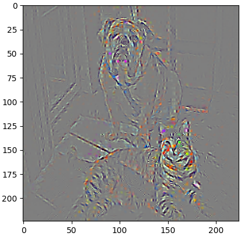

# Grad-CAM算法代码详解

## 前言

- `Grad-CAM`（Gradient-weighted Class Activation Mapping）是一种用于可视化深度学习模型（特别是卷积神经网络，`CNNs`）中模型“注意力”图的技术，可以帮助我们理解模型是如何做出决策的。
- 本文的重心不在论文解读与数学推导上，但也建议在读本文前对论文与算法实现有大概了解，下面是一些有关资料：
  - 论文原文[Grad-CAM: Visual Explanations from Deep Networks via Gradient-based Localization](https://arxiv.org/abs/1610.02391v4)
  - Bilibili同济子豪兄[可解释人工智能公开课](https://space.bilibili.com/1900783/channel/collectiondetail?sid=713364)系列视频（论文精度部分讲的很棒！如果大家没有时间阅读论文，可以看UP主的`Grad-CAM`论文精度视频）
  - 神经网络可视化包[pytorch-grad-cam](https://github.com/jacobgil/pytorch-grad-cam)，该包中实现了`GradCAM`、`GradCAM++`、`ScoreCAM`、`LayerCAM`，本文的算法代码详解也基于该库的优秀代码实现
- `Grad-CAM`算法的优点（引用Bilibili同济子豪兄视频总结）：
  - 无需`GAP`层，无需修改模型结构、无需重新训练模型
  - 可分析任意中间层
  - 数学上是原生`CAM`算法的推广
  - 细粒度图像分类、机器学习解释

- `Grad-CAM`算法的缺点：
  - 图像上有多个同类物体时，只能画出一块热力图
  - 不同位置的梯度值，`GAP`平均之后，影响是相同的
  - 梯度饱和、梯度消失、梯度噪声问题
  - 权重大的`channel`，不一定对类别预测分数贡献值大
  - 只考虑从后往前的反向传播梯度，没考虑前向预测的影响
  - 深层生成的粗粒度热力图和浅层生成的细粒度热力图都不够精准
- `GradCAM++`算法针对`Grad-CAM`缺点的第1、2点进行了改进、`ScoreCAM`针对`Grad-CAM`缺点的第3、4、5点进行了改进、`LayerCAM`针对`Grad-CAM`缺点的第6点进行了改进。这些改进算法都十分有针对性，大家感兴趣也可以阅读阅读，本文的重点还是放到`Grad-CAM`算法上。

## 准备工作

- 因为本文的`Grad-CAM`算法代码来源于[pytorch-grad-cam](https://github.com/jacobgil/pytorch-grad-cam)包，所以大家需要先安装`grad-cam`包：

```shell
pip install grad-cam
```

- 安装完成后，创建一个新的项目文件夹和一个`python`文件（`demo.py`），用于存放`demo.py`文件和方便后续`debug`，这里我创建的文件夹名称为`grad`，项目文件树为：

```python
-grad
	-demo.py
```

- 在`demo.py`文件中填入下列代码：

```python
import cv2
import numpy as np
import torch
from torchvision import models
import matplotlib.pyplot as plt
from pytorch_grad_cam import GradCAM
from pytorch_grad_cam import GuidedBackpropReLUModel
from pytorch_grad_cam.utils.image import (
    show_cam_on_image, deprocess_image, preprocess_image
)
from pytorch_grad_cam.utils.model_targets import ClassifierOutputTarget

# 加载预训练模型
model = models.shufflenet_v2_x2_0(weights='DEFAULT').to(torch.device('cpu')).eval()
target_layers = [model.conv5]
# BGR --> RBG
rgb_img = cv2.imread('1.png', 1)[:, :, ::-1]
rgb_img = np.float32(rgb_img) / 255
input_tensor = preprocess_image(rgb_img,
                                mean=[0.529, 0.510, 0.466],
                                std=[0.306, 0.312, 0.278]).to('cpu')
# 在预训练数据集ImageNet-1K中第281类表示tabby cat
targets = [ClassifierOutputTarget(281)]
# Grad-Cam算法
cam = GradCAM(model=model, target_layers=target_layers)
grayscale_cam = cam(input_tensor=input_tensor, targets=targets)
# 取第1张图的cam
grayscale_cam = grayscale_cam[0, :]
# 将CAM作为掩码(mask)叠加到原图上
cam_image = show_cam_on_image(rgb_img, grayscale_cam, use_rgb=True)
# cam_image = cv2.cvtColor(cam_image, cv2.COLOR_RGB2BGR)
plt.imshow(cam_image)
plt.show()

# Guided算法
gb_model = GuidedBackpropReLUModel(model=model, device='cpu')
# 得到模型输出
gb = gb_model(input_tensor, target_category=281)

# 将3个单通道cam图片拼接，变成1个3通道的cam掩码（mask）
cam_mask = cv2.merge([grayscale_cam, grayscale_cam, grayscale_cam])
# 对图像进行标准化
cam_gb = deprocess_image(cam_mask * gb)
gb = deprocess_image(gb)

plt.imshow(cam_gb)
plt.show()
plt.imshow(gb)
plt.show()
```

- 然后运行`demo.py`文件（1.png文件取至[both.png](https://github.com/jacobgil/pytorch-grad-cam/blob/master/examples/both.png)），如果正常运行会出现三张图片：

<center class="half">



</center>

- 这三张图分别表示什么，等后面我们解析完代码以后，大家就会很清楚了，先确保`demo.py`文件正常运行。

## 代码解析

- 为了减少不必要的代码，这里选择了`pytorch`提供的预训练模型，更多分类预训练模型可以查看[官方文档](https://pytorch.org/vision/stable/models.html#classification)。
- 我这里选择的是因为这个模型很轻，并且对CPU推理更加友好，当然大家可以根据自己的实际情况选择，步骤都是一样的。
- 我们加载完预训练模型后可以打印一下这个模型的架构，比如我选择的`shufflenet_v2_x2_0`：

```python
ShuffleNetV2(
  (conv1): Sequential(...)
  (maxpool): MaxPool2d(kernel_size=3, stride=2, padding=1, dilation=1, ceil_mode=False)
  (stage2): Sequential(
    (0): InvertedResidual(
      (branch1): Sequential(...)
      (branch2): Sequential(...)
    )
      ...
  )
  (stage3): Sequential(
    (0): InvertedResidual(
      (branch1): Sequential(...)
      (branch2): Sequential(...)
    )
    ...
  )
  (stage4): Sequential(
    (0): InvertedResidual(
      (branch1): Sequential(...)
      (branch2): Sequential(...)
    )
    ...
  )
  (conv5): Sequential(
    (0): Conv2d(976, 2048, kernel_size=(1, 1), stride=(1, 1), bias=False)
    (1): BatchNorm2d(2048, eps=1e-05, momentum=0.1, affine=True, track_running_stats=True)
    (2): ReLU(inplace=True)
  )
  (fc): Linear(in_features=2048, out_features=1000, bias=True)
)
```

- 可以发现模型在线性分类层`fc`的前面一层是`conv5`。虽然`Grad-CAM`算法可以应用到任意层，但一般认为线性分类层的前一层特征提取最抽象，也是线性分类头的特征来源，所以我们一般对模型线性分类头的前一特征层进行分析，这也就是为什么在`demo.py`文件中`target_layers = [model.conv5]`

```python
# 加载预训练模型
model = models.shufflenet_v2_x2_0(weights='DEFAULT').to(torch.device('cpu')).eval()
target_layers = [model.conv5]
```


- 然后就是使用`cv2`包读取了一张图片，并对图片进行了归一化操作，需要注意的是`[:, :, ::-1]`切片操作是将通道顺序`BGR`转换为`RBG`，因为`cv2`默认读取顺序是`BGR`。接着对图片进行了标准化，标准化中的均值（`mean`）和方差（`std`）是根据预训练模型在训练数据集中算出来的，比如`shufflenet_v2_x2_0`模型是在`ImageNet-1K`数据集上训练出来的，那么均值和方差就是根据`ImageNet-1K`数据集算出来的，在`demo.py`中大家默认使用这个均值和方差就可以。

```python
# BGR --> RBG
rgb_img = cv2.imread('1.png', 1)[:, :, ::-1]
rgb_img = np.float32(rgb_img) / 255
input_tensor = preprocess_image(rgb_img,
                                mean=[0.485, 0.456, 0.406],
                                std=[0.229, 0.224, 0.225]).to('cpu')
```

- 接下来就涉及到了`pytorch_grad_cam`库中的内容：

```python
# 在预训练数据集ImageNet-1K中第281类表示tabby cat
targets = [ClassifierOutputTarget(281)]
# Grad-Cam算法
cam = GradCAM(model=model, target_layers=target_layers)
grayscale_cam = cam(input_tensor=input_tensor, targets=targets)
# 取第1张图的cam
grayscale_cam = grayscale_cam[0, :]
# 将CAM作为掩码(mask)叠加到原图上
cam_image = show_cam_on_image(rgb_img, grayscale_cam, use_rgb=True)
# cam_image = cv2.cvtColor(cam_image, cv2.COLOR_RGB2BGR)
plt.imshow(cam_image)
plt.show()
```

- 首先解释一下这个`ClassifierOutputTarget()`，我们按住Ctrl，点击`ClassifierOutputTarget`，跳转到`pytorch_grad_cam\utils\model_targets.py`文件`ClassifierOutputTarget`类：

```python
class ClassifierOutputTarget:
    def __init__(self, category):
        self.category = category

    def __call__(self, model_output):
        # 若模型输出单列
        if len(model_output.shape) == 1:
            return model_output[self.category]
        # 若模型输出多列
        return model_output[:, self.category]
```

- 可以看到，`ClassifierOutputTarget`类接受一个`category`参数，调用时输出模型对应类别的值。简单点说`ClassifierOutputTarget()`就是用来设定，当模型预测这张图片为某类别时，模型关注的是哪些地方。举个例子，在上面的`1.png`中，同时存在猫和狗，那么如果我设定`ClassifierOutputTarget()`为猫时，`Grad-CAM`算法就会分析模型预测这张图为猫时关注的是哪些地方。依次类推，当我设定为狗时，算法就会分析模型预测这张图为狗时关注的是哪些地方。
- `ImageNet-1K`数据集有1000类，其中第281类（从0开始）表示`tabby cat`，这里我想要看模型预测这张图为猫时关注的是哪些地方（实际上模型认为这张图片是狗）。所以设定`ClassifierOutputTarget(281)`，如果你的模型只有3类，`[猫、狗、熊猫]`，那么你应该设置`ClassifierOutputTarget(0)`，当然你也可以不设定，即`targets= None`，那么算法会自动寻找模型分类概率最大的类别作为分析目标（`demo.py`中会分析类别‘狗’），这个会在后面的代码解析中有体现，这里大家先有个大致了解。
- 接下来终于来到了有关`Grad-CAM`算法的部分，点击`GradCAM`进入`pytorch_grad_cam\grad_cam.py`文件中`GradCAM`类：

```python
class GradCAM(BaseCAM):
    def __init__(self, model, target_layers,
                 reshape_transform=None):
        super(
            GradCAM,
            self).__init__(
            model,
            target_layers,
            reshape_transform)
```

- 发现该类继承自`BaseCAM`类，点击`BaseCAM`，跳转到`pytorch_grad_cam\base_cam.py`文件，`BaseCAM`类：

```python
class BaseCAM:
    def __init__(
        self,
        model: torch.nn.Module,
        target_layers: List[torch.nn.Module],
        reshape_transform: Callable = None,
        compute_input_gradient: bool = False,
        uses_gradients: bool = True,
        tta_transforms: Optional[tta.Compose] = None,
    ) -> None:
        self.model = model.eval()
        self.target_layers = target_layers
        self.device = next(self.model.parameters()).device
        self.reshape_transform = reshape_transform
        self.compute_input_gradient = compute_input_gradient
        self.uses_gradients = uses_gradients
        if tta_transforms is None:
            self.tta_transforms = tta.Compose(
                [
                    tta.HorizontalFlip(),
                    tta.Multiply(factors=[0.9, 1, 1.1]),
                ]
            )
        else:
            self.tta_transforms = tta_transforms

        # 注册hook函数（grad算法数据核心）
        self.activations_and_grads = ActivationsAndGradients(self.model, target_layers, reshape_transform)
```

- 在该类中，大家需要重点关注的是`ActivationsAndGradients`类，该类中实现了grad算法中的数据获取逻辑，点击`ActivationsAndGradients`，跳转到`pytorch_grad_cam\activations_and_gradients.py`文件中`ActivationsAndGradients`类：

```python
class ActivationsAndGradients:
    def __init__(self, model, target_layers, reshape_transform):
        self.model = model
        self.gradients = []
        self.activations = []
        self.reshape_transform = reshape_transform
        self.handles = []
        # 对目标层注册hook函数
        for target_layer in target_layers:
            self.handles.append(
                # 在前向传播后，自动调用hook函数
                target_layer.register_forward_hook(self.save_activation))
            # Because of https://github.com/pytorch/pytorch/issues/61519,
            # we don't use backward hook to record gradients.
            self.handles.append(
                target_layer.register_forward_hook(self.save_gradient))

    def save_activation(self, module, input, output):
        activation = output

        if self.reshape_transform is not None:
            activation = self.reshape_transform(activation)
        # 保存目标层前向传播的结果
        self.activations.append(activation.cpu().detach())

    def save_gradient(self, module, input, output):
        # 检查是否需要计算梯度
        if not hasattr(output, "requires_grad") or not output.requires_grad:
            # You can only register hooks on tensor requires grad.
            return

        # Gradients are computed in reverse order
        def _store_grad(grad):
            if self.reshape_transform is not None:
                grad = self.reshape_transform(grad)
            # 反向插入（先计算的梯度在后面），因为梯度是反向传播的，所以最新的梯度应该放在列表的前面。
            self.gradients = [grad.cpu().detach()] + self.gradients
        # 获得目标层反向传播的梯度
        output.register_hook(_store_grad)

    def __call__(self, x):
        self.gradients = []
        self.activations = []
        return self.model(x)

    def release(self):
        for handle in self.handles:
            handle.remove()
```

- 在`ActivationsAndGradients`初始化方法中，传入了`model`参数，初始化了用于存储分析层梯度的`gradients`变量，用于存储分析层梯度的`activations`变量，用于存储注册特征图和梯度`hook`函数的`handles`变量。
- 这里有必要解释一下`pytorch`中的4种`hook`函数

- **torch.Tensor.register_hook**
  - 功能：注册一个反向传播`hook`函数，这个函数是`Tensor`类里的，当计算`tensor`的梯度时自动执行。
  - 形式： `hook(grad) -> Tensor or None` ，其中`grad`就是这个`tensor`的梯度。
- **torch.nn.Module.register_forward_hook**
  - 功能：`Module`前向传播中的`hook`，`module`在前向传播后，自动调用`hook`函数。
  - 形式：`hook(module, input, output) -> None`。注意不能修改`input`和`output`返回值
  - 其中，`module`是当前网络层，`input`是网络层的输入数据，`output`是网络层的输出数据
  - 应用场景：如用于提取特征图

- **torch.nn.Module.register_forward_pre_hook**
  - 功能：执行`forward()`之前调用`hook`函数。
  - 形式：`hook(module, input) -> None or modified input`
- **torch.nn.Module.register_full_backward_hook**
  - 功能：`Module`反向传播中的`hook`，每次计算`module`的梯度后，自动调用`hook`函数。
  - 形式：`hook(module, grad_input, grad_output) -> tuple(Tensor) or None`
  - 注意事项：当`module`有多个输入或输出时，`grad_input`和`grad_output`是一个`tuple`。
  - 应用场景举例：例如提取特征图的梯度
- 更多有关`hook`函数的资料，可以参考[《PyTorch模型训练实用教程》（第二版）](https://tingsongyu.github.io/PyTorch-Tutorial-2nd/chapter-4/4.5-hook-func.html)

- 代码注释中说没有采用`backward hook`是因为一个`pytorch`的小`bug`，这个`bug`是`register_full_backward_hook`与`ReLU`激活函数不兼容，所以采用`register_forward_hook`方式。

- 我们可以发现初始化方法对目标层分别添加了两个`hook`函数，即`save_activation`和`save_gradient`，这两个函数就定义在`ActivationsAndGradients`类中，先看`save_activation()`函数：

```python
def save_activation(self, module, input, output):
    activation = output

    if self.reshape_transform is not None:
        activation = self.reshape_transform(activation)
    # 保存目标层前向传播的结果
    self.activations.append(activation.cpu().detach())
```

- 非常简单，就是将目标层的输出保存，那再看一下`save_gradient()`函数：

```python
def save_gradient(self, module, input, output):
    # 检查是否需要计算梯度
    if not hasattr(output, "requires_grad") or not output.requires_grad:
        # You can only register hooks on tensor requires grad.
        return

    # Gradients are computed in reverse order
    def _store_grad(grad):
        if self.reshape_transform is not None:
            grad = self.reshape_transform(grad)
            # 反向插入（先计算的梯度在后面），因为梯度是反向传播的，所以最新的梯度应该放在列表的前面。
        self.gradients = [grad.cpu().detach()] + self.gradients
        # 获得目标层反向传播的梯度
    output.register_hook(_store_grad)
```

- `save_gradient()`函数先判断是否需要计算梯度，然后在函数内定义了一个`_store_grad()`函数，该函数记录`tensor`的梯度，因为梯度是反向传播的，所以新的梯度应该放在列表前面。然后该`hook`函数被注册在目标层中，使用`register_forward_hook`和`register_hook`成功避开了使用`register_full_backward_hook`。

- 后面的`__call__`函数就是将数据输入模型，然后通过注册好的`hook`函数得到目标层的特征图`activations`和梯度值`gradients`。

```python
def __call__(self, x):
    self.gradients = []
    self.activations = []
    return self.model(x)
```

- 回到`demo.py`函数，现在我们已经实例化了`GradCAM`类，接下来开始调用：

```python
grayscale_cam = cam(input_tensor=input_tensor, targets=targets)
```

- 跳转到`pytorch_grad_cam\base_cam.py`文件`BaseCAM`类中的`__call__()`方法：

```python
    def __call__(
        self,
        input_tensor: torch.Tensor,
        targets: List[torch.nn.Module] = None,
        aug_smooth: bool = False,
        eigen_smooth: bool = False,
    ) -> np.ndarray:
        # Smooth the CAM result with test time augmentation
        if aug_smooth is True:
            return self.forward_augmentation_smoothing(input_tensor, targets, eigen_smooth)

        return self.forward(input_tensor, targets, eigen_smooth)
```

- 默认情况下`aug_smooth=False`，不用管`if`分支，直接看`return`，点击`forward`，跳转到`pytorch_grad_cam\base_cam.py`文件`BaseCAM`类中的`forward()`方法：

```python
    def forward(
        self, input_tensor: torch.Tensor, targets: List[torch.nn.Module], eigen_smooth: bool = False
    ) -> np.ndarray:
        input_tensor = input_tensor.to(self.device)

        if self.compute_input_gradient:
            input_tensor = torch.autograd.Variable(input_tensor, requires_grad=True)

        # 得到模型输出，通过hook函数得到特征图（注意！此时是没有得到梯度的，因为仅进行了前向传播）
        self.outputs = outputs = self.activations_and_grads(input_tensor)

        if targets is None:
            target_categories = np.argmax(outputs.cpu().data.numpy(), axis=-1)
            targets = [ClassifierOutputTarget(category) for category in target_categories]

        if self.uses_gradients:
            # 清空模型梯度
            self.model.zero_grad()
            # 取对应类别的输出结果
            loss = sum([target(output) for target, output in zip(targets, outputs)])
            # 反向传播，hook得到梯度，保存计算图（保存叶子结点结果）
            loss.backward(retain_graph=True)
        cam_per_layer = self.compute_cam_per_layer(input_tensor, targets, eigen_smooth)
        return self.aggregate_multi_layers(cam_per_layer)
```

- 可以看到`forward()`方法先调用了`activations_and_grads(input_tensor)`，而`activations_and_grads`是实例化后的`ActivationsAndGradients`类，点击`ActivationsAndGradients`，跳转到`pytorch_grad_cam\activations_and_gradients.py`文件`ActivationsAndGradients`类中的`__call__()`方法：

```python
def __call__(self, x):
    self.gradients = []
    self.activations = []
    return self.model(x)
```

- 前面已经解释过`ActivationsAndGradients`类中的`__call__()`方法了，这里不再赘述。回到`pytorch_grad_cam\base_cam.py`文件`BaseCAM`类中的`forward()`方法。在`targets`的`if`分支中可以看到，当`targets`为`None`时，会从模型的输出中找到数值最大的类别（对应输出下标），然后设定`targets = ClassifierOutputTarget(category)`。
- 接着往下，当需要梯度时，先对模型的梯度清零，取对应类别的输出结果，然后反向传播，并保存计算图。得到对应类别的梯度后，调用了`compute_cam_per_layer()`方法，点击`compute_cam_per_layer`跳转到`pytorch_grad_cam\base_cam.py`文件`BaseCAM`类中的`compute_cam_per_layer()`方法：

```python
    def compute_cam_per_layer(
        self, input_tensor: torch.Tensor, targets: List[torch.nn.Module], eigen_smooth: bool
    ) -> np.ndarray:
        # 目标层的特征图
        activations_list = [a.cpu().data.numpy() for a in self.activations_and_grads.activations]
        # 目标层的梯度
        grads_list = [g.cpu().data.numpy() for g in self.activations_and_grads.gradients]
        # 输入张量的宽度和高度
        target_size = self.get_target_width_height(input_tensor)

        cam_per_target_layer = []
        # Loop over the saliency image from every layer
        for i in range(len(self.target_layers)):
            target_layer = self.target_layers[i]
            layer_activations = None
            layer_grads = None
            if i < len(activations_list):
                layer_activations = activations_list[i]
            if i < len(grads_list):
                layer_grads = grads_list[i]

            cam = self.get_cam_image(input_tensor, target_layer, targets, layer_activations, layer_grads, eigen_smooth)
            # 将负值全部替换为0，相当于Relu函数
            cam = np.maximum(cam, 0)
            # 对类激活图进行缩放和归一化处理
            scaled = scale_cam_image(cam, target_size)
            # 在第1维和第2维之间插入一个新维度
            cam_per_target_layer.append(scaled[:, None, :])

        return cam_per_target_layer
```

- 可以看到`compute_cam_per_layer()`方法先将目标层的特征图和梯度提取出来，然后获取输入张量的宽度和高度，`for`循环中，分别对每个目标层的特征图和梯度进行处理，因为在`demo.py`文件中，我们仅选择了1个目标层，所以这里的`for`循环只会执行一次。
- `for`循环中调用了`get_cam_image()`方法，点击`get_cam_image`，跳转到`pytorch_grad_cam\base_cam.py`文件`BaseCAM`类中的`get_cam_image()`方法。

```python
def get_cam_image(
    self,
    input_tensor: torch.Tensor,
    target_layer: torch.nn.Module,
    targets: List[torch.nn.Module],
    activations: torch.Tensor,
    grads: torch.Tensor,
    eigen_smooth: bool = False,
) -> np.ndarray:
    weights = self.get_cam_weights(input_tensor, target_layer, targets, activations, grads)
    # 2D conv
    if len(activations.shape) == 4:
        weighted_activations = weights[:, :, None, None] * activations
    # 3D conv
    elif len(activations.shape) == 5:
        weighted_activations = weights[:, :, None, None, None] * activations
    else:
        raise ValueError(f"Invalid activation shape. Get {len(activations.shape)}.")

    if eigen_smooth:
        cam = get_2d_projection(weighted_activations)
    else:
        # 将加权后的特征图按照通道数（轴）进行求和
        # (batch_size, channel, hight, width) -> (batch, hight, width)
        cam = weighted_activations.sum(axis=1)
    return cam
```

- `get_cam_image()`方法在一开始就调用了`get_cam_weights()`方法，点击`get_cam_weights`跳转到`pytorch_grad_cam\grad_cam.py`文件`GradCAM`类中的`get_cam_weights()`方法：

```python
def get_cam_weights(self,
                    input_tensor,
                    target_layer,
                    target_category,
                    activations,
                    grads):
    # 2D image
    if len(grads.shape) == 4:
        # 根据目标层梯度求每个channel的平均值
        # grads:(batch_size, channel, hight, width) --> (batch_szie, channel)
        return np.mean(grads, axis=(2, 3))

    # 3D image
    elif len(grads.shape) == 5:
        return np.mean(grads, axis=(2, 3, 4))

    else:
        raise ValueError("Invalid grads shape." 
                         "Shape of grads should be 4 (2D image) or 5 (3D image).")
```

- 可以看到`get_cam_weights()`方法就是将输入的梯度按照`channel`维度进行平均，输入的梯度维度为：`(batch_size, channel, hight, width)`，输出为：`(batch_size, channel)`。
- 回到`pytorch_grad_cam\base_cam.py`文件`BaseCAM`类中的`get_cam_image()`方法。得到每个`clannel`的权重（`weights`）后，进入`if`分支，因为`demo.py`中是二维图片，所以应该进入`len(activations.shape) == 4`这个分支，注意`weights[:, :, None, None]`是在权重矩阵最后增加两个维度，即：`(batch_size, channel)` -->`(batch_size, channel, 1, 1)` ，这么做是为了与特征图`(batch_size, channel, hight, width)`相乘，得到的结果`weighted_activations`维度为：`(batch_size, channel, hight, width)`。
- 接着往下，因为在`demo.py`中没有使用`eigen_smooth`，所以走`else`分支，对与梯度和特征图相乘后的`weighted_activations`沿`channel`轴进行求和，`cam`的维度为：` (batch, hight, width)`，返回`cam`。
- 回到上层方法，`pytorch_grad_cam\base_cam.py`文件`BaseCAM`类中的`compute_cam_per_layer`方法：

```python
def compute_cam_per_layer(
    self, input_tensor: torch.Tensor, targets: List[torch.nn.Module], eigen_smooth: bool
) -> np.ndarray:
    ...

        cam = self.get_cam_image(input_tensor, target_layer, targets, layer_activations, layer_grads, eigen_smooth)
        # 将负值全部替换为0，相当于Relu函数
        cam = np.maximum(cam, 0)
        # 对类激活图进行缩放和归一化处理
        scaled = scale_cam_image(cam, target_size)
        # 在第1维和第2维之间插入一个新维度
        cam_per_target_layer.append(scaled[:, None, :])

    return cam_per_target_layer
```

- 现在我们已经得到了`cam`，接着将`cam`中的负值全部替换为0，相当于进入了`Relu`函数后的值，使用`scale_cam_image()`函数对`cam`进行缩放和归一化处理，点击`scale_cam_image`，看看内部实现：

```python
def scale_cam_image(cam, target_size=None):
    # 初始化一个空列表用于存放处理后的图像
    result = []
    # 在batch_size维度遍历输入的CAM图像列表
    for img in cam:
        # 将图像中的最小值减去，使图像的最小值变为0
        img = img - np.min(img)
        # 归一化图像，除以最大值（加1e-7是为了避免除以0）
        img = img / (1e-7 + np.max(img))

        # 如果提供了目标尺寸
        if target_size is not None:
            # 如果图像维度大于3
            if len(img.shape) > 3:
                # 使用scipy的zoom函数进行缩放
                img = zoom(np.float32(img), [
                           (t_s / i_s) for i_s, t_s in zip(img.shape, target_size[::-1])])
            else:
                # 使用OpenCV的resize函数进行缩放
                img = cv2.resize(np.float32(img), target_size)

        # 将处理后的图像添加到结果列表中
        result.append(img)
    # 将结果列表转换为numpy数组，并确保数据类型为float32
    result = np.float32(result)

    # 返回处理后的CAM图像数组
    return result
```

- 代码中的每一行我都进行了注释，这里就不再赘述了，简单点说，该函数就干了两件事，对`cam`（类激活图）进行最大最小归一化，然后将其缩放至输入图片的大小。
- 因为随着网络越来越深，图片的`(hight, wight)`越来越小，但`clannel`越来越大，将各通道根据梯度加权求和后，`clannel`维度消失，只剩下了`(hight, wight)`，为了能与原图片像素点对应，需要对`(hight, wight)`缩放，比如在`demo.py`中，原始输入维度为`(batch_size, clannel, hight, width) = (1, 3, 224, 224)`，加权求和前的`activations`（特征图）维度为`(batch_size, clannel, hight, width) = (1, 2048, 7, 7)`，加权求和后的`cam`维度为`(batch_size, hight, width) = (1, 7, 7)`。所以要缩放到原始输入维度`(1,224,224)`。
- 回到上层方法，`pytorch_grad_cam\base_cam.py`文件`BaseCAM`类中的`compute_cam_per_layer`方法：

```python
def compute_cam_per_layer(
    self, input_tensor: torch.Tensor, targets: List[torch.nn.Module], eigen_smooth: bool
) -> np.ndarray:
    ...
        # 在第1维和第2维之间插入一个新维度
        cam_per_target_layer.append(scaled[:, None, :])

    return cam_per_target_layer
```

- 得到`scaled`后追加到结果列表`cam_per_target_layer`，注意！在追加之前`scaled[:, None, :]`操作将`scaled`在第1维和第2维之间插入一个新维度，即`(batch_size, hight, width)`变为了`(batch_size, 1, hight, width)`
- 回到上层函数`pytorch_grad_cam\base_cam.py`文件`BaseCAM`类中的`forward()`方法：

```python

    def forward(
        self, input_tensor: torch.Tensor, targets: List[torch.nn.Module], eigen_smooth: bool = False
    ) -> np.ndarray:
        ...
        cam_per_layer = self.compute_cam_per_layer(input_tensor, targets, eigen_smooth)
        return self.aggregate_multi_layers(cam_per_layer)
```

- 现在已经得到了`cam_per_layer`，接下来调用了`aggregate_multi_layers()`方法，点击`aggregate_multi_layers`，跳转到`pytorch_grad_cam\base_cam.py`

```python
def aggregate_multi_layers(self, cam_per_target_layer: np.ndarray) -> np.ndarray:
    cam_per_target_layer = np.concatenate(cam_per_target_layer, axis=1)
    # 将负值全部变为0
    cam_per_target_layer = np.maximum(cam_per_target_layer, 0)
    # 沿clannel平均：(batch_size, clannel, hight, width) --> (batch_size, hight, width)
    result = np.mean(cam_per_target_layer, axis=1)
    # 对图片进行归一化
    return scale_cam_image(result)
```

- 该函数先对传入的`cam`类激活图做了拼接操作，然后将负值变为0，沿`clannel`轴进行平均（这里只对多目标层其作用，实际上对`demo.py`中的单图片，单目标层是不起作用的），最后对图片进行归一化，返回。
- `scale_cam_image()`函数，前面已经讲过了，这里不再赘述：

```python
def scale_cam_image(cam, target_size=None):
    # 初始化一个空列表用于存放处理后的图像
    result = []
    # 在batch_size维度遍历输入的CAM图像列表
    for img in cam:
        # 将图像中的最小值减去，使图像的最小值变为0
        img = img - np.min(img)
        # 归一化图像，除以最大值（加1e-7是为了避免除以0）
        img = img / (1e-7 + np.max(img))

        # 如果提供了目标尺寸
        if target_size is not None:
            # 如果图像维度大于3
            if len(img.shape) > 3:
                # 使用scipy的zoom函数进行缩放
                img = zoom(np.float32(img), [
                           (t_s / i_s) for i_s, t_s in zip(img.shape, target_size[::-1])])
            else:
                # 使用OpenCV的resize函数进行缩放
                img = cv2.resize(np.float32(img), target_size)

        # 将处理后的图像添加到结果列表中
        result.append(img)
    # 将结果列表转换为numpy数组，并确保数据类型为float32
    result = np.float32(result)

    # 返回处理后的CAM图像数组
    return result
```

- 回到上层函数`pytorch_grad_cam\base_cam.py`文件`BaseCAM`类中的`forward()`方法：

```python
def forward(
        self, input_tensor: torch.Tensor, targets: List[torch.nn.Module], eigen_smooth: bool = False
    ) -> np.ndarray:
        ...
        return self.aggregate_multi_layers(cam_per_layer)
```

- 回到上层函数`pytorch_grad_cam\base_cam.py`文件`BaseCAM`类中的`__call__()`方法：

```python
def __call__(
    self,
    input_tensor: torch.Tensor,
    targets: List[torch.nn.Module] = None,
    aug_smooth: bool = False,
    eigen_smooth: bool = False,
) -> np.ndarray:
    ...
    return self.forward(input_tensor, targets, eigen_smooth)
```

- 回到`demo.py`文件

```python
grayscale_cam = cam(input_tensor=input_tensor, targets=targets)
# 取第1张图的cam
grayscale_cam = grayscale_cam[0, :]
# 将CAM作为掩码(mask)叠加到原图上
cam_image = show_cam_on_image(rgb_img, grayscale_cam, use_rgb=True)
# cam_image = cv2.cvtColor(cam_image, cv2.COLOR_RGB2BGR)
plt.imshow(cam_image)
plt.show()
```

- 现在我们得到了类激活图`grayscalse_cam`，取出一张类激活图，使用`show_cam_on_image()`函数叠加到原图上。点击`show_cam_on_image`跳转到`pytorch_grad_cam\utils\image.py`

```python
def show_cam_on_image(img: np.ndarray,
                      mask: np.ndarray,
                      use_rgb: bool = False,
                      colormap: int = cv2.COLORMAP_JET,
                      image_weight: float = 0.5) -> np.ndarray:
    # 将 CAM 掩码转换为热力图
    heatmap = cv2.applyColorMap(np.uint8(255 * mask), colormap)

    # 如果使用 RGB 格式，则将 BGR 热力图转换为 RGB
    if use_rgb:
        heatmap = cv2.cvtColor(heatmap, cv2.COLOR_BGR2RGB)

    # 将热力图转换为浮点数，并将其范围缩放到 [0, 1]
    heatmap = np.float32(heatmap) / 255

    # 检查输入图像是否为浮点数，并且其值范围在[0, 1]之间
    if np.max(img) > 1:
        raise Exception(
            "The input image should np.float32 in the range [0, 1]")

    # 检查 image_weight 是否在[0, 1]之间
    if image_weight < 0 or image_weight > 1:
        raise Exception(
            f"image_weight should be in the range [0, 1].\
                Got: {image_weight}")

    # 将图像和热力图结合，根据image_weight进行加权混合
    cam = (1 - image_weight) * heatmap + image_weight * img
    # 对最终结果进行归一化，使其范围再次回到 [0, 1]
    cam = cam / np.max(cam)
    # 将结果转换回 uint8 类型，以便显示
    return np.uint8(255 * cam)
```

- 该函数的每一行代码都进行了注释，这里就不多赘述了，大家可以看注释。回到`demo.py`文件，将在原图上叠加好后的类激活图用`plt`进行可视化就得到了下图：


- 如果将`targets`设为`None`（`targets = None`），就得到了下面这张图，当模型认为类别为`狗`时关注的区域。


- 因为`Grad-CAM`算法是根据目标层的特征图和梯度来计算关注区域的，若目标层较深需要缩放到原图大小，这样可能就不够细致。所以出现了`Guided Backpropagation`算法。
- `Guided Backpropagation`是一种修改后的反向传播算法，它通过只传递正梯度来增强反向传播过程。这种方法可以产生更加清晰、更易于解释的输入图像敏感性图。在反向传播过程中，`Guided Backpropagation`只允许正梯度通过`ReLU`单元，这有助于突出显示对输出有积极贡献的图像区域。
- 一般先使用`Grad-CAM`生成热图，然后利用`Guided Backpropagation`生成精细的敏感性图。最后，将这两个结果结合起来，可以得到更加详细和精确的可视化结果。
- 继续看`demo.py`后面的代码：

```python
# Guided算法
gb_model = GuidedBackpropReLUModel(model=model, device='cpu')
# 得到对应类别梯度
gb = gb_model(input_tensor, target_category=281)

# 将3个单通道cam图片拼接，变成1个3通道的cam掩码（mask）
cam_mask = cv2.merge([grayscale_cam, grayscale_cam, grayscale_cam])
# 对图像进行标准化
cam_gb = deprocess_image(cam_mask * gb)
gb = deprocess_image(gb)

plt.imshow(cam_gb)
plt.show()
plt.imshow(gb)
plt.show()
```

- 点击`GuidedBackpropReLUModel`，跳转到`pytorch_grad_cam\guided_backprop.py`文件`GuidedBackpropReLUModel`类：

```python
class GuidedBackpropReLUModel:
    def __init__(self, model, device):
        self.model = model
        self.model.eval()
        self.device = next(self.model.parameters()).device
```

- 可以看到，该类的初始化方法接受了一个模型，然后将模型置为验证（`eval()`）模式，并将模型参数转移到对应设备（`device`）上。回到`demo.py`文件，接下来调用了`GuidedBackpropReLUModel`类的`__call__()`方法：

```python
def __call__(self, input_img, target_category=None):
    # 将nn.ReLU层全部变为GuidedBackpropReLUasModule()层
    replace_all_layer_type_recursive(self.model,
                                     torch.nn.ReLU,
                                     GuidedBackpropReLUasModule())


    input_img = input_img.to(self.device)

    # 对输入计算梯度
    input_img = input_img.requires_grad_(True)

    # 前向传播
    output = self.forward(input_img)

    if target_category is None:
        target_category = np.argmax(output.cpu().data.numpy())

    # 得到对应类别输出
    loss = output[0, target_category]
    # 反向传播并保存计算图
    loss.backward(retain_graph=True)

    output = input_img.grad.cpu().data.numpy()
    # (batch_size, clannel, hight, width) --> (clannel, hight, width)
    output = output[0, :, :, :]
    # (clannel, hight, width) --> (hight, width, clannel)
    output = output.transpose((1, 2, 0))

    # 将模型还原，即将GuidedBackpropReLUasModule()层全部变为nn.ReLU()层
    replace_all_layer_type_recursive(self.model,
                                     GuidedBackpropReLUasModule,
                                     torch.nn.ReLU())

    return output
```

- 可以看到`__call__()`方法，先调用了`replace_all_layer_type_recursive()`函数，点击`replace_all_layer_type_recursive`，跳转到`pytorch_grad_cam\utils\find_layers.py`文件`replace_all_layer_type_recursive()`函数：

```python
def replace_all_layer_type_recursive(model, old_layer_type, new_layer):
    for name, layer in model._modules.items():
        if isinstance(layer, old_layer_type):
            model._modules[name] = new_layer
        replace_all_layer_type_recursive(layer, old_layer_type, new_layer)
```

- 该函数的作用是不断递归模型的各个层，将`old_layer`替换为`new_layer`，回到`pytorch_grad_cam\guided_backprop.py`文件`GuidedBackpropReLUModel`类中的`__call__()`方法，发现`old_layer`就是`torch.nn.Relu()`激活层，`new_layer`是自定义的`GuidedBackpropReLUasModule()`，点击`GuidedBackpropReLUasModule`，跳转到`pytorch_grad_cam\guided_backprop.py`文件`GuidedBackpropReLUasModule`类：

```python
class GuidedBackpropReLUasModule(torch.nn.Module):
    def __init__(self):
        super(GuidedBackpropReLUasModule, self).__init__()

    def forward(self, input_img):
        return GuidedBackpropReLU.apply(input_img)
```

- 直接看`forward()`方法，里面调用了`GuidedBackpropReLU`，点击`GuidedBackpropReLU`，跳转到`pytorch_grad_cam\guided_backprop.py`文件`GuidedBackpropReLU`类

```python
class GuidedBackpropReLU(Function):
    @staticmethod
    def forward(self, input_img):
        # 创建一个与输入相同类型的mask，标记出输入中的正数元素
        positive_mask = (input_img > 0).type_as(input_img)
        # 使用addcmul操作来将正数元素保留，其余元素设为0
        # addcmul是一个逐元素乘法操作
        # torch.zeros初始化一个与input_img同尺寸的张量，然后使用addcmul与positive_mask逐元素相乘
        output = torch.addcmul(
            torch.zeros(
                input_img.size()).type_as(input_img),
            input_img,
            positive_mask)
        # 保存输入和输出张量，以便在反向传播时使用
        self.save_for_backward(input_img, output)
        # 返回经过 ReLU 激活后的输出
        return output

    @staticmethod
    def backward(self, grad_output):
        # 获取前向传播时保存的输入和输出张量
        input_img, output = self.saved_tensors
        # 反向传播的梯度默认为None
        grad_input = None

        # 创建一个与输入相同类型的mask，标记出输入中的正数元素
        positive_mask_1 = (input_img > 0).type_as(grad_output)
        # 创建一个与grad_output相同类型的mask，标记出grad_output中的正数元素
        positive_mask_2 = (grad_output > 0).type_as(grad_output)
        # 使用addcmul操作来保留输入和grad_output中同时为正数的元素的梯度
        # 第一步是将grad_output与input_img中的正数部分相乘
        # 第二步是将第一步的结果与grad_output中的正数部分相乘
        # 结果是只有当输入和grad_output都为正数时，梯度才被保留下来
        grad_input = torch.addcmul(
            torch.zeros(
                input_img.size()).type_as(input_img),
            torch.addcmul(
                torch.zeros(
                    input_img.size()).type_as(input_img),
                grad_output,
                positive_mask_1),
            positive_mask_2)
        # 返回计算得到的输入梯度
        return grad_input
```

- 该类的代码我都进行了注释，大家对照着看就可以，这里主要说一下`GuidedBackpropReLU`类和`nn.Relu()`的区别。两者在前向传播`forward`过程中都是一样的，仅允许正数通过。但反向传播`backward`过程就不一样了，`nn.Relu`将正数梯度赋为 1，负数则梯度为 0。`GuidedBackpropReLU`类将输入为正数并且梯度也是正数的梯度进行传递；其他情况下（输入是正数但梯度是负数），梯度被截断为 0。
- 从`GuidedBackpropReLU`类`backward()`方法可以很明显的看出来。回到上层方法`pytorch_grad_cam\guided_backprop.py`文件`GuidedBackpropReLUModel`类中的`__call__`方法，先调用`replace_all_layer_type_recursive()`函数将模型中的`nn.ReLU`层全部变为`GuidedBackpropReLUasModule()`层，然后将输入移动到与模型相同的设备上，并打开梯度计算，调用`forward()`方法，点击`forward`，跳转到`pytorch_grad_cam\guided_backprop.py`文件`GuidedBackpropReLUModel`类中的`forward()`方法：

```python
def forward(self, input_img):
    return self.model(input_img)
```

- `forward()`方法很简单，就是将张量输入模型，得到输出，进行一次前向传播。回到上层方法`pytorch_grad_cam\guided_backprop.py`文件`GuidedBackpropReLUModel`类中的`__call__`方法。

```python
def __call__(self, input_img, target_category=None):
    ...
    # 前向传播
    output = self.forward(input_img)

    if target_category is None:
        target_category = np.argmax(output.cpu().data.numpy())

    # 得到对应类别输出
    loss = output[0, target_category]
    # 反向传播并保存计算图
    loss.backward(retain_graph=True)

    output = input_img.grad.cpu().data.numpy()
    # (batch_size, clannel, hight, width) --> (clannel, hight, width)
    output = output[0, :, :, :]
    # (clannel, hight, width) --> (hight, width, clannel)
    output = output.transpose((1, 2, 0))

    # 将模型还原，即将GuidedBackpropReLUasModule()层全部变为nn.ReLU()层
    replace_all_layer_type_recursive(self.model,
                                     GuidedBackpropReLUasModule,
                                     torch.nn.ReLU())

    return output
```

- 得到模型输出后，判断是否传入了目标类别，如果没有传入则使用概率最大的类别，接着取出目标类的输出，进行反向传播并保存计算图，得到输入张量的梯度，去掉`batch_size`维度，对输出进行转置，最后将模型还原，`GuidedBackpropReLUasModule()`层全部变为`nn.ReLU()`层，返回经过变换的输入张量梯度`output`。
- 回到`demo.py`

```python
gb_model = GuidedBackpropReLUModel(model=model, device='cpu')
# 得到对应类别梯度
gb = gb_model(input_tensor, target_category=281)

# 将3个单通道cam图片拼接，变成1个3通道的cam掩码（mask）
cam_mask = cv2.merge([grayscale_cam, grayscale_cam, grayscale_cam])
# 对图像进行标准化
cam_gb = deprocess_image(cam_mask * gb)
gb = deprocess_image(gb)
```

- 现在我们已经得到了输入张量（图片）的梯度`gb`了，将3个单通道`cam`图片拼接，变成1个3通道的`cam`掩码（`mask`），然后分别对`gb`和叠加了`cam_mask`的`gb`图像进行标准化。点击`deprocess_image`，跳转到`pytorch_grad_cam\utils\image.py`文件，`deprocess_image()`函数：

```python
def deprocess_image(img):
    """ see https://github.com/jacobgil/keras-grad-cam/blob/master/grad-cam.py#L65 """
    # 将图像减去均值
    img = img - np.mean(img)
    # 除以方差
    img = img / (np.std(img) + 1e-5)

    img = img * 0.1
    img = img + 0.5
    # 0-1归一化
    img = np.clip(img, 0, 1)
    return np.uint8(img * 255)
```

- `deprocess_image()`函数先对图像减去均值，除以方差，然后最大最小归一化，再乘以255恢复原始图像量纲。

- 回到`demo.py`，标准化和归一化完成后就是可视化`gb`和`cam_gb`了

```python
plt.imshow(cam_gb)
plt.show()
plt.imshow(gb)
plt.show()
```

- `cam_gb`是`cam`和`gb`的叠加，遮掩了无关类别的权重，如第281类，猫


- 而`gb`则是所有对类别判别有帮助的像素点，如


## pytorch从零实现

- 当我们了解`Grad-CAM`算法原理后，实际上也可以自己手动去实现（下列代码部分参考[《PyTorch模型训练实用教程》（第二版）](https://tingsongyu.github.io/PyTorch-Tutorial-2nd/chapter-6/6.4-cam-vis.html)）
- 这里我还是选用的`ShuffNet`模型，环境是`kaggle jupyter notebook`，`GPU`是`P100`，数据集是[蚂蚁蜜蜂分类数据集](https://download.pytorch.org/tutorial/hymenoptera_data.zip)，模型训练代码参考[Transfer Learning for Computer Vision Tutorial](https://pytorch.org/tutorials/beginner/transfer_learning_tutorial.html)（计算机视觉迁移学习教程）

- 准备数据集

```python
# 下载蜜蜂蚂蚁分类数据集
!wget -q https://download.pytorch.org/tutorial/hymenoptera_data.zip
!unzip -q /kaggle/working/hymenoptera_data.zip
!rm -rf /kaggle/working/hymenoptera_data.zip
```

- 导入必要包

```python
import torch
import torch.nn as nn
import torch.optim as optim
from torch.optim import lr_scheduler
import torch.backends.cudnn as cudnn
import numpy as np
import torchvision
from torchvision import datasets, models, transforms
import matplotlib.pyplot as plt
import time
import os
from PIL import Image
import cv2
```

- 图像预处理与增强，加载数据集

```python
# 图像预处理与增强
data_transforms = {
    'train': transforms.Compose([
        transforms.RandomResizedCrop(224),
        transforms.RandomHorizontalFlip(),
        transforms.ToTensor(),
        transforms.Normalize([0.485, 0.456, 0.406], [0.229, 0.224, 0.225])
    ]),
    'val': transforms.Compose([
        transforms.Resize(256),
        transforms.CenterCrop(224),
        transforms.ToTensor(),
        transforms.Normalize([0.485, 0.456, 0.406], [0.229, 0.224, 0.225])
    ]),
}

data_dir = '/kaggle/working/hymenoptera_data'
# 读取数据集并添加预处理步骤
image_datasets = {x: datasets.ImageFolder(os.path.join(data_dir, x),
                                          data_transforms[x])
                  for x in ['train', 'val']}
# 加载数据集
dataloaders = {x: torch.utils.data.DataLoader(image_datasets[x], batch_size=16,
                                             shuffle=True, num_workers=4)
              for x in ['train', 'val']}
# 训练集与验证集大小
dataset_sizes = {x: len(image_datasets[x]) for x in ['train', 'val']}
# 类别名
class_names = image_datasets['train'].classes

# 训练设备
device = torch.device("cuda:0" if torch.cuda.is_available() else "cpu")
```

- 部分图像可视化

```python
def imshow(inputs, title=None):
    idx = 0
    for inp, t in zip(inputs,title):
        idx = idx+1
        if idx > 6:
            break
        inp = inp.numpy().transpose((1, 2, 0))
        mean = np.array([0.485, 0.456, 0.406])
        std = np.array([0.229, 0.224, 0.225])
        inp = std * inp + mean
        inp = np.clip(inp, 0, 1)
        plt.subplot(2,3,idx)
        plt.imshow(inp)
        plt.axis('off')
        plt.title(t)
    plt.show()


# 取1个batch的训练数据
inputs, classes = next(iter(dataloaders['train']))

imshow(inputs, title=[class_names[x] for x in classes])
```


- 定义模型训练函数

```python
def train_model(model, criterion, optimizer, scheduler, num_epochs=25):
    # 最佳模型权重保存路径
    best_model_params_path = 'best_model_params.pt'
    # 最佳准确率
    best_acc = 0.0
        
    for epoch in range(num_epochs):
        print(f'Epoch {epoch}/{num_epochs - 1}')
        print('-' * 10)
        # 训练模式与验证模式
        for phase in ['train', 'val']:
            if phase == 'train':
                model.train()
            else:
                model.eval()
            running_loss = 0.0
            running_corrects = 0

            # 迭代数据集
            for inputs, labels in dataloaders[phase]:
                # 将数据移动到训练设备
                inputs = inputs.to(device)
                labels = labels.to(device)

                # 梯度清零
                optimizer.zero_grad()

                # 反向传播
                # track history if only in train
                with torch.set_grad_enabled(phase == 'train'):
                    # 得到模型输出
                    outputs = model(inputs)
                    # preds为预测类别
                    _, preds = torch.max(outputs, 1)
                    # 计算loss
                    loss = criterion(outputs, labels)
                    if phase == 'train':
                        # loss反向传播
                        loss.backward()
                        # 更新参数
                        optimizer.step()

                # 统计loss
                running_loss += loss.item() * inputs.size(0)
                # 统计对的样本
                running_corrects += torch.sum(preds == labels.data)

            if phase == 'train':
                # 学习率更新
                scheduler.step()

            # epoch平均loss
            epoch_loss = running_loss / dataset_sizes[phase]
            # epoch准确率
            epoch_acc = running_corrects.double() / dataset_sizes[phase]

            print(f'{phase} Loss: {epoch_loss:.4f} Acc: {epoch_acc:.4f}')

            if phase == 'val' and epoch_acc > best_acc:
                best_acc = epoch_acc
                torch.save(model.state_dict(), best_model_params_path)

    print(f'Best val Acc: {best_acc:4f}')
    model.load_state_dict(torch.load(best_model_params_path))
    return model
```

- 加载模型与预训练权重，更改线性分类层，定义损失函数，定义优化器，定义学习率策略

```python
# 加载模型与预训练权重
model_ft = models.shufflenet_v2_x2_0(weights='IMAGENET1K_V1')
# 更改模型线性层输出类别数
model_ft.fc.out_features=2
# 将模型移动到训练设备
model_ft = model_ft.to(device)
# 损失为交叉熵损失
criterion = nn.CrossEntropyLoss()

# 训练模型所有参数
optimizer_ft = optim.SGD(model_ft.parameters(), lr=0.001, momentum=0.9)

# 学习率策略为StepLR
exp_lr_scheduler = lr_scheduler.StepLR(optimizer_ft, step_size=7, gamma=0.1)
```

- 调用模型训练

```python
model_ft = train_model(model_ft, criterion, optimizer_ft, exp_lr_scheduler,num_epochs=25)
```

训练过程输出：

```python
Epoch 0/24
----------
train Loss: 6.4428 Acc: 0.0123
val Loss: 5.1002 Acc: 0.0654
Epoch 1/24
----------
train Loss: 3.1179 Acc: 0.5451
val Loss: 1.6047 Acc: 0.7582
Epoch 2/24
----------
train Loss: 0.9885 Acc: 0.8033
val Loss: 0.7588 Acc: 0.8758
Epoch 3/24
----------
train Loss: 0.4546 Acc: 0.8648
val Loss: 0.5015 Acc: 0.9085
Epoch 4/24
----------
train Loss: 0.3737 Acc: 0.8811
val Loss: 0.4292 Acc: 0.9085
Epoch 5/24
----------
train Loss: 0.2881 Acc: 0.8975
val Loss: 0.3751 Acc: 0.9020
Epoch 6/24
----------
train Loss: 0.2737 Acc: 0.9057
val Loss: 0.3201 Acc: 0.9085
Epoch 7/24
----------
train Loss: 0.2423 Acc: 0.9426
val Loss: 0.3184 Acc: 0.9216
Epoch 8/24
----------
train Loss: 0.2564 Acc: 0.8975
val Loss: 0.3227 Acc: 0.9085
Epoch 9/24
----------
train Loss: 0.2292 Acc: 0.9303
val Loss: 0.3209 Acc: 0.9216
Epoch 10/24
----------
train Loss: 0.2486 Acc: 0.9098
val Loss: 0.2924 Acc: 0.9216
Epoch 11/24
----------
train Loss: 0.2330 Acc: 0.9303
val Loss: 0.3092 Acc: 0.9085
Epoch 12/24
----------
train Loss: 0.2340 Acc: 0.9180
val Loss: 0.3095 Acc: 0.9150
Epoch 13/24
----------
train Loss: 0.2455 Acc: 0.9139
val Loss: 0.3161 Acc: 0.9216
Epoch 14/24
----------
train Loss: 0.2640 Acc: 0.9016
val Loss: 0.2842 Acc: 0.9281
Epoch 15/24
----------
train Loss: 0.2705 Acc: 0.9139
val Loss: 0.2625 Acc: 0.9216
Epoch 16/24
----------
train Loss: 0.2159 Acc: 0.9467
val Loss: 0.2964 Acc: 0.9150
Epoch 17/24
----------
train Loss: 0.2150 Acc: 0.9098
val Loss: 0.3040 Acc: 0.9281
Epoch 18/24
----------
train Loss: 0.2077 Acc: 0.9303
val Loss: 0.3067 Acc: 0.9216
Epoch 19/24
----------
train Loss: 0.2104 Acc: 0.9180
val Loss: 0.3117 Acc: 0.9216
Epoch 20/24
----------
train Loss: 0.2399 Acc: 0.9016
val Loss: 0.3078 Acc: 0.9216
Epoch 21/24
----------
train Loss: 0.2341 Acc: 0.9303
val Loss: 0.2985 Acc: 0.9216
Epoch 22/24
----------
train Loss: 0.2210 Acc: 0.9385
val Loss: 0.3021 Acc: 0.9216
Epoch 23/24
----------
train Loss: 0.2442 Acc: 0.9180
val Loss: 0.3131 Acc: 0.9281
Epoch 24/24
----------
train Loss: 0.2048 Acc: 0.9508
val Loss: 0.2947 Acc: 0.9281
Best val Acc: 0.928105
```

- `Grad-CAM`算法实现

```python
# 反向传播计算完梯度后，自动调用，用于特征图梯度提取
def backward_hook(module, grad_in, grad_out):
    grad_block.append(grad_out[0].detach())

# 前向传播后自动调用，用于特征图提取
def farward_hook(module, input, output):
    fmap_block.append(output)
    
# 计算类向量
def comp_class_vec(ouput_vec):
    # 取概率最大的下标
    index = np.argmax(ouput_vec.cpu().data.numpy())
    # 将标量转换为形状为(1, 1)的二维数组
    index = index[np.newaxis, np.newaxis]
    # 将index转成tensor
    index = torch.from_numpy(index)
    one_hot = torch.zeros(1, 1000).scatter_(1, index, 1)
    one_hot.requires_grad = True
    class_vec = torch.sum(one_hot * ouput_vec)
    return class_vec

def gen_cam(feature_map, grads):
    # 初始化cam矩阵，形状为(H,W)
    cam = np.zeros(feature_map.shape[1:], dtype=np.float32)
    # 在第1维（高度）和第2维（宽度）上计算均值，保留第0维（通道）
    weights = np.mean(grads, axis=(1, 2))

    for i, w in enumerate(weights):
        # 对每个channel加权求和
        cam += w * feature_map[i, :, :]
    
    # 对 CAM 应用 ReLU 激活函数，确保所有像素值非负
    cam = np.maximum(cam, 0)
    # 将 CAM 调整为与原始图像相同的大小
    cam = cv2.resize(cam, (224, 224))
    # 最大最小归一化（0-1）归一化
    cam -= np.min(cam)
    cam /= np.max(cam)

    return cam

def inverse_normalize(inp):
    # 对图片进行反归一化
    # inp:(c,h,w) -> (h,w,c)
    inp = inp.numpy().transpose((1, 2, 0))
    mean = np.array([0.485, 0.456, 0.406])
    std = np.array([0.229, 0.224, 0.225])
    inp = std * inp + mean
    inp = np.clip(inp, 0, 1)
    # inp:(h,w,c) -> (c, h, w)
#     inp = inp.transpose((2, 0, 1))
    return inp

def show_cam_image(img, mask):
    heatmap = cv2.applyColorMap(np.uint8(255*mask), cv2.COLORMAP_JET)
    heatmap = np.float32(heatmap) / 255
    cam = heatmap + np.float32(img)
    cam = cam / np.max(cam)
    plt.imshow(cam)
    plt.show()
    
def grad_cam(model, img_input, class_names):
    # 注册hook
    model.stage4[-1].register_forward_hook(farward_hook)
    model.stage4[-1].register_full_backward_hook(backward_hook)
    # 取模型输出
    output = model(img_input.unsqueeze(0))
    # 根据输出判断模型类别
    idx = np.argmax(output.cpu().data.numpy())
    print("predict: {}".format(class_names[idx]))
    
    # 模型梯度清零
    model.zero_grad()
    class_loss = comp_class_vec(output)
    # 反向传播
    class_loss.backward()
    
    # 整理grad cap数据
    grads_val = grad_block[0].cpu().data.numpy().squeeze()
    fmap = fmap_block[0].cpu().data.numpy().squeeze()
    
    # 得到cam图
    cam = gen_cam(fmap, grads_val)
    
    og_img = inverse_normalize(img_input)
    
    show_cam_image(og_img, cam)
```

- 调用函数输出`cam`图

```python
fmap_block = []
grad_block = []

inputs, classes = next(iter(dataloaders['val']))
inputs = inputs[0,:,:]
classes = classes[0]
grad_cam(model_ft.to('cpu'), inputs, class_names)
```

- 输出（图中红色区域是不关注区域，蓝色是关注区域，因为3通道顺序是`BGR`所以造成这种现象）：


- 为了检验算法是否正确，我们使用[pytorch-grad-cam](https://github.com/jacobgil/pytorch-grad-cam)包验证一下，先安装[pytorch-grad-cam](https://github.com/jacobgil/pytorch-grad-cam)包

```shell
pip install grad-cam -q
```

- 导入必要包

```python
from pytorch_grad_cam import GradCAM
from pytorch_grad_cam.utils.image import (show_cam_on_image, preprocess_image)
```

- 定义可视化函数（为了与上面图片颜色通道一致，使用了`cv2.cvtColor()`将RGB变为BGR）

```python
def grad_cam_pack(model, rgb_img, input_tensor):
    target_layers = [model.stage4[-1]]
    cam = GradCAM(model=model, target_layers=target_layers)
    grayscale_cam = cam(input_tensor=input_tensor, targets=None)
    grayscale_cam = grayscale_cam[0, :]
    cam_image = show_cam_on_image(rgb_img, grayscale_cam, use_rgb=True)
    cam_image = cv2.cvtColor(cam_image, cv2.COLOR_RGB2BGR)
    plt.imshow(cam_image)
#     cv2.imwrite('cam_output.png', cam_image)
```

- 调用可视化函数，生成类激活图`cam`

```python
input_tensor = inputs.unsqueeze(0)
rgb_img = inverse_normalize(inputs)
grad_cam_pack(model_ft, rgb_img, input_tensor)
```


- 可以看到与我们自定义的输出完全一致，说明实现无误。