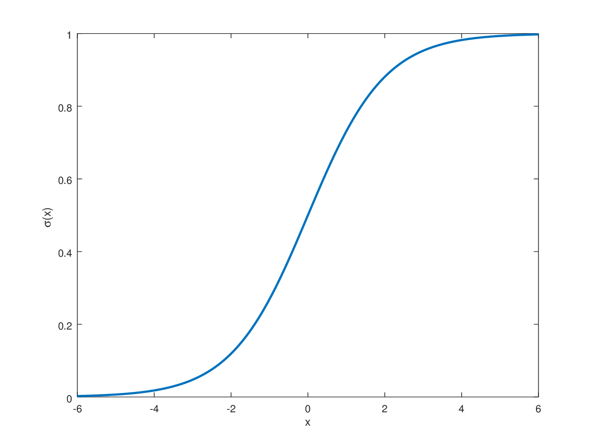
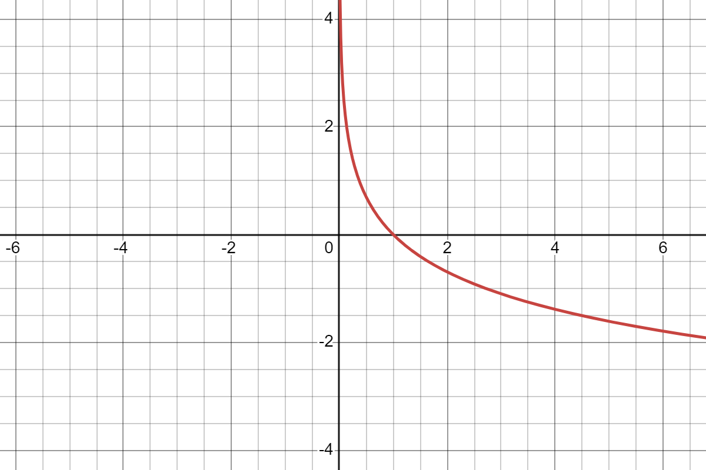
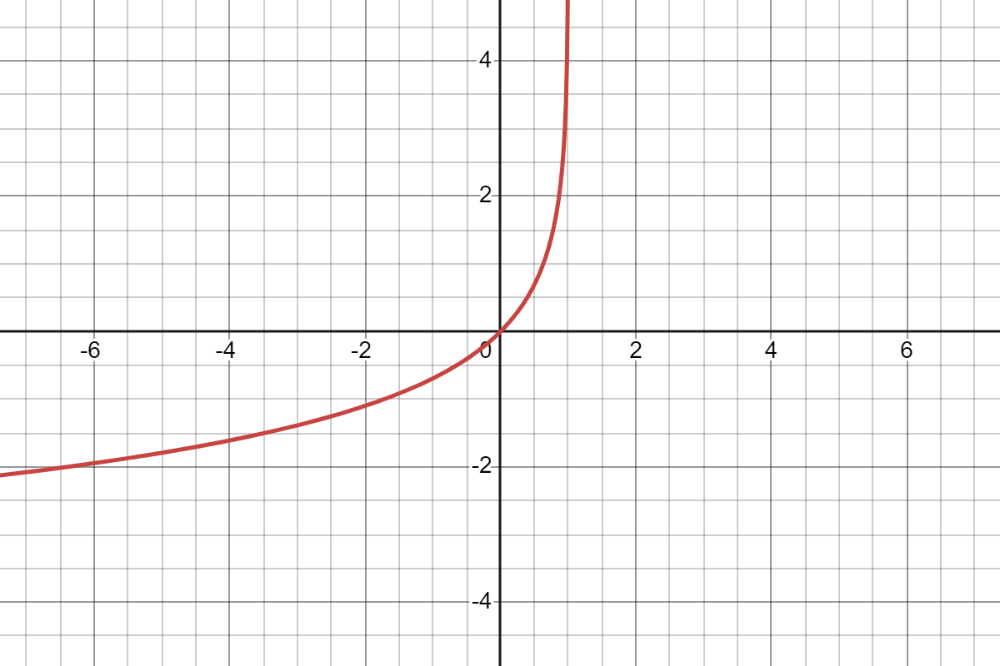
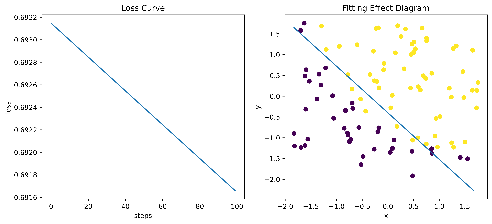
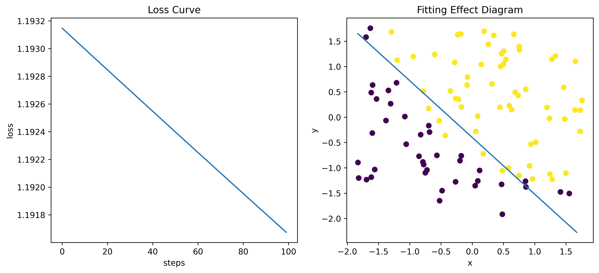

# 梯度下降算法在逻辑回归中的应用

## 逻辑回归简介

- sigmoid函数：

$$
g(z) = \frac{1}{1+e^{-z}}
$$



- 逻辑回归==假设函数==：

$$
\hat{y} = h_{\theta}(x) = g(\theta^Tx) = \frac{1}{1+e^{-\theta^Tx}}
$$

其中$\theta^T$和$x$延续在[梯度下降算法在线性回归中的应用](http://t.csdnimg.cn/vnee7)一文中的表达，即：
$$
\theta^T = 
\begin{bmatrix}
\theta_0, \theta_1,\theta_2,\cdots,\theta_n
\end{bmatrix}\\
x = 
\begin{bmatrix}
x_0\\
x_1\\
x_2\\
\vdots\\
x_n
\end{bmatrix}\\
$$

- ==损失函数==：

$$
L(\hat{y},y) = -ylog(\hat{y}) - (1-y)log(1-\hat{y})
$$

- 损失函数可以这样理解，当某一样本的真实标签$y=1$（正类）时，损失函数变为：

$$
L(\hat{y}, y) = -log(\hat{y})
$$



- 我们希望损失函数越小越好，那么也就是说希望$\hat{y}$越大越好，而$\hat{y}$表示是的概率，定义域是$[0,1]$，$\hat{y}$最大只能是1，与$y = 1$相同。
- 同样的，当某一样本的真实标签$y=0$（负类）时，损失函数变为：

$$
L(\hat{y},y) = log(1-\hat{y})
$$



我们希望损失函数越小越好，那么也就是说希望$\hat{y}$越小越好，而$\hat{y}$表示是的概率，定义域是$[0,1]$，$\hat{y}$最小只能是0，与$y = 0$相同。

- ==代价函数==：

$$
\begin{align}
J(\theta) &= \frac{1}{m}\sum^m_{i=1}L(\hat{y}^{(i)}, y^{(i)})\\
&= \frac{1}{m}\sum^m_{i=1}[-y^{(i)}log(\hat{y}^{(i)}) - (1-y^{(i)})log(1-\hat{y}^{(i)})]\\
&= \frac{1}{m}\sum^m_{i=1}\left[-y^{(i)} log\left(\frac{1}{1+e^{-\theta^Tx^{(i)}}}\right) - (1-y^{(i)})log\left(\frac{1}{1 + e^{-\theta^Tx^{(i)}}}\right)\right]
\end{align}
$$

## 梯度下降算法求解逻辑回归

- $J(\theta)$对$\theta_j$求偏导，$\theta_j$表示第$j$个$\theta$的值：

$$
\begin{align}
\frac{\partial}{\partial\theta_j}J(\theta) &= \frac{\partial}{\partial\theta_j} \frac{1}{m}\sum^m_{i=1}\left[-y^{(i)} log\left(\frac{1}{1+e^{-\theta^Tx^{(i)}}}\right) - (1-y^{(i)})log\left(\frac{1}{1 + e^{\theta^Tx^{(i)}}}\right)\right]\\
&=\frac{1}{m}\sum^m_{i=1}\left[y^{(i)} log\left(1+e^{-\theta^Tx^{(i)}}\right) + (1-y^{(i)})log\left(1 + e^{\theta^Tx^{(i)}}\right)\right]\\
\end{align}
$$

- 对$log\left(1+e^{\theta^Tx^{(i)}}\right)$​求偏导，注意这里采用复合函数求导法则

$$
\begin{align}
\frac{\partial}{\partial\theta_j}log\left(1+e^{-\theta^Tx^{(i)}}\right) &= \frac{1}{1 + e^{-\theta^Tx^{(i)}}} \times e^{-\theta^Tx^{(i)}} \times -x^{(i)}_{j}\\
& = \frac{-x^{(i)}_{j}e^{-\theta^Tx^{(i)}}}{1 + e^{-\theta^Tx^{(i)}}}
\end{align}
$$

- 则，原式为：

$$
\begin{align}
\frac{\partial}{\partial\theta_j}J(\theta) &=\frac{1}{m}\sum^{m}_{i=1}\left[-y^{(i)} \times \frac{-x^{(i)}_{j}e^{-\theta^Tx^{(i)}}}{1 + e^{-\theta^Tx^{(i)}}}  + (1-y^{(i)})\times\frac{x^{(i)}_{j}e^{\theta^Tx^{(i)}}}{1 + e^{\theta^Tx^{(i)}}}\right]\\
& = \frac{1}{m}\sum^{m}_{i=1}\left[-y^{(i)} \times \frac{-x^{(i)}_{j}}{e^{\theta^Tx^{(i)}} + 1}  + (1-y^{(i)})\times\frac{x^{(i)}_{j}e^{\theta^Tx^{(i)}}}{1 + e^{\theta^Tx^{(i)}}}\right]\\
& = \frac{1}{m}\sum^{m}_{i=1}\left[\frac{-x_j^{(i)}y^{(i)} + x_j^{(i)}e^{\theta^Tx^{(i)}} - y^{(i)}x_j^{(i)}e^{\theta^Tx^{(i)}}}{1 + e^{\theta^Tx^{(i)}}}\right]\\
& = \frac{1}{m}\sum^{m}_{i=1}\left[\frac{-y^{(i)}(1 + e^{\theta^Tx^{(i)}}) + e^{\theta^Tx^{(i)}}}{1 + e^{\theta^Tx^{(i)}}} x_j^{(i)} \right]\\
& = \frac{1}{m}\sum^{m}_{i=1}\left[\left(-y^{(i)} + \frac{e^{\theta^Tx^{(i)}}}{1 + e^{\theta^Tx^{(i)}}}\right)x_j^{(i)}\right]\\
& = \frac{1}{m}\sum^{m}_{i=1}\left[\left(-y^{(i)} + \frac{1}{e^{-\theta^Tx^{(i)}} +  1}\right)x_j^{(i)}\right]\\
& = \frac{1}{m}\sum^{m}_{i=1}\left[\left(h_\theta\left(x^{(i)}\right)-y^{(i)}\right)x_j^{(i)}\right]\\
\end{align}
$$

根据梯度下降算法公式，迭代公式为：
$$
\theta_j := \theta_j - \alpha\frac{1}{m}\sum^{m}_{i=1}\left[\left(h_\theta(x^{(i)}) - y^{(i)}\right)x_j^{(i)}\right]
$$
上面的$:=$符号表示先算右边的式子，算完后赋值给左边的变量。注意：左边和右边的$\theta_i$值并不相等，右边是迭代前的$\theta_i$值，左边的迭代后$\theta_i$的值。

## python代码实现

- 导入必要包

```python
import numpy as np
import statsmodels.api as sm
from tqdm.notebook import tqdm
import matplotlib.pyplot as plt
from sklearn.datasets import fetch_california_housing, make_regression
```

- 读取数据函数

```python
def load_data(data_path):
    data = np.loadtxt(data_path,delimiter=',')
    n = data.shape[1]-1
    data_x = data[:,0:n]
    data_y = data[:,-1].reshape(-1,1)
    return data_x,data_y
```

- sigmoid函数

```python
def sigmoid(z):
    r = 1/(1 + np.exp(-z))
    return r
```

- 逻辑回归函数

```python
def logic_lr(data_x, theta):
    z = np.dot(data_x,theta)
    return sigmoid(z)
```

- 代价函数

```python
def compute_loss(data_x, data_y, theta):
    row_num, col_num = data_x.shape
    l = -1 * data_y * np.log(logic_lr(data_x, theta)) - (1-data_y)*np.log(1-logic_lr(data_x, theta))
    return np.sum(l)/row_num
```

- 梯度下降算法求解逻辑回归函数

```python
def solve_logic_lr(data_x, data_y, theta, alpha, steps):
    temp_ones = np.ones(data_x.shape[0]).transpose()
    data_x = np.insert(data_x, 0, values=temp_ones, axis=1)
    row_num, col_num = data_x.shape
    loss_list = []
    for step in range(steps):
        loss_list.append(compute_loss(data_x, data_y, theta))
        for i in range(col_num):
            theta[i] = theta[i] - (alpha/row_num) * np.sum((logic_lr(data_x, theta) - data_y) * data_x[:,i].reshape(-1,1))
    return theta, loss_list
```

- 预测函数

```python
def predict(data_x, theta):
    temp_ones = np.ones(data_x.shape[0]).transpose()
    data_x = np.insert(data_x, 0, values=temp_ones, axis=1)
    p = logic_lr(data_x, theta)
    p[p >= 0.5] = 1
    p[p < 0.5] = 0
    return p
```

- 函数调用

```python
data_x, data_y = load_data('/kaggle/input/studyml/cls.txt')
data_x, mu, sigma = data_std(data_x)
# 变成列向量
theta = np.zeros(data_x.shape[1]+1).reshape(-1,1)
steps = 100
alpha = 0.0001
theta, loss = solve_logic_lr(data_x, data_y, theta, alpha, steps)
print(theta)
# 打印输出：[0.0009, 0.0027, 0.00249]
```

- 绘制Loss曲线（左）和拟合效果图（右）

```python
plt.figure(figsize=(12,5),dpi=600)
plt.subplot(1,2,1)
plt.plot(loss)
plt.title("Loss Curve")
plt.xlabel("steps")
plt.ylabel("loss")
plt.subplot(1,2,2)
plt.scatter(data_x[:,0],data_x[:,1],c=data_y)
temp_x1 = np.arange(min(data_x[:,0]), max(data_x[:,0]), 0.1)
temp_x2 = -(theta[1] * temp_x1 + theta[0])/theta[2]
plt.plot(temp_x1, temp_x2)
plt.title("Fitting Effect Diagram")
plt.xlabel("x")
plt.ylabel("y")
plt.show()
```



## 带L2正则化的逻辑回归

- 引入L2正则化，用于惩罚大的回归系数，减轻过拟合。则代价函数变为：

$$
\begin{align}
J(\theta) &= \frac{1}{m}\sum^m_{i=1}\left[-y^{(i)} log\left(\frac{1}{1+e^{-\theta^Tx^{(i)}}}\right) - (1-y^{(i)})log\left(\frac{1}{1 + e^{-\theta^Tx^{(i)}}}\right)\right] + \frac{\lambda}{2m}\lVert \theta \rVert_2^2
\end{align}
$$

- 根据上述的推导，可以得到$J(\theta)$对$\theta_j$的偏导数为：

$$
\frac{\partial}{\partial\theta_j}J(\theta) = \frac{1}{m}\sum^{m}_{i=1}\left[\left(h_\theta\left(x^{(i)}\right)-y^{(i)}\right)x_j^{(i)}\right] + \frac{1}{m} \times \lambda\theta_j
$$

根据梯度下降算法公式，迭代公式为：
$$
\theta_j := \theta_j - \alpha\frac{1}{m}\sum^{m}_{i=1}\left[\left(h_\theta(x^{(i)}) - y^{(i)}\right)x_j^{(i)} + \lambda\theta_j \right]
$$

## python代码实现

- 在上面的基础上，只需要修改代价函数和梯度下降求解函数就可以了
- 代价函数变为：

```python
def compute_loss(data_x, data_y, theta, lambd):
    row_num, col_num = data_x.shape
    l = -1 * data_y * np.log(logic_lr(data_x, theta)) - (1-data_y)*np.log(1-logic_lr(data_x, theta))
    return np.sum(l)/row_num + (lambd/2*row_num) + np.sum(np.power(theta,2))
```

- 梯度下降求解函数变为：

```python
def solve_logic_lr(data_x, data_y, theta, alpha, steps, lambd=0.01):
    temp_ones = np.ones(data_x.shape[0]).transpose()
    data_x = np.insert(data_x, 0, values=temp_ones, axis=1)
    row_num, col_num = data_x.shape
    loss_list = []
    for step in range(steps):
        loss_list.append(compute_loss(data_x, data_y, theta, lambd))
        for i in range(col_num):
            theta[i] = theta[i] - (alpha/row_num) * np.sum((logic_lr(data_x, theta) - data_y) * data_x[:,i].reshape(-1,1) + lambd * theta[i])
    return theta, loss_list
```

- 函数调用

```python
data_x, data_y = load_data('/kaggle/input/studyml/cls.txt')
data_x, mu, sigma = data_std(data_x)
# 变成列向量
theta = np.zeros(data_x.shape[1]+1).reshape(-1,1)
steps = 100
alpha = 0.0001
theta, loss = solve_logic_lr(data_x, data_y, theta, alpha, steps)
print(theta)
```

- 绘制Loss曲线（左）和拟合效果图（右）

```python
plt.figure(figsize=(12,5),dpi=600)
plt.subplot(1,2,1)
plt.plot(loss)
plt.title("Loss Curve")
plt.xlabel("steps")
plt.ylabel("loss")
plt.subplot(1,2,2)
plt.scatter(data_x[:,0],data_x[:,1],c=data_y)
temp_x1 = np.arange(min(data_x[:,0]), max(data_x[:,0]), 0.1)
temp_x2 = -(theta[1] * temp_x1 + theta[0])/theta[2]
plt.plot(temp_x1, temp_x2)
plt.title("Fitting Effect Diagram")
plt.xlabel("x")
plt.ylabel("y")
plt.show()
```

