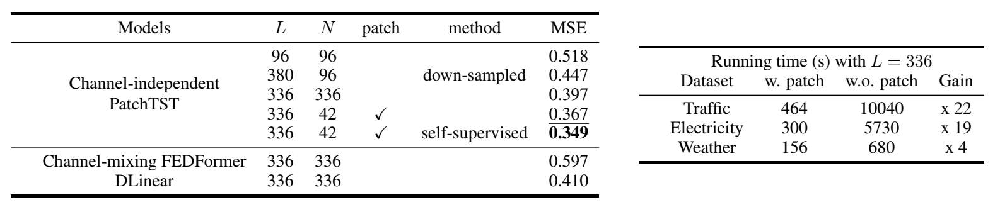
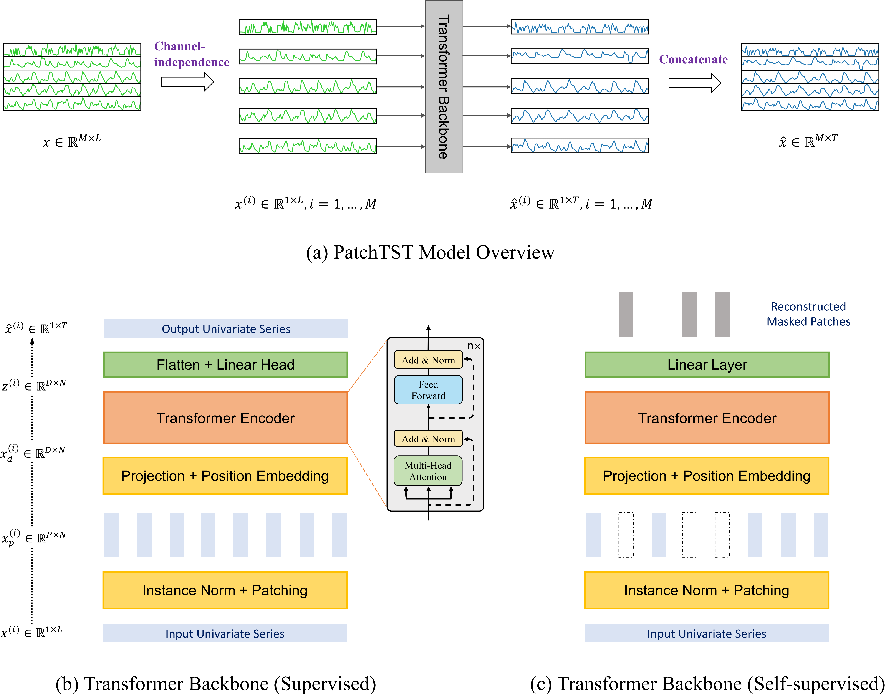
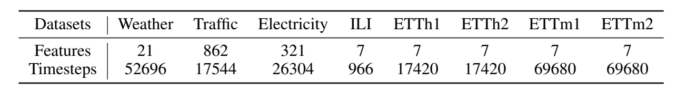
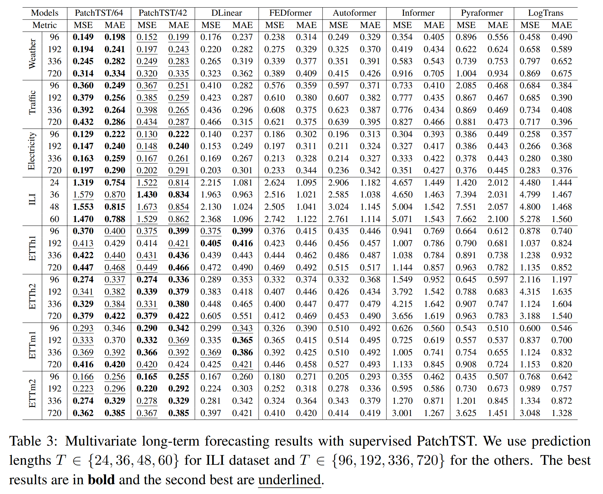
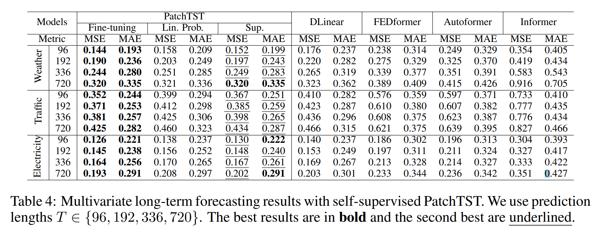
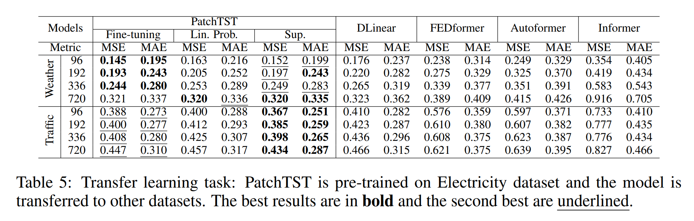
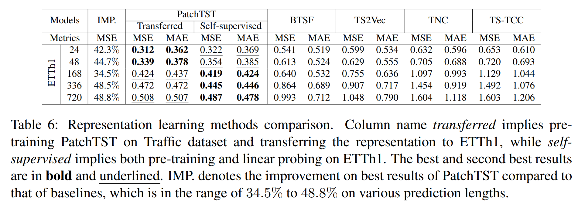
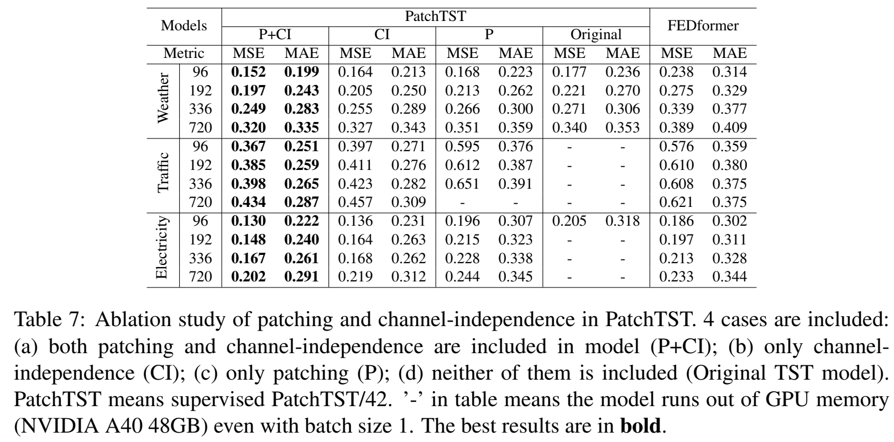
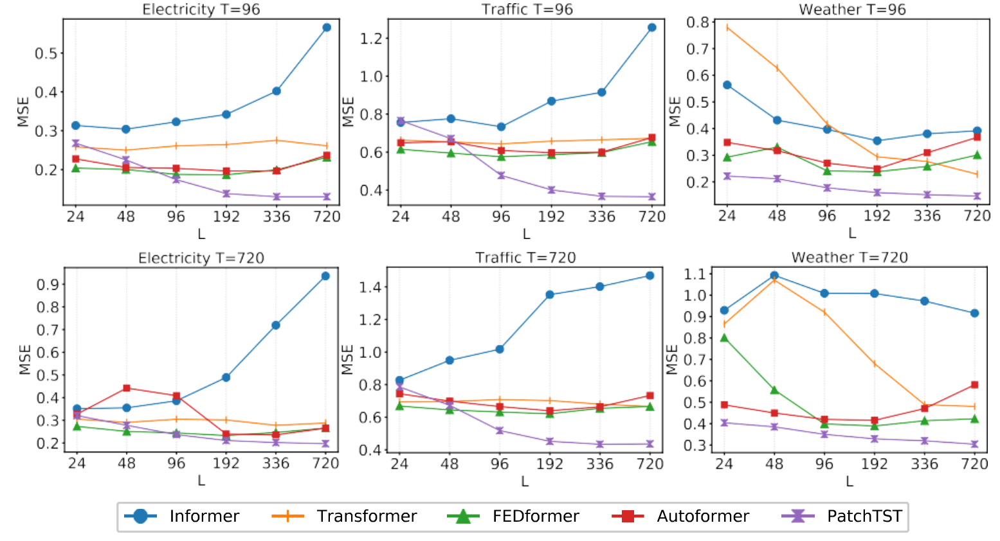

# A Time Series is Worth 64 Words

## 摘要

我们提出了一种高效的基于Transformer设计的模型，用于多变量时间序列预测和自我监督表征学习（self-supervised learning）。它基于两个关键部分：1、将时间序列分隔成子序列级别的patches，作为Transformer的输入；2、独立通道(channel-independence)，每个通道包含一个单一的单变量时间序列，它们共享相同的embedding和Transformer权重。设计patches有3个好处：局部序列信息被保留在embedding中；在相同的回视窗口下，注意力图的计算和内存使用量呈2次方减少；模型可以关注到更长的历史信息。我们提出的PatchTST模型（channel-independent patch time series Transformer）可以显著提高长期预测的准确性。我们还将模型应用于自监督预训练任务，并取得了出色的微调性能，在大数据集上的表现由于监督学习。将一个数据集上的masked预训练结果转移到其他数据集上也能产生SOTA预测精度。

## 简介

预测是时间序列分析中最重要的任务之一。随着深度学习模型的快速发展，关于这个主题的研究工作数量大大增加。深度模型不仅在预测任务上表现出优异的性能，并且在表征学习上也表现出优异的性能，抽象的表征可以被提取并转移到各种下游任务中，如分类和异常检测，以达到SOTA精度。

在深度学习模型中，Transformer在自然语言处理（NLP）、计算机视觉（CV）、语音以及最近的时间序列等各个领域都取得了巨大成功，得益于其注意力机制，可以自动学习序列中元素间联系，因此称为序列建模任务的理想选择。Informer、Autoformer和FEDformer是Transformer模型成功应用于时间序列数据的最佳变种之一。不幸的是，尽管Transformer模型设计十分复制，最近的论文显示，一个非常简单的线性模型可以在各种常见的基准上超过之前的所有模型，它挑战了Transformer在时间序列预测中的适用性。在本文中，我们试图通过提出基于Transformer的PatchTST模型来解决这一问题。

- Patching：时间序列预测的目的是了解每个不同时间步间相关性。然而，单个时间步长并不像句子中的一个单词那样具有语义，因此提取局部语义信息对于分析他们之间的联系至关重要。以前的工作大多只使用单点（point-wise）的输入标记，或者只是从系列中手动提取信息。相比之下，我们通过将时间步聚集到子系列级别的patch中，增强了位置（locality）性，并捕获了单点（point-wise）所没有的综合语义信息。
- 独立通道（Channel-independence）：多变量时间序列是一个多通道信号，每个Transformer的输入tokens可以由单通道或多通道的数据表示。根据输入tokens的设计特性，提出了Transformer架构的不同变体。通道混合（Channel-mixing）值的是后一种情况，即输入tokens采取所有时间序列特征向量并将其投射到embedding空间以混合信息。另一方面，独立通道意味着每个输入tokens只包含来自同一通道的信息。这被证明在CNN和线性模型中运行良好，但还没有被应用到基于Transformer模型中。

我们在下表中提供了对交通数据集的关键性研究结果，该数据集由862个时间点组成。我们的模型有以下几个优点。

- 减少时空复杂度：原始的Transformer在时间和空间上都有$O(N^2)$的复杂性，其中$N$是输入tokens的数量。如果不进行预处理，$N$将与输入序列长度$L$具有相同的值，这在实践中成为计算时间和内存的主要瓶颈。通过应用patch，我们可以将$N$缩小几倍：$N \approx L/S$，从而降低时间和空间复杂度。上表说明了patch的作用。通过设置patch长度$P = 16$，步长$S = 8$，$L = 336$，训练时间大大减少。
- 长回视窗口学习能力：上表显示，通过将回视窗口$L$从96增加到336，MSE可以从0.518降低到0.397。然而，简单地延长$L$是以较大的内存和计算量为代价的。由于时间序列往往带有大量的时间冗余信息，以前的一些工作试图通过采用下采样或精心设计的注意力稀疏连接来忽略部分数据点，模型仍然产生足够的信息来进行良好的预测。我们研究了$L = 380$的情况。时间序列每4步采样一次并将最后一个点加入序列中，输入tokens数量为$N = 96$。与使用包含最近96个时间点（0.518）相比，该模型取得了更好的MSE得分（0.447），表明即使输入tokens数量相同，更长的回视窗口也能传达更重要的信息。这让我们想到一个问题：有没有办法在保持长回视窗口的同时避免“扔掉”一些数据？patch是一个很好的答案。它可以将包含类似数值的局部时间点分组，同时使模型能够减少输入tokens的长度，以利于计算。从上表中可以看出，当$L = 336$时，通过patch，MSE从0.397进一步降低到0.367。
- 表征学习能力：随着强大的自监督学习技术的出现，需要具有多个非线性抽象层的复杂模型来捕捉数据的抽象表示。简单的模型，如线性模型，由于其有限的可表达性，可能不适合该任务。通过PatchTST模型，我们不仅证实了Transformer对时间序列是有效的，并且证明了他的表征能力可以进一步提高预测性能。我们的PatchTST模型在上表中取得了最好的MSE（0.349）

我们在下面的章节中详细介绍了我们的方法，并进行了大量的实验来最终证明我们的想法。我们不仅用超视距预测结果和消融实验证明了模型的有效性，而且还实现了SOTA自监督表征学习和迁移学习。

## 相关工作

Transformer中的patch：Transformer在不同的数据模式上表现出了巨大的潜力。在所有的应用中，当局部语义信息很重要时，patch是一个必不可少的部分。在NLP中，BERT考虑了基于子词的标记化（tokenization），而不是执行基于字符的标记化。在CV方面，Vision Transformer是一项里程碑式的工作，它将图像分割成16个patch，然后再送入Transformer模型。接下来的影响性工作，如BEIT和masked autoencoders都是使用patch作为输入。同样，在语音方面，研究人员正在使用卷积从原始音频输入中提取子序列级别的信息。

基于Transformer的长期时间序列预测：近年来，有大量的工作试图应用Transformer模型来预测长期时间序列。我们在此总结一下其中的一些。LogTrans使用卷积自注意力层与LogSparse设计来捕捉局部信息并降低空间复杂度。Informer提出了一个带有蒸馏技术的ProbSparse自注意力，以有效提取最重要的信息。Autoformer借用了传统时间序列分析方法中的分解和自相关思想。FEDformer使用傅里叶增强结构来获得线性复杂度。Pyraformer应用金字塔式注意力模块，具有尺度（inter-scale）和尺度（inter-scale）连接，也得到了线性复杂度。

这些模型大多侧重与设计新的机制，以减少原始注意力机制的复杂性，从而在预测上取得更好的性能，特别是当预测长度较长时。然而，大多数模型使用的是点式注意力，忽略了patch的重要性。LogTrans避免了key和query之间的点对点积，但其值仍然基于单一时间步长。Autoformer使用自动关联来获得patch级别的链接，但它是一个手工设计，并不包括patch内的所有语义信息。Triformer提出了patch attention，但其目的是通过一个使用伪时间戳作为patch内的query来降低复杂度，因此它即没有将patch作为一个输入单元，也没有揭示其背后的语义重要性。

时间序列表征学习：除了监督学习，自监督学习也是一个重要的研究课题，因为它已经显示出为下游任务学习有用表征的潜力。近年来，有许多非基于Transformer的模型被提出来学习时间序列的表征。同时，Transformer被认为是对基础模型和学习通用表征的理想候选者。然而，尽管人们已经对基于Transformer的模型进行了尝试，如时间序列Transformrt（TST）和TS-TCC，但其潜力仍未完全发挥。

## 本文方法

### 模型结构

我们考虑以下问题：给定一个具有回视窗口$L$ 的多元时间序列样本集合：$(x_1,...,x_L)$，其中每个$X_t$在时间步长$t$时是维度为$M$的向量，我们想预测$T$的未来值($x_{L+1},...,x_{L+T}$)。我们的PatchTST如下图所示，模型利用Transformer encoder作为核心结构。

前向过程：我们把从索引1开始的长度为$L$的第$i$个单变量序列表示为$x^{(i)} = (x_1^{(i)},...,x_L^{(i)})$其中$i = 1,...,M$。输入$(x_1,...,x_L)$被分隔成$M$个单变量序列$x^{(i)} \in R^{1 \times L}$，其中每个序列都根据channel-independence设置进入Transformer网络。然后Transformer将提供预测结果$\hat{x}^{(i)} = (\hat{x}^{(i)}_{L+1},...,\hat{x}^{(i)}_{L+T}) \in R^{1 \times T}$

Patching：每个输入的单变量时间序列$x^{(i)}$首先被划分为patch，这些patch可以是重叠的，也可以是非重叠的。将patch长度记为$P$，将两个连续patch之间的非重叠区域记为$S$，那么patch过程将产生一个patch序列$x_p^{(i)} \in R^{P \times N}$其中$N$是产生的patch数量，$N = [\frac{(L-P)}{S}]+2$。这里，我们把最后一个值$x_L^{(i)}$的$S$个重复数字pad到原序列的末尾，再进行patch。

随着patch操作，输入token数量可以从L减少到大约$L/S$。这意味着注意力图谱的内存使用和计算复杂度以4倍的速度下降。因此，在训练时间和GPU内存限制下，patch设计可以让模型看到更长的历史序列，这可以显著提高模型预测性能。

Transformer Encoder：我们使用普通的Transformer Encoder，将观察到的信号映射到潜在表征（latent representations）。通过可训练的线性投影$W_p \in R^{D \times P}$，以及可学习的加法位置编码$W_{pos} \in R^{D \times N}$，将patch映射到维度为D的Transformer latent空间，应用于监测patch的时间顺序：$x_d^{(i)} = W_px_p^{(i)} + W_{pos}$，其中$x_d^{(i)} \in R^{D \times N}$表示送入Transformer encoder的输入。多头注意力$h = 1,...,H$，将他们转化为query矩阵$Q^{(i)} = (x_d^{(i)})^TW_{h}^{Q}$，key矩阵$K_h^{(i)} = (x_d^{(i)})^TW_h^K$和value矩阵$h_h^{(i)} = (x_d^{(i)})^TW_h^V$，其中$W_h^K \in R^{D \times d_k}$，$W_h^V \in R^{D \times D}$。之后，按比例输出的方式来获得注意力输出$O^{(i)} \in R^{D \times N}$，即：

$$(O_h^{(i)})^T = Attention(Q_h^{(i)},K_h^{(i)},V_h^{(i)}) = Softmax(\frac{Q_h^{(i)}(K_h^{(i)})^T}{\sqrt{d_k}})V_h^{(i)}$$

多头注意力模块还包括BatchNorm层和一个具有残差连接的前馈网络。如上图所示，之后产生的表示方法为$z^{(i)} \in R^{(D \times N)}$。最后用一个带有线性头的全连接层来获得预测结果$\hat{x}^{(i)} = (\hat{x}_{L+1}^{(i)},...,\hat{x}_{L+T}^{(i)}) \in R^{1 \times T}$

损失函数：我们选择MSE来衡量预测结果和真实值的差异。每个channel的损失是$||\hat{x}_{L+1:L+T}^{(i)}-x_{L+1:L+T}^{(i)}||^2_2$，对$M$个时间序列进行平均，得到总的目标损失：

$$\zeta = E_x\frac{1}{M}\sum^{m}_{i=1}||\hat{x}_{L+1:L+T}^{(i)}-x_{L+1:L+T}^{(i)}||^2_2$$

实例归一化（Instance Normalization）：这项技术最近被提出来帮助缓解训练和测试数据之间的分布偏移效应。它简单地将每个时间序列$x^{(i)}$，其平均值为0，以标准差为单位。实际上，我们在patch前对每个$x^{(i)}$进行归一化处理，并将平均值和偏差加回到输出预测中。

### 表征学习

自监督表征学习已经成为一种流行的方法，从无标签的数据中提取高水平的抽象表征。在本节中，我们应用PatchTST来获得多变量时间序列的显著表示。实验表明，学习到的表征可以有效地转移到预测任务中。在自监督预训练学习表征的流行方法中，掩蔽自动编码（masked autoencoder）已被成功应用于NLP和CV领域。这种技术在概念上很简单：故意随机删除一部分输入序列，然后训练模型以恢复丢失的内容。

掩蔽自动编码最近被应用于时间序列，并在分类和回归任务上取得了显著的性能。作者提议将多变量时间序列应用于Transformer，其中每个输入tokens是一个由时间步长$i$的时间序列值组成的向量$x_i$。掩码在每个时间序列内和不同序列间随机放置。然而，这种设置有两个潜在的问题。首先，屏蔽（masking）是在单个时间步长的层面上应用的。当前时间点的遮蔽值（masked values）可以很容易地通过紧接着的时间值相互联系来推断，而不需要对整个序列有高水平的理解，这偏离了我们学习整个序列抽象表示的目标。Zerveas等人在2021年提出了复杂的随机化策略来解决这个问题，其中不同大小的时间序列组被随机屏蔽。

第二，预测任务的输出层设计可能很麻烦。给出对应于所有$L$个时间点的代表向量（resentation vectors）$z_t \in R^D$，通过线性映射将这些向量映射到包含$M$个变量的输出，每个变量的预测期限为$T$，这需要一个参数矩阵$W$的维度为：$(L \cdot D) \times (M \cdot T)$。如果这四个值中的任何一个或全部都很大，这个矩阵就会特别大。当下游训练样本的数量很少时，这可能导致过拟合。

我们提出的PatchTST可以自然地克服上述问题。如上图所示，我们使用与监督学习设置相同的Transformer encoder。预测头被移除，而一个D \times P的线性层被连接起来。与监督模型相反，在自监督学习中，我们将输入序列划分为规则的非重叠patch。这是为了确保观察到的patch不包含被遮蔽（mask）的信息。然后，我们均匀地随机选择一个patch指数的子集，并根据这些选定的指数用零值屏蔽patch。用MSE损失来训练模型，以重建被遮蔽的patch。

我们强调，每个时间序列都有自己的潜在表征，通过共享权重机制进行交叉学习，这种设计可以允许预训练数据包含与下游数据不同数量的时间序列，这在其他方法中可能是不可行的。

## 实验

### 长期时间序列预测

数据集：我们在8个流行的数据集上评估了PatchTST的性能，包括天气、交通、电力、ILI和ETT数据集（ETTh1、ETTh2、ETTm1、ETTm2）。这些数据集已被广泛用于基准测试，并在论文上公开。下表总结了这些数据集的统计数据。值得注意的是几个大型数据集（天气、交通和电力）。它们有更多的时间点，因此，与其他较小的数据集相比，结果会更稳定，更不容易被过拟合。

基线和实验设置：我们选择基于SOTA Transformer的模型，包括FEDformer、Autoformer、Informer、Pyraformer、LogTrans以及最近的非变压器模型DLinear作为基线。所有的模型都遵循相同的实验设置，ILI数据集的预测长度为$T \in \{24,36,48,60\}$，其他数据集的预测长度为$T \in \{96,192,336,720\}$，与原论文一样。我们收集了Zeng等人的基线结果，基于Transformer的模型默认回视窗口$L = 96$，DLinear的$L = 336$。但为了避免低估基线，我们也对六种不同的回视窗口$L \in \{24,48,96,192,336,720\}$运行FEDformer、Autoformer和Informer，并总是选择最佳结果来创建基线。关于基线的更多细节可以在附录中找到。我们计算了多变量时间序列预测的MSE和MAE作为衡量标准。

模型的变体：我们在下表中提出PatchTST的两个版本。PatchTST/64意味着输入patch的数量是64，使用回视窗口$L = 512$。PatchTST/42意味着输入patch数量为42，采用默认的回视窗口$L = 336$。因此，我们可以用PatchTST/42作为与DLinear和其他基于Transformer的模型进行公平比较，用PatchTST/64来探索更大数据集上的效果。更多的实验细节在附录中。

结果：上表显示了多变量长期预测的结果。总的来说，我们的模型优于所有基线模型。从数量上看，与基于Transformer的模型所能提供的最佳结果相比，PatchTST在总体MSE上实现了20.2%的降低，在MAE上实现了16.4%的降低。与线性模型相比，PatchTST在总体上仍然优于它，特别是在大型数据集（天气、交通、电力）和ILI数据集上。我们还对单变量数据集进行了实验，结果见附录。

### 表征学习

在本节中，我们进行了掩码自监督学习（masked self-supervised learning）的实验，我们将patch设置为不重叠的。在所有的表征学习实验中，输入序列的长度被设置为512，patch大小被设置为12，产生了42个patch。我们考虑提高掩码率，其中40%的patch被遮蔽为零值。我们首先在上节提到的数据集上应用自我监督的预训练，进行100个epochs。一旦某个数据集上的预训练模型可用，我们就进行监督训练，以评估所学到的表征，我们有两种选择：线性层微调和端到端微调。使用线性层微调，我们只训练模型最后线性层，20个epochs，同时冻结网络的其他部分；使用端到端微调，我们应用线性层微调10个epochs，然后使用端到端微调整个网络20个epochs。事实证明，线性层微调和端到端微调的两步策略可以胜过直接进行微调的策略。我们在下面选择一些有代表性的结果，完整的基准可以在附录中找到。

与监督方法比较：下表比较了PatchTST（含端到端微调、线性层微调和监督学习）与其他监督方法的性能。如表所示，在大数据集上，与从头开始的监督训练相比，我们的预训练程序有明显的改进。通过对模型头部的微调（线性探测），预训练的性能已经可以和从头开始训练整个网络相媲美，并且比线性层调整更好。最好的结果是通过端对端微调观察到的。自监督的PatchTST在所有数据集上都明显优于其他基于Transformer的模型。

迁移学习：我们测试了将预训练的模型迁移到下游任务中的能力。特别是，我们在电力数据集上预训练模型，并在其他数据集上进行微调。我们从下表中观察到，总的来说，微调的MSE比在同一数据集上的预训练和微调的MSE略差，这是合理的。在某些情况下微调的性能也比监督训练差。然而，预测性能仍然优于其他模型。需要注意的是，相对于有监督的PatchTST，整个模型在每个预测区间都要进行训练，这里我们只对线性头或整个模型进行重新训练，次数要少的多，这使得计算时间大大减少。

与其他自监督方法的比较：我们将我们的自监督模型与BTSF和TS-TCC是最先进的时间序列对比学习表示方法之一。我们在ETTh1数据集上测试了预测性能，其中我们只在获得学习表征后应用线性层微调，以使比较公平。下表的结果强烈的显示了PatchTST的优越性能，无论是对自己的ETTh1数据进行预训练还是对Traffic进行预训练。

### 消融实验

Patching and Channel-independence：我们在下表中研究了Patching and Channel-independence的影响。我们将FEDformer作为基于Transformer模型的SOTA基准。通过对Patching and Channel-independence是否设计的结果进行相应的比较，我们可以发现，这两个因素都是提高预测性能的重要因素。patch的动机是自然的；此外，由于Transformer序列输入较短，这种技术改善了运行时间和内存占用，如表1所示，另一方面，就技术优势而言，Channel-independence可能不像patch那样直观。因此我们在附录中深入分析了使Channel-independence更可取的关键因素，更多消融探究结果请见附录。

变化的回视窗口：原则上，较长的回视窗口会增加感受野。这将潜在地提高预测性能。然而，正如Zeng等人所论证的那样，在大多数基于Trasformer的模型中没有观察到这种现象。我们还在下图中表明，在大多数情况下，这些基于Transformer的基线并没有从较长的回视窗口$L$中受益，这表明它们在捕捉时间特征上没有效果。相比之下，我们的PatchTST随着感受野的增加，MSE分数不断降低，这证实了我们的模型有能力从更长的回视窗口中学习。

## 结论和展望

本文通过引入两个关键部分：Patching和Channel-independence，提出了一种有效的基于Transformer模型设计，用于时间序列预测任务。与以前的工作相比，它可以捕捉局部语义信息，并从更长的回视窗口中受益。我们不仅表明我们的模型在监督学习中优于其他基线，而且还证明了它在自监督表征学习和迁移学习中的优良表现。

我们的模型表现出成为基于Transformer基线模型的潜力，并成为时间序列基础模型的构建块。patch是简单的，但被证明是一个有效的操作，可以跟容易地迁移到其他模型。另一方面，可以进一步利用Channel-independence，以加入不同通道之间的相关性。对跨Channel的依耐性进行适当建模是未来的一个重要方向。
建块。patch是简单的，但被证明是一个有效的操作，可以跟容易地迁移到其他模型。另一方面，可以进一步利用Channel-independence，以加入不同通道之间的相关性。对跨Channel的依耐性进行适当建模是未来的一个重要方向。