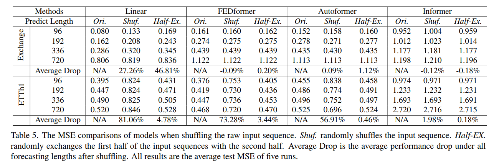

# Are Transformers Effective for Time Series Forecasting

## 摘要

&emsp;&emsp;基于``Transformer``的长时间序列预测模型不断涌现，并且性能在过去几年力不断提高，但``Transformer``是否对长时间序列问题有效？

&emsp;&emsp;具体来说，``Transformer``是提取长序列中各元素间语义关联最成功的模型，但是在时间序列模型中，我们需要在一个有序的连续点集合中提取时间关系。虽然采用位置编码和使用tokens嵌入子序列有利于保留一些排序信息，但变化无常的自注意力机制不可避免的导致部分时间信息丢失。所以为了验证我们的想法，我们引入了一组名为``LTSF-Linear``的简单单层线性模型，实验结果表明``LTSF-Linear``在所有数据集上都出乎意料的优于现有基于``Transformer``的复杂LSTF模型，而且往往有很大优势。

&emsp;&emsp;此外我们还进行了全面的验证实验，探讨``LTSF``模型各种设计元素对时间关系提取能力的影响，我们也主张在未来重新检查``Transformer``对其他时间序列分析任务的有效性。

## 简介

&emsp;&emsp;在当今数据驱动的世界中，时间序列无处不在。考虑到历史数据，时间序列预测（TSF）是一项长期的任务，具有广泛的应用，包括但不限于交通流量估计、能源管理、金融投资。在过去十几年里，（TSF）解决方案经历了从传统的统计方法（如ARIMA）和机器学习技术（如GBRT）到基于深度学习的解决方案，如循环神经网络（RNN）和时间卷积网络（TCN）的发展。

&emsp;&emsp;``Transformer``可以以说是最成功的序列模型架构。在自然语言处理（NLP）、语音识别和计算机视觉等各种方面有着非常显著的优势。最近，基于``Transformer``的时间序列预测模型也在不断涌现，最值得注意的是专注于解决长期时间序列预测（LTSF）问题的模型，包括``LogTrans``（NeurIPS2019），``Informer``（AAAI2021最佳论文）。``Autoformer``（NeurIPS 2021），``Pyraformer``（ICLR2022 Oral），``Triformer``（IJCAI 2022）和``FED-former``（ICML 2022）。

&emsp;&emsp;``Transformer``主要依赖多头注意力机制工作，它具有提取长序列中各元素（如文本中的单词或图像中的块）之间语义关联显著的能力。然而自注意力机制在某种程度上是无序的（特征之间没有空间位置关系）。虽然使用各种类型的位置编码技术可以保留一些排序信息，但在这些技术之上应用自注意力机制后，仍然不可避免会有部分信息损失。这对于NLP等语义丰富的应用来说，通常不是一个严重的问题，例如，即使我们对句子中的一些词重新排序，句子的语义也基本保留下来。但是，在分析时间序列数据时，数值型数据缺乏语义，而我们主要对连续点间趋势变化进行建模，也就是说顺序本身起着最关键的作用，因此，我们提出以下耐人寻味的问题。**Transformer对长时间序列预测真的有效吗？**

&emsp;&emsp;此外，虽然现有基于``Transformer``的LTSF模型显示出比传统方法更好的结果，在所有实验中，被比较的（非``Transformer``）基线都形成了自回归或多步骤迭代预测（IMS），这些方法在LTSF问题上有显著的误差积累效应。因此在这项工作中，我们用多步骤直接预测（DWS）策略与基于``Transformer``的模型进行对比，以验证其实际性能。

&emsp;&emsp;并非所有的时间序列都是可预测的，更不用说长期预测了（例如对于混乱的系统而言）。我们假设，长期预测只对那些具有相对明确趋势和周期性的时间序列可行。由于线性模型已经可以提取这样的信息，我们引入一组名为``LTSF-Liner``的简单线性模型作为新的比较基线。``LTSF-Liner``用单层线性模型对历史时间序列进行回归，以直接预测未来的时间序列。我们在9个广泛使用的基准数据集上进行了广泛的实验，这些数据集包含了各种现实生活中的应用交通、能源、经济、天气和疾病。令人惊讶的是，我们的结果显示，``LTSF-Liner``线性模型在所有情况下都优于现有基于```Transformer```的复杂模型，而且往往有很大的优势（20%~50%）。此外，我们发现，与现有```Transformer```模型中的主旨相比，大部分``Transformer``模型都未能提取出长序列时间上的关系，也就是说，预测误差并没有随着回视窗口大小的增加而减少（有时甚至增加）。最后我们对现有基于```Transformer```模型进行了各种分析研究，以研究其中各种设计元素的影响，总而言之，这项工作包括：
 - 这是一项挑战```Transformer```模型对长期时间序列预测任务的有效性工作
 - 根据``LTSF-Liner``在9个基准数据集上的表现，``LTSF-Liner``可以成为LSTF问题的一个新基线
 - 对现有基于```Transformer```模型各个方面进行全面实证研究，包括对长输入的建模能力，对时间序列顺序的敏感性，位置编码和子序列嵌入的影响，模型复杂度比较
&emsp;&emsp;综上所述，我们认为，至少对于``LTSF-Liner``来说，基于```Transformer```的模型对长时间序列预测任务的有效性被严重夸大了。同时，虽然``LTSF-Liner``取得了较好的准确率，但它只是作为未来研究TSF问题的一个简单基线，我们也主张在未来重新审视基于```Transformer```的模型在其他时间序列分析任务中的有效性。

## TSF问题表述

&emsp;&emsp;对于包含$C$变量的时间序列，给定历史数据$X = {X_1^t,...,X_C^t}_{t = 1}^L$，其中$L$是回看窗口的大小，$X_i^t$是变量$i$在$t$时刻的值。时间序列预测的任务是预测$\hat{X} = \{ \hat{X}_1^t,\cdots ,\hat{X}_C^t \}_{t = L+1}^{L+T}$在未来T个时间步长的数值。当$T>1$时，多步迭代（IMS）预测通过学习一个单步预测器，并迭代应用它来获得多步预测；直接多步预测（DWS）直接一次性优化多步预测目标。
&emsp;&emsp;与DMS预测结果相比，IMS预测的方差较小，这要归功于自回归机制，但它们不可避免地受到误差累计的影响。因此，当有一个高度准确的单步预测器，且$T$相对较小时，IMS预测是最好的。相反，当很难得到一个无偏的单步预测器时，或者$T$很大时，DMS预测会更准确。
## 基于Transformer的LSTF解决方案
&emsp;&emsp;基于``Transformer``的模型在自然语言处理和计算机视觉等许多长期人工智能任务中取得了较好的表现，这都要归功于多头注意力机制的有效性。同时也引发了人们对基于``Transformer``的时间序列建模的大量研究。特别是大量的研究工作致力于LTSF任务。考虑到``Transformer``模型擅长捕捉长距离依赖关系的能力，他们中的大多数都集中在探索较少数据的长期预测问题上（$T >> 1$）

&emsp;&emsp;当把假想的``Transformer``模型应用到LSTF任务时，出现了一些局限性。包括原始的自我注意力机制的$O(L^2)$时间/内存复杂度和``auto-regressive``解码器设计造成的错误累积。Informer解决了这些问题，并提出了一个新的``Transformer``架构，降低了时间、内存复杂度，并提出DMS预测策略。后来，更多的``Transformer``变体在模型中引入了各种时间序列特征来实现性能或效率的提升。我们将现有基于``Transformer``的LSTM解决方案设计要素总结如下：


### 时间序列分解
&emsp;&emsp;对于数据的预处理，在LSF中常见的是``zero-mean``方法。此外，``Autoformer``首次在每个神经块后面应用季节性趋势分解，这是时间序列分析中的一种标准方法，可以使原始数据更加可预测。具体来说，该模型使用移动平均核（moving average kernel）来提取时间序列的趋势周期成分。原始序列与趋势成分间差值被视为季节性成分。在``Autoformer``模型分解方案的基础上，FEDformer进一步提出了专家混合策略，以融合不同移动平均核所提取的趋势成分。
### 输入embedding策略
&emsp;&emsp;``Transformer``架构中自我注意力层无法保留时间序列的位置信息，然而局部位置信息（即时间序列的顺序）是很重要的。此外，全局时间信息，如分层时间戳（周、月、年）和不可知的时间戳（假期和事件），也是有信息量的。为了增强时间序列输入的时间背景，在基于SOTA``Transformer``的方法中，一个实用的设计是将7种方法嵌入模型，如固定位置编码、通道投影嵌入和可学习时间模块。此外，还引入了带有时间卷积层的嵌入层或可学习时间戳。
### 自注意力策略
&emsp;&emsp;``Transformer``主要依靠自注意力机制来提取成对元素的语义依赖关系，其冬季是为了减少$O(L^2)$的时间和空间复杂度。``Transformer``近期工作提出了两种提高效率的策略。一方面，``LogTrans``使用``Logsparse``掩码将计算复杂度降低到$O(LlogL)$，而``Pyraformer``采用金字塔式注意力，以$O(L)$时间和内存复杂度捕捉层次上的多尺度时间依赖。另一方面，``Informer``和``FEDformer``在自我注意力矩阵中使用了低等级权重（``low-rank property``）。``Informer``提出了``ProbSparse``自注意力机制和自蒸馏操作，将复杂度降低到了$O(LlogL)$，$FEDformer$设计了傅里叶变换增强块和小波增强块。最后，``Autoformer``设计了串联式自动相关机制来代替原来的自注意力层。
### 解码器（Decoder）
&emsp;&emsp;``vanilla Tranformer``解码器以自回归方式输出序列，导致了缓慢的输入速度和错误累积效应，特别是对于长时间序列预测。``Informer``为DMS预测设计了生成式解码器。其他``Transformer``变体也采用类似的DMS策略。例如，``Pyraformer``使用全连接层串联空间时间轴（``fully-connected layer concatenating Spatio-temporal axes``）作为解码器。``Autoformer``分别提取趋势、周期特征并与季节成分自动相关机制叠加得到最终的预测结果。``FEDformer``也使用了相似的频率衰减块分解得到最终结果。

&emsp;&emsp;``Transformer``模型效果依赖成对元素之间的语义关系，而自注意力机制本身是无序的（``permutation-invariant``），它对时间关系的建模能力主要取决于与输入标记相关的位置编码。考虑到时间序列中的原始数值数据（如股票价格或电力价值），它们之间几乎没有任何点状的语义关联。在时间序列建模中，我们主要对一组连续点间时间关系感兴趣，这些元素的顺序起着关键性作用，而并非成对关系。虽然采用位置编码和嵌入（``embedding``）模块有利于保留一些排序信息，但自我注意力机制的性质不可避免的导致时间信息丢失。根据上述观察，我们对重新审视基于``Tranformer``的LSTF解决方案有了兴趣。
## 一个简单的基线模型
&emsp;&emsp;现有基于``Transformer``的LTSF解决方案（``T >> 1``）实验中所有被比较的非``Transformer``模型基线都是IMS预测技术，众所周知，这种策略会受到显著的错误累积效应影响。我们假设，这些作品的性能改进主要是由于其使用了``DMS``策略。

&emsp;&emsp;为了验证这一假设，我们通过时间线性层提出了最简单的DMS模型，名为``LTSF-Liner``，作为比较的基线。``LTSF-Liner``通过加权和操作直接对历史时间序列做回归，以预测未来。其数学表达式为：$\hat{X}_{i} = WX_i$，其中$W \in R^{T \times L}$是沿时间轴的线性层。$\hat{X}_i$、$X_i$分别为预测值与输入值。值得注意的是，``LTSF-Liner``在不同变量间共享权重，并且不对任何空间相关进行建模。
&emsp;&emsp;$LSTF-Liner$是一组线性模型。``Vanilla Linear``是单层线性模型。为了处理不同领域（如金融、交通和能源领域)的时间序列，我们进一步引入了两种预处理方法的变种，名为``DLiner``和``NLiner``

 - 具体来说，``DLinear``是``Autoformer``和``FEDformer``中使用位置编码策略与线性层的组合。它首先将原始数据分别分解为移动平均分类量、季节趋势分量。然后将两个单层线性层应用于每个分量，我们将两个特征相加，得到最终预测结果。通过明确的处理趋势，当数据中存在明显趋势时，``DLinear``增强了``vanilla linear``性能。
 - 同时，为了提高``LTSF-Linear``的性能，当数据集出现分布偏移时，NLinear首先用序列最后一个值减去输入。然后，输入经过一个线性层，在进行最终预测之前，将减去的部分加回来。NLinear中加减操作可以看做对输入序列的简单标准化
## 实验
### 实验设置
&emsp;&emsp;**数据集**，我们在9个广泛使用的真实数据集上进行了广泛的实验，包括ETT（电力变压器温度）（ETTh1，ETTh2，ETTm1，ETTm2），交通，电力，天气，ILI，汇率。所有这些变量都是多变量时间序列，我们在附录中留下了数据描述。

&emsp;&emsp;**评价指标**，按照以前的工作，我们使用平均平方误差（MSE）和平均绝对误差（MAE）作为核心指标来比较性能。

&emsp;&emsp;**比较方法**，我们包括五个最近基于``transformer``的方法。``FEDformer``，``Autoformer``，``Informer``，``Pyraformer``和``LogTrans``。此外，我们还包括一个简单的DMS方法。``Repeat``模型，它重复回视窗口的最后一个值，作为另一个简单的基线。由于``FEDformer``有两个变种，我们比较了精度更好的一个。
### 与``Transformer``比较
&emsp;&emsp;在下表中，我们按照上述实验设置，在9个基准上广泛评估了所有提到的``Transformer``模型。令人惊讶的是，``LTSF-Linear``的性能在9个基准测试中得到了改善。在大多数情况下，``LTSF-Linear``比SOTA ``FEDformer``在多变量预测上有20%~50%的改进，其中``LTSF-Linear``甚至不对变量之间的关联性进行建模。对于不同的时间序列基准，NLinear和DLinear在处理分布偏移和趋势季节性特征方面显示出优越性。我们还在附录中提供了ETT数据集的单变量预测结果，其中LTSF-Linear仍然以很大优势持续优于基于``Transformer``的LTSF解决方案。

&emsp;&emsp;``FEDformer``在ETTh1数据集上实现了有竞争力的预测精度。这是因为``FEDformer``采用了经典的时间序列分析技术，如频率处理，这带来了时间序列的归纳偏差，有利于时间特征的提取能力。综上所述，这些研究结果显示，现有基于复杂``Transformer``模型在现有的9个基准上似乎并不有效，而LTSF-Linear可以成为一个强大的基线。另一个有趣的现象是，尽管``Repeat``模型在预测长期季节性数据（如电力和交通）时显示出较差的结果，但他在Exchange-Rate数据集上出人意料地超过了所有基于``Transformer``的方法（超出大约45%）。这主要是由于基于``Transformer``的方法对趋势错误预测造成的，它可能会对训练数据中突然变化的噪音进行过度拟合，从而导致显著的性能下降。相反``Repeat``没有偏向性如下图(b)

&emsp;&emsp;如上图所示，我们绘制了在三个选定时间序列数据集上使用``Transformer``解决方案和LTSF-Linear的预测结果，这些数据具有不同的时间间隔。当输入为96个时间步长，输出为336个时间步长时，``Transformer``不能捕捉到电力和ETT2数据的偏向性。此外，它们也很难预测诸如汇率等非线性数据的趋势。这些现象进一步表明现有基于``Transformer``的解决方案对``LTSF``任务是不够的。

### 更多关于``LSTF-Transformer``的分析
&emsp;&emsp;现有的``LSTF-Transformer``能否从较长输入序列中很好的提取时间关系？回视窗口(``look-back window``)大小对预测的准确性影响很大，因为它决定了我们能从历史数据中学习多少。一般来说，一个具有强大时间关系提取能力的LSTF模型应该能够在较大的回视窗口尺寸下取得更好的结果。

&emsp;&emsp;为研究输入回视窗口大小对模型的影响，我们分别使用$\{24,48,72,96,120,144,168,192,336,504,672,720\}$作为回视窗口大小预测720个时间步长，下图显示了在两个数据集上MSE。与之前研究类似，当回视窗口大小增加时，现有基于``Transformer``的模型性能会下降或保持稳定，相比之下，所有的``LTSF-Linear``性能都随着回视窗口大小的增加而明显提升。因此，如果给定一个较长的序列，现有的解决方案倾向于过度拟合时间噪声，而不是提取时间信息，而输入时间步长96正好适合大多数``Transformer``模型。
!

&emsp;&emsp;虽然回视窗口的时间动态性对短期时间序列预测的准确性有显著影响，但我们假设长期预测取决于模型是否能够很好的捕捉趋势和周期性，也就是说，预测范围越远，回视窗口本身的影响越小。

&emsp;&emsp;为了验证上述假设，在下表中，我们比较了同一数据集两个不同回视窗口对未来720个时间步长的准确性。从实验结果来看，SOTA``Transformer``性能略有下降，表明这些模型只能从相邻时间序列中捕捉到类似的时间信息。由于捕捉数据集的内在特征一般不需要大量的参数，即1个参数可以代表周期性。使用过多参数甚至会导致过拟合，这也部分解释了为什么``LSTF-Linear``比基于``Transformer``方法表现更好。


&emsp;&emsp;自注意力机制对LTSF有效吗？我们验证了现有``Transformer``中这些复杂的设计是否是有效的。前者（如``Informer``）是必不可少的。在下表中，我们逐步将``Informer``转换为``Linear``。首先，我们将每个自注意力层与一个线性层组合，称为``Att.Linear``，因为自注意层可以被视为一个权重动态变化的全连接层。此外，我们抛弃了Informer中其他辅助设计（例如FFN），留下嵌入层和线性层，命名为Embed-Linear。最后，我们将该模型简化为一个线性层。令人惊讶的是，Informer的性能随着结构逐渐简化而增长，这表明至少对于现有的LTSF基准来说，自注意力机制和其他复杂模块是不必要的。

&emsp;&emsp;现有的``LSTF-Tansformer``模型能否很好的保存时间秩序？自注意力机制在本质上是``permutation-invariant``的，顺序因素影响不大。然而，在时间序列预测中，序列顺序往往起着关键作用。我们认为，即使有了位置和时间信息的嵌入，现有的基于``Transformer``的方法仍然会丢失时间信息。在下表中，我们在嵌入策略之前对原始输入进行了洗牌。两种洗牌策略，``Shuf``：随机清洗整个输入序列。``Half-Ex``：将输入序列的前一半与后一半交换。有趣的是，在汇率数据集上，与原始输入相比，即使输入序列被随机洗牌，所有基于``Transformer``的方法性格都没有波动。相反，``LTSF-Linear``性能却很差。这表明，具有不同位置和时间嵌入的``LTSF-Transformer``保留了相当有限的时间关系，在嘈杂的金融数据上容易过拟合，而``LTSF-Linear``可以自然的建立秩序关系，使用较少参数避免过拟合。


&emsp;&emsp;对于ETTh1数据集，``FEDformer``和``Autoformer``在其模型中引入了时间序列的``inductive bias``，使得它们可以在具有明显时间趋势（如周期性）的数据集中提取某些时间信息。因此，在``Shuf``模式下，模型失去了秩序信息，两模型平均降幅为73.28%和56.91%。此外，``Informer``在``Shuf``和``Half-Ex``模式下收到的影响较小，因为它没有时间上的``inductive bias``。总的来说，在所有情况下，``LTSF-Linear``平均降幅都大于基于``Transformer``的方法，这表明``Transformer``不能很好的保存时间顺序。

&emsp;&emsp;不同的嵌入策略效果如何？我们研究了基于``Transformer``的方法中使用的位置和时间戳嵌入的好处。在下表中，如果没有位置嵌入（wo/Pos.），Informer的预测错误会大大增加。如果没有时间戳嵌入（wo/Temp），随着预测长度的增加，``Informer``性能将逐渐受损。由于``Informer``对每个标记使用一个时间步长，因此有必要在标记中引入时间信息。

&emsp;&emsp;``FEDformer``和``Autoformer``不是在每个标记中使用单一时间步长，而是输入一连串的时间戳来嵌入时间信息。因此，它们可以在没有固定的位置嵌入情况下达到相当的甚至更好的性能。然而，如果没有时间戳嵌入，``Autoformer``的性能会迅速下降，因为它失去了全局时间信息。相反，由于``FEDformer``提出的频率增强模块引入了时间上的``inductive bias``，它在去除任何位置/时间戳后受到的影响较小。

&emsp;&emsp;训练数据的大小是现有LTSF-Transformer的限制因素吗？有些人可能会认为，基于``Transformer``的解决方案性能不佳是由于基准数据集规模太小。与计算机视觉或自然语言处理任务不同，LTSF是在多姿多彩的时间序列上进行的，因此很难扩大训练数据的规模。事实上，训练数据的大小将对模型的性能产生重大影响。因此，我们对交通数据集进行了实验，比较了在完整数据集（17544 * 0.7小时）、缩短后数据集（8760小时，即1年）上模型的精度。出乎意料的是，如下表，在大多数情况下，减少训练集误差也会随之减少。这可能是因为整年的数据比长但不完整的数据规模更能保持清晰的时间特征。虽然我们不能得出结论：我们应该使用更少的数据进行训练，但这表明训练数据的规模并不是影响``Autoformer``和``FEDformer``性能的限制性原因。


## 结论和展望
### 结论
&emsp;&emsp;这项工作对新兴的基于``Transformer``的长时间序列预测问题解决方案的有效性提出质疑。我们使用一个简单的线性模型``LTSF-Linear``作为DWS预测基线来验证我们的想法。请注意我们的贡献不在于提出了一个线性模型，而在于提出了一个重要的问题，展示了令人惊讶的对比，并通过各种角度证明了为什么``LTSF-Transformer``并不像这些作品中所说那样有效。我们真诚的希望我们的研究能对这一领域的未来的工作有所帮助。

### 展望
``LSTF-Linear``模型效果有限，它只是为未来的研究提供了一个简单而有竞争力的基线，具有很强的可解释性。例如，单层线性网络很难捕捉到由变化点引起的时间动态变化。因此我们认为在新的模型设计、数据处理和基准方面有很大的潜力来解决困难的LSTF问题。