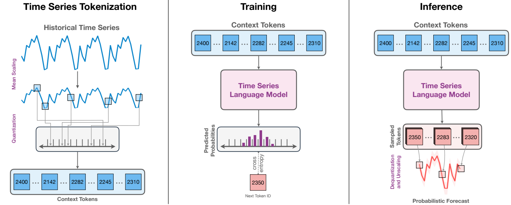
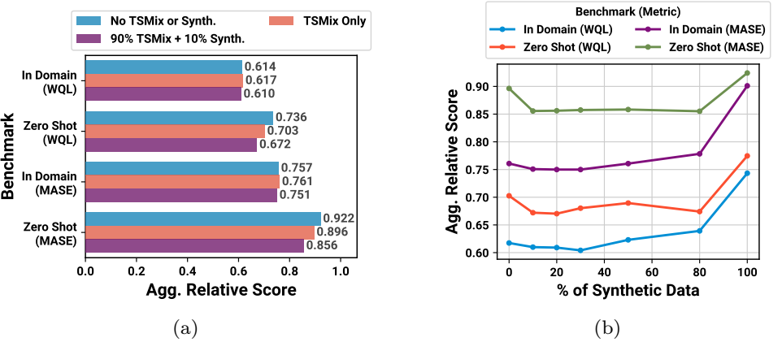

# Chronos：学习时间序列的大语言模型

## 摘要

本文介绍了一个简单而有效的预训练概率时间序列模型框架**Chronos**。**Chronos**使用缩放（scaling）和量化（quantization）技术将时间序列标记为固定词汇，并通过交叉熵损失在这些标记化（tokenized）的时间序列上训练基于Transformer的语言模型架构。我们在大量公开数据集上预训练了基于T5系列的**Chronos**模型（参数范围从20M到710M），并通过高斯过程生成了一个合成数据集作为补充，以提高泛化能力。在由42个数据集组成，同时包含经典局部模型和深度学习方法的综合基准测试中，我们发现**Chronos**模型：（a）在属于训练语料库的数据集上的表现明显优于其他方法；（b）在新数据集上，与专门训练过的方法相比，**Chronos**模型具有不相上下甚至有时更优越的性能。我们的研究结果表明，**Chronos**模型可以利用来自不同领域的时间序列数据提高未见预测任务的zero-shot准确率，预训练模型是简化预测管道的可行工具。

## 引言

时间序列预测是零售、能源、金融、医疗保健、气候科学等各个领域决策的重要组成部分。传统上，预测主要使用 ARIMA 和 ETS 等统计模型。至少在最近转向深度学习技术之前，这些模型一直是可靠的工具。这种转变可归因于大量、多样的时间序列数据源的可用性，以及业务预测问题的出现，这些都发挥了深度预测的优势，即从大量时间序列中提取模式的能力。尽管深度预测器的性能令人印象深刻，但它们仍然是在同一数据集上进行训练和预测的标准系统。虽然已有研究致力于转移学习和领域适应预测，但该领域尚未形成统一的通用预测模型，而这一目标仍是时间序列研究人员的指路明灯。

具有zero-short学习能力的大语言模型（LLM）的出现激发了人们对于开发时间序列“基础模型”的兴趣。在大语言模型的背景下，这种兴趣是通过两个主要途径来实现的：直接对预训练的LLMs使用提示词工程和针对时间序列任务微调LLM。然而，这些方法面临很大的局限性，特别是需要对每个新任务进行提示词工程或微调，并且大规模语言模型（GPT-3、Llama2）需要大量的计算资源和时间进行推理。最近的工作还探索了在大量真实或合成时间序列数据语料上，通过复杂的时间序列特定设计，对基于Transformer的模型进行预训练。

在这项工作中，我们回过头来问：预测下一个token的语言模型与预测下一个值的时间序列预测模型之间有什么本质区别？尽管表面上有区别——来自有限字典的token与来自无边界、通常是连续领域的值——但从根本上说，这两种工作都旨在对数据的序列结构进行建模，以预测未来的模式。优秀的语言模型难道不应该在时间序列上“顺利工作”吗？这个简单的问题促使我们挑战针对时间序列特定修改的必要性，回答这个问题促使我们开发了**Chronos**，一个最小化地适用于时间序列预测的语言建模框架。**Chronos**通过对实值进行简单的缩放和量化，将时间序列标记为离散的分段。这样，我们就可以在这种 "时间序列语言 "上训练现成的语言模型，而无需改变模型架构（**Chronos**的深层描述见图1）。值得注意的是，这种直截了当的方法证明是有用和高效的，凸显了语言模型架构的潜力，只需最小的改动就能解决广泛的时间序列问题。

<b>图 1：Chronos深层描述。（左）输入时间序列经过缩放和量化，得到一个序列的tokens。（中）标记被输入到语言模型中，该模型可以是encoder-decoder或仅decoder模型。该模型使用交叉熵损失进行训练。（右）在推理过程中，自回归地从模型中抽取tokens，并将它们映射回数值。通过抽取多个轨迹来得到预测分布。</b> 

为了开发一种有用的通用时间序列预测模型，公开可用的时间序列数据集稀缺性（无论在数量还是质量上）可能比建模框架更为关键。除了我们用来训练**Chronos**的公开数据集外，另一个核心方面是数据增强策略的整合，包括TSMix和KernelSynth。TSMix从不同的训练数据集中随机选取一组基础时间序列，并基于它们的凸组合生成新的时间序列；KernelSynth使用高斯过程通过随机组合核函数来生成合成的时间序列。这些技术解决了时间序列预测中小型训练数据集的固有限制，增强了模型的稳健性和泛化能力。

根据我们对42个数据集的全面评估，将**Chronos**设为领域内和zero-shot预测的基准，超越了传统模型和特定任务的深度学习方法。值得注意的是，**Chronos**出色的实现了zero-short预测，无需针对特定任务进行调整。其精度，加上相对适中的模型大小，使其成为zero-short领域更大、计算需求更高模型的选择。作为一种在固定词汇表上运作的语言模型，**Chronos**可以与未来的LLMs进步无缝集成，使其成为作为通用时间序列模型进一步开发的理想候选者。

本文接下来的内容安排如下。第2节介绍了时间序列预测和语言模型的背景，并讨论了相关工作。第3节介绍了我们提出的时间序列语言建模框架**Chronos**。第4节讨论我们的数据增强技术和合成时间序列生成过程。第5节介绍了我们的主要成果以及对不同设计选择的严格分析。我们在第6节讨论了未来的发展方向，并在第7节总结了本文。其他材料见附录。

## 背景及相关工作

**时间序列预测**涉及使用相关历史数据预测其未来值。形式上，给定一个均匀间隔的时间序列$x_{1:C} = [x_1,\cdots,x_C]$，我们感兴趣的是预测接下来H个步长的联合分布情况，$p(x_{C+1:c+H}|x_{1:C})$。在这项工作中，我们的重点是单变量预测，即观测值为标量，对于所有$i$，$x_i \in R$。

时间序列预测有多种不同的方法，大致可分为经典预测方法和深度学习方法。经典预测方法（如ETS、ARIMA、Theta）对每个时间序列独立拟合一个单独的模型。相比之下，深度学习预测模型则对给定数据集中的所有时间序列进行学习（被称为全局模型）。这些方法利用了深度学习的先进技术，如DeepState、DeepAR、TimeGrad使用的RNN，以及TFT和PatchTST使用的Transformer。除了架构的选择，这些方法对目标建模的方式也不尽相同，有的对密度函数建模，有的则直接预测一组量值。不过，并非所有模型都能进行概率预测：特别是Informer和DLinear等模型只能进行点预测。

**大型语言模型（LLM）**在各种自然语言处理任务中表现出令人印象深刻的性能。给定输入tokens序列，$w_{1:k} = [w_1, \cdots ,w_k]$，语言模型旨在预测下一个tokens，$w_{k+1}$，建立条件分布模型$p(w_{k+1}|w_{1:k})$。tokens属于一个词汇表（vocabulary），$V$，tokens可以是字符、子词或词，具体取决于所使用的tokenization方案。

大多数现代LLM都基于Transformer架构。最初的Transformer架构是为机器翻译设计的encoder-decoder模型。encoder将某种语言的输入句子映射为连续表示，decoder使用输入表示和先前解码的token逐个生成翻译。许多流行的语言模型，如BART和T5，都属于这个系列。另一种流行的LLM架构是GPT-3和Llama 2中使用的纯decoder架构，即模型只关注当前标记之前的标记。LLM通常是在非常庞大的文本语料库中进行训练的，其参数数量从数百万到数千亿不等。读者可参阅Zhao等人（2023 年）对这一研究领域的最新调查。

**基于LLM的预测器**。受预训练LLM的成功启发，最近的研究表明LLM是一种通用模式识别器，并开发了几种将LLM应用于时间序列领域的方法。其中一种方法是将数值时间序列数据视为原始文本，直接使用预训练的 LLMs，只需极少或无需微调即可预测未见的时间序列。PromptCast将时间序列数据转换为基于文本的输入和输出对，并将预测问题重新表述为问题解答任务，从而利用预训练的 LLM 进行预测。不过，PromptCast 需要特定于数据集的模板来将数字数据转换为文本提示。LLMTime也许是最直接的基于LLM的预测模型，它在各种基准时间序列数据集上清楚地证明了预训练LLM的zero-shot预测能力。LLMTime提出了一种新的标记化方案，在固定数值精度和适当缩放数据后，将实值数据编码为数字字符串。一旦编码为字符串，预测结果就能从GPT-3和Llama 2等经过预训练的LLM在zero-short的情况下获得。不过，使用这种计算负荷高的模型会影响LLMTime的可扩展性和实用性。

Zhou 等人（2023a）以预训练的GPT-2模型为骨干，针对不同的时间序列分析任务提出了一个统一的万能模型（GPT4TS），并且只对每个任务的位置嵌入和归一化层参数进行微调。与PatchTST相似，他们没有使用标记化输入，而是直接向模型提供patch嵌入。最近的工作TimeLLM将LLM用于时间序列预测，方法是将时间序列patch的嵌入与文本原型对齐，并用这些对齐的嵌入和描述任务的自然语言提示（冻结的）LLM。与 Chronos不同，GPT4TS和TimeLLM都需要进行域内训练或微调，即在每个数据集上分别进行微调和测试。此外，上述方法都是基于提示词或微调预训练的LLM。相比之下，Chronos则是在大量时间序列上从头开始训练语言模型，并通过缩放和量化进行tokenized。

**Zero-shot预测**。zero-shot预测是指模型在从未见过的数据集上时间序列预测的能力。zero-shot预测的一些早期工作是在单个时间序列数据集上进行训练，然后在不同的数据集上进行测试。ForecastPFN解决zero-shot预测问题的方法是，根据预定趋势和季节性生成的合成数据上训练一个基于Transformer的模型。然后，训练好的Transformer模型将被用于预测真实世界中的zero-shot时间序列。 在这项工作中，我们还提出了一种从高斯过程生成合成时间序列数据的方法（第 4.2 节）；不过，我们将合成数据与真实数据结合起来使用，以训练 Chronos 模型，从而提高了zero-shot误差性能。此外，Chronos模型是概率模型，而 ForecastPFN只能生成点预测。

最近的一些研究还通过在大量时间序列数据上对基于Transformer的架构进行预训练，开发了zero-shot预测模型。这些模型对时间序列的实值进行操作，并包含时间序列的特定设计，如时间特征、滞后、修补和实值分布等。相比之下，Chronos采用的是一种简约方法，它将时间序列值标记为固定词汇，并在这些标记上训练现有的语言模型架构，而不使用任何特定于时间序列的设计或特征。也就是说，Chronos 使用分类分布对观测数据建模，通过分类进行回归。

**其他时间序列任务**。与 Zhou 等人（2023a）的研究类似，最近的研究也对适用于各种时间序列任务的通用模型进行了研究，包括插补、预测、分类和异常检测。Wu 等人（2023 年）开发了基于Inception模型的任务通用骨干网。为了使用基于CNN的Inception模型，需要将一维时间序列转换为二维图像式表示，具体方法是根据周期性对时间序列进行分段并堆叠分段。SimMTM是针对时间序列的掩码预训练框架，可学习一般的时间序列表示，然后通过微调用于预测和分类。虽然我们在这项工作中重点关注的是单变量时间序列预测，但基于其在未见时间序列数据集上的出色表现，我们假设Chronos可以学习一般表征，从而有可能用于预测以外的任务。

## Chromos：时间序列的语言模型框架

在本节中，我们将介绍 Chronos，这是一个将现有语言模型架构和训练程序应用于概率时间序列预测的框架。虽然语言和时间序列在本质上都是连续的，但它们在表示形式上有所不同——自然语言由有限词汇表中的单词组成，而时间序列则是实值。这种区别要求对现有的语言建模框架进行特定的修改，特别是在tokenized方面，以使其适用于时间序列数据。尽管如此，由于现有的Transformer模型在语言任务中表现出色，我们的设计理念是对模型架构和训练过程进行最小限度的修改。

### 用于时间序列的Tokenization

考虑一个时间序列$x_{1:C+H} = [x_1, \cdots ,x_{C+H}]$，其中，前$C$个时间步构成历史信息，其余$H$个时间步代表预测范围。语言模型的操作对象是有限词汇中的词块，因此将其用于时间序列数据需要将观测值$x_i \in R$映射到有限的词块集中。为此，我们首先对观察数据进行缩放，然后将其量化为固定数量的箱（bins）。

**缩放**。即使在同一个数据集中，时间序列的规模也会有很大差异。这给深度学习模型的优化带来了挑战。因此，需要对单个时间序列进行归一化处理，以便更好地进行优化。就Chronos而言，归一化的目的是将时间序列值映射到适合量化的范围内。常见的归一化技术包括对时间序列进行仿射变换，即$\tilde{x}_i = (x_i - m)/s$。我们选择了均值缩放，这种方法已经在常用的深度学习模型中被证明是有效的，但其他方法也是可行的，而且只需要做最小的改动。 均值缩放是根据历史数值绝对值的平均值对时间序列的数值进行归一化处理。具体的，设$m=0$，$s = \frac{1}{C}\sum^{C}_{i=1}|x_i|$。 

**量化**。缩放后的时间序列$\tilde{x}_{1:C+H}=[\tilde{x_1},\cdots,\tilde{x_C},\cdots, \tilde{x}_{C+H}]$仍然是实值，语言模型无法直接处理。为了将这些实值转换为离散的tokens，我们采用了量化的方法。形式上，我们在实数线上选择$B$个箱（bin）中心$c_1 < \cdots < c_B$，并且$B-1$个边界值$b_i$，用来将它们分开，对于$i \in \{1,\cdots,B-1\}$，有$c_i < b_i < c_{i+1}$。然后，量化函数$q : R \rightarrow \{1,2,\cdots,B\}$和去量化函数$d : \{1,2,\cdots,B\} \rightarrow R$定义如下：
$$
q(x)=
\begin{cases}
1& if\ -\infty \leq x < b_1\\
2& if\ b_1 \leq x < b_2\\
\vdots\\
B& if\ b_{B-1} \leq x < \infty\\
\end{cases}
and\ \ \ \ d(j)=c_j
$$
箱（bin）中心和边缘的定位可以是依赖数据的，也可以是均匀的。分位数分箱，一种数据依赖的分箱类型，利用训练数据点的累积分布函数（CDF）构造分箱，使得大约相等数量的数据点被分配到每个箱中。相比之下，均匀分箱在某个区间$[l,r]$内均匀选择箱中心。由于下游数据集的值分布可能与训练分布有很大差异，我们在实验中选择均匀分箱，但也可以使用其他量化技术。我们参考Rabanser等人（2020）对时间序列量化方案的详细讨论。这种方法的一个潜在局限性是预测范围限定在$[c_1 , c_B ]$之间，理论上无法建模具有强烈趋势的时间序列。我们在第5.7节中进一步研究这个问题。

除了时间序列tokens${1,2,\cdots,B}$之外，我们还在时间序列词汇表中加入了两个在语言模型中常用的特殊标记 $V_{ts}$ ： PAD 和 EOS。PAD token 用于将不同长度的时间序列填充为固定长度，以便批量构建和替换缺失值。EOS token被附加到经过量化和填充的时间序列上，以表示序列的结束。虽然在时间序列中并不严格需要使用EOS标记，但它可以方便地使用流行的语言建模库进行训练和推理。语言模型（包括encoder-decoder模型和仅decoder模型）可以很容易地处理来自$V_{ts}$的标记序列，并像往常一样对其进行训练。时间序列建模的一种常见方法是通过周日、年周等特征来整合时间和频率信息。在Chronos中，我们忽略了时间和频率信息，将 "时间序列 "简单地视为一个序列，这也许与直觉相反。 

我们主要关注encoder-decoder T5模型的变体。此外，我们还对GPT-2模型进行了实验，以证明我们的方法可以直接扩展到纯decoder模型。除了将词汇量调整为$|V_{ts}|$外，无需对语言模型架构进行任何修改，而词汇量的大小取决于用于量化的分区数，可能与原始语言模型的词汇量大小不同。具体来说，调整词汇量需要截断（或扩展）语言模型的输入和输出嵌入层。

 ### 目标函数

像在语言模型中一样，我们使用$V_{st}$元素的分类分布作为输出分布，$p(z_{C+h+1}|z_{1:C+h})$，其中$z_{1:C+h}$是tokenized的时间序列。Chronos训练的目标是最小化量化的真实标签分布与预测分布之间的交叉熵。形式上，单个tokenized时间序列的损失函数（包括EOS token）由以下公式给出：
$$
l(\theta) = -\sum^{H+1}_{h=1}\sum^{|V_{ts}|}_{i=1}1_{z_{C+h+1=i}}log\ p_{\theta}(z_{C+h+1}=i|z_{1:C+h})
$$
其中$p_{\theta}(z_{C+h+1}=i|z_{1:C+h})$表示由$\theta$参数化的模型预测分类分布。在实际操作中，训练期间的损失在一批时间序列上取平均。

请注意，分类交叉熵损失函数（上诉公式）不是一个距离感知目标函数，也就是说，它并没有显式地认识到箱$i$比箱$i+1$更接近箱$i+2$。相反，模型期望根据训练数据集中的箱索引分布将附近的箱关联起来。换句话说，Chronos通过分类来进行回归。这不同于典型的概率时间序列预测模型，它们要么使用高斯或Student's-t分布这样的参数连续分布，要么进行分位数回归。

选择分类的输出分布有两个关键优点。首先，它不需要修改语言模型的架构或训练目标，允许使用流行的语言建模库和它们提供的现成工具。其次，它对输出分布的结构没有任何限制，允许模型学习包括多模态在内的任意分布。这种灵活性对于预训练模型特别有价值，因为来自不同领域的时间序列数据集可能遵循不同的输出分布模式。

### 预测

Chronos模型在设计上是概率性的，可以通过自回归从预测分布$p_\theta (z_{C+h+1}|z_{1:C+h})$中抽样，得到未来的多个实现，其中$h\in {1, 2,\cdots, H }$。这些样本以token ID的形式呈现，需要映射回实值，然后取消缩放以获得实际的预测。公式（1）中的反量化函数$d$将预测的token映射为实值，然后通过应用反缩放变换来取消缩放，这在均值缩放的情况下涉及将值乘以缩放因子$s$。

## 数据增强

与自然语言处理（NLP）领域相比，公共时间序列数据的质量和数量都相形见绌，前者受益于大量高质量的文本数据集，如WikiText-103、C4 和The Pile。这给zero-shot预测模型的训练带来了挑战，因为zero-shot预测依赖于具有不同模式的大规模时间序列数据。为了解决这个问题，我们建议从真实数据集生成混合增强数据，并用合成数据补充训练，从而增强训练数据的多样性。

### TSMix：时间序列的Mixup

Mixup是一种针对图像分类提出的数据增强方案。它能从训练数据集中生成随机图像对及其标签的凸组合，从而缓解深度学习模型中的记忆和过拟合等问题。现有研究已将Mixup扩展到时间序列领域。在这些工作的基础上，我们提出了TSMix，它将Mixup的理念推广到两个以上的数据点。具体来说，TSMix从训练数据集中随机采样$k \sim u\{1,K\}$特定长度$l \sim u\{l_{min},l_{max}\}$的时间序列，并对它们进行缩放，然后进行凸组合。
$$
\tilde{x}^{TSMix}_{1:l} = \sum^{k}_{i=1}\lambda_i\tilde{x}^{(i)}_{1:l}
$$
其中$\tilde{x}_{1:l}$表示第$i$个缩放时间序列。组合权重，$[\lambda_1,\cdots,\lambda_k]$从对称的Dirichlet分布Dir$(\alpha)$中采样。TSMix 的完整伪代码见附录 A 中的算法 1。直观地说，TSMix通过组合来自不同时间序列的模式来增强数据的多样性。图 2显示了TSMix 生成的增强示例，并说明了不同模式是如何混合的。

<b>图 2：k = {1, 2, 3}时，TSMix通过加权组合提高多样性的示例。TSMix 通过对不同数据集随机采样的时间序列进行加权组合，提高了模式多样性。</b> 

### KernelSynth：使用高斯过程生成合成数据

虽然TSMix提高了模式多样性，但它可能仍不足以训练通用时间序列模型，尤其是在真实数据有限的情况下。为了进一步补充训练数据集，我们提出了KernelSynth，一种利用高斯过程（GP）生成合成时间序列的方法。KernelSynth受到自动统计器（Automatic Statistician）的启发，在自动统计器中会对GP内核空间进行组合搜索，以解释时间序列的结构。我们使用这一过程的逆过程——随机组合GP核来生成新的时间序列。

GP是由均值函数$m(t)$和正定核$k(t,t')$定义的函数分布，其中$t\in R$是域。核指定了一个协方差函数，该函数定义了输入域中任意一对点$(t，t′)$上函数值的联合变异性。通过适当选择内核，可以生成多种模式。我们构建了一个由定义基本时间序列模式的基核组成的核库$K$。其中包括用于趋势的线性核、用于平滑局部变化的 RBF核，以及用于典型时间序列频率中的季节性的周期核。最终内核$\tilde{k}(t,t')$是通过从$K$中以替换方式抽取$j \sim U\{1,J\}$个内核，并通过随机二进制运算$+$或$\times$将这些内核组合而成。从GP先验$GP(m(t)=0,\tilde{k}(t,t'))$中提取长度为$l_{syn}$的同步样本，生成合成时间序列；详见附录 A 中的算法 2。图 3 描述了KernelSynth中使用的生成过程，说明如何通过简单基核的组合产生具有复杂模式的时间序列。

<b>图 3：(a) KernelSynth是一种基于高斯过程(GP)的合成时间序列生成方法。 内核从内核库中采样，然后使用二元运算符（×或+）随机组合。生成的内核用于 GP 先验生成合成时间序列。每一步的核随机样本用红色和蓝色表示。(b) KernelSynth 生成的合成时间序列示例。</b> 

## 实验

在本节中，我们将介绍常用基准数据集的实证结果。首先，我们概述了数据集、训练策略、基线和评估指标（第 5.1-5.4 节）。表 1 提供了实验中使用的数据集和基线的高度摘要。然后，（a）评估了Chronos模型在域内设置和zero-shot设置下与本地模型和特定任务深度学习模型的性能（第 5.5 节）；（b）分析了各种设计选择（如模型大小、初始化、合成数据比例、上下文长度和词汇量大小）对 Chronos 模型性能的影响（第 5.6 节）；（c）分析了Chronos模型的定性性能并强调了其局限性（第 5.7 节）。

<b>表 1：实验中使用的数据集和基线的高度摘要。</b> 

### 数据集

为了训练和评估Chronos模型，我们收集了大量公开可用的数据集，涵盖能源、交通、医疗保健、零售、网络、天气、金融等多个应用领域，采样频率从 5 分钟到一年不等。附录 B 列出了完整的数据集列表、各自的来源和其他详细信息。我们的数据集收集总共包括 55 个数据集，这些数据集来自多个来源，包括Monash时间序列预测库、M-competitions以及Kaggle的公共领域数据集。

根据训练和评估Chronos模型的方式，我们将这些数据集分为三个子集：（a）专门用于训练的数据集（13 个数据集）；（b）同时用于训练和评估的基准I数据集，代表域内评估（15个数据集）；（c）专门用于评估的基准II数据集，构成zero_shot评估（27个数据集）。在以这种方式对数据集进行分类时，我们试图在文献中最常用的数据集之间找到一个良好的平衡点，即为Chronos模型的zero-shot评估保留尽可能多的数据集，同时在训练数据的领域和采样频率方面保持足够的多样性。总体而言，我们使用了28个数据集来训练 Chronos模型，其中包括约890K个单变量时间序列，共约840亿个观测值（token）。对于域内（I）和zero-shot（II）基准数据集，我们使用每个时间序列的最后$H \in N+$个观测值作为保留测试集：所有模型都是根据其对这些保留集的预测准确性来评判的，没有任何模型可以使用这些保留集进行训练。预测长度$H$因任务而异（见附录B表2），我们将任务定义为数据集和预测长度对。这两个基准中的任务在数据集大小、频率、历史长度和预测长度方面都表现出不同的特性，使它们成为反映真实世界场景的丰富基准。

### 训练语料库和协议

我们在实验中选择了T5作为Chronos的主要架构，因为它有多种尺寸，从16M（Tiny）到 11B（XXL）参数不等。我们还用纯decoder模型GPT-2进行了实验，以证明Chronos框架对纯decoder模型的适用性。下面，我们将讨论主要结果（第 5.5 节）所使用的训练配置，并在第 5.6 节中探讨一些超参数的替代方案。

我们在28个训练数据集生成的1000万个TSMix（$K=3$）增强数据（见第 4.1 节）以及使用高斯过程生成的 100 万个合成时间序列（见第 4.2 节）上训练了4种大小的 T5 模型 ，即Mini（20M）、Small（46M）、Base（200M）和Large（710M），以及GPT-2基本模型（90M）。请注意，在这种设置下，原始时间序列得到了充分的体现，因为它们以1/3的概率被包含在TSMix增强中。在训练过程中，我们以9:1的比例从增强数据和合成数据中抽取时间序列。每个模型的有效批量大小为256个序列，必要时使用分布式数据并行和梯度累积进行训练。如第3.1节所述，这些序列是通过从时间序列中切分随机窗口，然后将其缩放和量化为区间$[l= - 15, r=15]$内大小相等的小块来构建的。序列的上下文长度设置为512，这是 T5 模型的默认值，预测长度设置为64，该值大于我们在评估中考虑的所有任务的预测长度。

使用权重衰减（weight decay）为0.01的AdamW优化器对模型进行了200K步的优化。学习率从0.001的初始值线性退火到0。其他模型和训练超参数设置为transformers 库中的默认值。 我们使用带有8个A100（40GB）GPU 的AWS EC2实例来训练所有Chronos模型，并采用更快的浮点格式（TF32）和模型编译来加快训练速度。附录E中的表 5报告了训练不同大小的Chronos模型所需的时间和大致成本。

### 基线

我们对照各种时间序列预测基准评估了Chronos模型的性能。 在统计预测文献中，我们纳入了Naive、Seasonal Naive、AutoETS、AutoARIMA 和 AutoTheta。此外，我们还与几种神经网络预测基准进行了比较，包括 WaveNet、DeepAR、N-BEATS、TFT、DLinear、PatchTST、N-HiTS 和 GPT4TS。在基准II上，我们还与ForecastPFN进行了比较，后者是一个仅在合成时间序列数据上训练过的预训练Transformer模型。

我们将Chronos模型和基准模型分为三类：分别估计每个时间序列参数的局部模型；分别针对每个任务进行训练或微调的特定任务模型；以及不进行特定任务训练，而是在所有任务中使用单一模型的预训练模型。 有关这些基线的实施和训练的更多详情，请参阅附录 C。

### 评价指标

在可能的情况下，我们都会从它们的概率和点预测性能两方面评估模型。我们使用加权分位数损失（WQL）来评估概率预测的质量：WQL与连续等级概率得分（CRPS）相关，通常用于评估概率预测。WQL衡量预测分布和真实观测在均匀分布的分位数水平之间的匹配度；我们在9个均匀分布的分位数水平$\{0.1, 0.2,\cdots, 0.9\}$上计算WQL。像TFT这样的分位数预测器直接在这些分位数水平上进行训练。对于需要抽样的方法，通过20个样本预测来估算分位数。我们使用平均绝对缩放误差（MASE）来评估点预测性能。MASE定义为预测的绝对误差，按照时间序列的历史季节误差进行缩放，之所以选择MASE，是因为它在其他点预测度量指标上具有优良的性能。对于概率预测器，我们使用中位数预测（0.5-分位数）来计算MASE。有关评估指标的详细讨论，请参见附录D。

由于评估指标的大小会因数据集而异，我们采用了一种不同于简单平均的方法来汇总得分。对于每个数据集，我们计算每个模型的相对分数，即该模型的分数除以基准模型的分数。使用几何平均数对所有数据集的相对得分进行汇总。选择几何平均数是经过深思熟虑的，Fleming 和 Wallace（1986 年）的研究表明，在这种情况下，算术平均数可能会产生误导性结论，而几何平均数则是唯一有意义的汇总此类相对分数的方法。此外，几何平均数对基线的选择也不敏感，即使选择另一个基线，模型排序也不会改变。由于 "Seasonal Naive "作为预测基线既简单又受欢迎，因此我们使用了它。对于在某些数据集上失败或无法在规定时间内完成评估的模型，我们在汇总结果时使用相对分数 1，即基线相对分数。在汇总过程中，我们对所有任务分配相同的权重，以反映现实世界中数据集可能具有不同数量的时间序列、频率、历史和预测长度的情况。

### 主要结果

本节将介绍我们在42个数据集上取得的主要成果，其中包括基准 I（15 个数据集）和基准 II（27 个数据集）。在域内数据集（基准 I，见第 5.5.1 节）上，Chronos 模型超越了经典统计基线和特定任务深度学习模型。在zero-shot数据集（基准二，见第 5.5.2 节）上，Chronos 模型的表现明显优于统计基准，同时与在这些任务上训练的最佳深度学习模型不相上下。通过廉价的微调方案，我们的 Chronos-T5 (Small) 模型在基准测试 II 中名列前茅，显著优于所有基线模型。

#### 基准 I：域内结果

基准 I包括 15 个数据集，这些数据集也是Chronos模型训练数据的一部分，即该基准评估Chronos模型的域内性能（见表 2）。图 4 总结了所有模型在保留的测试窗口上的概率预测和点预测性能，并给出了它们的综合相对分数，计算方法如第 5.4 节所述。较大的Chronos-T5模型（Base 和 Large）明显优于基线模型，获得了最佳的综合相对分数和平均排名（附录 E 图 18）。这些模型不仅优于本地模型（如 AutoETS 和 AutoARIMA），而且优于为每个数据集训练或微调的特定任务深度学习模型（如 PatchTST 和 DeepAR）。

较小的 Chronos-T5 模型（Mini和Small）和 Chronos-GPT2 也比大多数基线模型表现更好，但PatchTST除外。针对特定任务的深度学习模型是针对特定任务的多个时间序列进行训练的，其表现优于为每个时间序列拟合参数的本地统计模型。有趣的是，在该基准上，Seasonal Naive基线的表现与其他本地模型相比具有竞争力，这表明该基准中的数据集表现出强烈的季节性模式。这并不奇怪，因为这些数据集大多属于能源和运输等领域，而这些领域往往具有很强的季节性。图 4 中汇总的各个数据集的 WQL 和 MASE 原始值见附录 E 中的表 6 和表 7。

这些结果表明，使用在多个数据集上只训练一次的模型，比针对每个任务单独训练的特定任务模型更有优势。在需要对不同时间序列任务进行预测的情况下，这种模型可以简化生产预测系统，因为它省去了为每个任务单独训练模型的麻烦。

<b>图 4：不同模型在基准 I 上的表现，基准 I 包括 15 个数据集，也包括 Chronos 模型的训练数据。该基准测试展示了 Chronos 模型与本地统计模型（为每个时间序列单独拟合参数）和特定任务模型（为每个任务训练单独的模型）的域内性能对比。概率（WQL）和点（MASE）预测指标使用Seasonal Naive基线的分数进行归一化，并通过几何平均进行汇总，以分别获得汇总的相对 WQL 和 MASE。Chronos和特定任务模型（GPT4TS 除外）的结果是3个随机种子的平均值。产生点预测的模式（GPT4TS）仅根据 MASE 进行比较。</b> 

#### 基准 II：Zero-shot结果

基准II包括27个在Chronos模型训练过程中未使用过的数据集（见附录 B 表 2），即该基准评估的是这些模型的zero-shot性能。这些数据集属于不同的领域和频率，其中一些甚至不是训练数据的一部分，因此对 Chronos而言，这是一个具有挑战性的基准。与基准 I（图 4）相比，该基准显然更具挑战性，因为最佳模型的改进幅度往往低于基准模型。

然而，尽管在训练过程中从未见过这些数据集，Chronos模型的表现仍明显优于本地统计模型。在概率预测（总体相对 WQL）方面，Chronos 模型获得了第二名和第三名的好成绩，表现优于在这些任务中训练过的大多数特定任务模型。在点预测性能方面，Chronos-T5（Lager）排名第三，以微弱劣势输给了N-HiTS，屈居第二。Chronos 模型的性能也明显优于最近提出的zero-shot预测器ForecastPFN，甚至优于GPT4TS，后者在每个数据集上对预先训练的GPT-2模型进行了微调。图 5 中汇总的各个数据集的WQL和MASE原始值见附录 E 中的表 8 和表 9。

<b>图 5：不同模型在基准测试 II 上的表现，基准测试 II 包括 Chronos 模型在训练过程中未见过的 27 个数据集。通过该基准测试，我们可以深入了解 Chronos 模型与本地统计模型（针对每个时间序列单独拟合参数）、针对每个任务训练的特定任务模型以及预训练的 ForecastPFN 模型相比的zero-shot性能。概率预测指标（WQL）和点预测指标（MASE）使用Seasonal Naive基线的分数进行归一化处理，并通过几何平均进行汇总，以分别获得汇总的相对WQL和MASE。Chronos和特定任务模型（GPT4TS 除外）的结果是 3 个随机种子的平均值。生成点预测的模型（GPT4TS 和 ForecastPFN）仅根据MASE进行比较。</b> 

该基准测试的结果凸显了Chronos 为通用时间序列预测器的前景，它的性能明显优于zero-shot环境下常用的局部模型，而且与最佳特定任务深度学习模型的性能相当。

**微调**。受 Chronos 模型出色的zero-shot误差性能的激励，我们在基准II的数据集上对 Chronos 模型进行了单独微调的初步研究。由于 Chronos-T5 (Small) 模型的zero-shot误差性能好、训练成本相对较低，我们选择了该模型进行实验。

我们以数据集无关的方式对模型进行了微调，初始学习率为 0.001，经过 1000 步线性退火为 0。图 6 显示，微调显著提高了模型在基准II上的总体性能。经过微调的Chronos-T5 (Small) 模型在基准测试II中的总体表现名列前茅，超过了大型（zero-shot）Chronos 模型和最佳特定任务模型。值得注意的是，在基准测试II中，Chronos-T5 (Small) 甚至不是zero-shot测试中最精确的Chronos变体，这表明对较大的Chronos-T5变体进行微调可能会取得进一步的改进。

<b>图 6：在对基准测试 II 的单个数据集进行微调时，Chronos-T5（Small）的性能明显优于zero-shot模型，成为平均性能最好的模型（见图 5）。</b> 

### 超参数分析

在此，我们从比较不同的模型大小和初始化开始，探讨了不同的设计选择对下游模型性能的影响。然后，我们分析了训练步骤、合成数据比例、上下文长度和词汇量大小对 Chronos-T5 (Small) 性能的影响。我们只改变感兴趣的参数，其他参数均保持主要结果中的固定值。

**模型大小**。我们试验了从 20M 到 710M 参数的四种模型大小。不出所料，如图 7a 所示，训练损失随着模型容量的增加而增加。我们在下游模型性能中也观察到了这一趋势——如图 7b 所示，在域内和zero-shot基准中，下游模型性能随着模型大小的增加而提高。这些趋势表明，更大的模型也可能进一步提高性能。不过，由于推理时间较慢，在实际应用中不可行，因此我们没有探索更大的模型。

<b>图 7：模型大小。（a）不同大小Chronos模型的训练损失曲线。（b） Chronos模型随模型大小而变化的域内和zero-shot性能。</b> 

**初始化**。我们研究了将 Chronos 模型初始化为 Tay 等人（2021 年）在C4数据集上预训练的相应T5语言模型是否会对训练动态或下游性能产生影响。图 9显示了随机初始化的模型和使用语言模型权重初始化的模型的训练损失曲线。值得注意的是，与使用语言模型权重初始化的模型相比，随机初始化的模型往往会收敛到较低的训练损失。 对于较大的模型（基础模型和大型模型），使用语言模型权重初始化的模型最初的训练损失下降较快，但最终收敛到较高的损失。

<b>图 9：初始化。随机初始化不同大小的Chronos模型与使用语言模型权重初始化的模型的训练损失比较。</b> 

总之，这些观察结果表明，语言模型权重在时间序列预测中并不特别突出，与随机初始化相比也没有改进。图 8 展示了使用语言模型权重初始化的模型与随机初始化的三个模型的下游性能对比，进一步证实了上述结论。在所有大小的模型中，与随机初始化的模型相比，使用语言模型权重初始化的模型的性能要么重叠，要么略逊一筹。这些结果表明，LLM 初始化在时间序列预测方面的优势相对较小，而随机初始化可能是更好的选择。

<b>图 8：使用语言模型权重初始化的模型（标记为星形）与随机初始化（标记为圆形）的模型在不同模型大小下的域内和zero-shot性能比较。</b> 

**TSMix数据增强**。如第 5.2 节所述，我们在TSMix增强数据上而不是直接在原始时间序列上训练 Chronos 模型。在本实验中，我们研究了使用TSMix增强是否对下游性能有利。图 10a 比较了使用和不使用TSMix增强训练的 Chronos-T5（Small，46M）模型的性能。使用TSMix增强技术训练的模型与未使用增强技术训练的模型获得了相似的域内性能。但是，使用TSMix增强后，zero-shot性能有所提高。这表明，TSMix增强了训练数据的多样性，从而提高了在未见数据集上的性能。图 10a 还显示，加入合成数据后，zero-shot性能得到了额外提升。我们将在下一个实验中进一步研究这一点。

<b>图 10：(a) 使用和不使用 TSMix 增强训练的 Chronos-T5 (Small) 模型的域内和zero-shot性能比较。(b) 训练语料库中不同比例的KernelSynth数据下Chronos-T5 (Small) 模型的域内和zero-shot性能。</b> 

**合成数据比例**。我们系统的探讨了KernelSynth对下游模型性能的影响。用从TSMix增强数据和KernelSynth数据中采样的时间序列训练 Chronos-T5（Small，46M）模型，其比例从0%（即仅用TSMix增强数据训练）到100%合成数据不等。

图 10b 展示了使用不同比例合成数据训练的模型的性能。在训练中加入合成数据后，域内指标和zero-shot指标都有所改善。在合成数据比例为 10% 左右时，模型的性能改善最为一致。进一步提高合成数据的比例往往会降低性能。这并不奇怪，因为使用高斯过程生成的合成数据并不能代表真实世界的所有时间序列。

虽然与训练语料库中包含真实数据的模型相比，仅在合成数据上训练的模型表现较差，但就绝对性能而言，它的表现还算不错。图 20（附录 E）显示，它的表现明显优于ForecastPFN，后者是另一个仅在合成数据（生成方式与 KernelSynth 不同）上训练的模型。令人惊讶的是，尽管在训练过程中从未见过真实数据，但在我们的基准测试中，它的表现也优于其他几个基线模型。这些结果证明了我们合成数据的质量，也为今后进一步缩小性能差距指明了方向。

**训练步数**。我们对 Chronos-T5（Small，46M）进行了 100 万步的训练，以研究更长时间的训练对模型性能的影响。图 11a 显示，下游模型的性能在训练过程中有所提高，无论是在域内基准还是zero-shot基准上都是如此。这表明，大型模型（基础模型和大型模型）的性能有可能通过更长时间的训练得到提高。

**上下文长度**。我们用四种不同的上下文长度训练 Chronos-T5 模型（Small, 46M），研究了上下文长度对下游性能的影响。图 11b 显示了性能随上下文长度增加而变化的情况。我们观察到，随着上下文长度的增加，域内指标和zero-shot指标都有所改善，这表明较长的上下文有助于模型更好地进行预测。不过，由于我们的zero-shot评估设置，这种分析可能存在局限性，因为基准中的大多数数据集频率较低，时间序列短于 1000 步。因此，还需要进一步评估，以最终研究更长上下文长度的影响。我们认为，高频数据集可能会受益于更长的上下文，这可能是正确捕捉长期季节性模式所必需的。

**词表大小**。词汇量的大小决定了模型处理缩放时间序列的精度。为了探索其对性能的影响，我们训练了不同词汇量大小的 Chronos-T5 模型（Small，46M）。图 11c 显示，随着词汇量的增加，点预测指标（MASE）也在不断改善。与此相反，WQL 最初有所改善，但随着词汇量增大而恶化。我们假设，这种行为是所选指标的人为影响。MASE 与单个序列的规模无关，与我们的训练损失密切相关，而训练损失也与规模无关。 因此，随着精度的提高，MASE 也会有所改善，这也是训练损失的预期结果。 相反，WQL 作为一个规模依赖性指标，与训练损失并不密切相关，而且随着精度的提高，其表现的可预测性较差。有关这些指标特性的讨论，请参见附录 D。

<b>图 11：Chronos-T5（Small）模型的域内和zero-shot性能随（a）训练步数、（b）训练上下文长度和（c）词表大小的变化而变化。</b> 

### 定性分析与局限性

在本节中，我们将对 Chronos 模型生成的预测进行定性分析，并强调我们的tokenized技术的一些局限性。我们主要关注合成生成的时间序列，以便对不同类型的时间序列模式进行对照分析。有关真实数据集的预测示例，请参见附录 E 中的图 22 至图 24。

**I.I.D. 噪声**。我们生成了纯粹由高斯观测数据组成的时间序列$N (0, 1)$和$N (100, 10)$，并使用 Chronos-T5 (Base) 对其进行预测。图 12a 显示，Chronos 为这些时间序列生成了可信的预测结果，预测的 80% interval与蓝色虚线所示的真实值 80% interval相吻合。

<b>图 12：Chronos-T5 (Base) 根据合成数据生成的预测。(a) 噪音： Chronos 为高斯噪声生成了合理的预测，80% 的预测interval与基础分布的间隔一致（如蓝色水平虚线所示）。(b) 趋势： Chronos 能正确预测线性趋势（上图），但在预测指数趋势（下图）时却困难重重。(c) 季节性： Chronos 能准确模拟不同复杂程度的季节性模式（顶部为单一季节性，底部为三个季节性）。 (d) 综合模式： Chronos 能准确预测由趋势和季节模式的加法（上图）或乘法（下图）组合产生的时间序列。</b> 

**趋势和季节性**。我们按照线性和指数趋势生成了时间序列： 如图 12b 所示，Chronos-T5（Base）能准确预测线性趋势，但在预测指数趋势时却很吃力。 这可能是由于指数趋势在训练数据中的代表性有限。要想对具有指数趋势的时间序列做出更好的预测，可能的解决方法是在将时间序列输入Chronos模型之前进行对数缩放。我们还观察到，当上下文不够长时，Chronos 模型往往会低估趋势。图 13 描述了这一现象，当提供的上下文较短时，模型能正确预测模式，但低估了趋势。然而，如果上下文较长，模型就能预测出正确的模式和趋势。

<b>图 13：当上下文不够长时，Chronos-T5（Base）往往会低估趋势，如本例中的经典航空乘客数据（月度）的预测范围所示。上图：在只有 120 个观测值的情况下，预测中值与之前的趋势相比趋于平稳。下图：在有 144 个观测值的完整背景下，预测结果更接近趋势。</b> 

在分析中，我们发现 Chronos 模型能很好地识别时间序列中的季节性模式。我们使用不同频率的正弦波生成了纯季节性时间序列。如图 12c 所示，Chronos-T5（Base）精确地预测了这两个时间序列。当趋势和季节性等基本模式以相加或相乘的方式结合在一起时，Chronos 能准确预测它们。图 12d 演示了通过正弦波与线性函数的加法和乘法生成的时间序列。

**自回归过程**。阶数为$p$的自回归（AR）过程定义为：
$$
X_t = \sum^p_{i=1}\varphi_iX_{t-i}+\varepsilon_{t}
$$
其中$\varepsilon_{t} \sim N(0,1)$和$\varphi_1, \cdots,\varphi _p$是模型参数。我们从 1 到 4 的不同阶次的静态 AR 过程中生成了时间序列，并将 Chronos-T5（Base）生成的预测结果与以下三种模型生成的预测结果进行了比较：(a) 用于生成时间序列的基本真实AR模型；(b) 与时间序列匹配的具有正确阶次 ($p$) 的 AR 模型；(c) 与时间序列匹配的AutoARIMA 模型。图 14 显示了 AR(1) 和 AR(4) 过程的结果，图 21（附录 E）显示了 AR(2) 和 AR(3) 过程的结果。我们发现，Chronos-T5（Base）对所有四个 AR 过程都做出了合理的预测。对于正确指定的 AR 模型和 AutoARIMA 模型来说，较简单的 AR(1) 和 AR(2) 过程更容易拟合，因此 MSE 值优于 Chronos-T5（Base）。然而，随着 AR（3）和 AR（4）过程复杂度的增加，Chronos-T5（Base）不仅优于 AutoARIMA 模型（与地面实况模型属于同一族），而且还略胜于具有正确阶次的拟合 AR 模型。这些结果突出表明，Chronos 模型能够识别时间序列数据中存在的基本模式。

<b>图 14：Chronos-T5 (Base) 对由 AR(1) 和 AR(4) 过程生成的时间序列所做的预测与基本真实 AR 模型、正确阶次的拟合 AR 模型和 AutoARIMA 模型所做的预测进行比较。在这两种情况下，Chronos-T5（Base）都能生成可信的预测和预测区间。所有 AR 模型都能正确拟合较简单的 AR（1）过程，并获得比 Chronos-T5（Base）更好的 MSE；但是，随着 AR（4）过程复杂性的增加，Chronos-T5（Base）的性能仅次于真实 AR 模型。</b> 

**灵活的预测分布**。使用分类分布对预测进行encoder使 Chronos 能够灵活地生成不同形状的预测分布。图 15 展示了从 Chronos 模型中采样的token ID 的核密度估计（KDE）图，涉及三个数据集的预测范围内的前五个时间步骤。尽管交叉熵不具有距离感知能力，Chronos 仍能在连续的标记集上输出预测分布，并且具有不同的形状，包括多模态形状。

<b>图 15：Chronos 模型对 NN5（频率天）、交通和医院数据集序列的预测分布。每幅图都显示了五个预测步骤（h = 1, ... , 5）的预测分布：密度是通过样本预测的核密度估计获得的。尽管交叉熵不具有距离感知能力，但该模型学会了估计相邻标记的分布，以及各种形状的分布，包括多模态分布。</b> 

**溢出和精度损失**。Chronos 的一个局限性来自于tokenized方法（见第 3.1 节）。具体来说，我们选择的tokens代表$[-15s, 15s]$范围内的值，其中$s$是数据的标度（平均绝对值）。如果$s$与序列中的数值范围相比非常小，那么一些观测值就会超出可表示的范围。如图16a 所示，稀疏序列就是这种情况的一个例子。另一方面，与方差相比，$s$值过大会导致精度下降：在原始空间中，标记之间的间距为 $30s/(B - 1)$，其中$B$是指仓的数量（我们在实验中使用的是 B = 4094）；相距过近的值可能会被映射到同一个标记上，从而明显降低精度。图 16b 给出了这种行为的一个例子。改进tokenized以克服这些边缘情况是未来工作的主题，但第 5.5 节的结果表明，尽管存在这些限制，Chronos 模型在真实世界数据上的表现还是很好的。

<b>图 16：缩放和量化造成的精度损失。在（a）中，数据由每n = 10、20、50 个观测值（从上到下）的单位尖峰组成：这里的比例为 1/n，因此可表示的最大值为15/n。当 1 > 15/n 时，模型不可能恰当地捕捉到尖峰（除了最上面的情况），因为它们的值无法用标记准确表示。在 (b)中，数据是一个正弦波，向上移动了 µ = 1、10、50：这里的标度是 µ，随着信号方差相对于 µ 越来越小，标记的精确度也随之降低。</b> 

## 讨论

Chronos 是预训练时间序列预测模型的首次尝试之一，在大量测试数据集上取得了显著的zero-shot误差性能。这项工作开辟了多种研究途径，我们将在下文讨论其中的一些。

### 超越zero-shot单变量预测

在我们的实验中，我们对大多数数据集的 Chronos 进行了zero-shot评估。这样的设置凸显了 Chronos 模型在与特定任务基线对比时的竞争力。我们希望通过微调进一步提高域内结果和zero-shot结果，这也是我们在第 5.5.2 节中简要探讨的一个途径。这可以使用任何参数效率高的微调方法来实现，例如基于低阶适配器（LoRA）的方法。此外，还可以使用保形方法针对特定任务对 Chronos 进行校准。Chronos 在保形预测方面尤其具有吸引力，因为它不需要训练集，因此可以使用所有可用数据进行校准。

在这项工作中，我们的重点是单变量时间序列预测，因为它是现实世界中最常见的时间序列应用案例。然而，实际预测任务往往涉及必须考虑的其他信息。其中一个例子涉及协变量，这些协变量可能与时间无关（如产品的颜色），也可能随时间变化（如产品在哪天销售）。另一个密切相关的问题是多变量预测，其中一个时间序列（如利率）的历史值会影响对另一个时间序列（如房价）的预测。不同任务的协变量或多元维度的数量可能会有很大差异，这就使得训练一个能处理所有可能组合的单一模型具有挑战性。一种可能的解决方案是训练特定任务的适配器，将协变量注入预训练的预测模型。作为另一种选择，我们可以建立 Chronos 和其他擅长处理协变量的轻量级模型（如 LightGBM）的stacking和ensembles。

到目前为止，我们的探索主要集中在时间序列预测问题上。然而，其他一些时间序列分析任务，如分类、聚类和异常检测，也有可能受益于 Chronos 这样的预训练模型。我们假设，Chronos-T5 模型的encoder学习到的表征是通用的，可用于这些任务。对Chronos-T5模型在各种下游任务中的表征进行探索，将是未来有趣的工作。

### 推理

与特定任务深度学习模型相比，大型 Chronos 模型的一个潜在局限是推理速度。图 17 展示了单个时间序列生成预测的推理时间（数据集平均值）。大型 Chronos 模型的推理速度与某些统计局部模型相当。此外，虽然Chronos模型的推理速度比特定任务模型慢，但它们并没有大到令人望而却步的地步。 此外，针对特定任务的模型需要针对每个任务进行单独训练，这需要额外的时间和计算。相比之下，Chronos 模型可用于具有不同历史长度、频率、预测范围和上下文长度的数据集。这大大简化了模型部署和预测管道，不再需要针对特定任务进行训练。

<b>图 17：不同模型预测单个时间序列的推理时间（数据集的平均值）。强调了各个模型的计算要求。</b> 

通过利用时间序列的语言建模框架，我们可以将 NLP 界的发展成果立即移植到 Chronos 模型中。例如，通过使用为现代 GPU 优化的 CUDA 内核、量化和更快的解码技术（包括推测解码和前瞻解码），推理速度可以得到提高。 长语境语言模型的发展可能有助于提高 Chronos 模型对高频数据集的适用性，这些数据集需要更长的语境来捕捉季节性模式。其他常用于文本语言模型的技术，如温度调整、波束搜索、Top-K 采样、核采样等，都可以提高预测质量。这些技术尤其有助于提高点预测的速度和质量，目前点预测需要对多个样本进行汇总。

### 数据

我们的研究结果表明，在大量时间序列数据语料库上训练大型模型可以获得出色的域内和zero-shot性能。然而，与 NLP 相比，高质量的公共时间序列数据仍然有限。这就造成了一个难题，即在大量不同数据集的语料库上训练模型时，较多的数据集用来训练，而较少的数据集进行zero-shot评估。如果能获得更多的时间序列数据集，用于开发和改进 Chronos 等预训练模型，时间序列界将受益匪浅。

尽管还需要进一步的研究，但最近在为特定领域建立大规模时间序列数据集方面已经做出了一些努力。解决数据有限问题的另一个方向是开发更好的合成时间序列生成方法。我们的工作在这个方向上取得了重大进展，清楚地证明了使用高斯过程生成的合成数据的实用性，并在将其纳入训练数据时提高了模型性能。即使是仅用合成数据训练的模型，也表现出了合理的预测性能。未来的研究可以深入探讨这些模型的失效模式，提出改进建议，缩小真实数据与合成数据之间的差距。

## 结论

在这项工作中，我们从极简主义者的视角出发，探讨了开发通用预训练预测模型的问题。我们针对时间序列预测调整了现有的语言模型架构和训练程序，挑战了预测需要特定时间序列特征或架构的观点。这就产生了 Chrono——一种用于时间序列的语言建模框架，矛盾的是，它与时间无关。Chronos 的显著特点是与任何语言模型架构兼容，只需进行最小的修改——tokenized、缩放和量化。我们的预训练模型在域内性能方面明显优于现有的本地模型和特定任务深度学习基线。更值得注意的是，Chronos 模型在未见数据集上取得了优异的成绩（zero-shot 性能），与在这些数据集上训练的最佳深度学习基线相比具有很强的竞争力，同时还显示出通过微调进一步提高性能的希望。

我们的贡献主要体现在两个方面。首先，我们表明现有的语言模型架构能够在不进行特定时间序列定制的情况下进行预测。这为利用 LLM 领域的发展和更好的数据策略加快进展铺平了道路。 其次，在实用层面上，Chronos 模型的强大性能表明，大型（按照预测标准）预训练语言模型可以在不牺牲准确性的情况下大大简化预测流程，提供了一种仅推理的替代方法，而不是传统的在单个任务上训练和调整模型的方法。

## 致谢

我们非常感谢为本研究工作提供深入讨论和宝贵反馈的研究人员，包括但不限于 Laurent Callot、Baris Kurt、Valentin Flunkert、David Salinas、Boran Han、Xiaoyong Jin、Luke Huan、Youngsuk Park、Gaurav Gupta、Karthick Gopalswamy、Tim Januschowski、Jan Gasthaus、Bing Xiang、Kashif Rasul、Mononito Goswami 和 Gerald Woo。

## 附录A 算法

Algorithm 1 和Algorithm 2 分别给出了 TSMix 和 KernelSynth 的伪代码。

