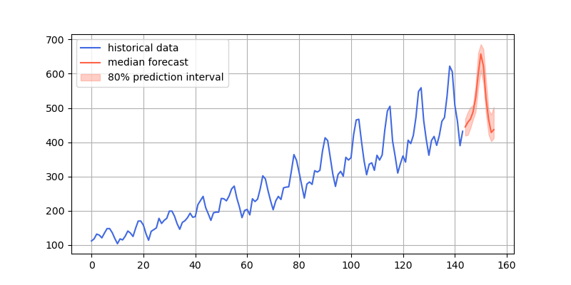

# Chronos：学习时间序列的大语言模型（代码解析）

## 前言

- 《Chronos: Learning the Language of Time Series》[原文地址](https://arxiv.org/abs/2403.07815v1)，Github[开源代码地址](https://github.com/amazon-science/chronos-forecasting)
- Chronos：学习时间序列的大语言模型（论文解读）[CSDN地址](http://t.csdnimg.cn/sft1E)

- GitHub项目地址[Some-Paper-CN](https://github.com/ytzfhqs/Some-Paper-CN)。本项目是译者在学习长时间序列预测、CV、NLP和机器学习过程中精读的一些论文，并对其进行了==中文翻译==。还有==部分最佳示例教程==。
- 如果有帮助到大家，请帮忙==点亮Star==，也是对译者莫大的鼓励，谢谢啦~

## 先验知识

- 建议先阅读`Chronos`论文解读篇，对大致原理有所了解，阅读代码效果会更好。
- 在论文解读篇中，我们已经知道了`Chronos`是基于`Google`的开源模型`T5`（[Huggingface](https://huggingface.co/google-t5)）。因受篇幅影响，有关`T5`模型的解析不在本次讨论范围内，感兴趣的小伙伴可以去查询相关资料。
- 论文基于`Transformers`框架，在阅读代码前，最好有一定`Transformers`库的基础知识。
- 虽然本文模型为时间序列模型，但不管是在模型架构、训练方式还是数据组织上都与大语言模型几乎一致，在阅读代码前，最好有一定大语言模型领域的知识，比如术语`tonken`、`tokenizer`。

## 代码解析

- 将开源代码从Github上下载到本地，关键文件在`chronos-forecasting/src/chronos`下，`chronos.py`文件。
- 类`ChronosConfig`用于加载模型参数（注意！是参数不是权重），类`ChronosTokenizer`用于加载模型`Tokenizer`，类`ChronosModel`用于根据模型参数构建模型。上述类为`Transformers`库基础类，这里不多赘述。
- 论文中的核心在类`MeanScaleUniformBins`用于数据均值缩放和量化分箱，类`ChronosPipeline`用于构架数据预测管道。

### MeanScaleUniformBins

```python
class MeanScaleUniformBins(ChronosTokenizer):
    def __init__(
        self, low_limit: float, high_limit: float, config: ChronosConfig
    ) -> None:
        self.config = config
        # 线性平分向量torch.linspace(start, end, steps)
        self.centers = torch.linspace(
            low_limit,
            high_limit,
            config.n_tokens - config.n_special_tokens - 1,
        )
        # 首尾元素分别为-1e20、1e20
        # self.centers[1:]除第1个元素外的所有元素
        # self.centers[:-1]除最后1个元素外的所有元素
        # (self.centers[1:] + self.centers[:-1]) / 2表示相邻元素平均值
        self.boundaries = torch.concat(
            (
                torch.tensor([-1e20], device=self.centers.device),
                (self.centers[1:] + self.centers[:-1]) / 2,
                torch.tensor([1e20], device=self.centers.device),
            )
        )

    def input_transform(
        self, context: torch.Tensor
    ) -> Tuple[torch.Tensor, torch.Tensor, torch.Tensor]:
        batch_size, length = context.shape

        if length > self.config.context_length:
            # 保留最后context_length个元素
            context = context[..., -self.config.context_length :]

        # 空值的反向布尔值
        attention_mask = ~torch.isnan(context)
        # context绝对值和attention_mask的点积，除以attention_mask的和
        scale = torch.nansum(
            torch.abs(context) * attention_mask, dim=-1
        ) / torch.nansum(attention_mask, dim=-1)
        # scale是0或空值设为1.0
        scale[~(scale > 0)] = 1.0
        # 将context按scale缩放
        scaled_context = context / scale.unsqueeze(dim=-1)
        # torch.bucketize根据边界值将输入映射到相应bucket（桶）中
        token_ids = (
            torch.bucketize(
                input=scaled_context,
                boundaries=self.boundaries,
                right=True,
            )
            + self.config.n_special_tokens
        )
        # 不需要关注的地方使用padding
        token_ids[~attention_mask] = self.config.pad_token_id

        # 如果需要在末尾添加eos符
        if self.config.use_eos_token:
            eos_tokens = torch.full(
                (batch_size, 1), fill_value=self.config.eos_token_id
            )
            token_ids = torch.concat((token_ids, eos_tokens), dim=1)
            # mask置为true
            eos_mask = torch.full((batch_size, 1), fill_value=True)
            attention_mask = torch.concat((attention_mask, eos_mask), dim=1)

        return token_ids, attention_mask, scale

    def output_transform(
        self, samples: torch.Tensor, scale: torch.Tensor
    ) -> torch.Tensor:
        # 将scale扩展两个维度
        scale_unsqueezed = scale.unsqueeze(-1).unsqueeze(-1)
        # 将值限制在0和centers长度间，确保索引值不超出centers
        indices = torch.clamp(
            samples - self.config.n_special_tokens,
            min=0,
            max=len(self.centers) - 1,
        )
        # 返回在原始context缩放级别下分桶值
        return self.centers[indices] * scale_unsqueezed
```

- `low_limit`和`high_limit`包含在模型参数中，根据论文分别为`-15`和`15`。
- 在`input_transform`函数中`scale = torch.nansum(torch.abs(context) * attention_mask, dim=-1) / torch.nansum(attention_mask, dim=-1)`看上去非常复杂，实际上在没有空值的情况下，相当于对序列求平均值。

- 在`input_transform`函数中分箱函数`torch.bucketize`的使用可以参考[官方文档](https://pytorch.org/docs/2.1/generated/torch.bucketize.html#torch-bucketize)。
- 在`input_transform`函数中空值使用`padding`填充，并使用`mask`进行遮掩，是大语言模型训练的常用操作。
- 在论文中，作者表示为了保持与大语言模型训练方式保持一致，会在序列结束后放置`eos`标识符，所以模型参数`use_eos_token`是为`True`的。
- `output_transform`函数是`input_transform`函数的反操作，需要注意的是`torch.clamp`函数，确保`token_id`在词表中，否则就无法反归一化得到正常的值了。

### ChronosPipeline

- `from_pretrained`函数用于加载模型预训练权重，这里不在过多赘述，关键在于`predict`函数。

```python
    def predict(
        self,
        context: Union[torch.Tensor, List[torch.Tensor]],
        prediction_length: Optional[int] = None,
        num_samples: Optional[int] = None,
        temperature: Optional[float] = None,
        top_k: Optional[int] = None,
        top_p: Optional[float] = None,
        limit_prediction_length: bool = True,
    ) -> torch.Tensor:
        """
        Get forecasts for the given time series.

        Parameters
        ----------
        context
            Input series. This is either a 1D tensor, or a list
            of 1D tensors, or a 2D tensor whose first dimension
            is batch. In the latter case, use left-padding with
            ``torch.nan`` to align series of different lengths.
        prediction_length
            Time steps to predict. Defaults to what specified
            in ``self.model.config``.
        num_samples
            Number of sample paths to predict. Defaults to what
            specified in ``self.model.config``.
        temperature
            Temperature to use for generating sample tokens.
            Defaults to what specified in ``self.model.config``.
        top_k
            Top-k parameter to use for generating sample tokens.
            Defaults to what specified in ``self.model.config``.
        top_p
            Top-p parameter to use for generating sample tokens.
            Defaults to what specified in ``self.model.config``.
        limit_prediction_length
            Force prediction length smaller or equal than the
            built-in prediction length from the model. True by
            default. When true, fail loudly if longer predictions
            are requested, otherwise longer predictions are allowed.

        Returns
        -------
        samples
            Tensor of sample forecasts, of shape
            (batch_size, num_samples, prediction_length).
        """
        context_tensor = self._prepare_and_validate_context(context=context)

        if prediction_length is None:
            prediction_length = self.model.config.prediction_length

        if prediction_length > self.model.config.prediction_length:
            msg = (
                f"We recommend keeping prediction length <= {self.model.config.prediction_length}. "
                "The quality of longer predictions may degrade since the model is not optimized for it. "
            )
            if limit_prediction_length:
                msg += "You can turn off this check by setting `limit_prediction_length=False`."
                raise ValueError(msg)
            warnings.warn(msg)

        predictions = []
        remaining = prediction_length

        while remaining > 0:
            # 根据MeanScaleUniformBins类对数据进行缩放和分箱
            token_ids, attention_mask, scale = self.tokenizer.input_transform(
                context_tensor
            )
            # 输入模型得到结果
            samples = self.model(
                token_ids.to(self.model.device),
                attention_mask.to(self.model.device),
                min(remaining, self.model.config.prediction_length),
                num_samples,
                temperature,
                top_k,
                top_p,
            )
            prediction = self.tokenizer.output_transform(
                samples.to(scale.device), scale
            )

            predictions.append(prediction)
            remaining -= prediction.shape[-1]
			
            # 判断是否预测完
            if remaining <= 0:
                break
			# 拼接操作
            context_tensor = torch.cat(
                [context_tensor, prediction.median(dim=1).values], dim=-1
            )

        return torch.cat(predictions, dim=-1)
```

- 作者建议将`prediction length`保持在64以下，因为模型没有针对较长的预测长度进行优化，因此预测质量可能会下降。
- 预测过程为：根据`MeanScaleUniformBins`类中`input_transform`函数对数据进行缩放和分箱，得到`token_id`、掩码矩阵`attention_mask`, 均值`scale`；将`token_id`和掩码矩阵`attention_mask`输入模型，得到输出`samples`。根据`MeanScaleUniformBins`类中`output_transform`函数和均值`scale`将输出`samples`反归一化得到实际值。
- `remaining`变量用于检验`prediction length`是否全部预测完。

### left_pad_and_stack_1D

- 上述代码中函数`predict`调用了`_prepare_and_validate_context`函数，本质是`left_pad_and_stack_1D`函数。

```python
def left_pad_and_stack_1D(tensors: List[torch.Tensor]):
    # tensors中最长元素的长度
    max_len = max(len(c) for c in tensors)
    padded = []
    # 遍历tensors中元素
    for c in tensors:
        assert isinstance(c, torch.Tensor)
        # c为一维张量
        assert c.ndim == 1
        # 填充torch.nan
        padding = torch.full(
            size=(max_len - len(c),), fill_value=torch.nan, device=c.device
        )
        # 拼接（c长度被扩展为max_len），并添加到列表padded中
        padded.append(torch.concat((padding, c), dim=-1))
    # 将padded列表中的所有元素沿着新维度折叠，形成二维张量
    return torch.stack(padded)
```

- 该函数是大语言模型训练过程中为了补齐长度做的操作，如果不理解也没事，只要明白在干什么就行。

## 测试Demo

- 如果想要进一步了解代码，还是希望大家用一个轻量的测试`Demo`从头到尾`Debug`一下。

```python
import matplotlib.pyplot as plt
import numpy as np
import pandas as pd
import torch
from chronos import ChronosPipeline

pipeline = ChronosPipeline.from_pretrained(
    "amazon/chronos-t5-tiny",
    device_map="cpu",
    torch_dtype=torch.float16,
)

df = pd.read_csv("AirPassengers.csv")

# context must be either a 1D tensor, a list of 1D tensors,
# or a left-padded 2D tensor with batch as the first dimension
context = torch.tensor(df["#Passengers"])
prediction_length = 12
forecast = pipeline.predict(
    context,
    prediction_length,
    num_samples=20,
    temperature=1.0,
    top_k=50,
    top_p=1.0,
) # forecast shape: [num_series, num_samples, prediction_length]

# visualize the forecast
forecast_index = range(len(df), len(df) + prediction_length)
low, median, high = np.quantile(forecast[0].numpy(), [0.1, 0.5, 0.9], axis=0)

plt.figure(figsize=(8, 4))
plt.plot(df["#Passengers"], color="royalblue", label="historical data")
plt.plot(forecast_index, median, color="tomato", label="median forecast")
plt.fill_between(forecast_index, low, high, color="tomato", alpha=0.3, label="80% prediction interval")
plt.legend()
plt.grid()
plt.show()
```

- 预测结果效果图

