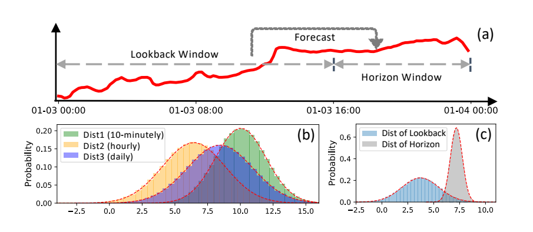
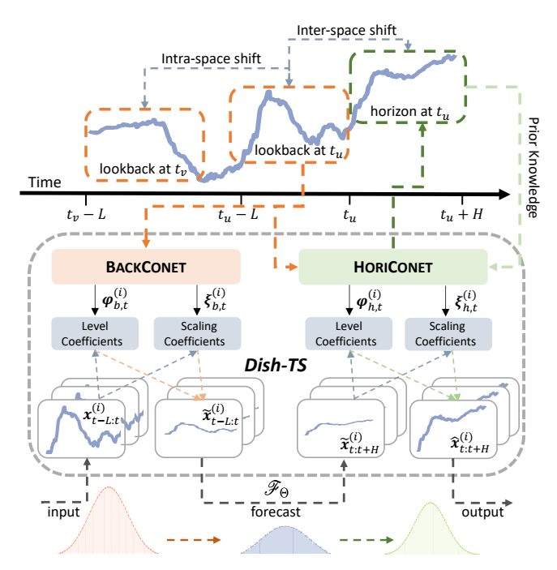
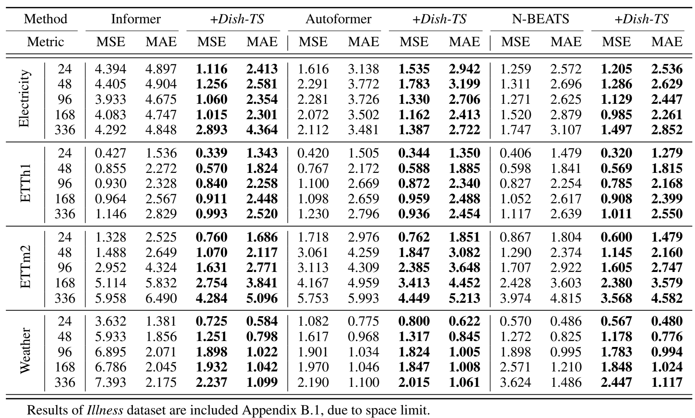
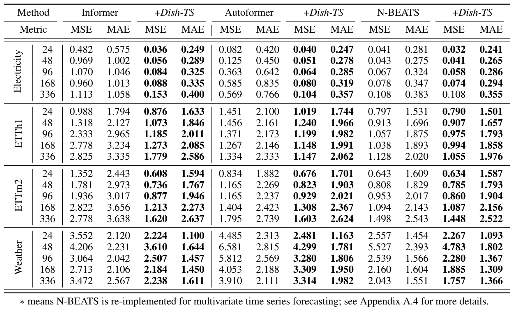
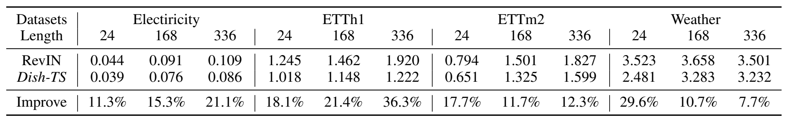
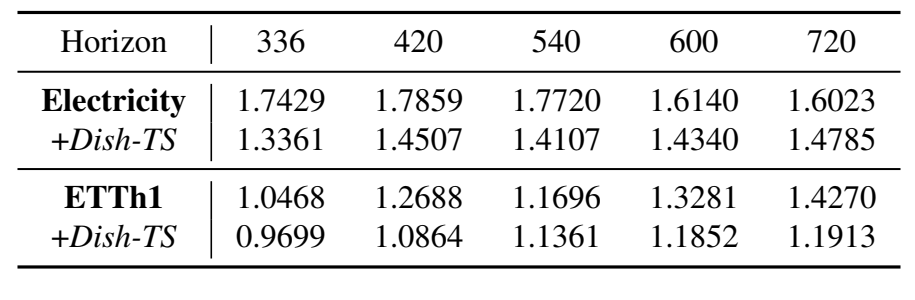
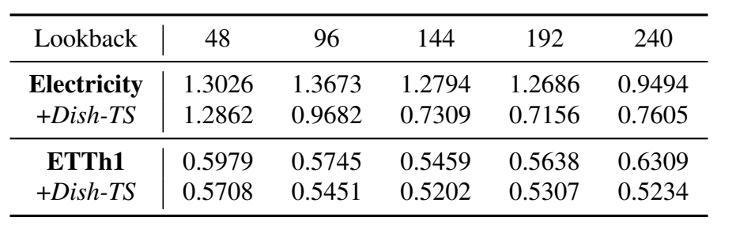
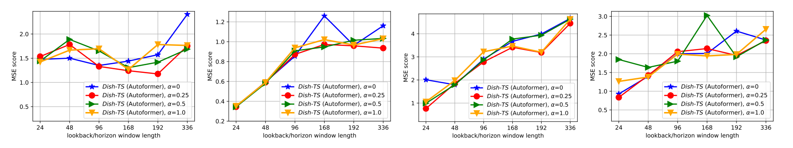
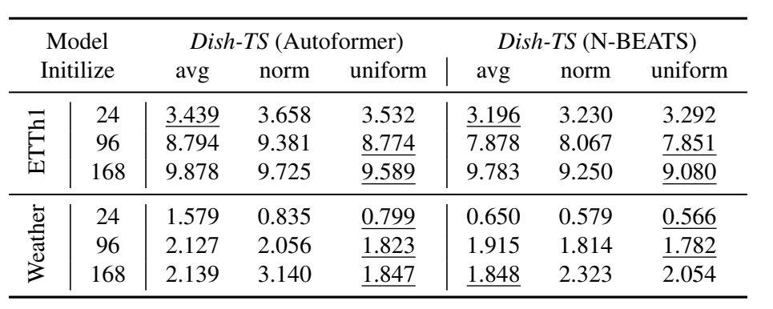
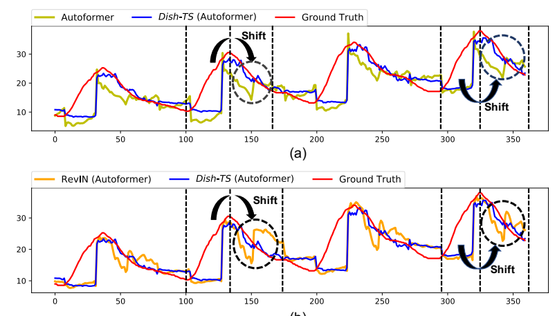

# Dish - TS：减轻时间序列预测中分布偏移的一般范式

## 摘要

时间序列预测中的分布偏移（TSF）指的是序列分布随时间发生变化，这很大程度上阻碍了TSF模型的性能。现有针对时间序列中分布偏移的研究主要限于分布的量化，更重要的是忽略了回视窗口和预测窗口（horizon windows）之间的潜在偏移。为了解决上述问题，我们系统地将TSF中的分布偏移总结为两类。将回视窗口视为输入空间，将预测窗口视为输出空间，存在（1）内部空间偏移，即输入空间内的分布随时间保持偏移，和（2）间隔空间偏移，即分布在输入空间和输出空间之间发生了偏移。然后，我们介绍了一种名为Dish-TS的通用神经范式，以缓解TSF中的分布偏移。具体而言，为了更好地估计分布，我们提出了系数网络（CONET），它可以是任何神经架构，将输入序列映射为可学习的分布系数。为了减轻内部空间和间隔空间的偏移，我们将Dish-TS组织为双CONET框架，以分别学习输入空间和输出空间的分布，自然地捕捉两个空间的分布差异。此外，我们还介绍了一种更有效的CONET学习训练策略。最后，我们在几个数据集上进行了大量实验，并结合各类最先进的预测模型。实验结果表明，Dish-TS始终以超过20%的效率提高了它们的性能。

## 简述时间序列预测

时间序列预测TSF在许多应用中发挥着重要作用，例如用电规划、交通流量分析、天气状况估计。继传统统计方法之后，基于深度学习的TSF模型在各个领域都取得了很好的表现。

尽管TSF模型取得了显著的成功，但时间序列数据的非平稳性一直没有得到充分解决。描述序列数据分布随时间变化的非平稳性可以解释为时间序列的分布变化。此类问题导致模型泛化能力差，从而在很大程度上阻碍了时间序列预测的性能。在分析了大量系列数据后，我们系统地将TSF的分布转移分了两类。将回视窗口作为模型的输入空间，将预测窗口作为模型的输出空间。有（1）**内部空间偏移**：时间序列分布随时间变化，使输入空间（回视）内的数据发生变化；（2）**间隔空间偏移**：分布在输入空间（回视）和输出空间（预测）之间偏移。现有工作试图缓解TSF中的分布偏移问题。然而，它们中的大多数都存在两个局限性：

**首先，TSF中空间内的分布量化不可靠**。理想情况下，时间序列是从真实分布连续生成的，而观测数据时间上是用传感器以特定记录频率离散采样的。现有方法总是直接对系列进行标准化或重新缩放，通过从观察数据中凭经验获得的固定统计量（例如，均值和标准差）量化真实分布，然后对序列分布进行归一化。然而，经验统计数据不可靠，并且在表示数据背后的真实分布方面能力有限。例如下图（b）表示三种分布（用均值和标准差表示）从统一系列不同频率（即每10分钟，每小时，每天）采样。尽管来自同一系列，但不同的采样频率提供了不同的统计数据，这引发了一个问题：哪个最能代表真实分布？由于时间序列的记录频率是由传感器决定的，因此很难识别数据背后的真实分布。因此，如何正确地量化分布，以及空间内的分布变化，仍然是一个问题。

**其次，忽略了TSF的空间转移**。在时间序列预测中，将输入序列（回视）和输出序列（预测）视为两个空间，现有工作总是假设输入空间和输出空间默认遵循相同的分布。尽管最近的一项研究RevIN试图通过规范化输入和非规范化输出来对齐实例，但它仍然提出了一个强有力的假设，即回视和预测具有相同的统计属性；因此具有相同的分布。尽管如此，输入空间和输出空间之间的分布总是存在差异。如上图（c），回视窗口和预测窗口之间的分布（用均值和标准差表示）表现出相当大的差异。对空间间转移的无知忽略了输入空间和输出空间之间的差距，从而阻碍了预测性能。

为了克服上述限制，我们提出了一种有效的通用神经范式Dish-TS，以对抗时间序列中的分布偏移。==Dish-TS与模型无关，可以与任何深度TSF模型结合使用==。受Kim的启发，Dish-Ts包括一个两阶段过程，即在预测前对模型输入进行归一化，并在预测后对模型输出进行反归一化。为了解决分布量化不可靠的问题，我们首先提出了一个系数网（CONET）来衡量序列分布。给定序列数据的任何窗口，CONET将其映射为两个可学习的系数：一个水平系数和一个有效说明系列整体规模和波动的缩放系数。一般来说，CONET可以被设计成任何神经网络结构，进行任何线性/非线性映射，提供足够复杂度的建模能力。为了重新实现上述的**内部空间偏移**和**间隔空间偏移**，我们将Dish-TS组织成一个双CONET框架。具体来说，Dual-CONET由两个独立的CONET组成：（1）BACKCONET，产生估计输入空间分布的系数（lookbacks）和（2）HORI-CONET，产生推断输出空间分布的系数（horizons）。Dual-CONET设置分别为输入空间和输出空间捕捉不同的分布，这就自然地缓解了空间间的偏移。

此外，考虑到HORICONET需要推断（或预判）输出空间的分布，由于空间间的转移，这是很难做到的，Dish-TS进一步引入了有效的先验姿势诱导的训练策略。因此，输出空间的一些额外分布特征被用来为HORICONET提供 更多的先验知识的监督。综上所述，我们的贡献如下：
 - 我们将时空预测中的分布偏移系统地组织为**内部空间偏移**和**间隔空间偏移**。
 - 我们提出了Dish-TS，这是一个通用的神经范式，用于环节TSF中的分布转移，建立在Dual-CONET的基础上，共同考虑**空间内**和**空间间**的转移
 - 为了实现Dish-TS，我们提供了一个最简单和直观的CONET设计实例，用先验知识诱导训练方式来证明这个范式的有效性。
 - 在各种数据集上进行的广泛实验表面，我们提出的Dish-TS持续提升了当前的SOTA模型，在单变量预测中平均提高了28.6%，在多变量预测中平均提高了21.9%。

## 相关工作

**时间序列预测的模型**。时间序列预测（TSF）是一个长期的研究课题。在早期阶段，研究人员提出了统计建模的方法，如指数平滑和自动回归移动平均数（ARMA）。然后，更多的作品提出了更复杂的模型：一些研究人员采用了混合设计。随着深度学习的巨大成功，许多深度学习模型已经被开发出来用于时间序列预测。其中，最具有代表性的一个是N-BEATS，应用于全连接工程，取得了卓越的性能。Transformer也被用于系列建模。为了改进它，Informer在注意力计算、内存消耗和推理速度方面进行了改进。最近，Autoformer将注意力与自动相关结合，以促进预测。

**时间序列预测中的分布变化**。尽管有许多出色的模型，但考虑到现实世界中序列的分布随时间变化，时间序列预测仍然收到分布偏移的影响。为了解决这个问题，一些规范化技术被提出来：自适应规范（Adaptive Norm）通过计算出的全局统计量对序列进行Z-score规范化。然后，DAIN应用非线性神经网络对序列进行自自适应规范化。Du等人2021年提出了自适应RNNS来处理时间序列中的分布转移。最近，RevIN提出了一个实例归一化，以减少序列偏移。尽管DAIN使用了简单的神经网络进行归一化，但大多数工作仍然使用静态统计或距离函数来描述分布和归一化序列，这在表达能力上是有限的。其他一些工作研究了某些领域的时间序列分布偏移，如交易市场。他们几乎没有考虑模型输入空间和输出空间之间的空间转移。

## 问题的提出

**时间序列预测**。让$x_t$表示一个定期采样的事件序列在时间步长$t$的值，经典的时间预测公式是将历史观测值$x_{t-L:t}  = [x_{t-L+1,\cdots,x_t}]$投射到它们随后的未来值$x_{t:t+H} = [x_{t+1},\cdots,x_t+H]$，其中$L$是回视窗口的长度，$H$是预测窗口的长度。单变量设置可很容易地扩展到多变量的设置。$\{x_{t}^{(1)},x_{t}^{(2)},\cdots,x_{t}^{(N)}\}^{T}_{t = 1}$代表长度$T$相同的N个不同的时间序列，多元时间序列预测为：
$$
(x_{t:t+H}^{(1)},\cdot,x^{(N)}_{t:t+H})^T = F_{\Theta}((x_{t-L:t}^{(1)},\cdots,x_{t-L:t}^{(N)})^{T})
$$
其中高斯噪声$\epsilon_{t:t+H}$存在于预测中，但为简洁起见而放弃了。${x_{t-L:t}^{(i)}}^{N}_{i=1}$和${x_{t:t+H}^{(i)}}^{N}_{i=1}$分别是多元回视窗口和预测窗口。映射函数$F_{\Theta}:R^{L \times N} \rightarrow R^{H \times H}$可以看作是一个预测模型，参数化$\Theta$

**时间序列中的分布偏移**。如前所述，本文主要讨论时间序列中的两种分布偏移。在训练预测模型时，一个序列将被切成几个回视窗口$\{x_{t-L:t}^{(i)}\}^{T-H}_{t = L}$，相应的预测窗口被切分为$\{x_{t:t+H}^{(i)}\}^{T-H}_{t = L}$，内部空间偏移被定义为：每一个$u \neq v$的时间步长：
$$
|d(X^{(i)}_{input}(u),X_{input}^{(i)}(v))| > \delta
$$
其中，$\delta$是一个很小的阈值；$d$是距离函数（例如KL散度）；$X_{input}^{(i)}(u)$和$X_{input}^{(i)}(v)$代表回视窗口的分布$x_{u-L:u}^{(i)}$和$x_{v-L:v}^{(i)}$为偏移量。值得注意的是，大多数现有工作在序列中提到的分布转移指的是**内部空间偏移**。相比之下，**间隔空间偏移**为：
$$
|d(X^{(i)}_{input}(u),X_{output}^{(i)}(v))| > \delta
$$
其中$X_{input}^{(i)}(u)$和$X_{output}^{(i)}(v)$表示时间步$u$处回视窗口和预测窗口的分布，这些都被现有的TSF模型所忽略了。

## DISH - TS

在本节中，我们将详细介绍我们的一般神经范式——Dish-TS。我们在4.1节中开始概述这一范式。然后我们在第4.2节中说明了Dish-TS的架构。另外，我们在第4.3节中提供了一个简单而直观的Dish-TS实例，并在4.4节中介绍了一个由先验知识诱导的训练策略，以展示一个针对预测偏移的可行设计。

### 概述

Dish-TS是一个简单而有效的、灵活的、针对时间序列预测中分布偏移的范式。Dish-TS 包括一个两阶段过程，预测前归一化，预测后反归一化。该范式建立在系数网络（CONET）之上，该系数网络将输入序列映射到系数以进行分布测量。如下图所示，Dish-TS被组织成一个双CONET框架，包括一个BACKCONET来说明输入空间（lookbacks）和一个HORICONET来说明输出空间（horizons）。在进入任何预测模型$F_{\Theta}$之前，回视窗口的数据被来自BACKCONET的系数转换。输出（即预测结果）通过HORICONET的系数进行转换，以获得最终预测结果。此外，HORICONET可以以先验知识诱导的方式进行训练，这是一种更有效的方式，特别是在长序列预测中。

### 双网框架

我们介绍了CONET和Dual-CONET框架；然后我们说明如何通过两阶段的归一化 - 反归一化过程将预测被整合到DualCONET中的。

**Conet**：非稳态的时间序列使其难以进行准确预测。Pilot works通过统计数据（通常是平均值和标准差）或距离函数来测量分布和它的变化。然而，如第1节所述，这些操作是不可靠的量化并且表达能力有限。在这方面，我们提出了一个系数网（CONET）来学习更好的分布系数以捕捉这种偏移。一般表述是：
$$
\varphi,\xi = CONET(x)
$$
其中$\varphi \in R^1$表示水平系数，代表窗口$x \in R^{L}$中输入序列的整体规模；$\xi \in R^1$表示缩放系数，即x的波动尺度。一般来说，CONET可以设置为任何神经结构来进行任何线性、非线性映射，这带来了足够的建模能力和灵活性。

**Dual -Conet**为了缓解上述时间序列中的内部空间偏移和间隔空间偏移，Dish-TS需要捕获输入空间之间的分布差异以及输入空间和输出空间之间的差异。受一个使用回视和预测进行后向和前向预测的卓越模型N-BEATS的启发，我们将Dish-TS指定为双CONET架构，包含BACKCONET用于输入空间分布$\{x_{t-L:t}^{(i)}\}^{T-H}_{t=L} \in x_{input}^{(i)}$和HORICONET用于输出空间分布$\{x_{t:t+H}^{(i)}\}^{T-H}_{t=L} \in x_{output}^{(i)}$。在多变量预测中，两个CONET表示为：
$$
\varphi_{b,t}^{(i)},\xi^{(i)}_{b,t} = BACKCONET(x_{t-L:t}^{(i)}),i = 1,\cdots,N \\
\varphi_{h,t}^{(i)},\xi^{(i)}_{h,t} = BACKCONET(x_{t-L:t}^{(i)}),i = 1,\cdots,N
$$
其中$\varphi_{b,t}^{(i)},\xi^{(i)}_{b,t} \in R^1$是回视窗口系数，$\varphi_{h,t}^{(i)},\xi^{(i)}_{h,t} \in R^1$是在时间步数$t$的水平线的系数，给定单一的第$i$个变量序列。 虽然同为输入$x_{t-L:t}^{(i)}$，但两个CONETS有不同的目标。BACKCONET旨在从输入回视窗口学习近似分布$X$，而HORICONET用以推断未来分布。这给训练HORICONET带来了额外的挑战。

## 实验

### 实验设置

**数据集**我们在5个真实数据集上进行了实验（1）电力数据集收集了321个客户的用电量（2）ETT数据集包括电力变压器温度数据。我们选择ETTh1数据集（每小时）和ETTm2数据集（每15分钟）。（3）天气数据集每10分钟记录21个气象特征。（4）疾病数据集包括每周记录的流感疾病患者数据。我们对数据进行与处理和拆分。

**评估**为了直接反映时间序列的分布偏移，所有实验都是在原始数据上进行的，没有数据归一化或缩放。我们根据均方误差（MSE）和平均绝对误差（MAE）评估时间序列预测性能。请注意，我们的评估基于原始数据；因此报告的指标被缩放以提高可读性。

**环境**所有实验均使用Pytorch在NVIDIA RTX3090 24GB GPU上实施。在训练中，所有模型都使用L2损失和Adam优化器进行训练，学习率为[1e-4,1e-3]。我们为每个实验重复三次并报告平均性能。我们让回视/预测窗口具有相同的长度，从24逐渐延长到336，除了有长度限制的疾病数据集。我们还讨论了更大的回视长度$L$，更大的视野长度$H$和先验指导率$\alpha$。

**基线**如上所述，我们的Dish-TS是一个通用神经框架，可以集成到任何深度时间序列预测模型中进行端到端训练。为了验证有效性。我们将我们的范式与三个最先进的骨干模型相结合，即Informer、Atoformer和N-BEATS。

### 综合性能

**单变量时间序列预测**。下表展示了三个最先进的骨干及其配备Dish-TS版本的整体单变量时间序列预测性能，我们可以很容易地观察到Dish-TS帮助所有主干实现更好的性能，下表最右边一列显示了Dish-TS在不同情况下相对于基线模型的平均改进。我们可以看到，Dish-TS在大多数辛苦下可以实现20%以上的MSE提升，在某些情况下可以达到50%。值得注意的是，Informer通常表现较差，但使用Dish-TS可以显著改善。

**多元时间序列预测**。下表展示了四个数据集的整体多元时间序列预测性能，疾病数据集的结果和分析在附录中。尽管如此，我们注意到与三个骨干相比，Dish-TS在多变量预测任务重也可以显著提高模型性能。当与Dish-TS结合使用时，我们发现ETTh1、ETTm2和天气数据集有稳定的改进（10%~30%）。有趣的是，我们注意到原始Informer和Autoformer都很难在Electricity原始数据中很好收敛。使用DIsh-TS，数据分布被归一化以实现更好的预测。

### 与归一化方法比较

在本节中，我们进一步将性能与最先进的归一化技术RevIN进行比较，该技术处理时间序列预测中的分布偏移。在这里我们不考虑AdaRNN，因为它不适合进行公平比较。下表显示了多元时间序列预测的比较结果。我们可以很容易地观察到，虽然RevIN实际上在一定程度上提高了骨干网络的性能（Informer），但与RevIN相比，Dish-TS仍然可以实现10%以上的平均提升。这种简单的CONET设计能对网络性能进行重大改进的一个潜在原因是对内部空间偏移和间隔空间偏移的考虑。

### 参数与模型分析

**预测分析**。我们旨在讨论更大范围（长时间序列预测）对模型性能的影响。有趣的是，从下表中，我们发现骨干网络（N-BEATS）在电力方面表现更好，因为视野变大，而在其他方面，像ETTh1这样的数据集更大的视野给预测带来了更大的困难。但是，Dish-TS在不同的设置下仍然可以取得更好的性能。随着预测窗口的增加，Dish-TS性能逐渐受损。一个直观的原因是更大的视野包括更多的分布变化，因此需要更复杂的建模。

**回视分析**。我们分析了回视窗口长度对模型性能的影响。如下表所示，我们注意到Dish-TS在电力数据集上从1.268 -> 0.731，当回视窗口从48增加到144时达到0.571 -> 0.520。这意味着在许多情况下，更大的回视窗口会带来更多的历史信息来推断未来的分布，从而提高预测性能。

**先验指导率**我们研究了先验指导对模型性能的影响。下图显示了不同引导权重$\alpha$的性能比较。从表中我们观察到，当lookback/horizon较小时，不同$\alpha$之间的性能差距不太明显。然而，当长度较大（大于168）时，$\alpha = 0$（无先验引导）的预测误差迅速增加，而其他设置的误差较小，这表明先验知识可以帮助网络更好的进行HORICONET学习，尤其是在长时间序列预测的设置中。

**Conet初始化**。我们旨在研究Conet初始化对模型性能的影响。如上述，我们为Conets创建了两个可学习的向量$v_b^{l}，v_f^l$。我们考虑三种策略来初始化$v_b^{l}，v_f^l$。（1）平均：对标量进行平均 （2）归一化：标准正态分布 （3）均匀采样：随机分布在0~1之间。从下表中，我们观察到三种策略的表现相似

**可视化**。我们在下图中比较了基础模型和Dish-TS的预测，在图中比较了RevIN和Dish-TS的预测。我们很容易观察到当序列趋势发生较大变化时（可以视为分布发生较大变化），骨干模型（Autoformer）和RebIN都无法获得准确的预测（黑色圆圈）。相比之下，我们的Dish-TS仍然可以做出正确的预测。

## 结论

本文系统地将时间序列预测中的分布偏移归纳为内部空间偏移和间隔空间偏移。我们提出了一个通用范例Dish-TS来更好地缓解这两个转变。为了证明其有效性，我们提供了一个最简单直观的Dish-TS实例以及先验知识诱导的训练策略，与最先进的模型相结合以实现更好的预测。我们对几个数据集进行了广泛的实验，结果表明对主干模型有非常显著的改进。我们希望这种通用范式与Dish-TS设计可以促进更多关于实践序列分布偏移的未来研究。