# Generalized Focal Loss V1

## 摘要

单级检测器基本上将物体检测表述为密集分类和定位（即边界框回归）。分类通常通过Focal Loss进行优化，而边界框的定位通常根据Dirac delta分布进行学习。单级检测器的最新趋势是引入一个单独的预测分支来估计定位质量，预测质量有助于分类，从而提高检测性能。本文深入探讨了上述三个基本要素：质量估计、分类和定位的表示方法。在现有实践中发现了两个问题，包括：(1) 质量估计和分类在训练和推理中的使用不一致（即单独训练但在测试中合成使用）；(2) 当存在模糊性和不确定性时，用于定位的Dirac delta分布不灵活，而在复杂场景中经常出现这种情况。为了解决这些问题，我们为这些元素设计了新的表示方法。具体来说，我们将质量估计合并到类别预测向量中，形成定位质量和分类的联合表示，并使用一个向量来表示方框位置的任意分布。改进后的表示消除了不一致性风险，并准确地描述了真实数据中的可变分布，但其中包含连续标签，这超出了 Focal Loss 的范围。我们随后提出了Generalized Focal Loss（GFL），它将Focal Loss从离散形式广义化为连续版本，从而成功实现优化。在 COCO test-dev 上，使用 ResNet-101 主干网，GFL 实现了 45.0% 的 AP，超过了最先进的 SAPD（43.5%）和 ATSS（43.6%），而且在相同的主干网和训练设置下，GFL的推理速度更高，甚至不相上下。值得注意的是，我们的最佳模型在单个2080Ti GPU上以10 FPS的速度实现了48.2%的单模型单规模AP。代码和预训练模型可在https://github.com/implus/GFocal上获取。

## 引言

近年来，高密集检测器逐渐引领了物体检测的潮流，而对边界框的表示及其定位质量估计的关注则推动了编码技术的发展。具体来说，边界框表示被建模为简单的Dirac delta分布，在过去几年中得到了广泛应用。正如FCOS所推广的那样预测额外的定位质量（如IoU（交并比）分数和centerness（中心）分数）可持续提高检测准确率，在推理过程中，质量估计与分类置信度相结合（通常是相乘）作为非最大抑制（NMS）算法过程的最终分数。尽管取得了成功，但我们在现有实践中发现了以下问题：
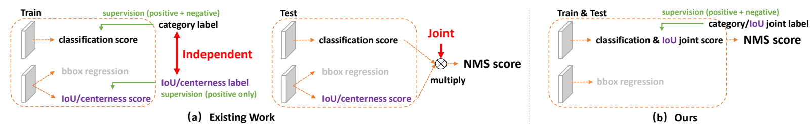

图1：现有分类和定位质量估算的单独表示与联合表示法的比较。（a）：目前的做法是在训练和测试期间分别使用质量分数（IoU或中心度分数）。（b）：我们对分类和定位质量的联合表征使训练和推理具有高度一致性。

**在训练和推理过程中对定位质量估计和分类分数的使用不一致：**（1）在最近的高密度检测器中，定位质量估计和分类分数通常是独立训练的，但在推理过程中却被综合利用（如乘法）（图1（a））；（2）定位质量估计的监督目前只分配给正样本，这是不可靠的，因为负样本可能有机会获得不可控的更高质量预测（图2（a））。这两个因素导致了训练和测试之间的差距，并有可能降低检测性能，利润在NMS过程中，具有随机高质量分数的负实例可能会排在预测质量较低的正实例前面。
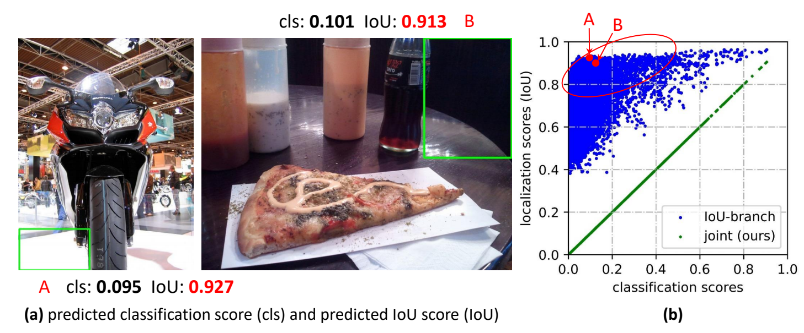

图2：使用IoU分数的现有密集检测器的不可靠IoU预测。（a）：根据图1（a）中的优化IoU分数模型，我们展示了一些预测质量分数极高（例如IoU分数大于0.9）的背景块（A和B）。（b）中的散点图表示随机抽样的实例及其预测分数，其中蓝色点清楚地说明了预测分类分数和预测IoU分数之间的弱相关性。红圈部分包含许多可能的阴性样本，其定位质量预测值较大，有可能排在真正的阳性样本之前，从而影响性能。相反，我们的联合表示法（绿点）迫使它们相等，从而避免了此类风险

**不灵活的边界框表示法：**广泛使用的边界框表示法可视为Dirac delta三角分布的目标方框坐标。然而，它没有考虑到数据集的模糊性和不确定性（见图3中边界不清晰的部分）。虽然最近的一些研究将方框建模为高斯分布，但这一方法过于简单，无法捕捉到边界方法内基数的真实分布。事实上，真实分布可以更加任意和灵活，而不必像高斯函数那样对称。

为了解决上述问题，我们为边界框及其定位质量设计了新的表示方法。对于定位质量表示法，我们建议将其与分类分数合并为一个统一的表示法：分类向量，其在真实类别指数上的值指的是其相应的定位质量（本文中通常指预测框与相应真实框之间的IoU分数）。通过这种方式，我们将分类得分和IoU分数统一为一个联合变量（称为“分类-IoU联合表示”），该变量可以端到端方式进行训练，并在推理过程中直接使用（图1（b））。因此，它消除了训练与测试的不一致性（图1（b）），并使定位质量与分类之间具有最强的相关性（图2（b））。此外，质量分数为0的负值将受到监督，从而使整体质量预测更加保密和可靠。这对高密度物体检测尤其有利，因为它们会对整个图像中定期采样的所有候选物体进行排序。对于边界框表示，我们建议通过直接学习其连续空间上的离散概率分布来表示边界框位置的任意分布，而不引入任何其他更强的先验（如高斯）。因此，我们可以获得更可靠、更准确的边界框估计，同时还能了解其各种基本分布（见图3和补充材料中的预测分布）。
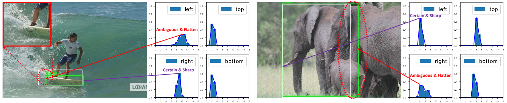

图3：由于遮挡、阴影、模糊等原因，很多物体的边界都不够清晰，因此真实标签（白色方框）有时并不可信，而Dirac delta分布在表示此类问题时也会受到限制。相反，我们提出的边界框一般分布的学习表示法可以通过其形状反映潜在信息，其中扁平分布表示不清晰和模糊的边界（见红圈），尖锐分布代表清晰的情况。我们的模型预测出的方框用绿色标记。

改进后的表征为优化带来了挑战。传统上，对于高密度检测器，分类分支的优化采用Focal Loss。FL可以通过重塑标准交叉熵损失来成功处理类别不平衡问题。然而，对于所提出的分类-IoU联合表示法，除了仍然存在的不平衡风险外，我们还面临着一个以连续IoU标签（0~1）作为监督的新问题，因为原始FL目前只支持离散的{1,0}类别标签。我们通过将FL从{1,0}离散版本到其连续变体，称为Generalized Focal Loss（GFL）。与FL不同，GFL考虑的是一种更普遍的情况，即全局优化解能够以任何所需的连续值为目标，而不仅是离散值。更具体地说，本文将GFL细分为质量焦距损失（Quality Focal Loss，QFL）和分布焦距损失（Distribution Focal Loss，DFL），分别用于优化改进后的两种表示方法：QFL专注与一组稀疏的示例，并同时生成它们在相应类别上的连续0~1质量估计；DFL网络在任意灵活的分布下，快速专注于学习目标边界框连续位置周围值的概率。

我们展示了GFL的三个优势：（1）当单级检测器需要额外的质量估计时，GFL可以弥合训练和测试之间的差距，从而更简单、联合和有效地表示分类和定位质量；（2）GFL可以很好地模拟边界框的灵活底层分布，从而提供更多信息和更准确的框位置；（3）在不引入额外开销的情况下，可以持续提升单级检测器的性能。在COCO test-dev上，GFL利用ResNet-101主干网实现了45.0%的AP，超过了最先进的SAPD（43.5%）和ATSS（43.6%）。我们的最佳模型在单个2080Ti GPU上以10FPS运行时，单模型单规模AP可达到48.2%。

## 相关工作

**定位质量的表示**。现有的做法，如Fitness NMS、IoU-Net、MS R-CNN、FCOS和IoU-aware，都是利用单独的分支以IoU或中心度分数的形式进行定位质量估计。如第1节所述，这种单独的表述方式会导致训练和测试之间的不一致性以及不可靠的质量预测。PISA和IoU-balance没有引入额外的分支，而是根据定位质量在分类损失中分配不同的权重，旨在增强分类得分与定位精度之间的相关性。然而，由于权重策略不会改变分类损失目标的最佳值，因此它的好处是隐形的，也是有限的。

**边界框的表示**。Dirac delta分布在过去几年中一直用于边界框的表示。最近，高斯假设被采用，通过引入预测方差来学习不确定性。遗憾的是，现有的表征要么过去僵化，要么过于简化，无法反映真实数据中复杂的底层分布。在本文中，我们进一步放宽了假设，直接学习更任意、更灵活的边界框一般分布，同时信息量更大、更准确。

## 方法

在本节中，我们首先回顾了用于学习单级检测器密集分类分数的原始Focal Loss（FL）。接下来，我们将详细介绍定位质量估计和边界框的改进表示方法，并分别通过所提出的Quality Focal Loss（QFL）和Distribution Focal Loss（DFL）对其进行成功优化。最后，我们将QFL和DFL的表述整合为一个统一的视角，称为Generalized Focal Loss（GFL），作为FL的灵活扩展，以促进今后的进一步推广和理解。
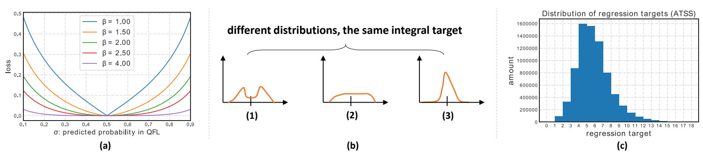

图5：（a）：质量标签$y=0.5$下的QFL图示。（b）：根据公式，不同的灵活分布可获得相同的积分目标，因此我们需要重点学习目标值附近的值概率，以获得更合理、更有把握的预测（如（3））。（c）：COCO trainval135k上所有训练样本的ATSS边框回归目标直方图。

Focal Loss（FL）。最初的FL是为了解决在训练过程中经常出现前景类和背景类极度不平衡的单阶段物体检测问题而提出的。FL的典型形式如下（为简单起见，我们忽略原论文中的$\alpha_t$）
$$
FL(p) = -(1-p_t)^{\gamma}log(p_t),p_t = 
\begin{cases}
p,\ \ \ when\ y=1\\
1-p,\ \ \ when\ y=0\\
\end{cases}
$$
其中，$y \in \{1,0\}$表示真实标签，$p \in [0,1]$表示标签为$y=1$的类别估计概率。$\gamma$是是可调的聚焦参数。具体来说，FL包括一个标准交叉熵部分$-log(p_t)$和一个动态缩放因子部分$(1-p_t)^{\gamma}$，其中缩放因子$(1-p_t)^{\gamma}$，在训练过程中自动降低容易分辨样本的贡献权重，并快速将模型集中在困难例子上。

**Quality Focal Loss（QFL）**。为了解决上述训练和测试阶段不一致性问题，我们提出了一种定位质量（即IoU分数）和分类分数的联合表示法（简称“分类-IoU”），其监督软化了标准的单级类别标签，并导致相应类别上可能的浮动目标$y \in [0,1]$（间图4中的分类分支）。具体来说，$y = 0$表示质量分数为0的负样本，$0 < y \leq 1$表示目标IoU分数为$y$的正样本。根据文献，我们采用多重二元分类法，并使用sigmoid算子$\sigma(\cdot)$来实现多类分类。为简单起见，将sigmoid的输出标记为$\sigma$。

由于所提出的“分类-IoU”联合表示法需要对整幅图像进行密集的监督，而类不平衡问题仍然存在，因此必须继承 FL 的思想。然而，当前形式的 FL 只支持 {1, 0} 离散标签，而我们的新标签包含小数。因此，我们建议扩展 FL 的两个部分，以便在联合表示的情况下进行成功的训练：(1) 交叉熵部分$-log(p_t)$扩展为完整版本$-((1-y)log(1-\sigma) + ylog(\sigma))$；（2）缩放因子$(1-p_t)^\gamma$部分被概括为估计值$\sigma$与其连续标签$y$之间的绝对距离，即，$|y-\sigma|^\beta\ (\beta \geq 0)$此处$y$保证了非负性。随后，我们将上述两个扩展部分结合起来，制定出完整的损失函数，即Quality Focal Loss（QFL）：
$$
QFL(\sigma) = -|y - \sigma|^\beta((1-y)log(1-\sigma) + ylog(\sigma))
$$
请注意，$\sigma = y$是QFL的全局最小解。 图 5 展示了几个$\beta$下的 QFL。（a）与 FL 类似，QFL 中的$|y - \sigma|^{\beta}$项也起着调节因子的作用：当对某个样本的质量估计不准确并偏离标签$y$时，调节因子相对较大，因此它更关注于学习这个困难的例子。 当质量估计变得准确时（即$\sigma \rightarrow y$），系数变为 0，估计良好样本的损失将被降权，其中参数$\beta$可以平滑地控制降权率（在我们的实验中，$beta = 2$ 对 QFL 效果最好）。
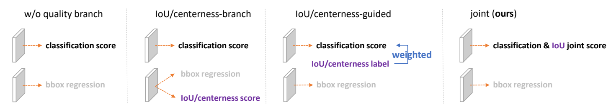

图6：单独和联合表示的修改版本图示。图中还提供了无质量分支的基线图

**Distribution Focal Loss（DFL）**。按照文献，我们采用从位置到边界框四边的相对偏移量作为回归目标（见图4中的回归分支）。边界框回归的传统操作将回归标签y建模为Dirac delta分布$\delta(x-y)$。它满足$\int^{+\infty}_{-\infty}\delta(x-y)dx=1$通常通过全连接层实现。更正式的说，恢复$y$的积分形式如下：
$$
y = \int^{+\infty}_{-\infty}\delta(x-y)xdx
$$
根据第1节的分析，我们建议不采用Dirac delta或高斯假设，而是直接学习底层一般分布$P(x)$，而不引入任何其他先验。给定标签$y$的范围，最小$y_0$，最大$y_n$，$y_0 \geq y \geq y_n,\ n \in N^{+}$，我们可以从模型中得到估计值$\hat{y}$($\hat{y}$也符合$y_0 \geq \hat{y} \geq y_n$)：
$$
\hat{y} = \int^{+\infty}_{-\infty}P(x)xdx = \int^{y_n}_{y_0}P(x)xdx
$$
为了与卷积神经网络保持一致，我们将连续域上的积分转换为离散表示，具体方法是将范围$[y_0,y_n]$离散为一个集合$\{y_0,y_1,\cdots,y_i,y_{i+1},\cdots,y_{n-1},y_n\}$，偶数区间为$\Delta$（简单起见，我们使用$\Delta = 1$）。因此，给定离散分布属性$\sum^n_{i=0}P(y_i)=1$，估计回归值$y$可表示为：
$$
\hat{y} = \sum_{i=0}^{n}P(y_i)y_i
$$
因此，$P(x)$可以通过由$n+1$个单元组成的softmax $S(\cdot)$层轻松实现，为简单起见，$P(y_i)$用$S_i$表示。请注意，$\hat{y}$可以使用传统的损失目标（如SmoothL1、IoU损失或GIoU损失）以端到端的方式进行训练。然而，如图5（b）所示，$P(x)$的值有无数种组合，会使最终积分结果为$y$，这可能会降低学习效率。直观上，与（1）和（2）相比，分布（3）更为紧凑，在边界框估算上也更为精确，这促使我们通过明确鼓励接近目标值$y$的高概率值来优化$P(x)$的形状。此外，最合适的基础位置（如果存在）往往不会远离标签。因此，我们引入了分布聚焦损失（DFL），通过明显扩大$y_i$和$y_{i+1}$（距离$y$最近的两个标签，$y_i \leq y \leq y_{i+1}$）的概率，迫使网络快速聚焦于标签 y 附近的值。由于边界框的学习只针对正样本，不存在类不平衡问题，因此我们只需将 QFL 中的完全交叉熵部分用于 DFL 的定义：
$$
DFL(S_I,S_{i+1}) = -((y_{i+1} - y)log(s_i) + (y-y_i)log(S_{i+1}))
$$
直观地说，DFL的目的是集中扩大目标$y$周围值（即$y_i$和$y_{i+1}$）的概率。DFL 的全局最小解，即$S_i = \frac{y_{i+1} - y}{y_{i+1} - y_i}$，$S_{i+1} = \frac{y-y_i}{y_{i+1} - y_i}$(见补充材料），可以保证估计的回归目标$\hat{y}$无限接近于相应的标签$y$，即，$\hat{y} = \sum^{n}_{j=0}P(y_i)y_i = S_iy_i + S_{i+1}y_{i+1}=\frac{y_{i+1}-y}{y_{i+1} - y_i}y_i + \frac{y - y_i}{y_{i+1} - y_{i}}y_{i+1} = y$，这也确保了其作为损失函数的正确性。
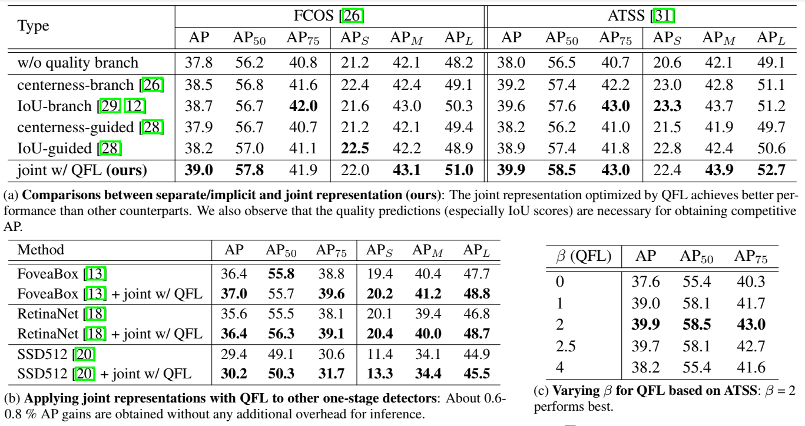

表1：QFL研究（ResNet-50主干网）。所有实验均转载于mmdetection，并在COCO minival进行了验证。

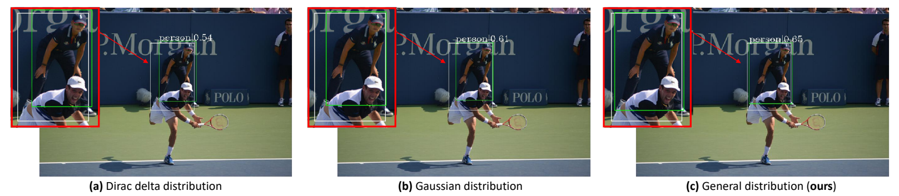

图7：基于ATSS，对COCO minival进行边界框回归时，Dirac delta分布（a）、高斯分布（b）和我们提出的一般分布（c）之间的定性比较。白色方框表示实际标签，绿色方框表示预测标签。

**广义焦距损失（GFL）**。请注意，QFL 和 DFL 可以统一为一种一般形式，本文称之为广义焦点损失（GFL）。假设一个模型估计了两个变量$y_l,\ \ y_r\ \ (y_l < y_r)$的概率为$p_{yl},\ \ p_{yr}\ \ (p_{yl} \geq 0,\ \ p_{yr} \geq 0,\ \ p_{y_i} + p_{y_r} = 1)$，其线性组合的最终预测结果为$\hat{y} = y_lp_{yl} + y_rp_{yr}\ (y_l \leq \hat{y} \leq y_{r})$。预测结果$\hat{y}$的相应连续标签$y$也满足$y_l \leq y \leq y_{r}$ 。以绝对距离$|y - \hat{y}|^\beta\ (\beta \leq 0)$作为调节因子，GFL 的具体公式可写成：
$$
GFL(p_{yl},p_{yr}) = -|y - (y_lp_{yl} + y_rp_{yr})|^\beta((y_r - y)log(p_{yl}) + (y - y_l)log(p_{yr}))
$$

**GFL的特性**。$GFL(p_{yl},p_{yr})$达到全局最小值的条件是$p^{*}_{yl} = \frac{y_r - y}{y_r - y_l},\ \ p^{*}_{yr} = \frac{y - y_l}{y_r - y_l}$这也意味着估计值$\hat{y}$与连续标签$y$完全匹配，即，$\hat{y} = y_lp^{*}_{yl} + y_rp^{*}_{yr} = y$。显然，原FL和提出的QFL和DFL都是GFL的特例。请注意，GFL可以应用于任何单级探测器。修改后的检测器在两个方面与原始检测器不同。首先，在推理过程中，我们直接将分类得分与质量估计的联合表示作为NMS分数输入，而无需乘以任何单独的质量分数（如FCOS和ATSS中的centerness）。其次，用于预测每个边界框位置的回归分支的最后一次现在有$n+1$个输出，而不是1个输出，这带来的额外计算成本可以忽略不计，如表3所示。

**使用GFL训练密集检测器**。我们用GFL来定义训练损失$L$：
$$
L = \frac{1}{N_{pos}}\sum_{z}L_Q + \frac{1}{N_{pos}}\sum_z1_{c_z^* > 0}(\lambda_0l_B + lambda_1L_D),
$$
其中$L_Q$表示QFL，$L_D$表示DFL。通常，L_B表示GIoU损失。$N_{pos}$表示代表正样本的数量。$\lambda_0$和$\lambda_1$分别为$L_Q$和$L_D$的平衡权重。$\sum$是对金字塔特征图上所有位置$z$的计算。$1_{c^*_z>0}$是指标函数，如果为$c_z^* > 0$，则开始为1，否则为0。按照官方规范的做法，在训练过程中，我们还利用质量得分来加权$L_Q$和$L_D$。
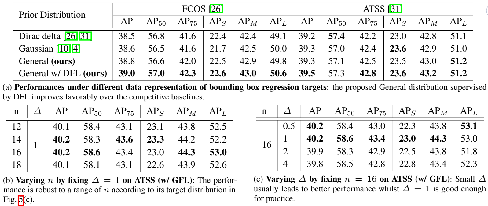

表2：DFL研究（ResNet-50主干网）。所有实验均转载于mmdetection，并在COCO minival进行了验证。

## 实验

我们的实验是在COCO基准上进行的，其中trainval135k（115k幅图像）用于训练，我们使用minival（5k幅图像）作为消融研究的验证。主要结果在test-dev（20k幅图像）上报告，可从验证集上获取。为了进行公平比较，所有结果都是在mmdetection条件下得出，其中采用了默认的超参数。除非另有说明，否则在接下来的研究中，我们基于ResNet-50主干网，采用1X学习计划（12个epoch），不进行多尺度训练。更多训练/测试详情请见补充材料。
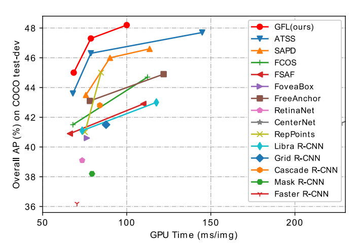

图8：最先进方法在COCO test-dev上的单模型单尺度速度（毫秒）与准确度（AP）对比。与许多同类方法相比，GFL实现了更好的速度-精度权衡。

我们首先研究了QFL的有效性（表1）。在表1（a）中，我们将拟议的联合表示法与其独立或隐含的对应部分进行了比较。表 1（a）中，我们比较了建议的联合表示法与单独或隐含的对应部分： 实验中还采用了 IoU 和中心度。总的来说，我们构建了4个使用独立或隐式表示的变体，如图6所示。根据实验结果，我们发现由QFL优化的联合表示法的性能始终优于所有对应的表示法，而IoU的性能始终优于所有对应的表示法。表1（b）显示，QFL也能提高其他常用单级检测器的性能。表1（c）显示，$\beta=2$是QFL的最佳设置。如图2（b）所示，我们通过对实例进行采样，并预测IoU分支模型和我们的模型的分类和IoU分数，来说明联合表示法的有效性。这表明，使用QFL训练的联合表示法因其更可靠的质量估计而有利于检测，并根据其定义在分类和质量得分之间产生最强的相关性。事实上，在我们的联合表示中，预测的分类得分与估计的质量得分完全相等。
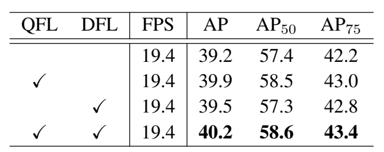

表3：QFL和DFL对ATSS的影响：QFL和DFL的效果是正交的，利用这两种方法可以在不引入额外开销的情况下，在强ATSS基线上将AP提升1%。

其次，我们研究了DFL的有效性（表2）。为了快速选择一个合理的$n$值，我们首先在图5（c）中说明回归目标的分布情况。我们将在后面的实验中说明，ATSS推荐的$n$值为14或16。在表2（a）中，我们比较了不同数据表示的有效性用于边界框回归。我们发现，一般分布假设取得了更优或至少相当的结果，而DFL可以进一步提高其性能。定性比较见图（7）可以看出与高斯分布和一般分布相比，一般分布假设能提供更精确的边界框位置。特别是在有大量遮挡物的情况下（更多讨论见补充材料）。表2（b）和（c）列出了基于GFL训练的改进ATSS的$n$和$\Delta$在DFL中的影响。结果表面，在实际应用中，$n$的选择并不敏感，而$\Delta$建议选取较小值（如1）。为了说明一般分布的效果，我们在图3中绘制了几个具有代表性的实例及其在四个方向上的分布式边界框，在这些实例中，一般分布式表示法可以通过其形状有效地反映边界框的不确定性（更多示例请参见补充材料）。

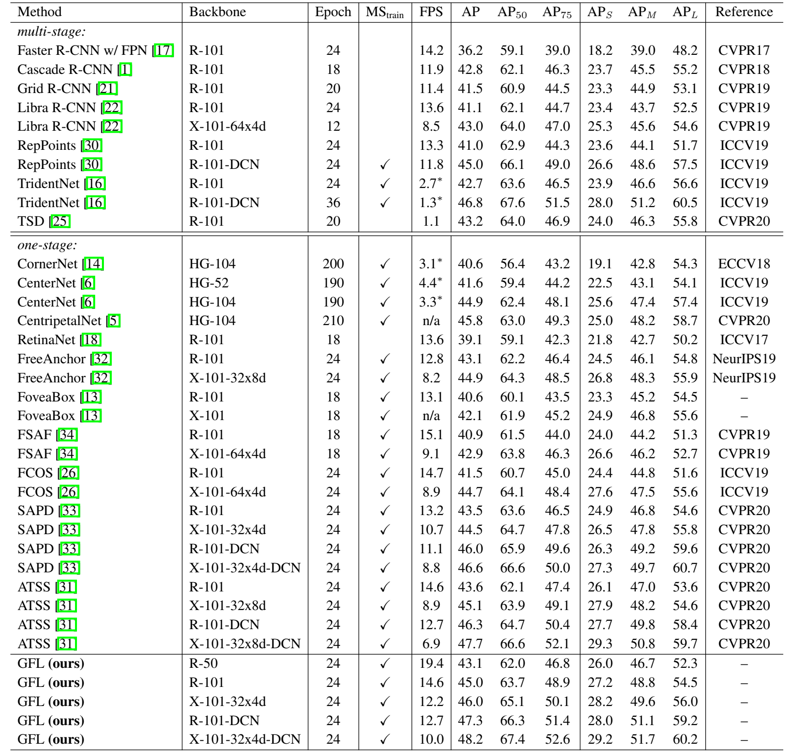 表4：最先进检测器在COCO test-dev上的比较（单一模型和单一尺度结果)。$MS_{train}$表示多尺度训练。带有$*$的FPS值来自文献，其他数值是在同一机器上使用单个GeForce RTX 2080Ti GPU在相同的mmdetection框架下测量的，尽可能使用1的batch size。n/a表示没有原始论文中训练的模型和结果。R：ResNet，X：ResNeXt，HG：Hourglass，DCN：Deformable Convolutional Network

我们在带有ResNet-50主干网的ATSS上进行了消融研究，以显示QFL和DFL的相对贡献（表3）。FPS（每秒帧数）是在同一台机器上用单个GeForce RTX 2080Ti GPU测量的，在相同的mmdetection框架下，batch-size为1。我们观察到，DFL与QFL的改进是正交的，而两者的联合使用（即GFL）可将强ATTS基线的AP分数绝对值提高1%。此外，根据推理速度，GFL带来的额外开销可以忽略不计，因此非常实用。

最后，我们在表4中比较了GFL（基于ATSS）和COCO test-dev上的先进方法。根据之前的研究，在训练过程中采用了多尺度训练策略和2x学习计划（24个epoch）。为了进行公平比较，我们展示了所有方法的单模型单尺度测试结果以及相应的推理速度（FPS）。使用ResNet-101的GFL在14.6FPS速度下实现了45.0%的AP，优于所有采用相同骨干网的现有检测器，包括SAPD（43.5%）和ATSS（43.6%）。此外可变形卷积模型使用ResNeXt-101-32x4d-DCN的GFL在10FPS时获得了最先进的48.2%AP，而使用ResNeXt-101-32x4d-DCN的GFL在10FPS时获得了最先进的48.2%AP。图8展示了精确度-速度权衡的可视化效果，可以看到，我们提出的GFL将精确度-速度边界推到了一个很高的水平。

## 结论

为了有效地为密集物体检测器学习合格的分布式边界框，我们提出了Generalized Focal Loss（GFL），它将原来的Focal损失从$\{1, 0\}$离散变为连续。GFL可分为Quality Focal Loss（QFL）和Distribution Focal Loss（DFL），其中QFL鼓励学习更好的分类和定位质量联合表示法，而DFL则通过将它们的位置建模为一般分布，提供信息更丰富、更精确的边界框估计。大量实验验证了GFL的有效性。我们希望GFL可以作为社区的一个简单而有效的基准。