# 语言模型的在线策略提炼：从自我错误中学习

## 摘要

知识蒸馏（KD）被广泛用于通过训练较小的学生模型来压缩教师模型，以降低推理成本和内存占用。然而，当前用于自回归序列模型的KD方法存在训练期间看到的输出序列与学生在推理期间生成的输出序列之间的分布不匹配的问题。为了解决这个问题，我们引入了广义知识蒸馏（GKD）。GKD不是仅仅依赖于一组固定的输出序列，而是利用老师对这些序列的反馈，在学生自生成的输出序列上训练学生。与监督式KD方法不同，GKD还提供了在学生和老师之间采用替代损失函数的灵活性，这在学生缺乏模仿老师分布的表现力时很有用。此外，GKD促进了蒸馏与RL微调（RLHF）的无缝集成。我们证明了GKD在摘要、翻译和算术推理任务中提炼自回归语言模型的有效性，以及用于指令微调任务的有效性。

## 引言

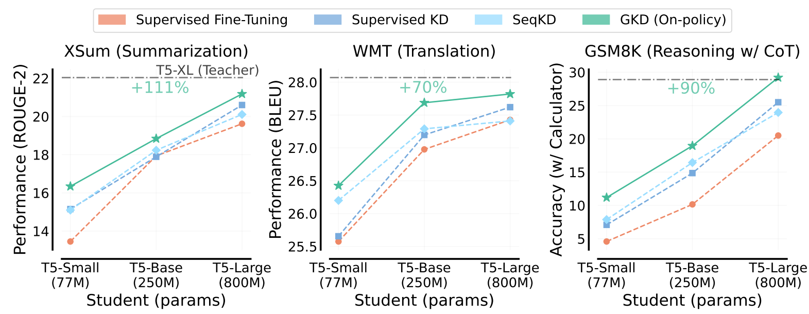

<b>图 1: 不同学生模型规模下GKD与KD方法的比较。我们将使用SFT训练的T5模型作为学生。我们使用SFT训练的T5-XL（∼3B params）作为教师，教师的表现用水平线表示。有监督的KD和FT使用真实输出序列进行训练，而SeqKD则使用教师生成的输出序列进行训练。On-policy GKD使用从学生中采样的输出序列进行训练。对于GKD，我们在WMT上使用JSD (0.1)，在其他任务上使用前向KL。在评估中，我们对XSum和GSM8K采用贪婪采样，对WMT采用波束搜索。</b> 

自回归序列模型，如语言模型（LMs），在众多任务中展现了卓越的能力，而这一成功的关键通常在于增加训练数据量以及模型参数的数量。然而，增加参数数量会带来成本，这些模型的部署受限于推理成本或内存占用。因此，为了实际应用大型高性能模型，一个关键目标是通过减少参数数量来压缩模型，同时尽可能保留其性能。

一种广泛使用的模型压缩技术是知识蒸馏。蒸馏是指训练一个学生模型，以复制另一个教师模型，在特定任务集上的知识。通常，学生模型的参数比教师模型少，因此，蒸馏可以在保持较低推理成本和较小内存占用的同时提高特定任务的性能。目前针对自回归序列模型的蒸馏方法要么需要从教师模型生成一组固定的输出序列，这可能会很昂贵；要么需要一个固定的数据集，其中教师模型可以通过分配逐词概率来进行标注。然而，使用固定数据集会导致训练过程中看到的输出序列与推理过程中学生模型自回归生成的序列之间的分布不匹配，这是模仿学习中的一个已知问题。此外，蒸馏的常见目标是最小化教师与学生分布之间的前向KL散度。然而，学生模型可能不足以表达教师模型的分布，这可能导致学生生成的样本不大可能是由教师生成的（例如，图A.16）。

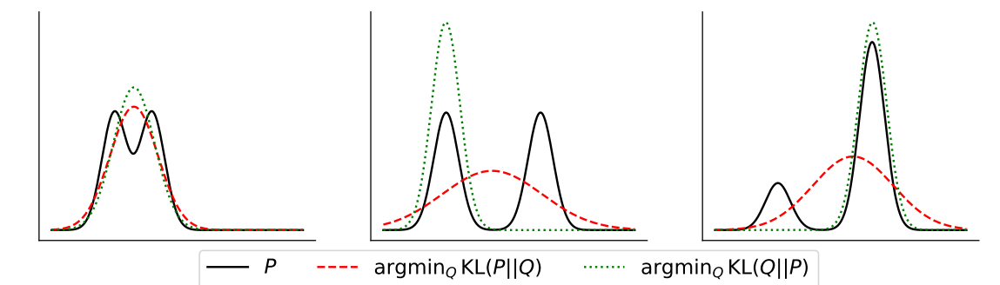

<b>图 A.16: Mode-seeking vs Model-covering KL在容量不匹配情况下的对比。我们展示了当最小化混合分布P与单模高斯分布Qθ之间的前向KL散度和反向KL散度时所学到的分布Qθ。反向KL是mode-seeking的，因为它迫使Qθ在P为零的地方也为零，从而使其集中在其中一个模式上（最后一幅图）。然而，前向KL是mode-covering的，因为它确保了在P有质量的任何地方Qθ下也都有一定的质量。</b> 

在本文中，我们提出了广义知识蒸（GKD）以缓解上述问题。首先，我们认识到对于自回归序列模型而言，知识蒸馏可以视为一种具有交互式专家的模仿学习问题。基于这一认识，GKD使用学生模型自身生成的序列进行训练，这些序列是在线（on-policy）策略的，而不是使用一组固定的输出序列，并利用教师模型的概率作为这些序列上的标签。最近，我们的想法还得到了对大型语言模型进行微调以生成自身输出序列的成功实践的支持。此外，GKD提供了优化替代性散度度量的灵活性，比如反向KL和广义JSD（第2节），这样可以利用学生的有限容量专注于生成在教师模型下可能出现的样本。

GKD统一了现有的自回归语言模型的知识蒸馏方法，并实现了新的在线（on-policy）策略方法，这些方法显著优于流行的方法。在不同规模的T5学生模型上，从on-policy策略GKD获得的性能提升相对于初始学生模型，在摘要任务上平均相对提升达到了 2.1 倍，在机器翻译任务上为 1.7 倍，在算术推理任务上为 1.9 倍，相较于基准知识蒸馏方法的性能改进如图 1。此外，我们在非特定任务蒸馏中展示了GKD的有效性，在保留的BBH和MMLU基准测试套件上分别实现了绝对准确率2%和1%的提升（图 10）。

我们的主要贡献是：

- 为了解决自回归语言模型在训练和推理过程中的不一致性问题，我们提出了GKD，该方法利用学生模型生成的on-policy策略输出进行蒸馏，并由教师模型在这些输出上的逐词概率进行引导。GKD在特定任务（图1）和非特定任务的知识蒸馏（图10）中均显著优于常用的方法。
- 我们展示了on-policy策略GKD可以无缝结合语言模型的强化学习微调（例如RLAIF），这种组合此前尚未被探索过（图5）。

- 通过对GKD中设计选择的系统性评估，我们提供了在蒸馏过程中使用学生生成的on-policy策略输出序列的重要性以及学生与教师之间最优散度的任务依赖性的实用见解。

## 前言

自回归生成序列模型。我们将输入和输出序列分别记为$x$、$y$。$V$表示由$M$个`tokens`组成的词汇表，$y_{<n+1} = (y_1,y_2,\cdots,y_n)$表示截至第$n$个token生成的输出序列，$L_y$表示序列$y$的长度。token级别的自回归生成策略，$p(\cdot|y_{<n}, x) \in (0,1)^M$，以输入$x$和输出序列$y_{<n}$为条件，输出$V$中所有token的next token概率分布。此外，$y \sim p(\cdot|x)$对应于给定输入$x$的采样输出序列$y$，为了便于表达，我们定义$p(y_n|x) := p(y_n|y_{<n},x)$。自回归生成是指根据之前生成的token，预测一下个token。预测$n$个token $y_n$的概率$p(y_n |x)$使用温度（temperature）$\gamma$的softmax来确定：$p(y_n|x) = \frac{\exp(z_n/\gamma)}{\sum_{i=1}^M exp(z_i/\gamma)}$ ，其中，$z_n$是token $y$的对数得分。$\gamma$值越大，随机性越强，$\gamma$值越小，输出结果越确定，因为它偏向于最可能出现的词。在训练期间，学生的温度$\gamma$保持为 1。在评估时，我们使用贪婪抽样（$\gamma  \rightarrow 0$）或温度抽样（$\gamma > 0$）。

基于 KL散度。两个概率分布之间的发散度是对分布相似性的一种度量，其中KL散度是一种常用的度量。两个离散分布$P (C)$和$Q(C)$ 之间的KL散度由公式给出：$D_{KL}(P||Q) = \sum_{c \in C}P(c)log\frac{P(c)}{Q(c)}$

KL散度不是对称的：$D_{KL}(P||Q) \neq D_{KL}(Q||P)$。因此，我们把$D_{KL}(P||Q)$称为正向KL（forward KL），将$D_{KL}(Q||P)$称为$P$和$Q$之间的反向（reverse KL），经验数据分布下的正向KL与最大似然相对应，我们在监督学习中会对最大似然进行优化。在模型容量不匹配的情况下，当使用分布$Q_{\theta}(C)$近似$P(C)$时，最小化反向和正向KL会导致mode-seeking行为（图 A.16）。

尽管KL散度可能无界，但即使对于支持集不相交的概率分布，也有一种众所周知的有界散度，即广义JS散度（Jensen-Shannon散度）。$JSD(\beta)$使用有界系数$0 < \beta < 1$在前向和反向KL散度之间进行插值。
$$
D_{JSD(\beta)}(P||Q) = \beta D_{KL}\left(P ||\beta P + \left(1-\beta\right)Q\right) + \left(1-\beta\right)D_{KL}\left(Q||\beta P + \left(1 - \beta \right)Q\right)
$$
可以看到当$\beta$趋近于0时，$DJS_{(β)}(P||Q)/\beta = D_{KL}(P||Q)$。因此，当$\beta$分别接近0和1时，$JSD(\beta)$的梯度表现类似于前向KL和反向KL。

## 自回归模型的蒸馏

**问题设置。**我们有两个容量不同的自回归序列模型，其中$p_S$和$p_T $分别指代学生模型和教师模型。我们假设学生有可学习的
参数$θ$且$p_S^\theta$ 在$\theta$条件下是可变的。我们还有一个输入数据集$X$。我们可以假设能获得输入输出序列对$(X,Y)$。如果没有给定这样的数据集，可以通过从教师模型中采样序列来生成。对于某一散度$D$，我们定义教师模型$p_T$ 和学生模型$p_S$在逐词分布上的差异为：
$$
D(p_T||p_s^\theta)(y|x) := \frac{1}{L_y}\sum_{n=1}^{L_y}D(p_T(\cdot|y_{<n},x)||p_S^\theta(\cdot|y_{<n},x))
$$

对于输入$x$和输出序列$y$。例如，在上式中使用$JSD(\beta)$作为$D$会得到$D_{JSD_{(\beta)}}(P_T||P_S^{\theta})(y|x) = \frac{1}{L_y}\sum_{n}D_{JSD(\beta)}(P_T(\cdot|y_{<n},x)||p_S^\theta(\cdot|y_{<n},x))$。

**有监督微调**：如果我们仅获得一个包含真实输出序列的固定数据集，而没有查询教师策略的权限，那么一个简单的方法是最小化这些序列在学生模型下的负对数似然：$L_{SFT}(\theta) = E_{(x,y) \sim (X,Y)}[-log\ p_S^\theta(y|x)]$。

**序列级别KL散度**：SeqKD最大化教师生成的高概率序列的似然，并可以视作是在教师生成的输出上进行的监督微调。

**有监督KL散度**：这是一种广泛使用的技术，其中学生模型被训练以模仿教师模型的逐词概率分布。学生模型$p_S$通过监督目标$L_{SD}$来训练，以匹配教师模型$P_T$的目标逐词概率分布：
$$
L_{SD}(\theta) := E_{(x,y) \sim (X,Y)}\left[D_{KL}(p_T || p_S^\theta)(y|x)\right]
$$
其中期望是在数据集的样本上进行的。这个监督目标通过利用教师的完整逐词分布提供了丰富的训练信号。

### 广义知识蒸馏（GKD）

正如上文所述，常见的知识蒸馏方法使用的是固定输出序列数据集，这些序列要么来自真实的目标，要么是由教师模型生成的。然而，使用这种方法蒸馏自回归的学生模型会导致训练与推理时的分布不匹配。这是因为，在推理过程中自回归生成阶段遇到的部分序列可能与训练阶段所见到的序列大不相同。由于在自回归模型中任何步骤的预测都取决于之前的步骤，这种不匹配可能会产生级联效应，即早期步骤中的预测错误会影响后续的预测，导致生成的文本质量较差。为了解决这种不匹配，我们借鉴了模仿学习（IL）的方法。具体来说，on-policy策略模仿方法迭代地使用学生模型收集序列，为这些序列获取标签，然后在这个数据集上重新训练学生模型。尽管on-policy策略方法在机器人技术和深度强化学习中非常流行，但它们通常并不用于蒸馏自回归模型。

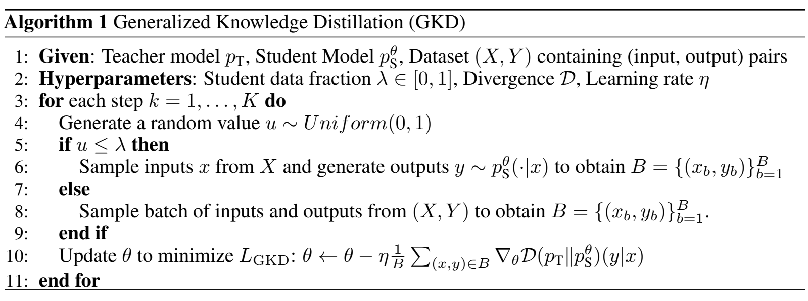

将on-policy策略模仿扩展到知识蒸馏中，我们提出了on-policy策略知识蒸馏（on-policy KD）。在蒸馏过程中使用on-policy策略数据时，学生模型会从教师模型的logit上获得关于其自回归生成的输出序列中错误词汇的具体反馈。这建立了一种类似于我们在强化学习中观察到的反馈循环，有助于最小化训练与推理时的分布不匹配。此外，随着学生模型在训练过程中的进化，它生成的数据质量也会得到提升。对于输入$x$，学生模型生成输出序列$y$，并在中间状态 $y < n$上模仿教师模型的逐词分布 $p_T(y_n|x)$。具体来说，on-policy策略损失$L_{OD}$表示为：
$$
L_{OD}(\theta) := E_{x\sim X}\left[E_{y\sim ps(\cdot|x)}[D_{KL}(p_T || p_S^{\theta})(y|x)]\right]
$$
其中，我们不对学生模型的采样分布$p(\cdot|x)$进行反向传播，这与on-policy策略类似。不通过采样进行反向传播使得训练更加稳定并且计算效率更高。在on-policy策略知识蒸馏中，训练是在学生模型有可能生成的输出序列上进行的。在训练过程中，我们使用温度参数$\gamma = 1$​，以鼓励学生生成具有多样性的序列。此外，对于未标记的输入提示，由于模型大小的不同，使用学生模型生成序列的计算成本要比使用教师模型更低。

在此基础上，我们将监督和在线策略方法相结合，提出了一种更为通用的方法，我们称之为广义知识蒸馏（GKD）。在 GKD 中，我们可以选择要优化的散度以及训练所用的输出序列。具体来说，我们可以优化教师与学生模型之间逐词概率分布的任意散度。对于输出序列，GKD使用的是固定数据集（包括教师生成的或真实数据）与on-policy策略学生生成序列的混合。抽象地说，GKD最小化了一个形式化的目标：
$$
L_{GKD}(\theta) := (1 -\lambda)E_{(x,y) \sim (X,Y)}[D(p_T||p_S^\theta)(y|x)] + \lambda E_{x~X}\left[E_{y \sim p_S(\cdot|x)}[D(p_T || p_S^\theta)(y|x)]\right]
$$
其中 $D(p_T,p_S)$是教师与学生分布之间的散度（方程2），$\lambda \in [0,1]$是一个控制学生数据比例的超参数，即on-policy策略学生生成输出的比例。类似于on-policy策略知识蒸馏，我们不对学生模型的采样过程传递梯度。on-policy策略和监督知识蒸馏分别是GKD的实例化，其中散度$D$设置为前向KL散度，学生数据比例$\lambda$分别设置为1和0。也就是说，GKD 允许对比例$\lambda$和散度有其他选择，这是我们在这项工作中探讨的内容。

与使用随机初始化的学生模型不同，我们假设可以访问到能够生成足够质量序列的学生模型，这样教师模型可以对其提供反馈。在我们的实验中，我们从已经经过监督微调（FT）的学生模型开始。这类似于广泛用于语言模型的两阶段RLHF训练，在这种训练中，我们首先进行监督微调（SFT），然后进行on-policy强化学习微调。因此，GKD可以利用来自RLHF的超参数调优见解，并且可以在较小的计算开销下与RLHF结合，无需添加额外的超参数。

**GKD中的散度选择**。尽管前向KL散度常用于蒸馏，但它要求学生模型覆盖教师逐词分布$p_T(\cdot|y_{<n},x)$的整个支持集。这样一来，学生模型可能会给那些在$p_T(\cdot|y_{<n},x)$下概率很低的词汇$v$分配概率，这可能导致幻觉和生成质量低下。当学生模型的容量远小于教师模型时，使用温度采样时这个问题尤为明显（例如，图 A.16）。相比之下，mode-seeking型的散度，如反向 KL，优先考虑教师模型赋予高概率的词汇，这可以避免低质量的生成，但代价是对于给定输入生成的多样性降低。我们的实验证明，最优散度似乎是任务依赖的。总的来说，在选择GKD散度时，需要考虑特定任务的多样性和性能之间的权衡（例如，图 4、10）。

### RL微调+ON-POLICY GKD

在某些任务中，从教师模型中提炼出的结果可能只是我们主要目标的一个替代，而我们的主要目标也可能是无差别的。我们可以通过强化学习（RL）直接优化这一目标。幸运的是，ON-POLICY GKD可以很容易地与来自人类（RLHF）或人工智能反馈（RLAIF）的 RL 微调相结合，因为它只需要学生的输出样本。事实上，如果我们想要优化学生策略，使其获得标量奖励$r$，同时与教师策略保持一致，那么我们就会得到一个正则化的 RL 微调目标，其形式为：
$$
\mathbb{E}_{x \sim X}[(1-\alpha) \underbrace{E_{y \sim p_{\mathrm{S}}^\theta(\cdot \mid x)}[r(y)]}_{\text {RL objective }}-\alpha \underbrace{\mathbb{E}_{y \sim p_{\mathrm{S}}(\cdot \mid x)}\left[\mathcal{D}\left(p_{\mathrm{T}} \| p_{\mathrm{S}}^\theta\right)(y \mid x)\right]}_{\text {Generalized On-Policy Distillation }}]
$$
其中$\alpha \in [0,1]$ 控制了蒸馏损失相对于强化学习目标的强度。当$\alpha=1$时，将只执行蒸馏。上述目标允许我们在通过蒸馏提升模型其他能力的同时最大化奖励，这可能减少在使语言模型与人类偏好对齐时一般模型能力的“对齐税”下降。我们将上述思路应用于使用 RLAIF减少幻觉，同时通过蒸馏提升下游任务的性能（图 5）。

在RLHF或RLAIF中，我们通常使用反向KL散度来约束学习到的策略接近初始策略。如果希望仅对现有的强化学习微调工作流程进行轻微修改，我们建议在集成GKD与RL时使用反向KL或JSD(0.9)。

## 实验

在本节中，我们评估了 GKD 在蒸馏语言模型（自回归序列模型）在文本概括、机器翻译和算术推理任务上的表现。

**学生/教师模型。**我们的实验始于不同规模的学生和教师模型，具体来说是开源的 T5 模型，这些模型在同一数据集上进行了预训练。我们使用监督微调后的 T5-XL（约3B参数量）作为教师模型。对于学生模型，我们使用了T5-small（77M参数量）、T5-base（250M参数量）和 T5-large（800M参数），它们分别比教师模型小 38 倍、12 倍和 3.8 倍。更多细节请参见附录 A.2。

**GKD 变体。**在算法1的GKD中，我们选择了前向KL、反向KL 和三种$JSD(\beta)$的变体：JSD(0.1)、JSD(0.5) 和 JSD(0.9)。对于学生数据比例 $ \lambda$，我们尝试了 $\lambda = 1$（on-policy策略）、$\lambda = 0.5$（混合策略）和$\lambda = 0$（监督策略）。特别是，我们关注的是在线策略变体（$ \lambda = 1$），这部分之前未曾被探索过。

**基线**。我们对比了第3节中讨论的广泛使用的知识蒸馏方法：SeqKD和监督知识蒸馏。我们也评估了ImitKD和f-distill，这两种方法可以视作GKD的“混合”数据变体（$\lambda=0.5$），其中散度分别为前向KL和总变异距离（total variation distance）。所有的基线方法都和 GKD 一样，从相同的监督微调后学生模型检查点开始。

## 实例研究： 文本概括

我们首先在捕捉输入文档核心思想的摘要这一任务上评估GKD。为此，我们使用了XSum数据集，该数据集包含了新闻文章及其对应的人工撰写的摘要。参照 PaLM 的方法，我们在 XSum 数据集的验证集上使用 ROUGE-2 分数来评估预测摘要的表现，但在 ROUGE-L 和 ROUGE-1 上也观察到了相似的趋势。我们使用在 XSum 上监督微调的 T5 模型作为蒸馏的学生模型，而微调后的 T5-XL 则作为教师模型。更多实验细节请参见附录 A.3。

**与基线的比较**。首先，我们探讨了GKD在不同规模的学生模型上与广泛使用的知识蒸馏方法SeqKD和监督知识蒸馏相比的表现。如图 1 所示，我们观察到GKD带来了持续的提升，这表明了GKD在学生模型容量方面的可扩展性。值得注意的是，GKD使我们能够使用一个比PaLM（540B 参数）小 7000 倍的 T5 模型超越其few-shot性能。我们还将GKD变体与ImitKD和f-distill进行了比较，并在图 2 中评估了贪婪采样和温度采样（$\gamma=1$）下的性能。使用JSD(0.9)的on-policy GKD在两种情况下都超过了这些附加的基线方法。

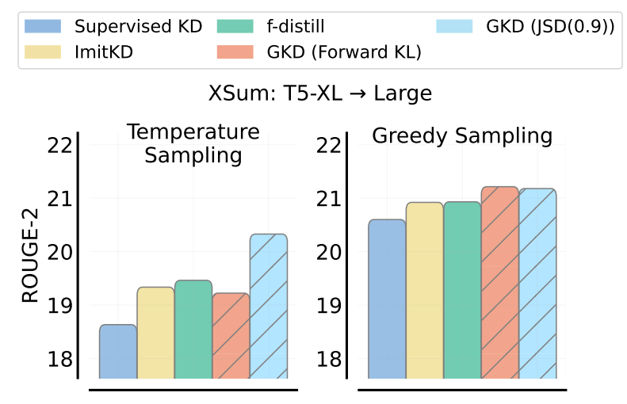

<b>图 2 : 在XSum数据集上从T5-XL蒸馏到T5-large时，GKD与基线方法的比较。在线策略GKD变体总体上优于基线方法。</b> 

**数据效率与扩展性**。为了评估GKD的效率和扩展性，我们使用了XSum训练数据集的子集来蒸馏 T5-XL 教师模型：1K（0.5%）、10K（5%）和 50K（25%）的样本量。我们使用T5-small作为学生模型，并在图 3 中报告了数据扩展曲线。值得注意的是，在不使用任何真实摘要的情况下，仅用5%子抽样数据集的在线策略GKD的表现优于使用带有真实摘要的完整训练数据集的监督知识蒸馏和 ImitKD。

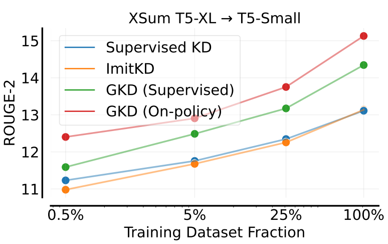

<b>图 3 : 缩放训练数据规模。我们使用温度采样（$\gamma = 1$）对蒸馏T5-small进行了评估。与基线相比，GKD的数据效率更高。</b> 

**GKD的消融研究**。我们在图A.12和A.13中对学生模型的不同规模进行了GKD的不同散度和学生数据比例的消融实验。在线策略和混合变体的表现始终优于监督变体。在使用温度采样进行评估时，模式搜索型散度的表现更好；而在贪婪采样时，散度的选择对性能影响不大。

**选择 GKD 散度**。用于蒸馏的散度对于决定摘要质量和多样性之间的权衡至关重要。由于采样温度也可以调整以平衡摘要质量和多样性，因此最佳散度的选择依赖于温度。为了理解这种依赖关系，我们评估了使用不同散度进行在线策略GKD蒸馏的T5-small模型。如图4所示，某些散度，如JSD(0.5) 和JSD(0.9)，在较高温度下提供了更好的质量但减少了多样性。然而，随着温度的降低，不同散度之间的质量差异缩小，同时多样性也随之下降。

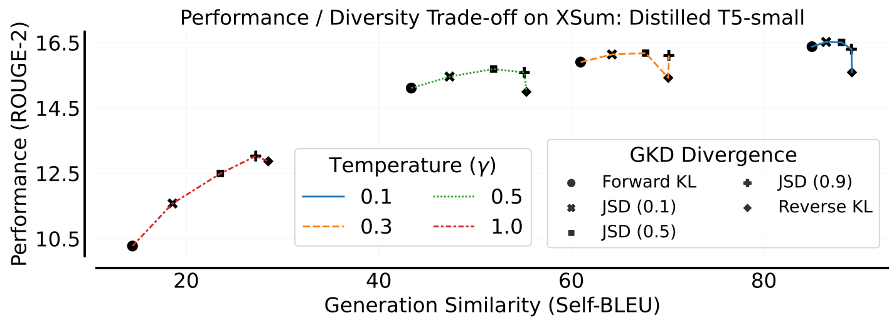

<b>图 4 : 散度对性能和多样性的影响。通过使用不同散度的在线策略GKD，我们评估了蒸馏学生模型生成质量和多样性之间的权衡，方法是改变采样温度。我们使用Self-BLEU来量化多样性，其中得分100表示确定性输出，而0表示最大的多样性。从前向KL散度过渡到反向KL散度，通过广义JSD，会导致多样性减少，这归因于散度增强的mode-seeking特性。mode-seeking散度通常会产生更高的质量，特别是在高温度（$\gamma = 1$）下。降低温度会减少多样性，同时缩小不同散度间的性能差异。</b> 

on-policy GKD 与强化学习的结合。在摘要生成中，我们希望模型生成的摘要能够与输入文档在事实上保持一致。然而，单独的蒸馏可能无法改善事实的一致性，因为即使是大规模的模型也可能产生不一致的摘要。最近，Roit 等人（2023）通过使用文本蕴含反馈（textual entailment feedback）作为奖励（RLEF）的强化学习方法减轻了摘要任务中的幻觉现象，因为忠实的摘要必须从输入文档中得以文本蕴含。受到他们成功的启发，我们探讨了结合使用类似于REINFORCE目标的强化学习微调与on-policy GKD的方法，如第3.2节所述。如图 5所示，与教师模型相比，结合RL微调的GKD显著提高了事实一致性，同时在蒸馏的学生模型的摘要质量上获得了大幅改进。

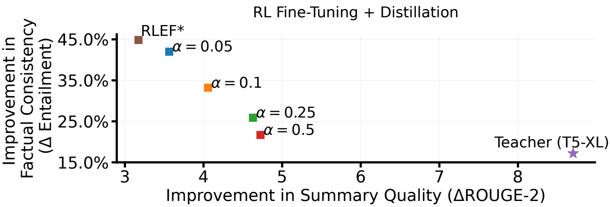

<b>图 5 : RLAIF + on-policy GKD。我们在XSum数据集上展示了奖励最大化与摘要性能之间的权衡。我们报告了相对于原始T5-base学生模型的改进。遵循Roit等人（2023）的方法，我们使用T5-XXL NLI分类器的文本蕴含（textual entailment）分数作为奖励。alpha控制了使用JSD(0.9)的在线策略GKD损失的强度。随着\alpha的增加，ROUGE-2 分数增加，而事实一致性的改进则减少。为了对比，我们展示了12倍更大的T5-XL教师模型的相对性能。RLEF*对应于Roit等人（2023）中的RLAIF方法，其中学生模型被正则化回到其自身而不是教师模型。在线策略GKD + RL达到了比RLEF* 更高的ROUGE-2分数，同时生成了相较于教师模型更符合事实的摘要。</b> 

### 机器翻译

为了进一步评估GKD在摘要之外的表现，我们考虑使用WMT14 en-de数据集进行英译德的任务。我们报告了在验证集上的性能，使用的是衡量机器翻译文本与高质量参考翻译相似度的BLEU分数。我们使用了监督微调后的T5-XL作为教师模型，并设置了softmax 温度为1.0（BLEU 分数为 28）。更多实验细节请参见附录 A.5。

**结果。**图1和图A.15显示，on-policy GKD的表现优于常用的KD方法。此外，我们在图6中使用T5-small和T5-base作为学生模型进行了GKD变体的消融研究。我们观察到，广义JSD散度的表现优于前向或反向 KL 散度，但在使用更大规模的学生模型时，它们之间的性能差距减小。此外，完全使用on-policy和混合数据分布始终优于仅使用固定监督数据集的GKD变体，这表明从学生模型生成在线策略输出序列的重要性。在线策略数据在WMT上的有效性与我们在XSum上的发现是一致的。

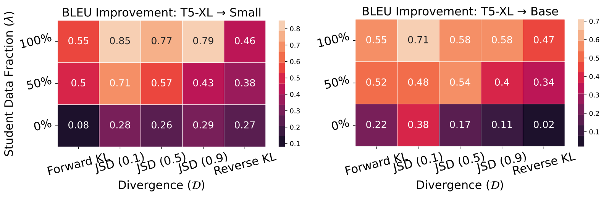

<b>图 6 : WMT en → de 上 GKD 中的不同学生数据分数和散度。为了进行评估，我们使用了波束搜索，并报告了蒸馏后的学生相对于原始学生的BLEU分数的提高情况。结果是三个种子的平均值。我们观察到，仅使用学生生成的输出样本的效果优于其他GKD变体。我们使用在WMT上经过微调的T5-XL (∼3B params) 作为教师，其BLEU得分为28。（左）我们使用T5-small (77M params)作为学生，其BLEU得分为25.58。(右图）学生对应T5-base（250M个参数），BLEU得分为26.98。</b> 

### 算术推理

研究表明，推理能力只有在至少有几十亿个参数的 LLM 中才会出现，因此KD对于提高较小模型的推理能力非常重要。为此，我们在 GSM8K上对GKD进行了评估，这是一个高质量的小学数学单词问题数据集，需要多步逻辑推理。在这里，我们将GKD与思维链（CoT）结合起来进行了探讨，思维链是一种常见的方法，可通过提示LLMs在给出最终答案前产生中间推理步骤来提高其推理能力。

**实验设置**。我们通过在GSM8K的数学问题前加上Wei等人（2022）提供的前 4 个思考过程（CoT）输入输出示例来进行少量示例提示。在评估时，我们通过检查目标答案是否与外部计算器得出的最终答案匹配来报告测试集上的准确率，这与Cobbe等人（2021）的做法类似。对于监督训练，我们使用了Magister等人（2022）生成的CoT输出，这导致在GSM8K的原始训练集中大约有5.3K对（问题，CoTs）的数据。我们使用在上述 CoT 数据集上监督微调了10K steps的Flan-T5模型作为蒸馏的起点。我们使用微调后的 FLAN T5-XL作为教师模型，其测试准确率为 27.9。更多实验细节请参见附录 A.4。

**结果**。我们首先对GKD变体进行了消融研究，并在图7和图A.14中报告了结果。我们观察到，当仅使用固定的CoT数据集或将其与学生生成的CoT混合使用时，其性能始终不及仅使用学生生成的CoT。此外，前向 KL的表现非常好，这与我们在使用贪婪采样的 XSum 上的发现相似。值得注意的是，反向KL同样表现良好，尤其是在仅使用固定数据集进行训练时。另外，图8 显示，只要至少有 25% 的数据是on-policy数据，随着on-policy数据比例的增加，性能会持续提高。此外，如图 9 所示，我们证明了在线策略GKD在所有学生模型规模上都优于基线KD方法。最后，我们在附录 A.1 中展示了GKD在GSM8k上进行自我蒸馏时表现出的有希望的结果。

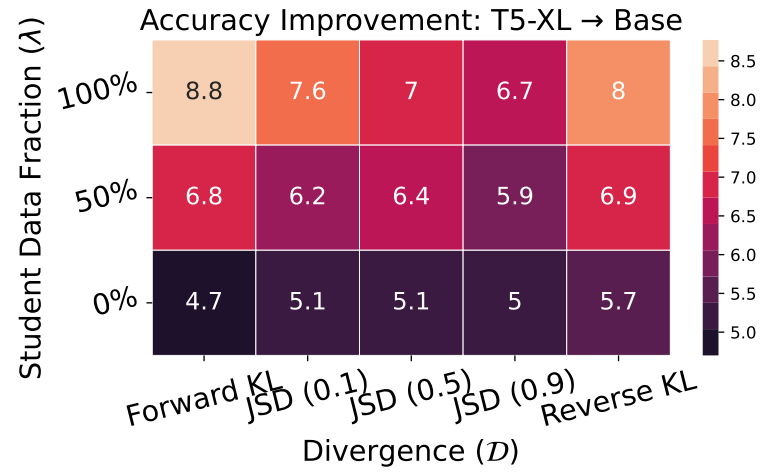

<b>图 7 : 在GSM8K上消融GKD。我们将经过微调的T5-XL提炼为T5-Base，其精度分别为27.9和10.16（采用贪婪采样）。</b> 

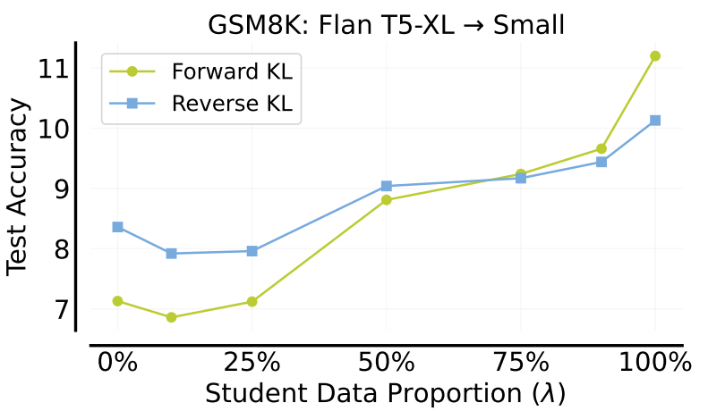

<b>图 8 : GSM8K上不同的策略效果。当我们将学生生成数据的比例提高到25%以上时，性能通常会得到改善。</b> 

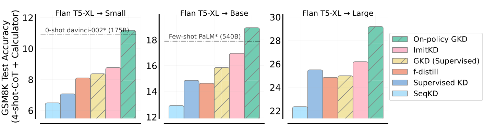

<b>图 9 : 在GSM8K上进行蒸馏，并进行少量CoT提示。在on-policy上，GKD大大优于其他方法。作为参考，我们提供了GPT-3 davinci-002结果以及PaLM (540B) 的结果（无计算器）。我们使用正向KL和反向KL分别表示on-policy上和监督下的GKD。</b> 

### 基于特定任务的蒸馏：指令微调

针对特定任务的蒸馏可为预定义任务提供优化性能，这通常对部署目的至关重要，而针对任务不可知的蒸馏则可在任务的确切性质事先未知且在部署过程中可能发生变化的情况下提供令人信服的替代方案。正如 Sanh 等人（2019）所强调的，无特定任务蒸馏法的魅力在于它的高效性：一旦蒸馏完成，模型就可以通过提示或微调重新用于多个下游任务。

**实验设置。**为了研究无特定任务的知识蒸馏，我们专注于指令微调。我们的目标是提高蒸馏模型处理以指令形式呈现的各种任务的能力。为此，我们采用FLAN T5-XL模型作为教师模型，并将其知识蒸馏到由 Chung 等人（2022）引入的FLAN T5-Base中。我们的蒸馏过程利用了全面的FLAN2021指令微调数据集，该数据集包含跨越62种不同的语言理解和生成任务的536万个示例。有关超参数的详细信息，请参见表 A.4

**评估**。为了衡量一个任务无关模型的多功能性，有必要在一系列多样的任务上对其进行测试。与 Chung 等人（2022）一致，我们在两个保留的基准套件上评估了我们蒸馏出的T5-base学生模型：(1) MMLU（大规模多任务语言理解）包括来自 57 项任务的考试题目，如数学、历史、法律和医学；(2) BBH（BIG-Bench Hard）包括来自 BIG-Bench 的 23 项任务，PaLM 540B（Chowdhery 等人，2022）在这部分任务上的表现低于平均水平的人类评价者。在评估性能时，我们展示了蒸馏模型通过标准的少量示例提示直接预测答案的能力，并在 MMLU 和 BBH 的任务中取平均值。

**结果**。我们在图 10 中展示了不同方法在经过5万步训练后得到的蒸馏检查点的性能。我们发现，使用反向KL的on-policy策略GKD显著优于监督知识蒸馏（Supervised KD）和ImitKD。尤其在指令微调的情境下，我们发现使用反向 KL 的表现远好于前向 KL。我们推测反向KL在指令微调中的有效性可能源于其模式搜索特性，因为它确保了模型能够聚焦于指令所指定的主要意图或行为。因此，模型可能会优先考虑核心行为而非不太相关的细节，从而在保留任务上取得更好的性能。

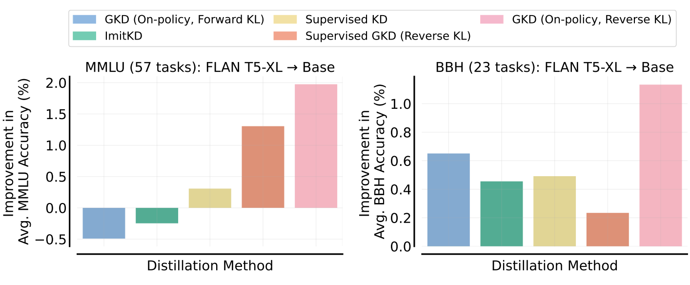

<b>图 10 : FLAN上的无特定任务蒸馏。使用反向KL的在线策略GKD优于其他方法。在MMLU和BBH基准套件上的评估指标是少量示例（few-shot）提示准确率（完全匹配），我们在所有任务上取无加权平均。这些评估基准是保留的（不包含在蒸馏数据中）。由于SeqKD在训练期间从教师模型生成数据时计算效率低下，这里我们没有运行SeqKD。教师模型FLAN T5-XL在MMLU上的准确率为52.4%，在BBH上为41%，而学生模型T5-large在MMLU上的准确率为35.6%，在BBH上为31.25%。</b> 

## 相关工作

**知识蒸馏**。监督知识蒸馏是一种经典方法，并已成功用于蒸馏自回归模型。另一种蒸馏这类模型的方法是序列级知识蒸馏。on-poilcy GKD显著优于监督知识蒸馏和SeqKD（图 1）。其他的知识蒸馏方法训练学生模型去匹配从教师模型获得的不同量值，比如隐藏状态或注意力分数。然而，这些方法都没有建立起蒸馏与模仿学习之间的联系，并且纯粹的监督方法可能会遭受训练-推理不匹配的问题，这也被称为暴露偏差。尽管He等人认为这种不匹配可能不是关键问题，但多篇论文表明，暴露偏差会导致文本生成质量较差。

ImitKD通过从学生模型和固定数据集中采样序列识别这一联系，但并未进一步发展这个想法。不同于 GKD，ImitKD并未探索纯粹的on-poilcy策略数据收集，也没有整合RL微调。此外，ImitKD仍然保持在词级别上的前向 KL，而这在可以访问到教师模型的概率对数而不只是采样时并不是必要的。此外，GKD展示了这一想法的可扩展性，处理的学生模型大约是ImitKD探索的学生模型大小的26 倍。ImitKD可以视为使用前向 KL和一个非递增的$\lambda$调度的 GKD，一个简单的选择是$ \lambda = 0.5 $。最近，f-distill将序列级知识蒸馏表述为最小化f散度，并基于师生模型词级别分布之间的总变差距离提出了一个可行的目标函数。本质上，ImitKD和f-distill都是GKD的特定实例，我们证明了它们的结果不如on-poilcy GKD（图 2、9）。

与此同时，MiniLLM的工作也利用了与模仿学习的联系，并将蒸馏框架作为一个RL问题。具体而言，MiniLLM使用策略梯度方法在序列级别上优化教师与学生模型之间的反向KL（而似然最大化是前向KL）。然而，我们认为GKD更简单且更稳定，因为它更接近于监督训练，并且不通过学生的采样过程反向传播。实际上，MiniLLM 依赖于多种稳定技巧来解决高方差、奖励破解和生成长度偏差等问题。GKD 也更具通用性，因为它还可以与其他散度一起使用，如前向KL或JSD，这些在某些情况下表现得比反向KL更好（图 6、7）。

**强化学习微调**。现在已有大量例子表明，语言模型可以通过强化学习（RL）进行微调，无论是优化某个度量的奖励，还是通过人类反馈进行学习。在这些方法中，通常会对RL微调的模型施加正则化，使其回归到初始模型（通常是监督微调过的模型）。然而，据我们所知，我们是首次同时进行知识蒸馏和RL微调（图 5）的。虽然这样做看起来自然，但从优化角度来看，它改变了正则化的方向，即从初始策略转向教师策略，并且我们通过实验证明这是一种可行的方法。

**带有推理轨迹或理由的知识蒸馏**。近期的研究表明，通过提示（prompting）的方式，大型语言模型（LLMs）能够逐步解决复杂的推理任务。这一理念迅速被应用到知识蒸馏中，通过扩展包含CoT提示的教师数据集来微调学生模型。蒸馏仍然是以监督的方式进行，而且可以考虑其他类型的增强提示。我们采取了同样的方法，但结合了使用不同散度的在线策略蒸馏。这显示了 GKD 的多功能性，并且根据我们在 GSM8K 上的结果（图 9），这种方法优于纯粹的监督方法。

## 结论

在这项工作中，我们提出了GKD，以解决在蒸馏自回归语言模型时训练-推理分布不匹配的问题。在文本概括、机器翻译和算术推理这三种语言生成任务中，GKD的表现始终优于常用的知识提炼方法。我们进一步证明，GKD可以与强化学习相结合，除了提炼大型教师模型的知识外，还可以优化序列级奖励，我们相信这可以改进语言模型广泛使用的RLHF训练阶段。未来工作的一个有趣方向是将GKD扩展到用于音频、视频和文本到图像生成的自回归序列模型。我们希望，我们的工作对那些致力于提高生成式自回归序列模型性能和效率的研究人员和从业人员来说是有价值的。
