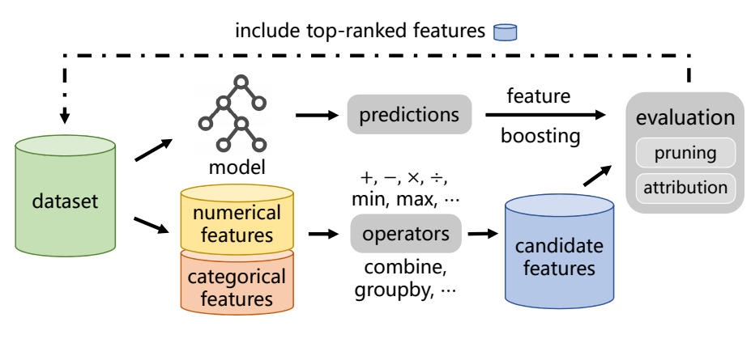
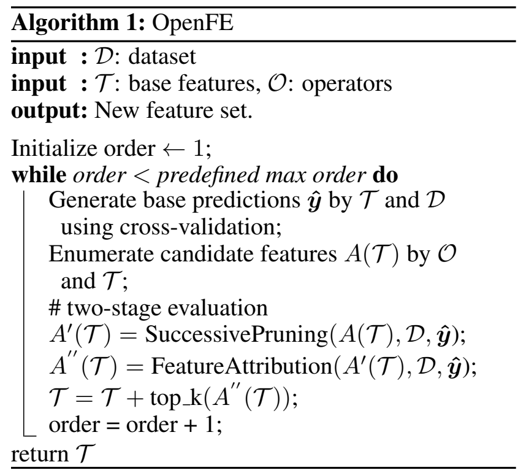
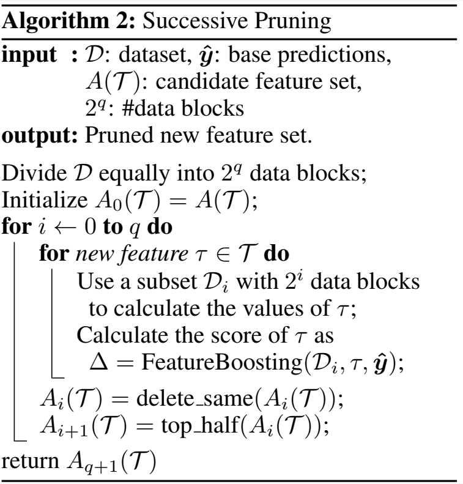
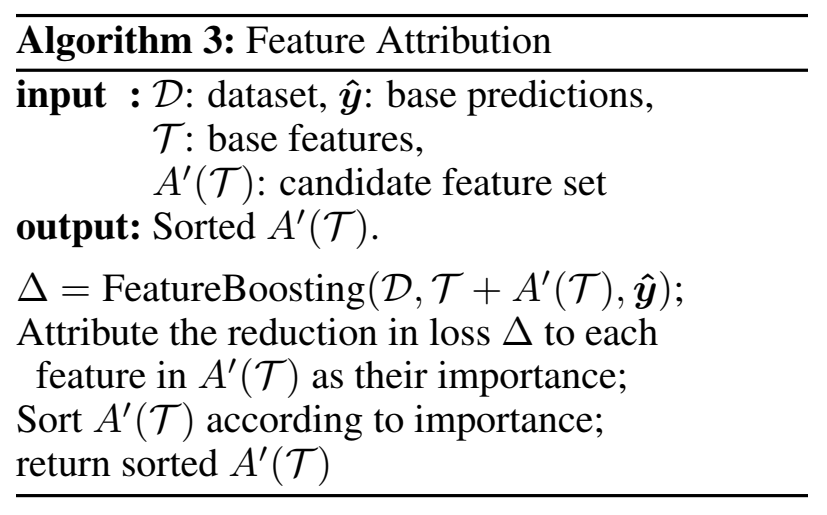
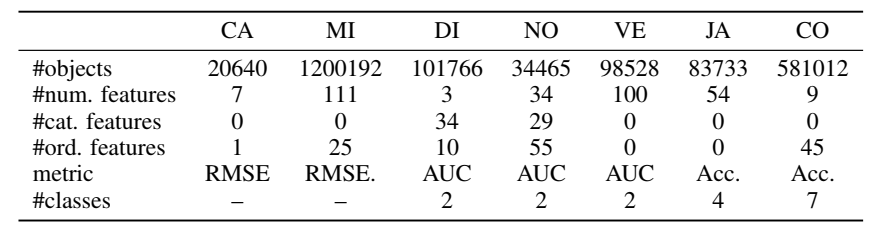
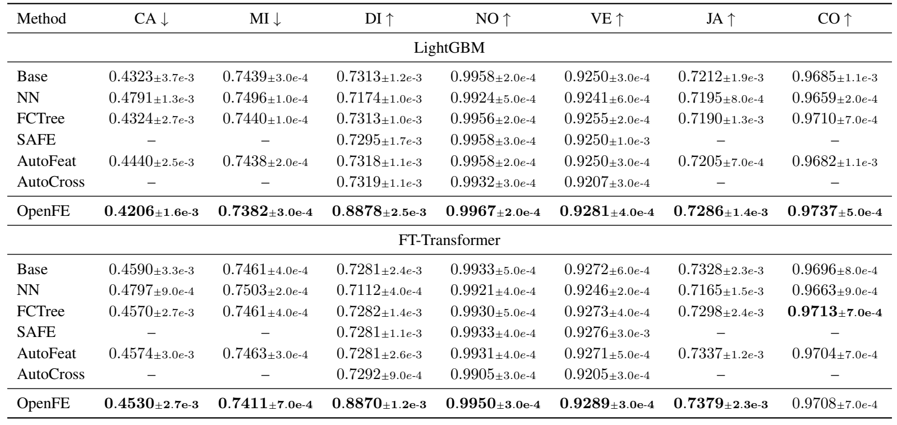
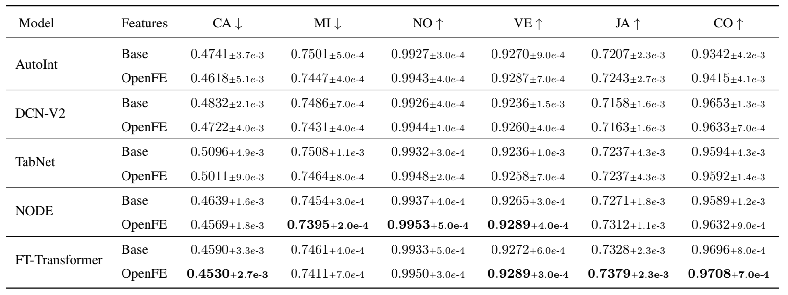
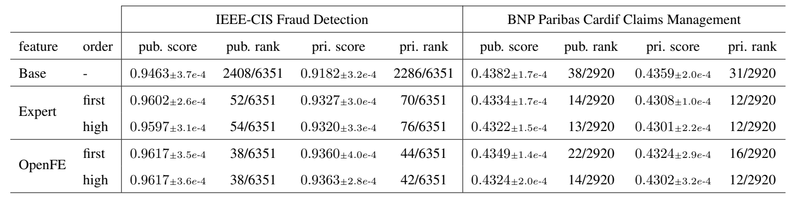
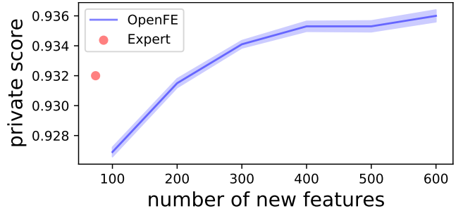
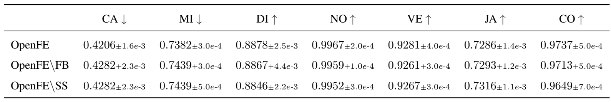

# OpenFE：全自动特征生成器

## 摘要

自动化特征生成的目标是将机器学习专家从人工特征生成的繁重任务中解放出来，这对于提高表格数据的学习性能至关重要。自动特征生成的主要挑战是从大量候选特征中高效准确地识别有用的特征。在本文中，我们介绍了OpenFE，这是一种自动特征生成工具，可提供与机器学习专家竞争的结果。OpenFE通过2个组件实现效率和准确性：（1）一种新颖的特征增强方法，用于准确估计候选特征的增量性能。（2）特征评分框架，用于通过连续的特征减半和特征重要归因从大量候选者中检索有效特征。7个基准数据集的大量实验表明，OpenFE优于现有的基准方法。我们在2个著名的Kaggle竞赛中进一步评估了OpenFE，有数千个数据科学团队参加。在其中一项比赛中，OpenFE使用简单基线模型生成的特征可以击败99.3%的数据科学团队。除了实证结果外，我们还提供了理论观点来表明特征生成在简单但具有代表性的环境中是有益的。

## 简介

将机器学习方法应用于表格数据时，特征生成是一项重要但具有挑战性的任务。表格数据，其中每一行代表一个实例，每一列对应一个不同的特征，在工业应用和机器学习竞赛中无处不在。众所周知，特征的质量对表格数据的学习性能有重大影响。特征生成的目标是将基于特征转化为信息量更大的特征，以更好地描述数据并提高学习性能。例如，市盈率(P/E)，计算方式为(股价/每股收益)，是从财务报表中的基本特征“股价”和“每股收益”中推导出来的，并告知投资者对公司价值的看法。在实践中，数据科学家通常使用他们的专业知识以反复试验的方式找到有用的特征转换，这需要大量的人力和专业能力。

由于手动特征生成非常耗时并且需要相关领域知识，因此自动特征生成称为自动化机器学习中的一个重要组成。扩展和缩减可以说是自动特征生成中最普遍的框架，我们首先扩展候选特征，然后消除冗余特征。在经典的扩展和缩减中有2个挑战。首先，在许多工业应用中，候选特征的数量通常是巨大的。由于需要大量内存，计算所有的候选特征不仅计算量大并且也是不可行的。第2个挑战是如何高效准确地估计一个新特征的增量性能，即当一个新的候选特征被添加到基本特征集时，可以提供多少性能改进。大多数现有方法依赖统计假设来确定是否包括新特征。然而，具有统计意义的特征并不总能转化为良好的预测因子。仅对于人口中的一部分实例，特征可能与目标显著相关，从而导致人口预测不佳。此外，即使新特征与目标显著相关，基本特征集也可能包含有效特征。

在本文中，我们提出了OpenFE，这是一种强大的自动特征生成算法，可以有效地生成有用的特征以提高学习性能。首先，受重要特征和良好预测变量间差距的启发，我们提出了一种特征增强方法，该方法直接估计除了基本特征集之外的新特征预测能力。其次，受有效特征通常在大量候选特征中稀疏这一关键事实的启发，我们提出了一个两阶段评估框架。在第一阶段，我们提出了一种连续的特征剪枝算法，通过动态地将计算资源分配给有前途的特征来快速消除冗余候选特征。在第二阶段，我们提出了一种连续的特征剪枝算法，根据剩余候选特征对学习性能提高的贡献对剩余候选特征进行排序，进一步消除冗余候选特征。我们在各种数据集和Kaggle竞赛上验证了OpenFE，其中OpenFE优于现有的基线方法。在一场有数千个数据科学团队参与的著名Kaggle竞赛中，由OpenFE生成的具有特征的基线模型击败了6351个数据科学团队中的99.3%。更重要的是，OpenFE生成的特征与竞赛的顶级获胜者提供的特征相比，具有相当甚至更大的性能提升，这首次证明了自动特征生成与机器学习专家的竞争。

除了提出一种新方法外，本文还打算解决阻碍自动特征生成研究过程的两个重要问题。第一个问题是大多数现有方法是在不同的数据集上进行评估，这些研究没有开源他们的代码和数据集，阻碍了新的研究进行公平的比较。为了便于在未来的研究中进行公平比较，我们重现了自动特征生成的主要方法，并通过与相应论文中的结果进行比较来验证重现效果。

第二个问题是缺乏深度学习时代特征生成必要性的证据。深度神经网络（DNN）因其提取特征表示的能力而得到广泛认可。近年来，已经精心开发了多种DNN来对表格数据进行建模，其中一些已经证明了它们在特征交互学习方面的效率。我们广泛评估了OpenFE对各种DNN的影响。我们证明，使用OpenFE生成新的转换特征可以进一步提高现有DNN架构的学习性能。除了实证结果之外，我们还提供了一个简单但具有代表性的转导学习（transductive learning）设置。

我们将本文的贡献总结如下：
 - 我们提出了一个新颖的自动特征生成方法，可以有效地识别有用的新特征以提高学习性能。大量实验表明，OpenFE在七个基准数据集上达到了SOTA。更重要的是，我们首次证明OpenFE在特征生成方面与人类专家具有竞争力。
 - 我们通过以下方式促进特征生成方面的研究：复现自动特征生成的主要方法并发布代码和数据集。提供经验和理论证明表明特征生成是表格数据建模的重要组成部分，即使在深度学习的时代
 - 我们提供易于使用的OpenFE Python实现，只需三行代码即可生成新功能。该代码可通过“pip install openfe”访问

## 问题定义

对于给定的训练数据集$D$，我们将其拆分为子训练集$D_{tr}$和验证集$D_{vld}$。假设D由特征集T+S组成，其中T是基础特征集，S是生成的特征集。我们使用学习算法L来学习模型$L(D_{tr},T+S)$，并计算评估指标$\varepsilon (L(D_{tr},T+S),D_{vld},T+S)$来衡量模型性能，具有较大的值表示更好的性能。现在，我们将特征生成问题正式定义为：
$$
\mathop{max}\limits_{S \subseteq A(T)} \varepsilon (L(D_{tr},T+S),D_{vld},T+S)
$$
其中A(T)是从基本特征集生成的所有可能候选特征集合。特征生成的目标是从A(T)中找到一个最大化评价指标的特征集S。我们通过用于转换基本特征的运算符集合O来确定A(T)。运算符O包括一元运算符，例如log、sigmoid、square和二元运算符，例如$\times$、$\div$、$min$、$max$、$GroupByThenMean$。附录D.2包含运算符列表以及我们如何使用它们来转换数值和分类特征。我们的方法可以扩展到包括其他运算符，用户也可以定义自己的运算符。

## OPENFE

#### 概述

我们在上图中简要概述了OpenFE。OpenFE遵循扩展和缩减框架来自动生成特征。为了扩展，首先，我们将所有基本特征分类为数值特征和分类特征。然后我们通过使用运算符枚举基本特征的所有一阶变换来创建候选特征池，其中每个变换使用一个运算符。特征自动特征生成的挑战往往在与先扩后缩，即如何兼顾消除冗余候选特征的效率和有效性，尤其是在候选特征数量庞大的情况下。为了缩减，我们提出了一个两阶段评估框架来快速减少候选特征的数量。最后，我们在基本特征集中包含排名靠前的候选特征。我们采用贪心搜索并重复上述过程以生成高阶特征。

#### 特征提升

自动特征生成的关键挑战之一是准确估计新特征的增量性能，即新特征添加到基本特征集时可以提供多少性能改进。标准评估程序包括将新特征包含在基本特征集中、重新训练机器学习模型以及观察验证损失的变化。然而，由于从头开始训练模型到在整个数据集上收敛需要大量计算资源，标准评估程序非常昂贵。因此，许多现有方法依赖于统计测试来确定新功能是否有效。然而，重要特征并不总能转换为良好的预测因子。新特征的有效性可能包含在基本特征集中，受此启发，我们提出了一种特征增强方法来估计除了基本特征集之外的新特征预测能力。

特征增强的输入是数据集$D$，新特征$T^{\prime}$和基本预测$\hat{y}$。特征提升输出损失$\Delta$的减少作为对新特征增量性能的评估。特征增强是由梯度增强算法驱动的。假设我们有一个包含$n$个样本的数据集$D = \{(x_i,y_i),i = 1,2,...,n\}$，$F$表示一组在基础特征$T$上定义的模型。假设我们有一个模型$f \in F$，它已经在$D$上被训练收敛。我们将预测$\hat{y_i} = f(x_i)$称为基本预测，并定义损失$L(f) = \sum_{n}^{i = 1}l(y_{i},f(x_i))$。令$F^{\prime}$表示在新特征$T^{\prime}$上定义的一组模型。我们想找到一个新模型$f^{\prime} \in F^{\prime}$以提高$f$的性能最小化$L(f+f^{\prime}) =  \sum_{n}^{i = 1}l(y_{i},f(x_i) + f^{\prime}(x_i))$。我们可以通过梯度下降法，对$f$进行罚款并优化$f^{\prime}$。通过基础预测初始化。特征增强可以通过训练新特征而不是完整特征集来估计增量性能，从而更快地收敛以提高效率，我们在附录中提供了一个案例研究来说明特征提升可以有效地估计新特征的增量性能。

#### 两阶段评估框架

尽管特征增强提供了一种有效的方法来估计候选特征的增量性能，但计算和评估大量候选特征在计算上仍然是不可行的。受有效特征通常在大量候选特征池中稀疏这一关键事实的启发，我们提出了一个基于特征提升的两阶段评估框架，以有效地消除冗余特征并非检索有用特征。

在介绍两阶段评估之前，我们在下面算法中介绍了OpenFE的总体框架。OpenFE首先通过在基本特征T上训练模型以进行特征提升来生成基本预测。然后我们通过在基本特征上应用运算符来创建候选特征池。接下来，我们提出了一个两阶段评估框架来处理大量的候选特征。第一阶段采用连续特征修剪算法。通过使用基于bandit算法将计算资源动态分配给有前途的特征，我们通过使用特征提升单独检查每个特征的有效性来快速消除冗余特征。在第二阶段，我们进一步考虑交互效应，并提出一种特征重要归因算法来验证剩余特征以减少损失函数。

#### 第一阶段：连续特征剪枝

在OpenFE中，首先我们使用连续的特征修剪方法来快速减少候选特征的数量（见下面算法）。该方法的灵感来自多臂老虎机问题中的连续减半算法。连续减半将计算资源动态分配给有前途的特征。在我们的设置中，首先我们将数据集拆分为$2^q$个数据块，其中每个数据块都有一个训练集和一个验证集，样本总数为$[\frac{n}{2^q}]$。然后我们将每个候选特征看作一个手臂，手臂的拉动就是使用特征提升来评估单个特征在数据块上的有效性。拉动手臂的奖励是特征提升中损失的减少，这是在验证集上计算的。我们将更多的数据块（资源）分配给更有希望的候选特征。在连续按特征修剪后，仅返回损失$\Delta$正减少的候选特征

除了连续减半之外，我们在算法中使用了一个简单的技巧来消除冗余候选特征。在候选特征集中，两个特征具有完全相同的值是很常见的。例如如果特征$\tau_1$的最小值大于$\tau_2$和$\tau_3$的最大值，则$max(\tau_1,\tau_2)$和$max(\tau_1,\tau_3)$完全相同。具有相同值的特征具有相同的分数（即损失减少$\Delta$）。因此delete same算法首先对所有新特征进行得分排序，然后比较相邻特征的得分，去除冗余特征。

#### 第二阶段：特征重要性归因

第一阶段有两个问题没有解决：（1）剪枝后的候选特征集中仍然有很多冗余特征。（2）第一阶段只单独评估每个特征的有效性。因此在第二阶段，我们进一步考虑交互效应来评估剩余候选特征的有效性。我们选择排名靠前的候选特征并删除冗余特征以提高泛化性能。假设剪枝后剩余的候选特征为$A^{\prime}(T)$。我们使用候选特征$A^{\prime}(T)$和基本特征$T$一起作为特征提升的输入。损失$\Delta$的减少是对剩余候选特征A(T)的增量性能估计，它考虑了$A^{\prime}(T)$和$T$之间的交互作用。我们将损失$\Delta$的减少归因于每个候选特征的重要性。特征重要性归因的流行方法包括杂质平均减少（MDI）、排列特征重要性（PFI）和SHAP。MDI是树集成中特征归因的一种流行方法，他总结了给定特征在所有分隔中损失的总减少量。PFI衡量我们随机排列特征值后损失函数的增加。SHAP是一种用于特征归因的博弈论方法。

### 实施

在OpenFE中，我们使用梯度提升决策树（GBDT）对表格数据建模，原因有：（1）GBDT通常是表格数据上表现最好的模型，其中特征具有单独的意义。（2）GBDT可以自动处理缺失值和分类特征，便于自动化。我们使用流行的LightGBM实现。使用MDI进行特征重要性归因。我们在附录中比较了MDI、PFI和SHAP。证实MDI计算速度快，并提供与PFI和SHAP相当的性能。即使特征生成方法依赖于GBDT，生成的特征也可以增强各DNN的学习性能。

#### 特征生成的理论优势

在本节中，我们从理论的角度研究特征生成的优势。我们提出了一个简单但具有代表性的设置，其中随着训练样本数量的增加，通过特征生成增强的经验风险最小化测试损失可证明收敛到零，而没有特征生成的任何学习模型的测试损失至少是一个正数。特别是，我们提出了一种转导学习设置，它捕获了数据科学应用中可能经常遇到的一类数据集的总要特征，例如IEEE-CIS欺诈检测数据集（我们还在第5.5节中对该数据集进行了实验）由于篇幅限制，可以在附录A中找到对模型的正式和详细描述。我们在这里简要介绍一下高级概念。许多表格数据集同时包含分类和数值属性（即特征）。分类特征将数据集分成组（每个组与一个不同的类别相关联）。对于数据点$(X,Y)$。目标$Y$不仅与特征$X$相关，还包含$(X,Y)$组的某些统计数据相关。具有此类特征的数据集在数据科学应用中非常丰富。举个具体的例子，可以把每一个训练数据看成一个实例，一个分类特征就是user id（每个用户在这张表中可能有很多事务，这些事务组成一个组）。我们想要预测的关于交易的目标$Y$（例如，欺诈概率）可能不仅取决于该特定交易的特征，还取决于该用户的一些统计数据（例如，ta的交易平均规模）。因此，可以看出GroupByThenMean（按用户ID分组）等操作可以通过聚合来自与该用户关联的所有数据点的信息来提供有关该用户的统计信息。

我们提出了一个理论数据模型，它是一个两阶段数据生成模型，以捕捉上述特征。在相当标准的学习理论假设（即有界Rademacher复杂度）下，我们证明随着样本量和组大小的增加，通过特征生成（例如GroupByThenMean操作）增强的经验风险最小化可以实现消失的测试损失。

定理1：假设数据集是按照附录A中描述的两阶段过程生成的。分别用$k_1$和$k_2$表示训练集和测试集中的组数，以及数据点数每组刚好$h$个。有一个特征生成函数$H$，使得经验风险最小化$\hat{f}$的测试损失可以被限制为：

$$
L_{D_{test}}(H,\hat{f})  \leq O(Rad_{k_1}(F) + \sqrt{ln(4\delta^{-1})/k_1}+\sqrt{dln(4d(k_1+k_2)\delta^{-1})/h}) 
$$

概率至少为$1 - \delta$。特别地，假设Rademacher复杂度$Radk1(F) \rightarrow 0$为$k_1 \rightarrow \infty$，当$k_1,h \rightarrow \infty$时，测试损失趋近于0。另一方面，如果我们不使用任何特征生成，任何预测变量$f^{\prime}$（无论$f^{\prime}$有多复杂）都会导致非零常量测试损失。

定理2：在我们不使用任何特征生成的情况下，存在一个问题事实，无论$k_1$、$k_2$和$h$有多大，对于预测变量$f^{\prime}:X \rightarrow Y$，测试损失$L_{D_{test}}(f^{\prime}) \geq  \frac{3}{64}$。

## 实验

### 数据集和评估指标

我们使用一组不同的七个公共数据集，其中包括2个回归数据集、3个二元分类数据集和两个多分类数据集。每个数据集都有一个训练-验证-测试拆分，并且所有方法都使用相同的拆分。我们收集的数据集包括：Calidornia Housing、Microsoft、Diabetes、Nomao、Vehicle、Jannis、Covertype。我们在下表中总结了数据集的属性。每个数据集中的特征分为数值、分类和序数特征。在生产转换特征时，序数特征可以被视为分类特征或数值特征。

### 比较的基线方法

进行比较的基线方法包括Base（没有生成特征的基础特征集）、FCTree、SAFE、AutoFeat、AutoCross。我们提供了另一个基线，它使用DCN-V2的最后一个隐藏层作为特征。DCV-V2是一种为表格数据建模而开发的DNN框架，并声称能够自动捕获特征交互。我们将此基线表示为NN。大多数现有的自动化特征工程方法都没有开源他们的代码。我们根据这些论文中的描述重现了FCTree、SAFE和AutoCross。我们通过将再现结果与相应论文中的结果进行比较来验证我们的再现。其他一些基于学习的方法，例如LFE、ExploreKit和NFS、TransGraph，缺乏复现的关键细节。例如训练数据集的选择对于基于学习的方法泛化至关重要，但是之前的研究并未描述使用哪些数据集进行训练。

### 结果对比

在本节中，我们将OpenFE与其他基线方法进行比较。我们使用两种标准学习算法来评估不同方法生成的新特征有效性。对于GBDT，我们选择LightGBM实现。对于神经网络，我们选择FT-Transformer。超参数调整遵循标准研究，我们使用基本特征集调整超参数。对于每个数据集，我们生成一阶特征并为不同的方法包含相同数量的新特征以进行公平比较。我们在附录E中讨论了生成高阶特征。我们在下表中给出了比较结果。我们可以观察到OpenFE与基线方法相比具有明显的优势，并且在大多数情况下都达到了SOTA。OpenFE生成的特征极大地增强了LightGBM和FT-Transformer的性能。当基线方法无法生成有效的新特征时，它们会在基础特征集中包含无信息的特征，这会带来额外的噪声并且不利于学习模型的泛化。我们在附录C中介绍了不同方法的运行时间。

### 神经网络特征生成

在本节中，我们展示了OpenFE生成的新功能可以极大地提高各种专门为表格数据设计的神经网络性能。这些模型包括：Autolnt、DCN-V2、NODE、TabNet、FT-Transformer。我们遵循相同的实现以及超参数调整。我们在下表中给出了结果。在大多数情况下，OpenFE生成的新特征极大地提高了不同模型的性能。对于声称能够学习特征交互的Autolnt和DCN-V2，特征生成可以进一步提高性能。尽管OpenFE依赖GBDT来衡量新特征的性能，但生成的特征对各种DNN也有效。

### 案例研究：OpenFE与机器学习专家对比

我们举办了两个kaggle竞赛，以表明OpenFE生成的特征可以与竞赛顶级获胜者提供的特征更有竞争力。第一个kaggle竞赛是IEEE-CIS Fraud Detection3，其目标是预测在线交易是否存在欺诈，这项比赛是Kaggle上规模最大、竞争最激烈的表格数据比赛之一，有6351支数据科学团队参加。比赛的第一名团队在比赛结束后公开了他们生成的特征，我们称之为Expert。这场比赛严重依赖于特征生成，在私人排行榜上6351支队伍中，XGBoost的基线模型没有特征生成，排名为2286。然而，具有团队生成特征的基线模型排名为76/6351。与OpenFE生成特征相同的基线模型排名为42/6351，这优于第一名团队生成的特征。我们在下表中列出了结果。我们研究了新的一阶特征数量对结果的影响，如下图。OpenFE的优势在于它可以自动探索和生成比Expert更有用的特征转换。

第二个竞赛是BNP Paribas Cardif Claims Management5，其目标是预测保险索赔是否应该被批准。

### 消融实验

我们进行了一项消融实验来证明OpenFE的设计选择是合理的。我们将OpenFE的不同变体命名如下：
 - OpenFE\FB：没有功能提升的OpenFE。相反，我们使用相互之间的信息特征和目标作为评分标准。
 - OpenFE\SS：没有连续特征修剪的OpenFE。我们对数据进行子采样，以便生产的所有特征都可以放入内存中。
我们在下表中给出了结果。结果表明：（1）特征提升显著改善了结果；（2）直接对数据进行子采样通常会损害性能。

## 相关工作

Expand-and-reduce可以说是自动特征生成中最流行的框架。大多数现有的自动特征生成方法都采用统计方法来识别和删除冗余特征。例如，Data Science Machine(DSM)使用卡方检验来删除冗余特征。DSM和OneBM专注于关系数据库中的特征生成，这与我们在表格数据中的设置不同。FCTree在决策树的构建过程中使用信息增益来选择新特征。SAFE使用信息值来排除无信息特征。AutoCross和AutoFeat使用对线性回归模型的改进来确定是否应包含新特征。LFE和ExploreKit基于统计方法涉及元特征，并使用元学习方法来确定新特征的有效性。LFE和ExploreKit仅限于二进制分类任务和一组特定的运算符。由于搜索空间的爆炸式增长，如何搜索高阶特征转换在自动特征生成中具有挑战性。一些基于学习的方法直接搜索高阶特征转换。例如，神经特征搜索利用递归神经网络控制器来搜索一系列转换。

## 结论

我们提出了OpenFE，这是一种强大的自动特征生成，可以有效地生成有用的特征来增强表格数据的学习性能。大量实验表明，OpenFE在七个基准数据集上实现了SOTA，并且在特征生成方面与人类专家具有竞争力。我们通过以下方式促进未来的研究：（1）复制自动特征生成的主要方法并发布代码和数据集以进行公平比较。（2）提供经验和理论证据，证明特征生成是表格数据建模的关键组成部分。