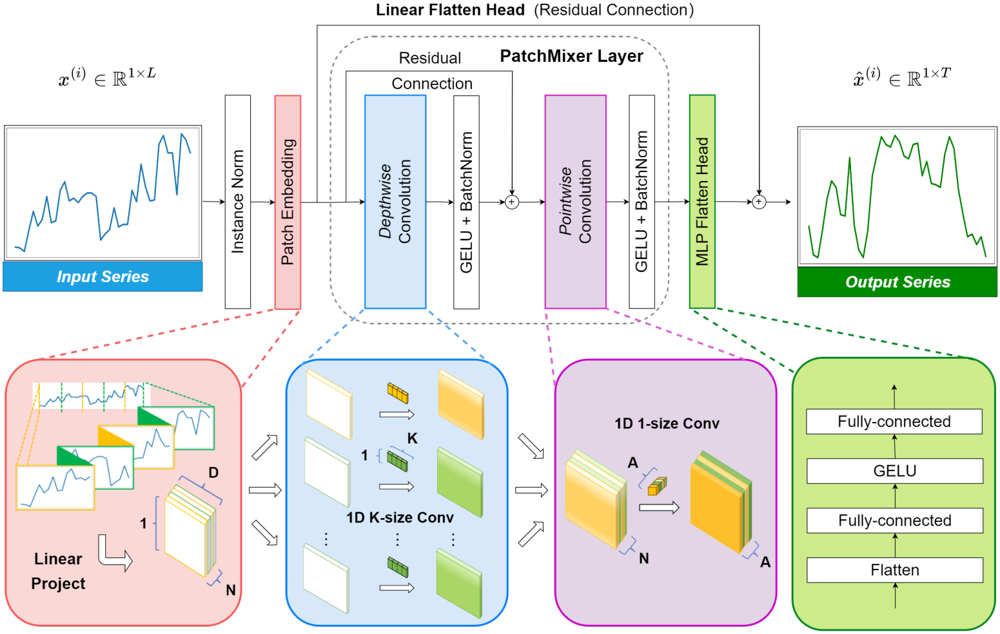
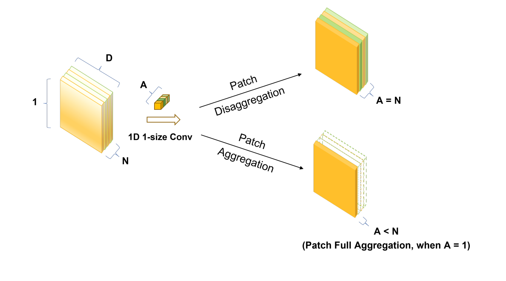
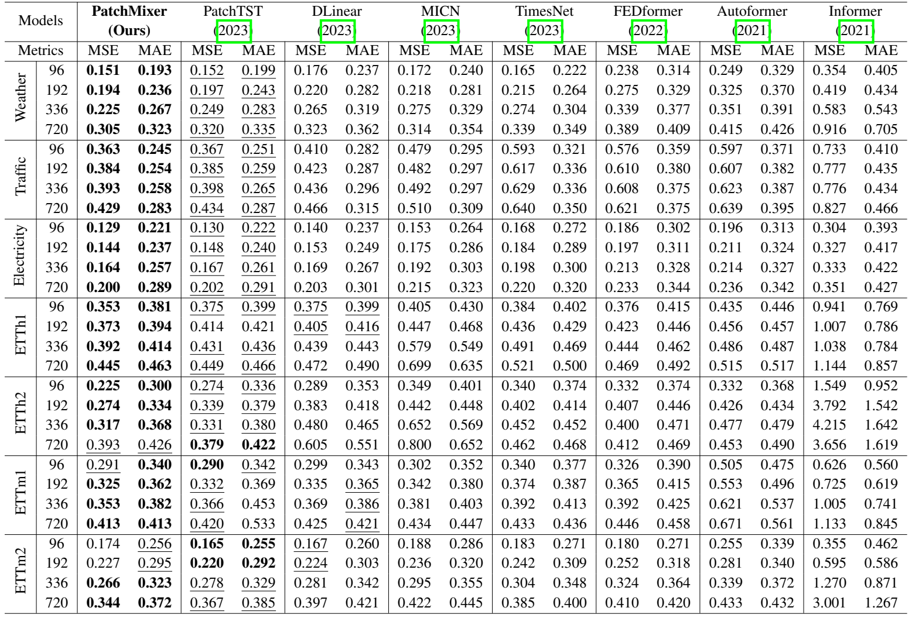
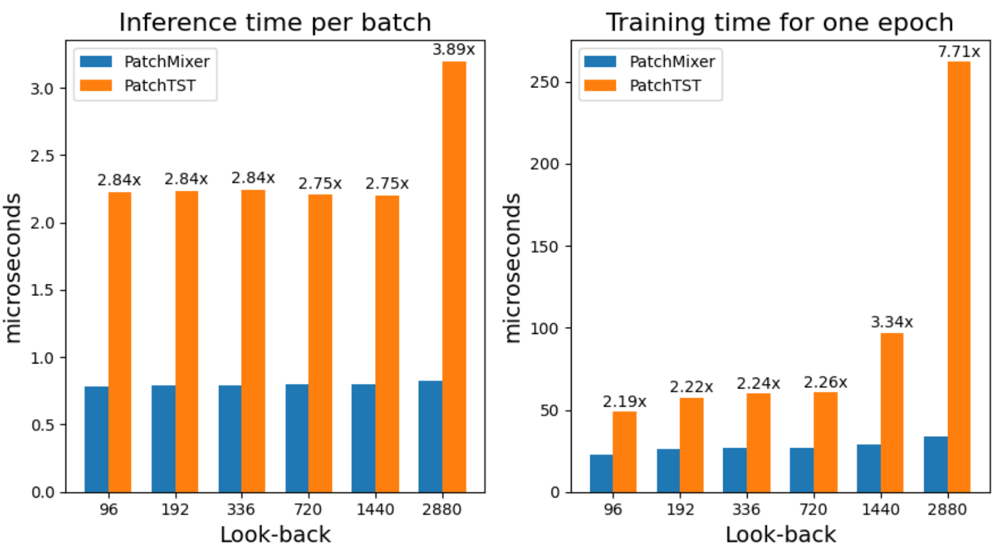
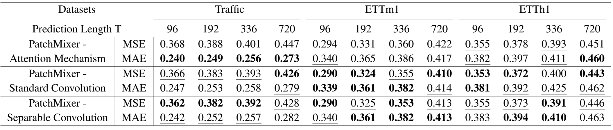
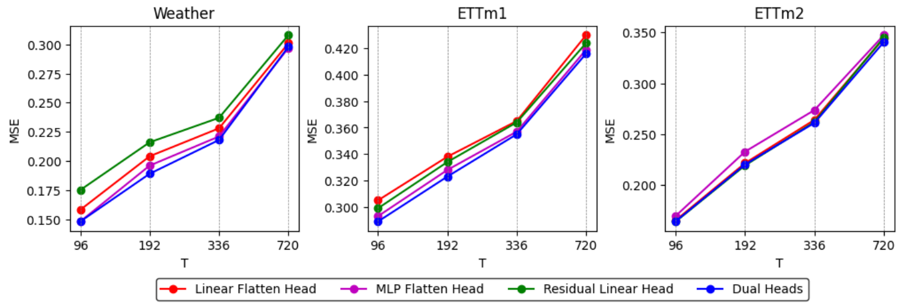
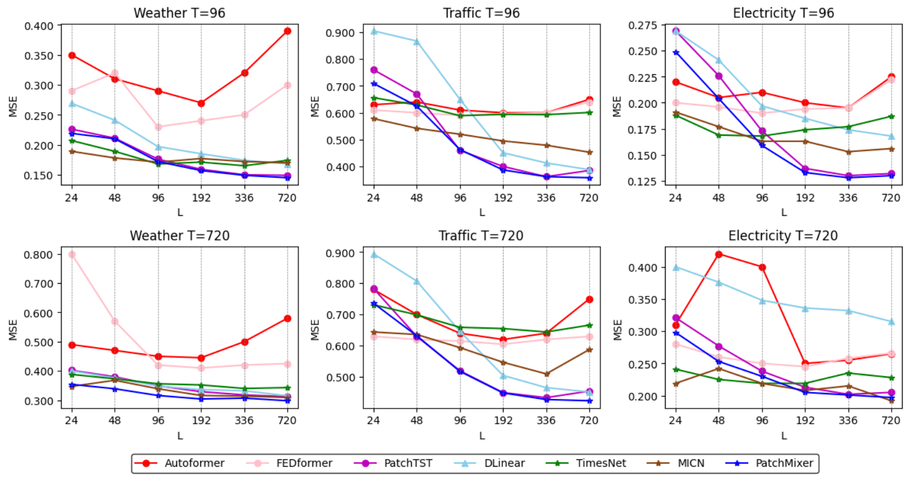

# PatchMixer：一种用于长时间序列预测的Patch混合架构

## 摘要

尽管近年来Transformer已成为时间序列预测任务的主流架构，但一个根本性的挑战仍然存在：Transformer中的排列不变性（permutation invariance）会导致时间信息的损失。为了应对这些挑战，我们提出了基于CNN的新型模型PatchMixer。它引入了排列可变性（permutation variant）卷积结构，以保留时间信息。在这一领域，传统的CNN通常采用多个尺度或多个分支，与之不同的是，我们的方法主要依靠深度可分离卷积。这使我们能够使用单尺度架构提取局部特征和全局相关性。此外，我们还采用了包含线性和非线性成分的双重预测头，以更好的模拟未来曲线趋势和细节。我们在7个时间序列预测基准上的实验结果表明，与最先进的方法和性能最好的CNN相比，PatchMixer分别获得了3.9%和21.2%的相对改进，同时比最先进的方法快2~3倍。我们将开源模型和代码。

## 导言

长时间序列预测是一项重要任务，旨在通过利用大量历史事件序列数据，预测较长时期内的未来趋势。长期时间序列预测的应用领域非常广泛，包括流量估算、能源管理和金融投资。

在过去几年中，Transformer一直是时间序列预测任务中的主流架构。它最初应用于自然语言处理（NLP）领域，后来作为一种通用架构扩展到计算机视觉（CV）等领域。为了解决传统Transformer模型的局限性，如二次时间和内存复杂性，Informer引入了复杂性更低的创新型Transformer架构。

然而，一位专家对Transformer在LTSF任务中的有效性提出了质疑。该项目由简单的多层感知机（MLP）网络构成，令人惊讶的是其性能大大超过了之前所有Transformer模型的预测性能。因此，他们提出了一个耐人寻味的问题：Transformer对长时间序列预测有效吗？针对这一问题，一个基于Transformer的模型PatchTST采用了基于CV中的Patch技术，并取得了最先进的预测结果。最近的Transformer也采用了基于Patch的方法，并取得了值得注意的性能。这就自然引出了另一个重要问题：PatchTST令人印象深刻的性能是否主要源于Transformer的固有功能，还是至少部分归功于使用Patch作为输入表示？

在本文中，我们通过引入一种名为PatchMixer的新型骨干架构来解释这一问题，该架构基于卷积神经网络（CNN）。PatchMixer主要由两个卷积层和两个预测头组成。它的显著特点是 "Patch混合 "设计，即模型首先将输入时间序列分割成较小的Patch，然后整合这些Patch内部和之间的信息。受Transformer中多头注意力机制的启发，我们在模型中采用了双预测头设计。这些改进使PatchMixer超越了其他基于CNN的模型，在时间序列预测方法达到了最先进的精度。

这项工作的主要贡献如下：

- 我们提出了基于卷积架构的新型模型PatchMixer。这种方法有效地取代了Transformer中计算成本高昂的自注意力模型，同时利用新颖的Patch混合设计来揭示时间序列中错综复杂的时间模式。
- PatchMixer在长时间序列预测方面非常有效。通过采用单尺度结构和优化Patch表示，我们的模型实现了显著的性能提升。与SOTA模型相比，推理速度快3倍，训练速度快2倍。
- 在7个常用的长时间序列预测基准中，我们的PatchMixer在MSE和MAE方面比SOTA方法高出3.9%和3.0%。此外，与之前最好的CNN模型相比，MSE平均相对减少了21.2%，MAE减少了12.5%

## 相关工作

**LTSF中的CNN**。CNN和Transformer都是CV领域的主流模型。不过，在LTSF任务中，Transformer占据了主导地位。这主要是由于CNN感受野较小，基于 CNN 的方法通常采用局部视角，通过连续堆叠卷积层将感知领域扩展到整个输入空间。例如，TCN首次将CNN结构引入TSF任务，使用多层因果卷积和扩张卷积来模拟时间因果关系和扩大感受野。随后SCINet利用多层二叉树结构迭代获取不同时间分辨率的信息。最近，MICN采用了多尺度混合分解和等距卷积，从局部和全局两个角度进行特征提取。同时，TimesNet使用快速傅立叶变换（FFT）算法将一维序列转换为二维张量，从而可以使用Inception等视觉骨干来捕捉时间模式。

**深度可分离卷积**。这是一种广泛应用与计算机视觉领域的技术。深度可分离卷积的工作最初是由van Noord在2018年提出。后来，这种方法被用作Inception V1和V2的第一层。在同一时期，谷歌推出了高效的MobileNets。其核心层建立在深度可分离卷积上。Xception网络展示了如何扩展深度可分离卷积。最近，ConvMixer通过该方法提出，Patch表示可能是在CV任务中取得“卓越”性能的关键因素。

**通道独立性**。多变量时间序列可以看作是具有多个信道的信号。当输入tokens将所有时间序列特征的向量投影到embedding空间以混合信息时，就称为“通道混合”。而“通道独立”则恰恰相反。直观地说，变量之间的相关性可能有助于提高预测精度。Zeng等人首次在LTSF领域使用了这一策略，Nie等人进一步验证了其有效性。这两项研究表明，在预测任务中，强调通道独立比通道混合方法更有效。因此，我们采用了通道独立的方法，而不是通道混合设计。此外，在这一概念的推动下，我们探索了每个单变量时间序列的Patch之间和Patch内部的相关性，这与 "Patch混合 "的理念不谋而合。

## 方法的提出

### 问题的提出

在这项工作中，我们要完成以下任务：给定一组具有历史窗口$L$的多变量时间序列实例$(x_1,\cdots.x_L)$，其中时间步长为$t$的每个$x_t$代表$M$个变量的向量。我们的目标是对随后的$T$个时间步进行预测，得出预测序列$(x_{L+1},\cdots,x_{L+T})$。

从通道独立的角度看，多元时间序列$(x_1,\cdots,x_L)$被分隔为$M$个单变量序列$x^{(i)} \in R^{1 \times L}$。我们将长度为$L$的第$i$个单变量序列视为$x_{1:L}^{(i)} = (x_1^{(i)},\cdots,x_{L}^{(i)})$，其中$i = 1,\cdots,M$。这些单变量序列被独立输入模型。在最后，网络提供相应的预测结果$\hat{x}^{(i)} = (\hat{x}_{L+1}^{(i)},\dots,\hat{x}_{L+T}^{(i)}) \in R^{1 \times T}$。

### 模型结构

图1展示了PatchMixer的整体架构。我们采用单尺度深度可分离卷积块来捕捉输入序列中的全局感受野合局部位置特征。我们还设计了双预测头，包括一个线性flatten层和一个MLP层。这些预测头共同结合了非线性和线性特征，对未来序列进行独立建模。随后，双预测头的巨吵结果将被合并，产生最终预测结果，用$\hat{x}$​表示。下文将对这些组件进行详细说明。

<b>图 1 : PatchMixer总览</b> 

### Patch Embedding

**Patch表示的比较**。我们的研究比较了近期LTFS研究中的两种不同的Patch模式。

- Top-K频率：对于一维长度为L的单变量时间序列$X_{1D} \in R^{L}$。这种方法采用FFT算法将原始时间信号转换为频域，并提取前$k$个（top-k）突出频率$\{f_1,\cdots,f_k\}$，其振幅为$\{A_{f_1},\cdots,A_{f_k}\}$，其中$k$为超参数。这一步的目的是再时域中将信号折叠$k$次，每次折叠的周期由相应的频率决定。最后，我们会得到$k$组周期性Patch$X_{2D}$。该过程可概括为以下等式：

$$
A = Amp(FFT(X_{1D})),\ \{f_1, \cdots, f_k\} = \underset{f_{*} \in \{1,\cdots,[\frac{T}{2}]\}}{arg Topk}(A)\\
Period(\hat{X}_{1D}^{(i)}) = \frac{L}{f_i},i\in\{1,\cdots,k\}\\
\hat{X}_{2D}^{(i)} = Reshape(ZeroPad(\hat{X}_{1D}^{(i)})), i\in\{1,\cdots,k\}
$$

- 滑动窗口：这种方法通过一个长度为$P$，步长为$S$的滑动窗口来展开输入的单变量时间序列$X_{1D} \in R^{L}$。在转换之前，它通过重复其最终值$S$次来扩展原始单变量时间序列$X_{1D}$。这一过程会产生一系列二维Patch，并保持其原始的相对位置。以下公司说明了Patch过程：

$$
\hat{X}_{2D} = Unfold（ReplicationPad(\hat{X}_{1D}),size=P,step=S)
$$

比较这两种方法，基于Patch的表示法为我们采用类似于图像处理的方法提供了可能性。这主要归功于维度扩展过程。基于Patch的表示法将连续的时间序列数据分解成较小的结构化片段，类似于图像Patch。向二维格式的扩展引入了空间因素，与图像数据的性质相一致，并使卷积运算成为可能，而卷积运算非常适合捕捉时间序列中的局部模式和全局关系。

值得注意的是，我们注意到第一种方法倾向于优先提取周期性模式，并通过0填充引入冗余。相比之下，第二种方法保留了数据的原始相对顺序，不改变或省略任何元素。因此，我们选择采用后一种方法，并将$P=16$和$S=8$作为默认设置。这种设置会产生一系列Patch。这种配置会产生一系列Patch，每个Patch之间有一半的重叠。

**无位置编码Embedding**。本地位置信息表示时间序列数据的时间顺序，具有重要意义。然而，Transformer架构中的自注意力层无法从本质上保留这种位置信息。为了增强时间序列输入的时间顺序，传统的Transformer模型，如Informer，Autoformer和FEDformer采用三种输入embedding方式。下列公式描述了这一过程，其中TFE表示时间特征编码（例如，分钟（MinuteOfHour）、小时（HourOfDay）、周（DayOfWeek）、月（DayOfMonth）和年（MonthOfYear）），PE表示位置嵌入，VE表示值嵌入。
$$
Embedding(X) = sum(TFE + PE + VE):x^{L} \rightarrow x^{D}
$$
最近出现的Transformer（如PatchTST）将Patch作为一个输入单元，从而消除了对时间特征编码的需求。取而代之的是，它们专注于捕捉点级别不易获得的综合语义信息。这是通过将时间步聚合到子序列级Patch来实现的。
$$
Embedding(X) = sum(PE + VE):x^{N \times S} \rightarrow x^{N \times D}
$$
与Transformer不同的是，CNN结构本身具有排列变换性，因此在我们的模型中无需使用位置Embedding。最终，我们的Embedding可以用下面的公式表示，只需一个线性层即可完成。
$$
Embedding(X) = VE:x^{N \times S} \rightarrow x^{N \times D}
$$

### PatchMixer层

如第2节所述，以往LTSF中的CNN通常是对时间序列数据中跨越多个尺度或众多分支的全局关系进行建模。相比之下，我们的Patchmixer采用单尺度深度可分离卷积作为核心模块。Patch混合设计将深度卷积的每个位置（Patch内）操作和点卷积（pointwise convolution）的跨位置（Patch间）操作分开，这使我们的模型能够捕捉输入序列中的全局感受野和局部位置特征。

**深度卷积**。我们使用一种特定类型的分组卷积，其中分组的数量等于Patch的数量，用$N$表示。为了扩大感受野，我们采用了更大的kernel大小，通常等于默认的Patch步长$S$，即：$K=8$。在此过程中，输入特征图中的$N$个Patch中的每一个都要与一个kerner进行单独的卷积。这一操作会生成$N$个特征图，每个特征图对应一个特定的Patch。然后将这些特征图依次串联起来，生成一个具有$N$个通道的输出特征图。深度卷积有效地使用了分组卷积核，这些核对于共享相同空间位置的Patch是相同的。这样模型就能捕捉到时间Patch中潜在的周期性模式。下面的公式展示了$l$层的单变量序列$X^{N \times D}$经过$l-1$层深度卷积核的过程。
$$
x^{N \times D}_{i} = BatchNorm(\sigma\{Conv_{N \rightarrow N}(x^{N \times D}_{i-1},stride=K,kernel\_size=K)\}
$$
**点状卷积**。我们的深度卷积操作可能无法有效捕捉Patch间的特征相关性，因此我们在深度卷积操作后进行点卷积。通过这一层，我们实现了Patch之间的时间关联。
$$
x_{l}^{N \times D} = BatchNorm(\sigma\{ConvDepthwise(x^{N \times D}_{l-1})\}) + x_{l-1}^{N \times D}\\
x_{l+1}^{A \times D} = BatchNorm(\sigma\{Conv_{N-A}(x_{l}^{N \times D},stride=1,kernel\_szie=1)\})
$$
上述公式展示了第$l$层的单变量序列$x^{N \times D}$通过第$l+1$层点卷积核的过程，其中$A$表示点卷积的输出通道数。在每个卷积操作后，我们都要应用激活函数和激活后BatchNorm。在这种情况下，$\sigma$表示元素非线性激活函数。在我们的工作中采用了GELU激活函数。

我们证明了可分离卷积法的有效性，它超越了注意力机制，与传统卷积法相比，整体性能更优越。实验详情见第4.2节。此外，如图2所示，点卷积允许我们通过调整输出通道A的数量来控制Patch间的信息聚合程度。我们将在附录 5 中进一步深入探讨这一特性。

<b>图 2 : 通过点卷积进行Patch聚合和Patch分解</b> 

### 双预测头

以往的LTSF方法通常采用分解输入的模式，例如采用季节趋势分解技术，并将分解后的成分进行组合，以获得预测结果。同样，Transformer中的多头注意力机制也涉及分解和汇总多个输出。

受上述实例的启发，我们提出了一种基于分解-聚合概念的新型双头机制，一个专门用于捕捉线性特征，另一个则专注于捕捉非线性变化。具体来说，PatchMixer通过跨卷积的线性残差连接来提取变化的整体趋势，并在卷积层后使用MLP预测头，用非线性函数细致地拟合预测曲线中的微小变化。最后，我们可以通过将各自的输出相加得出预测结果。与直接使用以前的单一线性层相比，使用双预测头能产生更有效的映射效果。我们在第4.2节中确认，这两个预测头对于准确预测都是不可或缺的。

### 归一化和损失计算

**实例归一化**。这种技术最近被提出来帮助减轻训练数据和测试数据之间的分布偏移效应。它简单地将每个时间序列实例$x^{(i)}$归一化为零均值和标准单位差。实质上，我们在Patch之前对每个$x^{(i)}$进行归一化处理，并在双预测头之后将均值和偏差加回输出。

**损失函数**。在这里，我们将平均平方误差（MSE）和平均绝对误差（MAE）以1:1的比例结合起来，作为我们的损失函数。出乎意料的是，我们发现这种简单的方法在整体上实现了较高的精度，在实现较低的MSE和MAE之间取得了平衡。实验细节见附录A.2。

MSE损失为：
$$
L_{MSE} =\frac{1}{M}\sum^{M}_{i=1}||\hat{x}^{(i)}_{L+1:L+T} - x^{(i)}_{L+1:L+T}||^2_2
$$
MAE损失为：
$$
L_{MAE} = \frac{1}{M}\sum^M_{i=1}||\hat{x}_{L+1:L+T}^{(i)}-x^{(i)}_{L+1:L+T}||
$$

## 实验

### 多元长序列预测

**数据集**。我们在7个常用的长期预测基准数据集上评估了PatchMixer的性能：天气、交通、电力和4个ETT数据集（ETTh1、ETTh2、ETTm1、ETTm2）。这些数据集的统计摘要见附录A1.1.需要指出的是，ETTh1和ETTh2属于小型数据集，而ETTm1、ETTm2和天气属于中型数据集。交通和电力分别有800多个和300多个变量，每个变量包含数万个时间点，属于大型数据集。一般来说，较小的数据集包含更多噪音，而较大的数据集则表现出更稳定的数据分布。

**基线和衡量标准**。我们选择SOTA和具有代表性的 LTSF 模型作为基线，其中包括PatchTST、FEDformer、Autoformer、Informer等基于Transformer的模型，以及包含MICN和TimesNet的两个基于CNN的模型，还有重要的基于MLP的模型DLinear作为基线。为了评估这些模型的性能，我们采用了广泛使用的评估指标：MSE和MAE。附录A.1.2介绍了每种基线的详细信息。

**结果**。表1展示了多元长时间序列预测结果。在包括交通、电力和天气在内的所有大型数据集基准中，我们的模型都明显优于所有基准方法。从数值上看，与最先进的Tranformer（PatchTST）相比，PatchMixer的MSE和MAE分别降低了3.9%和3.0%。在与表现最好的基于MLP的模型（DLinear）进行评估时，我们的模型在MSE和MAE方面分别整体下降了11.6%和9.4%。此外，与基于CNN的最佳模型（TimesNet）相比，我们的模型在MSE和MAE上分别降低了21.2%的MSE和 12.5%的MAE。

<b>表 1 : 使用我们的模型PatchMixer进行多变量长期预测的结果。所有数据集的预测长度T->{96,192,336,720}。最佳结果以粗体表示，次佳结果以下划线表示</b> 

### 消融实验

**训练和推理效率**。如图3所示，我们的目标是证明PatchMixer与PatchTST相比，在训练和推理时间上具有更高的效率。我们使用PatchTST的数据加载器和ETTm1数据集进行了实验，batch size为8，因此每批数据维度为$8 \times 7 \times L$​。我们展示了每个batch的推理时间和每个epoch的训练时间，同时回视窗口从96到2880不等。

<b>图 3:训练和推理时间比较：PatchMixer与PatchTST比较</b> 

我们的研究结果凸显了两项关键改进。首先，与PatchTST相比，PatchMixer的推理速度提高了3倍，训练速度提高了2倍。其次，PatchTST的性能对回视窗口的长度非常敏感。尤其是当回视窗口长度达到或超过1440时。相比之下，PatchMixer的推理和训练时间随着历史长度的增加波动较小，从而提高了准确性和计算效率。本小节中的所有实验都在同一台机器上进行，使用的是单GPU RTX4090，以获得一致可靠的结果。

**深度可分离卷积与自注意力模块、标准卷积的对比**。为了评估深度可分离卷积的效果，我们将PatchMixer中的模块分别替换为PatchTST和标准卷积的Transformer Encoder。两者各使用一层，配置相同。

结果如表2所示，这意味着卷积层在大多数情况下都优于注意力层。深度可分离卷积的结果与标准卷积接近，而标准卷积主要在中小型数据集上取得最佳结果。相比之下，可分离卷积的卓越预测性能则均匀地分布在各种规模的数据集上。

<b>表 2 : Traffoc、ETTm1和ETTm2数据集中深度可分离卷积的消融实验。我们在PatchTST中使用Transformer Encoder替换了卷积模块。最好的结果以粗体标出，次好的结果以下划线标出。</b> 

**双预测头**。我们使用单一线性Flatten头作为基准。从图4中可以明显看出，双预测头机制优于所有其他结果，至少可与双预测头设置中的一个输出头相媲美。与单层输出头相比，这一结果凸显了双预测头机制的有效性。

<b>图 4 : 双预测头消融实验。我们在3个数据集Weather、ETTm1和ETTm2中使用了预测长度T->{96，192,336,720}</b> 

**不同的回视窗口**。原则上，大的感受野有利于提高性能，而在时间序列分析中，回视窗口的感受野也很重要。一般来说，具有强大时空关系提取能力的LTSF模型应该能够在较长的输入历史序列中取得更好的结果。然而，正如Zeng等人所指出的，大多数基于Transformer的模型都没有观察到这一现象。我们还在图5中证明，在大多数情况下除了PatchTST之外，这些基于Transformer的基线并没有从更长的回视窗口$L$中获益，这表明它们在捕捉长时间信息方面效果不佳。相比之下，PatchTST、DLinear和我们的PatchMixer等最新基线则随着感受野的增加而持续降低MSE分数，这证明我们的模型有能力从更长的回视窗口中学习。

<b>图 5 : 在3个最大数据集上使用不同回视窗口的预测性能（MSE）：Traffic、Electricity、Weather。回视窗口选择：L=24、48、96、192、336、720，预测长度为T=96、720。本实验使用我们的PatchMixer和基线。</b> 

## 结论和未来工作

在本文中，我们介绍了PatchMixer，这是一种基于CNN的用于长时间序列预测的新型模型。PatchMixer利用深度可分离卷积核创新的Patch混合设计，在没有自注意力机制的情况下有效捕捉全局和局部时间模式。我们还强调了通过双预测头分别对线性和非线性成分进行建模的重要性，从而进一步增强了模型的预测能力。我们的实验表明，PatchMixer在预测准确性方面优于最先进的方法，同时在推理和训练方面都明显更快。

虽然我们的模型取得了可喜的成果，但仍然有改进的余地，尤其是再整合外部时间特征方面。长时间序列预测通常依赖于节假日、天气状况或经济指标等外部因素。由于基于Patch的操作本身具有局部性，因此将这些特征有效纳入基于Patch的模型是一项挑战。这些模型往往关注单个时间点，而不是更广泛的时间段。我们衷心希望在这一方向上的进一步研究能带来更强大的预测解决方案。
