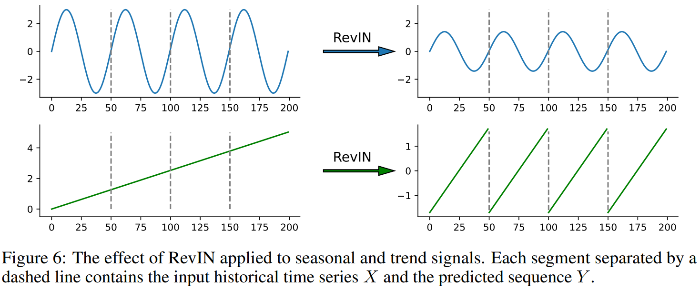
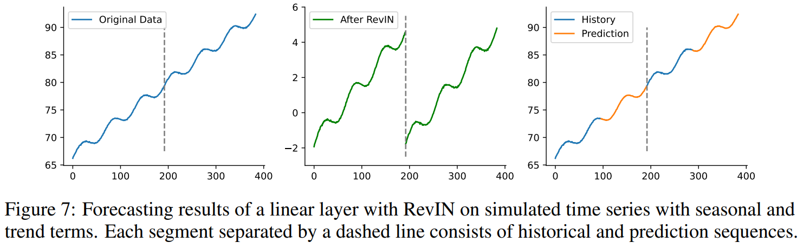

# 重新审视长时间序列预测：关于线性映射的调查

## 摘要

近年来，长时间序列预测得到了极大的关注。虽然有各种专门的设计来捕捉时间依耐性，但以前的研究表明，与其他复杂的架构相比，单一的线性层可以实现有竞争力的预测性能。在本文中，我们彻底调查了最近提出的方法内在的有效性，并提出了3个关键意见：1）==线性映射对于之前的长期时间序列预测工作至关重要==；2）==RevIN（可逆归一化）和CI（通道独立）在提高整体预测性能方面发挥了重要作用==；3）==线性映射能够有效捕捉时间序列中的周期特征，并且在增加输入时间序列长度时对不同通道的不同周期具有鲁棒性==。我们提供了理论和实验的解释来支持我们的发现，也讨论了局限性和未来的工作。

## 引言

近年来，时间序列预测由于其在各个领域的适用性而变得越来越流行，如电力预测、天气预报和交流流量估计。随着计算资源、数据量和模型架构的进步，深度学习技术，如基于RNN的模型和基于CNN的模型，在精度和稳健性方面已经超过了传统的统计方法。

最近，人们对使用基于变换器的方法来捕捉时间序列预测中的长期时间相关性越来越感兴趣。这些方法通过各种注意力机制和非回归生成技术表现出了很好的效果。然而，最近的一项工作（DLinear）表明，这些基于Transformer的方法可能并不像以前认为的那样有效，并发现他们报告的预测结果与自回归生成相比可能主要依赖于单通道预测。相反，只使用单一线性层的DLinear出人意料地以很大的优势超过了现有的复制架构。在这项工作的基础上，随后的方法摒弃了编码-解码器架构，专注与开发时间特征提取器，并对历史输入和预测之间的映射进行建模。虽然这些方法取得了更好的预测性能，但它们仍然没有明显优于线性模型。此外，它们往往需要大量可调整的超参数和特定的训练技巧，如归一化和特定的通道处理，这可能会潜在地影响比较的公平性。基于这些观察，我们提出以下问题：（1）时间特征提取器对长时间序列预测是否有效？（2）解释线性映射在时间序列预测中的有效性的基本机制是什么？（3）线性模型的局限性是什么，我们怎样才能改进它们？

在下面的章节中，介绍了问题的定义和实验设置之后，我们对最近的时间序列预测模型的内部工作机制进行了深入的实验和分析，目的是通过大量的时间和理论分析来回答上述问题。本文的主要贡献在于：
 - 我们研究了近期时间序列预测模型中不同成分的功效，返现线性映射对其预测性能至关重要，如第3节所示
 - 我们用理论和实验证据证明了线性映射在长期时间序列预测任务中学习周期性的有效性，并提出了简单而有效的基线，以便在未来进行更公平的比较（如表3所示）
 - 我们研究了在处理具有不同通道的多变量时间序列时线性映射的局限性，并分析了输入水平和一种称为通道独立的补救技术的影响，如图10和11所示。

## 问题定义和实验设置

**问题的定义**。给定一个历史时间序列$X = [x_1,x_2,\cdots,x_n] \in R^{c \times n}$，有$c$个通道和$n$个时间步骤，预测任务旨在预测未来$m$个时间步骤$Y = [x_{n+1}, x_{n+2},...,x_{n+m}] \in R^{c \times m}$其中m表示预测范围。我们需要学习一个映射$F:X^{c \times n} \mapsto Y^{c \times n}$，其中X和Y在原始时间序列数据中是连续的。

实验设置。我们的实验是在模拟时间序列和六个公开的真实数据集上进行的：（1）ETTH，有4个不同粒度的数据集，记录了6个电力负荷特征和电力变压器的油温；（2）Weather包含2020年美国近1600个地点的21个气象指标；（3）ECL记录了2012年至2014年321个客户的每小时用电量。为了进行公平的比较，我们遵循相同的评估协议，将所有数据集分为训练集、验证集和测试集。我们提出的基线使用L2损失和Adam优化器进行训练。训练过程在20个epochs内提前停止。MSE和MAE被作为评价指标进行比较。R-squared得分被用于实证研究，因为它可以消除数据规模的影响。所有的模型都在Pytorch中实现，并在单个Nvidia V100 32GB GPU上进行了三次测试。

## 时间特征提取器是否有效？

**一般框架**。图1说明了最近的工作对时间序列预测的一般框架，包括3个核心部分：RevIN，一个可逆的归一化层；一个周期敏感的特征提取器，如注意力、MLP或卷积层；以及一个预测最终结果的线性投影层。鉴于超参数调整和各种训练技巧对比较公平性的潜在影响，我们首先考察了不同时间特征提取器的有效性。在不丧失一般性的前提下，我们精心挑选了四个值得注意的最优模型：PatchTST（Attend）、MTS-Mixers（MLP）、TimesNet和SCINet（Conv）。所有这些方法都遵循这个共同的框架和正如他们所宣称的那样，已经取得了最先进的预测性能，考虑到他们报告的预测精度并不明显优于单一的线性层，我们使用ETT基准进行了新的实验，以检查每个部分在他们中的贡献。

图二显示了不同模型在ETTh1不同预测长度上的预测性能。基线“RLinear”指的是带有RevIN的线性投影层。固定随机提取器（fixed random extractor）是指我们只随机初始化时间特征提取器，在训练阶段不更新其参数。值得注意的是，RevIN明显提高了这些方法的预测精度。因此，将一种方法与其他不使用RevIN的方法进行比较，可能会因为其优势而导致不公平的结果。在RevIN的帮助下，即使是一个简单的线性层也能超过目前最先进的基线PatchTST。

值得注意的是，我们的发现表明，即使使用随机初始化的时间特征提取器，并使用未经训练的参数，也能引起有竞争力的、甚至更好的预测结果。有必要考虑这些特征提取器从时间序列数据中学到了什么。图3说明了最后的线性投影层和不同的时间特征提取器的权重。有趣的是，当时间特征提取器是MLP时，MLP和投影层都学到了混乱的权重，而两者的乘积与从单一线性层学到的权重保持一致。另一方面，当时间特征提取器是Attention时。它也会学到混乱的权重，但投影层学到的权重与单一线性层的权重相似，意味着线性投影在时间序列中的重要性。

为了减轻任何潜在的特定数据集偏差，我们在完整的ETT基准上进行了更多的实验，使用相同的比较协议。表1展示了RLinear和选定模型的预测结果。有趣的是，与精心设计的方法相比，简单的基线RLinear在大多数情况下具有可比性甚至更好的性能。有时，这些使用时间特征提取器的精致模型甚至比未经训练的原型表现更差。值得注意的是，使用固定的随机时间特征提取器的模型通常表现出类似的预测性能，并接近单一线性层。这些耐人寻味的观察促使我们质疑时间特征提取器是否有必要，以及为什么线性映射在长期时间序列预测中如此有效。

## 关于线性映射的理论和实证研究

### 预测中线性映射的作用

线性映射学习周期性。考虑一个单一的线性层为：
$$
Y = XW + b
$$
其中$W \in R^{n \times m}$是权重，也被称为过渡矩阵，$b \in R^{1 \times m}$是偏置。

**假设1.**一般的时间序列$x(t)$可以被分解为季节性部分$s(t)$和趋势部分$f(t)$，并带有可容忍的噪声，表示为$x(t) = s(t) + f(t) + \epsilon$。

许多方法已经被开发出来，将时间序列分解为季节性和趋势项，利用神经网络来捕捉周期性和补充趋势预测。然而，值得注意的是，单个线性层也可以有效地学习周期性模式。

**定义1.**给定一个满足$x(t) = s(t) = s(t-p)$的季节性时间序列，其中$p \leq n$为周期，线性模型总是存在一个分析解为：
$$
[x_1,x_2,\cdots,x_n] \cdot W + b = [x_{n+1},x_{n+2},\cdots,x_{n+ m}],\\
\ \\
W_{ij}^{(k)}=
\begin{cases}
1,\ \ \ if i = n - kp + (j \ mod\ p)\\
\ \ \ \ \ \ \ \ \  \ \ \ \ \ \ \ \ \ \ \ \ \ \ \ \ \ \ \ \ \ \ \ \ \ \ \ \ \ \ \ \ \ \ \ \ \ \ \ \ \ \ 1 \leq k \in Z \leq \lfloor n/p \rfloor,b_i = \sum^{k-1}_{l = 0}a^l \cdot c.\\
0, \ \ \ otherwise\\
\end{cases}
$$
上述方程表明，当输入历史序列的长度不小于周期时，线性映射可以预测周期性信号，当这并不是唯一的解。由于$s(t)$中的每个时间戳对应的值几乎不可能是线性独立的，所以w的参数解空间很广泛。特别是，当$n \gg p$时，有可能对$W^{(k)}$的更多潜在值以不同的系数$k$获得闭式解。带有适当比例系数的$[W^{(1)},\cdots,W^{(k)}]$的线性组合也满足上述方程的解。

**推论1.1**当给定的时间序列满足$x(t) = ax(t-p)+c$其中$a,c$是缩放和平移因子，线性模型对方程2仍有一个闭式解，即：
$$
W_{ij}^{(k)}=
\begin{cases}
a^k,\ \ \ if i = n - kp + (j \ mod\ p)\\
\ \ \ \ \ \ \ \ \  \ \ \ \ \ \ \ \ \ \ \ \ \ \ \ \ \ \ \ \ \ \ \ \ \ \ \ \ \ \ \ \ \ \ \ \ \ \ \ \ \ \ 1 \leq k \in Z \leq \lfloor n/p \rfloor,b_i = \sum^{k-1}_{l = 0}a^l \cdot c.\\
0, \ \ \ otherwise\\
\end{cases}
$$
现在我们知道，一个单一的线性层可以有效地捕捉时间序列中的周期性。图3中可视化的权重也支持我们的观点，从输入到输出的过渡矩阵显示出明显的周期性（每期24个时间步长）。然而，在实践中，时间序列通常遵循假设1，所以趋势项可能会影响线性模型的学习。图4说明了线性层对模拟的季节性和趋势性信号的预测结果，包括正弦波、线性函数和它们的总和。正如预期的那样，线性模型对季节性的拟合很好，但对趋势的表现很差，不管它算法有偏置项。Chen等人也研究了类似的问题，并提供了线性模型在预测具有季节性和趋势成分的时间序列时的性能上限。在他们的工作基础上，我们调整了他们的结论，并得出了以下定理。

**定理2.**设$x(t) = s(t) + f(t)$，其中$s(t)$是一个周期为$p$的季节性信号，$f(t)$满足K-Lipschitz连续。那么，存在一个如方程2的线性模型，输入长度$n = p + \tau,\tau \geq 0$这样$|x(x + j) - \hat{x}(n + j)| \leq K(p + j),j = 1,...,m$

**证明.**为了简化证明过程，我们假设历史数据的时间戳是1到$n$，那么对于要预测的第$j$个真实值$x(n + j)$，我们有：
$$
x(n + j) = x(p + \tau + j) = s(\tau + j) + f(p + \tau + j)
$$

假设线性模型只能学习周期性模式，我们可以直接使用方程3作为近似解，其中我们选择$k = 1$。因此，对$x(n + j)$的预测是：
$$
\hat{x}(n + j) = XW+b =x(n - p + (j\ mod\ p)) = s(\tau + j) + f(\tau + (j\ mod\ p))
$$

利用K-Lipschitz连续的特性，我们可以得到
$$
\begin{align*}
|x(n + j) - \hat{x}(n + j)| &= |f(p + \tau + j) - f(\tau + (j \ mod \ p))|\\
& \leq K|p + j - (j\ mod\ p)|\\
& \leq K(p + j)
\end{align*}
$$

虽然线性模型对趋势项的预测误差是有限制的，但随着时间戳的积累或趋势项变得更加显著，它仍然会影响预测结果。这有可能是线性模型在趋势预测中容易表现不佳的原因。

### 解除纠缠和归一化

**分离中的问题**。如果趋势项可以被消除或季节项分离，预测性能可以得到改善。以前的工作着重于将时间序列分解为季节性和趋势性部分，以单独预测它们。一般来说，他们利用由平均池层实现的移动平均，通过适当大小的滑动窗口，从输入的时间序列中获得趋势信息。然后，他们从原始数据中减去趋势项得到的周期性信号中识别季节性特征。然而，正如文献中所说，这些方法有一些问题。首先，滑动窗口的大小应大于季节性部分的最大周期，否则解耦将是不充分的。其次，由于使用了平均池化层，对齐需要在输入时间序列的两端进行填充，这不可避免地会使序列的头部和尾部发生扭曲。此外，即使信号被完全分解，或者它们只有趋势项，趋势项的欠拟合问题仍然存在。因此，虽然解耦可能会提高预测性能，但他与最近的一些先进模型仍有差距。

**把趋势变成季节性。**脱离的关键是将移动平均数从原始时间序列中减去，这与归一化有关。Kim等人认识到，由于分布偏移问题，时间序列的一些统计信息，如均值和方差，会随着时间的推移而不断变化。为了解决这一难题，他们开发了RevIN，这种方法首先对输入的历史时间序列进行归一化，并将其送入预测模块，然后再对预测结果进行去归一化。以前的工作证实RevIN在关节分布偏移方面的效果比归一化更有效。然而，时间序列中的数值范围和大小在现实世界的场景中也是有意义的。直接对输入数据进行归一化可能会抹去这些统计信息，导致预测结果不佳。图5说明了使用不同归一化方法对具有两个通道的模拟趋势信号的预测结果。仅仅使用线性层来拟合趋势变化是具有挑战性的。应用批量归一化甚至会诱发更差的结果，而层归一化会导致接近零的无意义预测。解除模拟时间序列的束缚也不起作用。然而，在RevIN的帮助下，单个线性层可以准确预测趋势项。

可逆归一化的核心在于可逆性。它消除了由时刻统计引起的趋势变化，同时保留了可用于恢复最终预测结果的统计信息。图6说明了RevIN是如何影响季节性和趋势项的。对于季节性信号，RevIN缩放了范围，但不改变周期性。对于趋势信号来说，RevIN将每个区段扩展到相同的范围，并表现出周期性模式。RevIN能够将一些趋势变成季节性，使模型更好地学习或记忆趋势条款。图7展示了带有RevIN的线性模型对带有季节性和趋势项的模拟时间序列的预测结果。RevIN将连续变化的趋势转换为具有固定和类似趋势的多个分段，显示出周期性特征。因此，由过去累积的时间段引起的趋势预测误差可以得到缓解，导致更准确的预测结果。

## 实验评估

在这一节中，我们首先评估了不同模型在真实世界数据集上的表现，然后考察了各种渠道之间的多时段情景。

### 在真实数据集上的比较

表2提供了这六个真实数据集的统计信息。我们使用三个最新的竞争基线进行实验：PatchTST、TimesNet和DLinear。鉴于RevIN极大地提高了预测性能，我们增加两个简单的极限，即RLinear和具有两个线性层和ReLU激活的RMLP，以进行更公平的比较。表3提供了所有基准的预测结果概览。

然而，这些精心设计的模型并不比我们提出的两个简单的基线更好。这些模型的成功可能是由于通过线性映射学习周期性和可逆归一化的效率。有趣的是，我们注意到，在具有大量通道的数据集上，如天气和ECL，RLinear的表现并不明显优于复杂的模型，这一点将在下一节研究。

### 当线性遇到通道间多周期时

尽管线性映射能够学习时间序列中的周期性，但在处理多通道数据集时，它面临挑战。为了解决这个问题，一个可能的解决方案是使用通道独立（CI）建模，它独立处理时间序列中的每个通道。虽然这种方法可以提高预测精度，但它也大大增加了计算开销。图8显示了不同模型应用于具有3个不同周期通道的模拟时间序列的预测结果。可以看出RLinear-CI和RMLP能够拟合曲线，而RLenar则失败。这表明，单一的线性层可能难以学习通道内的不同周期。非线性单元或CI建模可能有助于提高具有不同周期通道的多变量时间序列模型的稳健性。表4提供了对使用CI的RLinear的天气和ECL的预测结果，它取得了与RMLP相当的性能，证实了单一线性层可能容易受到渠道中不同时期的影响。

为了进一步研究线性映射对多变量时间序列的影响，我们使用一系列角频率在1/30到1/3之间、长度为3000的正弦波进行模拟。图10展示了不同设置下的预测结果。我们的发现表明，线性模型在具有两个通道的时间序列上始终表现良好，无论周期性的差异是小是大。然而，随着不同周期的通道数量增加，线性模型的表现逐渐变差，而非线性单元的模型或CI继续表现良好。此外，增加输入范围可以有效缓解线性模型在多渠道数据集上的预测性能。这些观察结果表明，现有模型可能侧重于学习季节性，而多变量时间序列中不同渠道之间的周期性差异是制约预测性能的关键因素。定理3对线性模型在预测多变量时间序列中的作用做了解释。

**定理3.**，$X = [s_1,s_2,\cdots,s_c]^T \in R^{c \times n}$是输入的历史多变量时间序列，有c个通道，长度为n。如果每个信号$s_i$有相应的周期$p_i$，一定有一个线性模型$Y = XW + b$，当$n \gg lcm(p_1,p_2,...,p_c)$

如图11所示，增加输入跨度可以使预测性能得到明显改善。这是因为较长的输入跨度覆盖了更多的潜在时期，使线性模型和非线性单元的模型之间的性能差距最小化。然而，值得注意的是，当输入水平线较长时，RLinear-CI和RMLP在ETTh1数据集上的表现较差，这可能是由于这个特定数据集的容量较小。此外，应该注意的是，通过增加输入窗口实现的性能改善有一个上限。这个限制可能高度依赖于数据集中存在的周期性模式。

## 总结

本文系统地研究了线性映射在长期时间序列预测中的作用，有以下重要启示：（1）线性映射对周期的长期时间序列预测方法至关重要，它们通常容易学习类似的仿射变换，即从输入历史观测到输出预测中对应特定的周期模式；（2）RevIN（可逆归一化）和CI（独立通道）通过简化对周期性的学习来提高整体预测性能；（3）当输入范围增加时，线性映射对具有不同周期通道的多变量时间序列具有鲁棒性，而它可能引起短周期特征的欠拟合。我们提供了理论上的解释，并在模拟和现实世界的数据集上进行了广泛的实验，以支持我们的发现

**限制和未来的工作**。长期的时间序列基准往往显示出一致的季节性模式。为了提高模型的概况能力，值得研究它在季节性变化时的表现。探索我们的理论对其他任务的适用性也很有价值，比如短期时间序列预测。我们承认，这些探索将留给未来的工作。