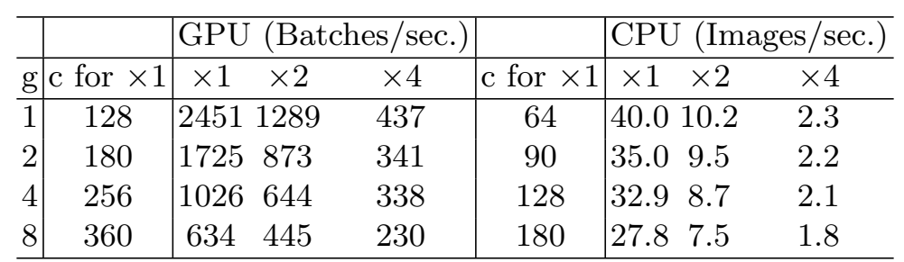
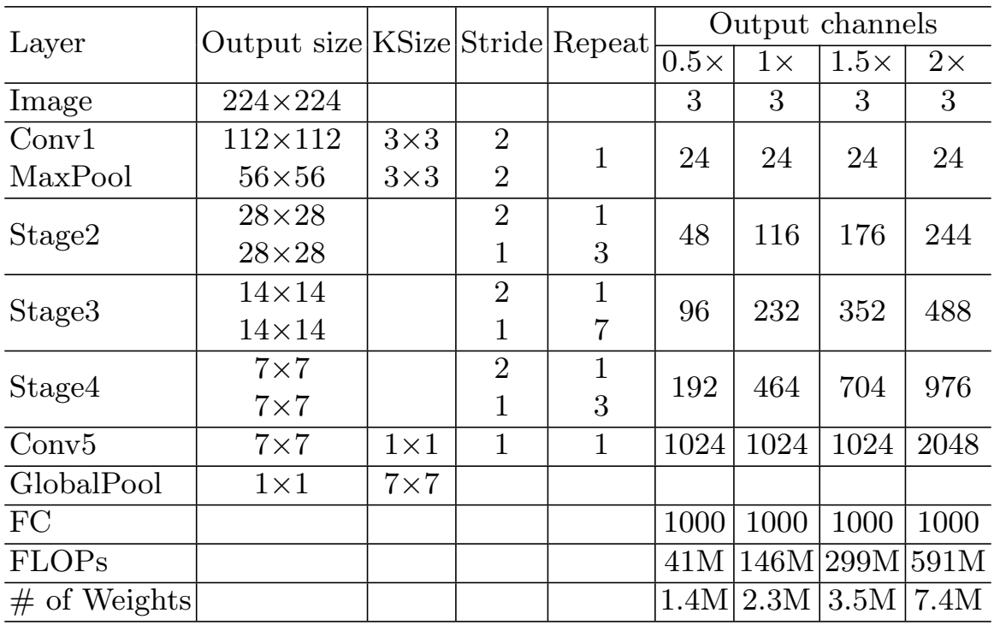

# ShuffleNet V2：高效CNN架构设计实用指南

## 摘要

目前，神经网络架构设计主要以计算复杂度的间接指标（即 FLOPs）为指导。然而，直接指标（如速度）还取决于其他因素，如内存访问成本和平台特性。因此，这项工作建议在目标平台上评估直接指标，而不仅仅考虑 FLOPs。在一系列受控实验的基础上，本研究为高效网络设计提供了若干实用指南。因此，本文提出了一种新架构，称为ShuffleNet V2。全面的消融实验验证了我们的模型在速度和准确性的权衡方面是最先进的。

## 引言

深度卷积网络（CNNs）架构经过多年发展，变得越来越精确和快速。自AlexNet这一里程碑式的研究成果问世以来，通过新颖的结构，包括VGG、GoogLeNet、ResNet、DenseNet、ResNeXt、SE-Net，以及自动网络架构搜索等等。

除了精度，计算复杂度也是另一个重要的考虑因素。现实世界中的任务通常是在目标平台（如硬件）和应用场景（如要求低延迟的自动驾驶）给出的有限计算预算下获得最佳精度。这就促使一系列工作朝着轻量级架构设计和更好的速度-精度权衡方向发展，其中包括Xception、MobileNet、MobileNet V2、ShuffleNet和CondenseNet等等。在这些工作中，分组卷积和深度卷积至关重要。

图1：四种网络架构在两种不同计算复杂度的硬件平台上的准确度（验证集上的ImageNet分类）、速度和FLOPs的测量结果。(a)、(c)是GPU上batch size为8的结果。(b)、(d)是ARM上batch size为1的结果。在所有情况下，性能最好的算法，即我们提出的ShuffleNet V2，都位于右上角区域。

要衡量计算复杂度，一个广泛使用的指标是浮点运算次数FLOPs。然而，FLOPs是一个间接指标。它是速度或延迟等指标的近似值，但通常并不等同与我们真正关心的指标。这种差异已被注意到。在以前的工作中。例如，MobileNet V2比NASNET-A快得多，但它们的FLOPs却不相上下。图1进一步说明了这一现象，表明具有相似FLOPs的网络具有不同的速度。因此，将FLOPs作为计算复杂度的唯一指标是不够的，可能会导致次优设计。

间接指标（FLOPs）和直接指标（速度）之间的差异主要有两个原因。首先，FLOPs没有考虑对速度有重大影响的几个重要因素。其中一个因素是内存访问成本（MAC）。在某些操作（如分组卷积）中，这种成本占运行时间的很大一部分。在计算能力较强的设备（如GPU）上，它可能会成为瓶颈。在网络架构设计中，不应简单地忽略这一成本。另一个代价是并行程度。在FLOP相同的情况下，并行程度高的模型可能比并行程度低的模型快得多。

其次，根据平台的不同，具有相同FLOPs的操作可能会有不同的运行时间。例如，张量分解在早期的工作中被广泛用于加速矩阵乘法。然而，最近的工作发现，中的分解虽然减少了75%的FLOPs，但在GPU上却更慢。我们对这一问题进行了研究，发现这是因为最新的CUDNN库专门针对$3 \times 3$卷积进行了优化。我们不能想当然的认为$3 \times 3$比$1 \times 1$慢9倍。

图2：两个具有代表性的先进网络架构ShuffeNet V1和MobileNet V2的运行时间分解

有鉴于此，我们建议在进行有效的网络架构设计时应考虑两个原则。首先，应使用直接指标（如速度）而不是间接指标（如FLOPs）。其次，应在目标平台上对这些指标进行评估。

在这项工作中，我们遵循这两个原则，提出了一种更有效的网络结构。在第2节中，我们首先分析了两个具有代表性的最先进网络的运行性能。然后，我们推导出四条高效网络设计准则，这些准则不仅仅考虑FLOPs。虽然这些准则与平台无关，但我们在两个不同的平台（GPU和ARM）上进行了一系列消融实验，通过专门的代码优化验证了这些准则，从而确保我们的结论是最先进的。在第3节中，我们根据指南设计了一种新的网络结构。由于受到ShuffleNet的启发，它被称为ShuffleNet V2。通过第4节中的综合验证实验，它在两个平台上都比之前的网络更快、更准确。在计算复杂度预算为$4 \times 10^{7}$FLOPs的情况下，ShuffleNet V2比ShuffleNet V1和MobileNet V2的精确度分别高出$3.5\%$和$3.7\%$。

## 高效网络设计实用指南

我们的研究是在两个广泛采用的硬件上进行的，并对CNN库进行了行业级优化。我们注意到，我们的CNN库比大多数开源库更高效。因此，我们确保我们的观察和结论是可靠的，对行业实践具有重要意义。

GPU使用NVIDIA GeForce GTX 1080Ti。卷积算子为CUDNN 7.0。我们还激活了CUDNN的基准测试功能，分别为不同的卷积选择最快的算法。ARM使用高通骁龙810。我们使用高度优化的基于Neon的实现。使用单线程进行评估。

表1：准则1的验证实验。测试了输入/输出通道数的四种不同比例（$c_1$和$c_2$），并通过改变通道数来固定四种比例下的总FLOPs。输入图像大小为$56 \times 56$。

其他设置包括：开启全部优化选项（例如张量融合，用于减少小运算的开销）。输入图像大小为$224 \times 224$。每个网络随机初始化并评估100次。采用平均运行时间。

作为研究的开端，我们分析了两种最先进网络的运行性能，即ShuffleNet V1和MobileNet V2。这两个网络在ImageNet分类任务中都具有很高的效率和准确性。它们都广泛应用于手机等低端设备。虽然我们只分析了这两个网络，但我们注意到它们代表了当前的趋势。即核心为分组卷积和深度卷积，这也是其他最先进网络的关键组成部分，如ResNeXt、Xception、MobileNet和CondenseNet。

如图\ref{yxsjfj}所示，对不同操作的整体运行时间进行了分解。我们注意到FLOPs指标只考虑了卷积部分。虽然这部分消耗的时间最多，但其他操作，包括数据输入，输出、数据打乱和元素操作（AddTensor、ReLU等）也消耗了大量时间。因此FLOPs并不能准确估算实际运行时间。

基于这一观察结果，我们从几个不同方面对运行时间（或速度）进行了详细分析，并得出了高效网络架构设计的若干实用指南。

**通道宽度相同，内存访问成本（MAC）最小**。现代网络通常采用深度可分离卷积，其中点卷积（即$1 \times 1$卷积）占据大部分复杂性\wxyy{b15}。我们研究的是$1 \times 1$卷积的核形状。形状由两个参数指定：输入通道数$c_1$和输出通道数$c_2$。假设$h$和$w$是特征图的空间大小，则$1 \times 1$卷积的FLOPs为$B = hwc_1c_2$

为简单起见，我们假设计算设备中的高速缓存足够大，可以存储整个特征图和参数。因此，内存访问成本（MAC）或内存访问操作次数为MAC$= hw(c_1 + c_2) + c_1c_2$。请注意，这两个项分别对应于输入/输出特征图和核权重的内存访问。根据均值不等式，我们可以得出：
$$
\begin{equation}
MAC \geq 2\sqrt{hwB} + \frac{B}{hw}.
\end{equation}
$$
因此，MAC有一个由FLOPs给出的下限。当输入和输出通道相等时，它就达到了下限。

结论是理论上的。实际上，很多设备的缓存都不够大。此外，现代计算库通常会采用复杂的分块策略来充分利用缓存机制。因此，真实的MAC可能与理论上的MAC有所偏差。为了验证上述结论，我们进行了如下实验。通过重复堆叠10个模块来构建一个基准网络。每个模块包含两个卷积层。第1层包含$c_1$个输入通道和$c_2$个输出通道，第2层则不包含。

表1展示了在固定总FLOPs的情况下，通过改变$c_1$:$c_2$的比例所获得的运行速度。很明显，当$c_1$:$c_2$接近1:1时，MAC变小，网络推理速度加快。

**过多的分组卷积会增加MAC**。分组卷积是现代网络架构的核心。它通过将所有通道之间的密集卷积变为稀疏（仅在通道分组内），降低了计算复杂度（FLOPs）。一方面，它允许在FLOPs固定的情况下使用更多通道，并增加了网络容量（因此精度更高）。但另一方面，通道数量的增加会导致更多的MAC。

形式上，根据公式1中的符号，$1 \times 1$分组卷积的MAC和FLOP之间关系为：
$$
\begin{align}
MAC &= hw(c_1 + c_2) + \frac{c_1c_2}{g}\\
&=hwc_1 + \frac{Bg}{c_1} + \frac{B}{hw},
\end{align}
$$
其中，$g$是分组组数，$B = hwc_1c_2/g$是FLOPs。不难看出，在输入形状$c_1 \times h \times w$和计算成本$B$固定的情况下，MAC会随着$g$的增长而增加。

表2：准则2的验证实验。输入图像大小为$56 \times 56$。

为了研究实际应用中的效果，我们通过堆叠10个分组卷积层建立了一个基准网络。表2展示了在固定总FLOPs的情况下，使用不同的组数。很明显，使用较大的组数会大大降低运行速度。例如，在GPU上使用8组比使用1组（标准密集卷积）慢2倍多，在ARM上慢30\%。这主要是由于MAC增加所致。注意，我们的实现经过了特别优化，比逐个组计算卷积要快得多。

因此，我们建议应根据目标平台和任务谨慎选择组数。仅仅因为可以使用更多通道而使用较大的组数是不明智的，因为精度提高带来的好处很容易被迅速增加的计算成本所抵消。

**网络分割降低了并行程度**。在GoogleNet系列和自动生成的架构中，每个网络块都广泛采用了“多路径”结构。大量的小算子被使用，而不是几个大算子。例如，在NASNETA中，小算子的数量（即一个模块中单独卷积或集合运算的数量）为13个。相比之下，在ResNet等常规结构中，这一数字为2或3。

虽然这种片段式结构已被证明有利于提高准确性，但它可能会降低效率，因为它对GPU等具有强大并行计算能力的设备不友好，还会带来额外的开销，如内核启动和同步。

表3：准则3验证实验。其他分块结构的通道数经过调整，时FLOPs与1分块相同。输入图像大小为$56 \times 56$。

为了量化小算子对效率的影响，我们评估了一系列具有不同小算子程度的模块。具体来说，每个模块由1至4个$1 \times 1$卷积组成，它们依次或平行排列。每个模块重复堆叠10次。表3中的结果显示，在GPU上，分块结构大大降低了速度，例如，4分块结构比1分块结构慢3倍。在ARM上，速度降低幅度相对较小。

图3：ShuffleNet V1和本作品的架构模块。（a）：基本Shufflenet                                                  单元；（b）：用于空间向下采样($2 \times$)单元；（c）：我们的基本单元；（d）：我们的空间向下采样($2 \times$)单元。DWC：深度卷积。GConv：分组卷积。

**逐元素操作不可忽略**。如图3所示，在等轻量级模型中，逐元素操作占用了大量时间，尤其是在GPU上。在这里，逐元素运算包括ReLU、ADDTensor、AddBias等。它们的FLOPs较小，但MAC相对较重。特别值得一提的是，我们还将深度卷积视为一种逐元素算子，因为它的MAC/FLOPs比率也很高。

表4：准则4的验证实验。$c$为单元中的通道数。该带院重复堆叠10次，以确定速度。

为了进行验证，我们使用了ResNet中的“bottleneck”单元（$1 \times 1$卷积，接着是$3 \times 3$卷积，然后是$1 \times 1$卷积，带有ReLU和残差连接）进行实验。ReLU和残差连接被分别删除。不同变体的运行时间见表\ref{biao4}。我们发现，去掉ReLU和残差连接后，在GPU和ARM上的运行速度提高了约20\%。

**结论与讨论**。根据上述指导原则和经验研究，我们得出结论：高效的网络架构应：（1）使用通道宽度相等的卷积；（2）注意使用分组卷积的成本；（3）降低分块操作；（4）减少逐元素操作。这些理想特性取决与平台特性（如内存操作和代码优化），超出了理论FLOP。在实际网络设计中，应考虑这些因素。

最近在轻量级神经网络架构方面取得的进展大多数基于FLOPs指标，并没有考虑上述这些适当的关系。例如，ShuffleNet V1在很大程度上依赖于分组卷积，违反了准则2。类似“bottleneck”的构建。违反了准则1。MobileNet V2采用了一种违反准则1的倒置“bottleneck”结构。它在“厚”特征图上使用深度卷积和ReLU，这违反了准则4。自动生成的结构高度分散，违反了准则3。

## ShuffleNet V2：高效架构

**回顾ShuffleNet V1**。ShuffleNet是一种最先进的网络架构。它被广泛应用于手机等低端设备。它启发了我们的工作。因此，我们首先对其进行回顾和分析。

根据文献，轻量级网络面临的主要挑战是，在给定的计算限制（FLOPs）下，只能负担有限数量的特征通道。为了在不大幅增加FLOPs的情况下增加通道数量，采用了两种技术：逐点群卷积和“bottleneck”结构。然后引入通道混洗操作，以实现不同通道组之间的信息沟通，并提高精度。图3展示了这些构建模块。

如第2节所述，逐点群卷积和bottleneck结构都会增加MAC（准则1和准则2）。这种代价是不可忽略的，特别是对于轻量级模型。此外，使用过多的分组也会违反准则3。残差连接中逐元素的“加”操作也是不可取的（准则4）。因此，为了实现模型的高容量和高效率，关键问题是如何在既不密集卷积又不使用过多分组的情况下，保持大量且同样宽的通道。

**通道分隔**。ShuffleNet V2为实现上述目的，引入了一个简单的运算法，称为通道分隔（channel split）。如图\ref{zys}(c)所示。在每个单元开始时，$c$个特征通道的输入被分成两个分支，分别为$c--c^{\prime}$和$c^{\prime}$个通道。根据准则3，1个分支保持不变。另一个分支由3个具有相同输入和输出通道的卷积组成，以满足准则1的要求。不同的是，两个$1 \times 1$卷积不再分组。一方面是为了遵循准则2，另一方面是因为拆分操作已经产生了两个组。

卷积后，两个分支被合并。因此，通道数保持不变（准则1）。然后使用与相同的通道混洗操作，使两个分支之间进行信息交流。混洗结束后，下一个单元开始。请注意，ShuffleNet V1中的“加”操作已不复存在。像ReLU和深度卷积这样的元素操作只存在于1个分支中。此外，“Concat”、“Channel Shuffle”和“Channel Split”这三个连续的元素操作被合并为一个单一的元素操作。根据准则4，这些变化是有益的。

图4：DenseNeT和ShuffleNet V2的特征重用模式说明。(a)模型中卷积层的平均绝对滤波权重。像素$(s,l)$的颜色表示连接层$s$和层$l$的平均l1-norm权重。(b)在ShuffleNet V2中，像素$(s,l)$的颜色表示直接连接块$s$和块$l$的通道数。

对于空间向下采样，该单元稍作修改，如图3(d)所示，去掉了通道分隔运算符。因此，输出通道的数量增加了一倍。

模块(c)(d)以及由此产生的网络被称为ShuffleNet V2。根据上述分析，我们得出结论，这一架构设计遵循了所有准则，因此非常高效。

表5：针对四种不同复杂程度的ShuffleNet V2的总体结构。

这些模块通过重复堆叠来构建整个网络。为简单起见，我们假设$c^{\prime} = \frac{c}{2}$。整体网络结构类似与ShuffleNet V1，如表5所示，只有一点不同：在全局平均池化之前增加了一个额外的$1 \times 1$卷积层来混合特征，这在ShuffleNet V1中是没有的。每个模块中的通道数都是按比例增加的，以生成不同复杂度的网络，标记为$0.5 \times$、$1 \times$等。

**网络准确性分析**。ShuffleNet V2不仅高效，而且准确。主要原因有两个。首先，每个构建的高效率使得可以使用更多的特征通道和更大的网络容量。其次，在每个模块中，有一半的特征通道（当$c^{\prime} = \frac{c}{2}$时）直接穿过该模块并加入下一个模块。这可以看作是一种特征重用，与DenseNet和CondenseNet的概念类似。

在DenseNet中，为了分析特征重用模式，绘制了层与层之间的l1-norm权重，如图3(a)。很明显，相邻层之间的连接比其他层更紧密。这意味着所有层之间的密集连接可能会带来冗余。最近的CondenseNet也支持这一观点。

在ShuffleNet V2中，很容易证明第$i$个和第$i+1$个模块之间的“直接连接”通道数为$r^{j}c$，其中$r = (1-c^{\prime})/c$。换句话说，特征重用量随两个模块之间的距离呈指数衰减。在距离较远的模块之间，特征重用会变得更弱。图\ref{qzt}(b)绘制了与(a)类似的可视化，$r=0.5$。请注意，(b)中的模式与(a)中相似。

因此，ShuffleNet V2的结构在设计上实现了这种特征重用模式。与DenseNet类似，它也具有重复使用特征以获得高精度的优点，但如前文所分析的，它的效率更高。表8的实验验证了这一点。

## 实验

我们的消融实验是在ImageNet 2012分类数据集上进行的。按照惯例，所有对比网络的计算复杂度分为4个等级，即40、140、300和500+MFLOPs。这种复杂度是移动场景的典型特征。其他超参数和协议与ShuffleNet V1完全相同。

我们将其与以下网络架构进行比较。ShuffleNet V1，对一系列组数$g$进行了比较。结果表面$g=3$在准确性和速度之间有更好的权衡。这与我们的观察结果一致。在这项工作中，我们主要使用$g=3$。

MobileNet V2。它优于MobileNet V1。为了进行全面比较，我们同时展示了原始论文和我们重新实现的准确性，因为中的一些结果无法获得。

Xception。最初的Xception模型非常庞大（FLOPs>2G），超出了我们的比较范围。最近的工作提出了一种改进的轻量级Xception结构，在精度和效率之间显示出更好的权衡。因此，我们将与这一变体进行比较。

DenseNet。最初的工作只展示了大型模型（FLOPs > 2G）的结果。为了直接进行比较，我们按照表5中的架构设置重新实现了它，其中第2-4阶段的模块包括的DenseNet块。我们会更加不同的目标复杂度调整通道数量。表8汇总了所有结果。我们从不同方面对这些结果进行分析。

精度与FLOPs。很明显，所提出的ShuffleNet V2模型远远优于所有其他网络。尤其是在计算预算较低的情况下。此外，我们还注意到，在图像大小为$224 \times 224$的情况下，MobileNet V2在40MFLOPs的水平上表现较差。这可能是由于通道太少造成的。相比之下，我们的模型没有这个缺点，因为我们的高效设计允许使用更多通道。此外，虽然我们的模型和DenseNet都重复使用了特征，但我们的模型更高效，这将在第3节中讨论表8还将我们的模型与其他最先进的网络进行了比较，包括CondenseNet、IGCV2和IGCV3。我们模型在各种复杂度水平上都表现得更好。

推理速度，FLOPs/准确度。对于ShufleNet V2、MobileNet V2、ShuffleNet V1 和Xception这四种精度较高的架构，我们比较了它们的实际速度与FLOPs，如图1(c)(d)所示。ShuffleNet V2明显快于其他三个网络，尤其是在GPU上。例如，在500MFLOPs 下，ShuffleNet V2比MobileNet V2快58\%，比ShuffleNet vl快63\%，比Xception 快2\%。在ARM上，ShuffleNet vl、Xception和ShuffleNet V2的速度相当；但MobileNet V2要慢得多，尤其是在较小的FLOP上。我们认为这是因为MobileNet V2的 MAC较高（见第2章中的准则1和准则4），这在移动备上非常重要。

与MobileNet V1、IGCV2和IGCV3相比，我们有两个观察结果。首先，虽然MobileNet V1的准确度不如ShuffleNet V2，但它在GPU上的运行速度却比所有同类产品都快。我们认为这是因为它的结构满足了大多数建议准则(例如，对于准则3，MobileNet V1的分块甚至比ShuffleNet V2更少)。其次，IGCV2和IGCV3速度较慢。这是由于使用了太多的分组卷积。这两点都与我们提出的指导原则相一致。最近，自动模型搜索已成为CNN架构设计的大势所趋。表8底部评估了一些自动生成的模型。我们发现它们的速度相对较慢。我们认为这主要是由于使用了太多的分块（准则3）。尽管如此，这一研究方向仍然大有可为。例如，如果将模型搜索算法与我们提出的指南相结合，可能会获得更好的模型
而直接指标（速度）则在目标平台上进行评估。

最后，图1(a)(b)总结了精度与速度（直接指标）的对比结果。我们得出结论，ShuffeNet V2在GPU和ARM的表现都是最好的。

**与其他方法的兼容性**。ShuffleNet V2可以与其他技术相结合，进一步提高性能。如果配备挤压和激励（SE） 模块，ShuffleNet V2的分类准确率会提高$0.5\%$，但速度会受到一定影响。

表6：大型模型的结果。

**适用于大模型**。虽然我们的主要消融是在轻量级场景下进行的，但ShuffleNet V2可用于大型模型（如FLOPs > 2G）。表6比较了50层的ShuffleNet V2与ShuffleNet V1和ResNet50。ShuffleNet V2在2.3GFLOPs时的性能仍然优于 ShuffleNet V1，而ResNet-50则比ShuffleNet V1 低40\%。对于深度很深的ShuffleNet V2（例如超过100层），为了使训练收敛得更快，我们对ShuffleNet V2的基本单元稍作修改，增加了残差连接。表6列出了一个配备SE组件的164层ShuffleNet V2模型。与之前的先进模型相比，它以更少的FLOPs获得了更高的精度。

**目标检测**。为了评估泛化能力，我们还测试了COCO目标检测任务。我们使用最先进的轻量级检测器Light-Head RCNN作为框架，并遵循相同的训练和测试协议。我们只替换了骨干网络。模型在ImageNet上进行预训练，然后在检测任务中进行微调。训练时，我们使用COCO中的train+val集，但从minival集中抽取5000张图像，并使用minival集进行测试。准确度指标是COCO标准mmAP，即在0.5至0.95的方框IoU值下的平均mAP。

ShuffleNet V2与其他三种轻量级模型进行了比较:Xception、ShuffleNet V1和MobileNet V2。表7中的结果显示，ShuffleNet V2的性能最好。

将目标检测结果（表7）与分类结果（表8）进行比较后发现，分类准确率排名为ShufleNet V2 > MobileNet V2 > ShuffeNet V1 > Xception，而目标检测准确率排名为ShuffleNet V2 > Xceptiono > ShuffleNet V1。这表明Xception在检测任务中表现出色。这可能是因为Xception模块的感受野比其他对应模块更大（7:3）。受此启发，我们也扩大了ShuffleNet v2的感受野。这种变体被称为ShuffleNetv2*。只需增加几个FLOP，它就能进一步提高准确性。

我们还对GPU的运行时间进行了基准测试。为了进行公平比较，我们将batch size设置为4，以确保GPU得到充分利用。由于数据复制的开销（分辨率高达$800 \times 1200$）和其他特定检测的开销，我们对GPU的运行时间进行了基准测试。

表7：COCO目标检测性能。输入图像大小为$800 \times 1200$。FLOPs行列出了输入大小为$224 \times 224$时的复杂度级别。对于GPU速度评估，batch size为4。我们没有测试ARM，因为\wxyy{b34}中所需的PSRoI池化操作目前在ARM上不可用。

尽管如此，ShuffleNet V2的性能仍然优于其他模型，例如比ShuffleNet V1快约40\%，比MobileNet V2快约16\%。

此外，变体ShuffleNet v2*的准确度最高，而且比其他方法更快。这就提出了一个实际问题：如何增加感受野的大小？这对于高分辨率图像中的物体检测至关重要。我们将在未来研究这一课题。

## 结论

我们建议网络架构设计应考虑速度等直接指标，而不是FLOPs等简介指标。我们提出了使用的指导原则和新颖的架构ShuffleNet V2。我们希望这项工作能启发未来的网络架构设计工作，使其具有平台意识并更加实用。

表8：在两个平台和四个计算复杂度级别上，比较几种网络架构的分类误差（验证集，单中心物体）和速度。为了更好地进行比较，结果按复杂度分组。GPU 的批次大小为 8，ARM 为 1。图像大小为 224 × 224，[*] 160 × 160 和 [**] 192 × 192 除外。由于目前缺乏有效的实现方法，我们没有提供 CondenseNets 的速度测量结果。

## 附录

附图1：准则3实验中使用的构件。(a)分块1。(b)分块2。 (c)分 块 4。(d)平行分 块 2。 (e)平行分块4。

附图2：带SE和残差连接的ShuffleNet V2结构。(a)带残差连接的ShuffleNet V2。(b)带 SE的ShuffleNet V2。(c)带SE和残差连接的ShuffleNet V2。

附录表1：表(a)比较了每个网络（整个架构）的速度。表（b）比较了每个网络单元的速 度，我们将每个网络的10个网络单元堆叠在一起；c值表示ShuffleNet V2的通道数，我 们调整通道数以保持其他网络单元的FLOPs 不变。对于输入大小为320 × 320的4kw FLOPs模型，为确保GPU利用率，我们将batch size设置为8，否则设为0。
