# 大语言模型的简易可扩展增量预训练策略

## 摘要

大语言模型（LLMs）通常需要在数十亿个tokens上进行预训练，一旦有了新数据，又要重新开始训练。更有效的解决方案是增量预训练（Continue PreTraining）这些模型，这与重新训练相比可以节省大量的计算资源。然而，新数据带来的分布偏移通常会导致在旧数据上的性能下降或者对新数据的适应性不佳。在本文中，我们展示了一个简单并且可扩展的结合学习率（LR）重预热（re-warming）、学习率重衰减（re-decaying）以及添加以前的数据，足以达到与从零开始在所有可用数据上重新训练相同的性能水平，这一结论通过最终损失和在多个LLM基准（benchmarks）评估上的平均得分来衡量。。具体来说，我们展示了在微弱但切合实际的分布偏移：训练语料为常用英文预训练语料（英文->英文）和强分布偏移：训练语料为德语（英文->德语）情况下，使用大量数据集（100B tokens）和上述策略训练405M参数量的模型是有效的。在更大规模的实验中，我们选择了微弱但切合实际的分布偏移数据集，并发现我们的增量预训练策略在10B参数量的LLM效果上足以与重新训练的模型媲美。实验结果表明，通过简单、可扩展的增量预训练策略，可以成功更新LLM，只需要使用一小部分计算量就能与重新训练的模型媲美。最后，受之前工作的启发，我们提出了余轩学习率策略的代替方案，有助于避免LR重预热（re-warming）引起的遗忘，并且并且不受固定tokens预算的限制。

## 引言

在过去几年中，大型预训练模型在语言建模、视觉理解、文生图和文生视频方面实现了巨大的性能提示。大型语言模型是所有这些改进的核心，为人类通过语言与机器学习算法进行交互提供了一种直观的手段。

虽然LLM是当前生成式人工智能技术的基石，但它们的训练和更新成本高得令人望而却步。然而，随着新的、更高质量的数据集不断出现，企业需要更新其模型，以便在竞争中保持领先。目前，LLM 需要结合新旧数据进行重新训练。现有工作旨在通过实现低成本超参数优化或提供在给定计算预算下最大化性能的指南来降低这些训练成本。然而，这些工作都假设模型将从随机初始化开始训练，这就提出了以下问题： 从业者是否应该总是结合现有数据集，从随机初始化开始训练，以获得最佳性能？对模型的每次更新都这样做很快就会变得过于昂贵。

为了避免完全的重新训练，我们探索了简单且可扩展的增量学习策略，以便在大量新数据（200B+ token）上继续预训练 LLM（多达 10B 参数）。我们将我们的设置称为 "增量预训练（continual pre-training）"，并强调它有别于文献中的现有设置，因为我们考虑了大量的输入数据。在这项工作中，我们并不打算改进在所有可用数据上随机初始化训练出来的模型的性能。相反，我们将在现有数据集的基础上训练出来的模型视为基线，我们希望通过大规模持续学习策略的组合来匹配这些模型的性能。

然而，简单的继续在新数据上训练模型，往往会导致性能远远低于在所有可用数据上重新训练的结果，这通常是由于：（1）适应性差（未能优化新数据集）或 （2）灾难性遗忘（在以前的数据集上损失了大量能力）。首先，适应性问题是我们的核心问题，因为在大型数据集上进行训练的成本很高。人们大概不会选择花费大量计算资源在新数据集上进行训练，却只为适应新数据集。然而，大多数性能优异的开源 LLM 在训练结束时都会将学习率衰减到一个很小的值。因此，我们假设，在新数据集上进行训练时，学习率必须重新增加（re-increased）和重新衰减（re-decayed），以提高单位计算量的适应性。我们注意到，增量训练的相关文献尚未对此进行深入研究。其次，如果要充分发挥持续预训练的潜力，灾难性遗忘是一个需要克服的关键困难。适应数千亿个新token固然重要，但绝不能以抹去LLM中的大部分现有知识为代价。最近的研究表明，在LLM微调设置中，添加以前的数据（只要1%）就足以在很大程度上减轻遗忘。虽然持续对大量新数据进行预训练几乎肯定会比微调导致更多遗忘，但我们假设，适量的添加原数据可以减轻遗忘——即使在我们的实验中也是如此。此外，最近的研究表明，预训练和扩大模型规模都有助于减少遗忘的影响。因此，我们预计语言模型容量和预训练数据集规模同步增长的趋势将使模型的持续学习能力越来越强，这表明我们的实验结果只会随着模型规模的扩大而改善。

鉴于增量训练在大大降低重新训练模型的成本方面具有巨大潜力，而且LLMs有可能成为强大的增量学习者，我们提出了以下问题：当应用简单且可扩展的增量训练技术时，相较于在所有可用数据上从随机初始化开始预训练的LLMs，增量预训练的LLMs的性能差异有多大？为了回答这个问题，我们对用于LLM预训练的增量预训练技术进行了大规模实证研究。我们的实证评估涵盖了大型（10B参数量）和小型（405M参数量）模型，以及弱（英语 → 英语）和强（英语 → 德语）分布偏移。我们的主要贡献可归纳如下：

- 我们确定了使用余弦学习策略对预训练模型的学习率重预热（re-warming）和重衰减（re-decaying）的效果，表明在增量预训练期间，重预热（re-warming）和重衰减（re-decaying）对适应新数据是必要的。
- 我们确定了添加原数据的效果，同时在两种分布转移和多次改变添加原数据的百分比。 我们发现，即使在对数千亿个新token进行模型更新时，也可以通过适量添加原数据来显著减少遗忘。
- 我们通过两个模型的参数大小和分布变化证明，将 LR重预热（re-warming）、LR重衰减（re-decaying）和添加原数据简单且可扩展地结合在一起，可使增量预训练模型的平均性能达到与在所有数据基础上重新训练的模型类似的水平，同时大大减少了计算量。
- 我们为LLM的增量预训练提出了无限学习率策略（infinite learning rate schedules）（允许跨数据集平滑过渡的策略），这是避免与学习率重预热（re-warming）相关的优化困难的一种可行方法。

## 主要结论和启示

我们的实验结果假定，增量预训练LLM依次经历两个或多个预训练阶段。也就是说，我们的结果适用于随机初始化一个增量预训练LLM，并在按照数据集$D_0$，$D_1$，$D_{N-1}$的顺序进行预训练的情况，其中$N \geq 2$且$tokens(D) \geq 100B$。我们注意到，这包括了以下两种情况：一种是涉及到已经在$D_0$上进行过预训练的开源模型的情况，另一种是企业可能希望训练一个初始的LLM，并打算在新的数据上不断地对其进行预训练的情况。新数据可能与之前的数据相似，对应于弱分布偏移（比如来自于网络上不同领域的最新信息），也可能与之前的数据截然不同，对应于强分布偏移（比如来自全新语言的数据）。我们的实验评估考虑到了这些困难，发现适当应用LR重预热（re-warming）、LR 重衰减（re-decaying）和添加原数据足以在弱和强分布偏移以及两种模型大小中媲美重新训练的性能（如图 1）。为了使我们的研究成果尽可能为社会所了解，我们现在提供应用我们研究成果的经验法则：

- 注意——以下指南是基于我们当前的知识编写的。
- 学习率策略：
  - 如果学习率在初始数据集的预训练过程中从一个较大的值$\eta_{max}$ 以余弦衰减到一个较小的值 $\eta_{min}$，那么以下指南可以帮助您进行增量预训练模型：
  - 将学习率从$\mathcal{O}(\eta_{max})$重新升温并再次衰减到$O(\mathcal{O}(\eta_{min})$可以改善模型对新数据集的适应性。
  - 降低学习率策略中的最大学习率可以帮助减少遗忘，而增大最大学习率可以改善模型对新数据的适应性。
  - 无限学习率计划（Infinite LR schedules）是余弦衰减策略有前景的替代方案。它们在任务之间转变为较高的恒定学习率，从而通过避免在任务之间重新预热（re-warming）学习率，帮助防止与优化相关的遗忘。它们还避免了对特定的tokens预算的限制，因为在训练过程中可以随时使用最终的指数衰减来将模型训练至收敛。

- 添加原数据：
  - 我们建议添加 5%的原数据，作为默认比例。 对于较强的分布偏移，应该使用更大的比例，而对于较弱的分布偏移，可以使用 1%的原数据。

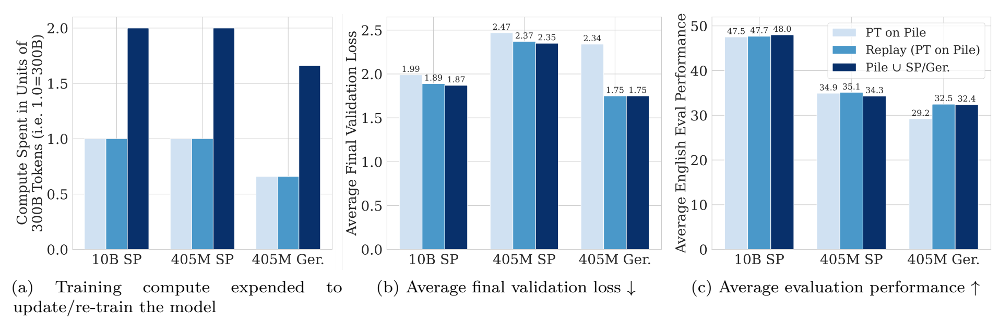

<b>图 1：增量预训练可降低更新模型的计算成本，同时保持相似的最终验证平均性能。我们展示了 在两个数据集的基础上训练的Pile ∪ SlimPajama(SP)/German(Ger.) 基线模型的结果，我们认为这是性能的上限。我们还报告了两个增量预训练模型的性能。“在Pile上预训练”（PT on Pile）从一个预训练的Pile检查点开始，只使用学习率重预热（re-warming）和重衰减（re-decaying），而“Replay（在Pile上预训练）”则使用学习率重预热（re-warming）和重衰减（re-decaying），并对SlimPajama添加5%的原始数据，对German添加25%的原始数据。我们观察到，学习率重预热（re-warming）和重衰减（re-decaying）和添加原数据的组合使我们的增量预训练模型在需要显著更少计算量的情况下，能够达到与基线模型相似的平均性能。我们注意到，这种设置假定有一个预训练模型可用。</b> 

## 相关工作

### 增量学习（训练）（Continual learning）

增量训练（CL）方法旨在从不断变化的数据分布中学习，在适应新数据的同时，保留通过先前训练收集的知识。增量训练的关键挑战在于，既要避免遗忘过去的信息，又要适应新的信息。这种权衡被称为 "刚性-可塑性困境"（the rigidity-plasticity dilemma）。

即使在小规模场景中，CL方法也很方便，可以避免从头开始重新训练，或解决数据可用性问题。然而，在大规模情况下，CL不仅仅是一种便利，可能还需要处理大量持续收集的数据。最近训练规模的扩大，尤其是LLM的扩大，为CL提供了新的机会，可以降低重新训练的成本，提高内存、计算和存储的效率。正如联合学习可以实现在空间共址的不同代理之间共享计算和数据一样，增量训练可以通过时间逐步实现计算和数据共享，成为大规模训练的有用工具。

最近的研究表明，SGD和Adam等优化器在DNN中具有有趣的知识保留特性，这可能有利于大规模CL，而且只需添加少量原数据就足以促进知识积累。在这项工作中，我们希望在大型语言模型预训练的背景下从这些方法的效率中获益，并通过正确的学习率策略和添加原数据（replay）策略来提升它们。

### 预训练，模型规模和增量学习（训练）

现有几项研究评估了预训练和模型规模对增量训练的影响。Cossu 等人（2022 年）研究了语言和视觉的预训练方案。他们发现，无监督和自我监督的预训练在减轻遗忘方面起着根本性的作用，而监督则会损害性能。同样，Mehta 等人（2023 年）发现，预训练模型的遗忘比随机初始化模型少，这是因为它们的权重位于损失空间较平坦的区域。他们还发现，较大的模型遗忘较少，这与Ramasesh等人（2022 年）和Mirzadeh等人（2022 年）的研究结果有关。前者发现预训练模型随着规模的扩大遗忘较少，这可能是由于隐藏表征随着规模的扩大更加正交。后者发现，与参数相当的深度神经网络相比，广度神经网络的遗忘更少。Hernandez等人（2021 年）建立了迁移的比例定律：可以预测神经网络在新任务上的表现的方程，是其参数数量和预训练数据集大小的函数。作者发现，随着参数数量的增加，这种正迁移的效果会持续改善。最后，Scialom等人（2022 年）表明，自回归LLM具有很强的增量训练能力，他们假设这与其预训练目标有关。

### 领域自适应增量预训练 （DACPT）

现有的工作考虑了领域自适应增量预训练（DACPT），在这种情况下，LM可以依次获得一系列未标记的领域，而实践者希望以自我监督的方式对每个领域进行训练，同时保持每个领域的性能。虽然目标与我们的类似，但我们考虑的是混合多个领域的通用预训练数据集，而不是特定领域的数据集。Ke等人（2022 年）假设在新领域进行训练时，以前领域的数据不可用，并针对这种情况开发了一种新技术，其中包括对所有以前任务的参数进行重要度掩码，以防止在以掩码语言建模（MLM）为目标进行预训练时发生遗忘。Gururangan等人（2020 年）研究了RoBERTa（也是 MLM）的领域和任务自适应预训练，并为高效增量预训练贡献了一种样本选择策略。同样，Xie 等人（2023 年）也提出了一种数据选择策略，降低了增量预训练的计算成本（自回归 LM）。Qin 等人（2023 年）研究了重新循环利用以前基础LM的微调适配器层，作为新适配器的初始化，以根据特定任务适配不断更新的基础LM版本。最近，Wu 等人（2024 年）提出了LLaMA Pro，这是一种对 LLM 进行增量预训练的方法，可以在不遗忘先前知识的情况下学习新任务。不过，与我们考虑调整所有现有权重的工作不同，LLaMA Pro需要在每次新更新时扩大模型的规模，并只调整新权重。

### 应用于垂直领域的LMs增量训练

一些相关工作将增量预训练应用于特定任务和领域（Sun 等人，2020；Jang 等人，2022a;b；Gong 等人，2022；Zan 等人，2022；Yadav 等人，2023a；Ma 等人，2023；Yang 等人，2024）。虽然这些工作也利用了增量预训练技术，但与我们的工作不同的是，它们专注于特定领域，而不是一般的预训练技术，专注于规模较小的数据集（小于10B tokens）与较小的模型。现有研究中唯一接近我们数据集规模的是（Gogoulou 等人，2023 年），该研究在英语、丹麦语、冰岛语和挪威语数据集（各为 730 亿）中探索了连续自回归语言建模。虽然他们没有添加原始数据（replay），但对学习率进行了重预热（re-warming）和重衰减（re-decaying）。目前唯一接近我们模型规模的研究是（Yang 等人，2024 年）。他们在小规模的植物科学学术数据上不断对LLaMA2进行增量预训练和指令微调。这项同时进行的工作采用了与我们提出的非常相似的增量训练设置：混合原始数据（replay）、重预热（re-warming）和重衰减（re-decaying）。虽然与我们的工作不同，他们没有建立一个受控实验框架来系统评估这些方法在增量预训练中的有效性，但很高兴看到进一步的实验证据验证了我们的方法。

### 学习率策略

一些研究考察了不同学习率（LR）策略对神经网络训练稳定性和最终性能的影响。Goyal 等人（2018）发现，在训练初期逐步预热 LR 有助于克服优化难题，尤其是在mini-batch规模较大的情况下。此外，Popel & Bojar（2018）还强调了训练后 LN  Transformers 时热身阶段的重要性。另一方面，Xiong 等人（2020 年）发现，Pre-LN Transformers 更为稳定，可能不需要热身阶段。You 等人（2019）探索了 LR 衰减的作用，发现较大的初始 LR 会阻止网络记忆嘈杂数据，而较小的 LR 则有助于学习复杂模式。卡普兰等人（2020）探索了预训练大型语言模型（LLM）的 LR 策略，发现策略选择对性能没有显著影响。Hoffmann 等人（2022 年）纠正了这一错误发现，他们发现 LR 策略确实起着重要作用。Hoffmann 等人（2022 年）和 Rae 等人（2021 年）确立了在预训练LLM时使用余弦策略的最佳实践，并已被广泛采用。相比之下，Raffel 等人（2023 年）和 Zhai 等人（2022 年）探索了大规模预训练时遵循反平方根衰减的LR策略。Raffel 等人（2023 年）利用反平方根衰减（Inverse Square Root Schedule）训练 LLM，从而可以灵活调整训练步数。在 Zhai 等人（2022 年）的研究中，作者利用这些被称为"无限学习率策略（infinite learning rate schedules） "的策略来训练视觉变换器。这些策略可实现无限训练，并在一次运行中评估多个训练持续时间。我们提出的LLM无限学习率策略（第 7.4 节）就是受这一思想的启发。

## 背景与方法

在本节中，我们将提供与LLMs增量预训练相关的背景和方法。

### 线性预热和余弦衰减策略

Hoffmann等人（2022 年）和 Rae 等人（2021 年）确立了在预训练LLM时使用余弦策略的最佳实践。具体来说，他们建议从线性预热阶段开始，然后将学习率衰减到其最大值的 10 倍，这样余弦周期的终点就会与tokens数量相匹配。虽然线性预热的持续时间各不相同，但大多数著名的作品都将0.1%到0.5%的预热作为训练步骤（Zhao 等人，2023 年）。鉴于许多流行的开源模型（Touvron 等人，2023b;a; Almazrouei 等人，2023）都遵循这一增量训练策略，因此了解其细微差别对于增量预训练此类模型至关重要。该策略首先在$T_{warmup}$个时间步长（timesteps）上线性增加学习率，或者直到某个时间步$t_{ann} = T_{warmup}$：
$$
\eta_t = \eta_{max} \cdot \frac{t}{T_{warmup}}
$$

其中，$\eta_{t}$是迭代到$t$时的学习率值，$η_{max}$是最大学习率。然后，策略会在$T_{ann}$个时间步上过渡到余弦退火阶段，等同于直到某个时间步$t_{end} = T_{ann} + t_{ann}$：
$$
\eta_t = \eta_{min} + \frac{\eta_{max} - \eta_{min}}{2}\cdot\left(cos\left(\pi \cdot \frac{t-t_{ann}}{t_{end} - t_{ann}}\right)+1\right)
$$

其中$η_{max}$是最大学习率，$η_{min}$是最小学习率。

### 保持Replay后计算量相等

在许多实验中，我们将使用添加了原始数据（Replay）训练的模型与不使用原始数据（Replay）训练的模型进行比较。在进行这种比较时，我们会保持训练两种模型的计算量不变。也就是说，我们会相应减少从新数据集中看到的token数量，以适应从原始数据（Replay）缓冲区看到的额外token。我们将这种添加原始数据的方式称为Compute-equivalent Replay。例如，假设数据集$D_0$和$D_1$各包含 100B tokens。我们希望在$D0$和$D1$上顺序训练的模型 (a) 与在$D_0$和$D_1$上顺序训练并加入5%原始数据的模型 (b) 进行比较。模型 (a) 将看到来自两个数据集的所有tokens，共计200B个tokens。模型（b）将看到 $D_0$的100B tokens和$D_1$的95B tokens，再加上$D_0$的5B原始tokens，共计200B tokens 。这样，两个模型的计算量相同。

例如，在我们的实验中，只有两个数据集$(D_0、D_1)$，我们在训练$D_1$时使用$D_0$的Replay数据。我们按照在$D_0$上进行预训练时的顺序Replay数据，因为在初步实验中，我们在Replay数据时没有观察到明显的差异。Replay样本的选择方法将留待今后研究。我们将使用重放数据的模型称为 "$D_1\ \ x\% \ \ Replay$"，其中$x$是每个训练批次中来自$D_0$数据的百分比。 反之，每个训练批次中$(100\% - x)\%$的样本将从$D_1$中采样。在比较使用Replay训练的模型和其他配置时，我们会减少$D_1$标记的数量，以容纳来自$D_0$的Replay tokens，从而确保计算量相同。

## 实验配置

为了对增量预训练LLM与随机初始化训练LLM的效果进行实证评估，我们从文献中选择了最新的预训练数据集，概述了实用的增量预训练调查配置，并选择了几个基线与我们提出的技术进行比较。我们的目标是在受控环境下，将我们的增量预训练技术与基线技术进行公平比较。我们并不寻求获得最先进的性能或与本文范围之外的模型进行比较。

### 数据集

我们使用三个数据集进行训练和验证： SlimPajama (Soboleva 等人，2023 年)、German Common- Crawl (Laippala 等人，2022 年) 和 Pile (Gao 等人，2020 年)。对于所有数据集，使用与Black等人（2022 年）专门在Pile上训练的相同的tokenizer。为了创建SlimPajama的训练集，我们随机对数据集（总标记数为 606B ）进行子样本抽取，以形成一个与 Pile 大小相当的约299B tokens子集（见表 1）。我们还对SlimPajama子集进行了进一步的子采样，以创建数据集的三个约100B tokens子集（详见第 7.4 节）。为了创建SlimPajama验证集，我们只需对经过大量重复的默认验证集进行tokenizer处理即可（Soboleva 等人，2023 年）。为了创建德语训练集和验证集，我们将德国的Common Crawl数据抓取部分（作为Oscar数据集的一部分，由Laippala等人，2022年提供）进行分割和tokenizer，生成一个包含195.43B token的训练集和一个包含982.6M tokens的验证集。Pile数据集已经预先进行了混合和随机排列，我们直接使用了默认的训练集和验证集。训练集总共包含约330B tokens，但在我们的实验中，我们只在一个300B tokens的子集上进行训练。

<b>表 1：SlimPajama的300B tokens训练集的领域规模。我们将SlimPajama数据集（总共606B tokens）子采样为一个300B tokens的部分，以使其与Pile的规模相当。我们展示了构成SlimPajama的子采样领域的规模以及训练时使用的采样百分比（例如，每个batch中来自某个特定领域的样本所占的百分比）。</b> 

| Dataset        | Size（Tokens） | Sampling（%） |
| :------------- | :------------: | :-----------: |
| Wikipedia      |     11.96B     |     4.00      |
| Book           |     12.58B     |     4.20      |
| C4             |     79.87B     |     26.69     |
| Stack Exchange |     10.09B     |     3.37      |
| GitHub         |     15.63B     |     5.22      |
| Common Crawl   |    155.89B     |     52.09     |
| Arxiv          |     13.25B     |     4.43      |
| Total          |    299.28B     |      100      |

### 增量训练配置

我们在正文中考虑了三种实际的增量预训练设置，并在附录中提供了第三种设置的结果，尽管我们认为这种设置的必要性较低。每种设置都经过精心选择，以揭示增量预训练的不同挑战和优势。我们的方案假定增量预训练的LLM依次经历两个或更多的预训练阶段。在每个阶段开始时，我们会重置优化器状态，因为优化器状态可能并不总是可用，例如在使用来自HuggingFace的开源模型时。也就是说，我们的结果适用于这样一种情况：一个增量预训练的LLM被随机初始化，并依次在数据集$D_0$、$D_1$、…、$D_{N-1}$上进行预训练，其中$N \geq 2$。我们考虑到实际情况，$tokens(D_i)$ 都$\geq$100B。在每种情况下，我们都考虑了以下基线：

- 一个从随机初始化在所有数据集的联合上训练的模型，即$\bigcup_{i=0}^{N-1}D_i$，以及 

- 一个从随机初始化在单个数据集$D_i$上训练的模型，其中$0 \leq i \leq N$。

当$N=2$时配置——这里我们假设一个模型是可用的（例如，通过Hugging Face获取或内部预训练的），并且已经在数据集（$D_0$）上通过线性升温和余弦衰减的学习率计划进行了自回归语言建模的预训练。我们还假设该计划遵循现有文献中的惯例（例如，学习率衰减计划；详见第4节），因为这对于大多数高性能的预训练LLM来说是常见的情况。假设一个模型已经在数据集$D_0$上进行了预训练，现在我们假设一个实验人员希望使用相同的自监督目标在新数据集$D_1$上更新该模型。我们考虑了以下两种具体的数据集设置的变体：

- **两个数据集，弱分布偏移**：在这种变体中，我们将$D_0$视为Pile，将$D_1$视为SlimPajama预训练数据集。SlimPajama是RedPajama的一个经过广泛去重的版本，而RedPajama是基于LLaMA数据集构建的。我们认为这是一个弱但现实的分布变化，因为这两个数据集都是英文的，包含相同的领域以及其他不重叠的领域。此外，SlimPajama（2023）是比Pile（2020）更新的数据集，所以在重叠领域中可能包含较新的数据。因此，尽管可能存在重叠，我们认为这种偏移是切合实际的，并且可能会引起许多希望在与预训练相似的分布上更新LLM的实验者的兴趣（例如，来自相同来源的更高质量过滤的新收集数据）。
- **两个数据集，较强的分布偏移：** 在这种变体中，我们将$D_0$视为Pile预训练数据集，将$D_1$视为German Common Crawl预训练数据集。German Common Crawl是一个约200B tokens的数据集，取自Oscar数据集。我们注意到，由于语言的改变，这构成了较强的分布变化。这种设置对那些希望通过添加新的自然语言、编程语言或特定领域（其词汇与预训练数据显著不同）来增强LLM的实验者特别有兴趣。然而，我们也注意到，随着领域与分词器的训练语料库的距离越来越远，分词器可能会成为性能的关键瓶颈。我们将分词器的处理留待未来工作探讨。

当$N > 2$时的配置——我们还考虑了以下具有更多数据集偏移的情况，以研究所考虑的方法在处理更多数据集时的扩展性。

- **三个数据集，无分布变化：** 我们考虑了一个$N = 3$的情况，其中$D_0$、$D_1$、$D_2$​分别是SlimPajama的三个各包含100B tokens的不同部分。这个设置主要用于评估我们的技术在多个未来更新中的扩展能力，以及评估我们提出的无限学习率计划（infinite learning rate schedules）的性能。
- 垂域增量预训练：这种设置考虑按照领域顺序训练SlimPajama的tokens。也就是说，我们按顺序训练$N$个垂域数据集{$D_0,\ D_1,\cdots D_{N−1}$}，每个数据集是SlimPajama 300B的一个独特领域。我们注意到这与DACPT（Ke等，2022年）类似，但我们考虑的每个领域的数据集要大得多。这种设置特别具有挑战性，因为每个领域之间的转换都要经历了分布偏移。虽然这确实很有趣，但我们认为与在训练之前混合SlimPajama数据相比，这种方式不必要地困难。这种设置下的差劲结果（附录Sec. A.1）表明，如果可能的话，通用目的的大型语言模型应该在多个领域的混合上增量预训练，而不是按领域更新。

### 训练配置

我们使用基于Megatron-DeepSpeed的GPT-NeoX来训练具有因果语言建模目标（causal language modeling objective）的decoder-only transformers模型。这些模型使用预归一化（Pre-LN）。所有模型均采用Black等人(2022)使用的相同tokenizer进行训练，该tokenizer是通过字节对编码（BPE）算法专门在“The Pile”数据集上训练得到的。对于所有模型，我们都使用AdamW优化器进行训练，batch_size为1104，序列长度（sequence）为2048。一个epoch大约对应132366个steps。如前文所述，我们在不同的数据集之间重置优化器的状态。我们考虑了两种模型规模：包含嵌入层在内的405M参数和9.6B（本文中称为10B）参数的模型。较小的模型使用46台每台有6个GPU的节点进行数据并行训练，micro-batch大小为4。较大的模型则使用每个节点内的张量并行（跨六个GPU）以及跨四个节点的管道并行；也就是说，每个模型副本跨越四个节点的24个GPU。我们在276个节点上训练这个大型模型，并使用4 steps梯度累积（gradient accumulation）。每个模型都利用ZeRO-1进行优化器分片（optimizer sharding）、激活检查点（activation checkpointing）、在张量并行等级上的激活分区以及混合精度FP16/FP32来减少GPU内存消耗并充分利用NVIDIA张量核心进行训练。我们已在附录（表13）中提供了所有超参数的详细描述。

### 大语言模型的德语和英文基准测试

我们测试在一系列下游任务上的性能，这些任务可以大致分为以下几类。英语基准测试：

- Commonsense Reasoning（0-shot）：HellaSwag、Winogrande、PIQA、OpenBookQA、ARC-Easy、ARC-Challenge
- World Knowledge （5-shot）：NaturalQuestions、TriviaQA
- Reading Comprehension （0-shot）：BoolQ
- Math：MathQA
- Popular Aggregated Results：MMLU （5-shot）

来自德国的基准测试，这些测试是通过GPT 3.5 API将其英文版本翻译过来的。

- Commonsense Reasoning （0-shot）：HellaSwag-DE、ARC-Challenge-DE
- World Knowledge （5-shot）： TriviaQA-DE
- Popular Aggregated Results：MMLU-DE（5-shot）

## 结论

 我们专注于当新的数据集很大（200B tokens以上）时的增量预训练。在这种情况下，训练成本很高，因此有效地适应大量新数据至关重要。然而，大多数表现优异的语言模型都是用线性预热和余弦衰减的学习率计划训练的，这种计划通常有一个相对较低的最小学习率。我们假设需要将学习率重新预热到一个相对较高的值，然后再次使其衰减，才能有效地适应新的数据集。为此，在第6.1节中，我们研究了线性预热持续时间、重新预热学习率（re-warming）、重新衰减（re-decaying）学习率以及最大学习率幅度对适应性和遗忘的影响。我们发现重新预热和重新衰减学习率都会增加新数据的适应性和原始数据遗忘的程度，在第6.2节中，我们探讨了加入原始数据（Replay）是否可以帮助缓解在学习率被重新预热和重新衰减时发生的遗忘问题。第6.3和6.4节结合了前面两节中研究的策略，并展示了这些策略相对于弱分布偏移和强分布偏移基线以及大规模模型的表现。最后，在第7节中，我们展示了学习率的重新预热可能会导致不希望发生的遗忘，并引入了无限学习率策略作为一种有前景的方式来避免这种情况的发生，并将这些策略与基线进行了比较。

### 学习率策略

鉴于学习率对新数据适应性的影响以及优秀的语言模型最终学习率值较低的情况，我们假设在增量预训练期间应该重新预热（re-warming）并重新衰减（re-decaying）学习率以促进适应性。在本节中，我们研究了线性预热持续时间、重新预热学习率、重新衰减学习率以及最大$\eta$值（$\eta_{max}$）在增量预训练时的影响。具体来说，我们在两个数据集的弱分布偏移情况（300B Pile tokens -> 300B SlimPajama tokens）和两个数据集的较强分布偏移情况（300 Pile tokens -> 300B SlimPajama ）下评估了它们各自的效果。值得注意的是，在$D_0$（300B Pile tokens）上训练的模型遵循线性预热和余弦衰减计划，这模拟了许多常见的开源预训练语言模型的情况。

#### 线性预热对弱分布偏移和强分布偏移的影响

我们首先研究了线性预热持续时间对原始数据的遗忘和新数据适应性的影响，在两个数据集的弱分布偏移和两个数据集的强分布偏移情况下（请参见第5.2节了解详情）。我们在SlimPajama（弱分布偏移）和德语Common Crawl（强分布偏移）上增量预训练模型，在训练的前50B tokens中。我们使用余弦学习率策略重新预热并重新衰减学习率，该策略分别在300B和200B个tokens时达到其最小值（$\eta_{min} = 0.1\cdot\eta_{max}$）。我们考虑将学习率预热到数据集$D_1$总训练迭代次数的0.5%，1%和2%（分别是132366和86000 steps）。由于衰减发生在剩余的迭代中（即分别为99.5%，99%和98%的总迭代steps），请注意这意味着较长预热期的衰减阶段会略微加快。此外，我们还训练了一个没有线性预热（0%）的模型，该模型立即从$\eta_{max}$开始衰减学习率。所有实验都在405M参数的模型上进行。

图2展示了所有模型在$D_1$上增量预训练前50B tokens期间，对于$D_0$和$D_1$的验证损失。(a)、(b)展示了弱分布偏移的结果，(c)、(d)展示了强分布偏移的结果。在这两种分布偏移的情况下，我们最初观察到使用较短线性热身期的模型比使用较长热身期的模型对原数据的遗忘和对新数据适应得更快。这是因为较短的热身期会导致学习率（LR）更快地增加，从而导致更快的原数据遗忘和新数据适应。然而，在所有情况下，这些初始差异随着训练的进行而逐渐减小，使得所有模型在经过50B个令牌后都有相对类似的原数据遗忘和新数据适应情况。因此，在所探索的情况中，线性热身阶段的持续时间似乎对增量预训练过程中的原数据遗忘或新数据适应没有显著影响。考虑到这一点，我们将后续所有实验中的线性热身期设置为总训练迭代次数的1%。

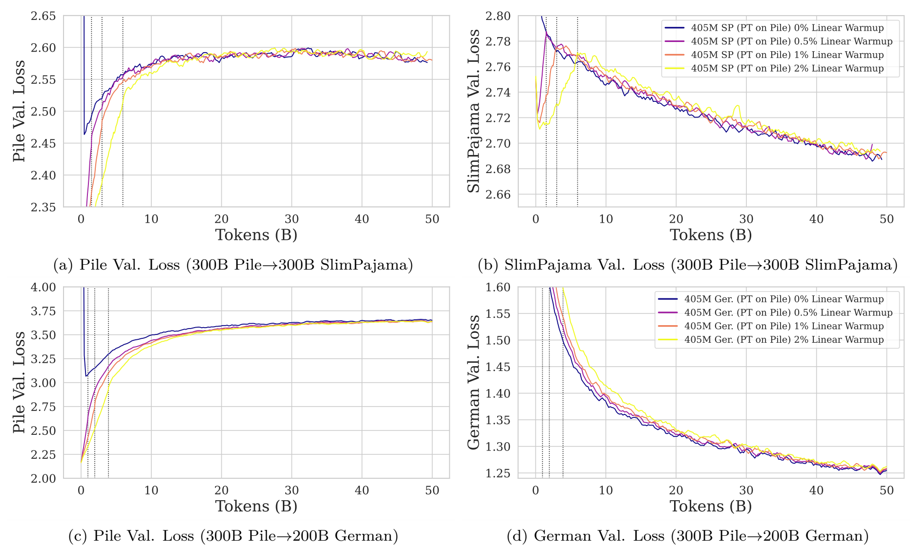

<b>图 2：线性预热期对于弱分布偏移和强分布偏移的影响。（a）、（b）和（c）、（d）具有相同的图例，分别显示在右侧的图中。我们训练了包含405M参数的模型，采用了线性预热和余弦衰减的学习率调度策略，并设置了不同的线性预热期长度：0%、0.5%、1% 和 2% 的训练迭代次数。每个学习率调度都会根据数据集的大小，在训练结束时衰减至最大学习率的0.1倍。我们展示了前50B tokens的训练结果。在所探索的配置中，我们观察到预热的持续时间似乎对增量预训练没有显著影响。</b> 

#### 重新预热、重新衰减以及变化的最大学习率（$η_{max}$）对于弱分布偏移和强分布偏移的效果

我们现在研究对于不同的最大学习率（$\eta_{max}$）值，重新预热和重新衰减学习率的好处。具体来说，我们将这些模型与两个基线进行比较：一个是在最小学习率（$η_{min}$，即$3 \times 10^{-5}$）保持不变，不重新预热的模型，以及另一个重新预热到预训练的最大学习率（$η_{max}$，即$3 \times 10^{-4}$）但不重新衰减的模型。我们使用了相同的双数据集配置：首先在“The Pile”（$D_0$）上预训练300B tokens，然后在“SlimPajama”（弱偏移）或“German Common Crawl”（强偏移）$D_1$数据集上增量预训练我们的模型。增量预训练是在这些数据集的全规模（分别为300B和200B tokens）上进行的。那些重新预热并重新衰减学习率（LR）的模型考虑了三种策略：重新预热到预训练$η_{max}$的一半（$1.5 \times 10^{-4}$），重新预热到与预训练相同的$η_{max}(3 \times 10^{-4})$，以及重新热身到预训练$η_{max}$的两倍$(6 \times 10^{-4})$。在所有情况下，学习率在经过线性热身之后按照余弦衰减的方式下降，以便在训练结束时达到$η_{min}=0.1 \cdot ηmax$。最后，我们还考虑了在$D_0 \bigcup D_1$上训练的模型作为第三个基线，以提供性能的上限。

图3展示了所有模型在整个增量预训练过程中对于$D_0$和$D_1$数据集的验证损失。(a)、(b)展示了弱分布偏移（300B Pile -> 300B SlimPajama）的结果，(c)、(d)展示了强分布偏移（300B Pile -> 200B German Common Crawl）的结果。对于这两种分布偏移，$η_{min}$恒定学习率模型在$D_0$上的遗忘最少。但对于强分布偏移来说，它也在$D_1$上的适应程度最低。对于弱分布偏移，它对新数据的适应程度超过了$η_max$恒定基准。当我们比较这些基线与那些重新预热和重新衰减的学习率模型时，我们观察到后者在两种分布偏移下都显著更好地适应了新数据集。这表明，在持续预训练大型语言模型（LLMs）时，重新预热和重新衰减是最大化适应新数据集所必需的。在那些重新预热和重新衰减学习率的模型中，我们观察到改变学习率导致新数据适应和原数据遗忘的小幅差异：较高的$η_{max}$值导致更多的原数据遗忘和更多的新数据适应，而较低的值则相反。当我们比较基线与$D_0 \bigcup D_1$训练的基线时，我们发现$D_1$的最终验证损失在两种分布偏移下都显著高于$D_0 \bigcup D_1$训练模型。这也适用于弱分布偏移下的$D_1$，但有趣的是，在强分布偏移下，恒定基线模型的$D_1$验证损失低于联合训练模型。我们推测这是由于更强的分布偏移通常会增强适应性并加剧遗忘，在大型语言模型的背景下更是如此。当我们比较增量预训练且重新预热和重新衰减的模型与$D_0 \bigcup D_1$基线时，我们注意到这些模型相较于$D_0 \bigcup D_1$基线对$D_1$的适应性更好（更低的最终验证损失）。然而，这些模型在$D_0$上经历了显著的遗忘，这显示出需要加入原始数据（replay）以使这些模型与$D_0 \bigcup D_1$基线模型竞争的重要性。

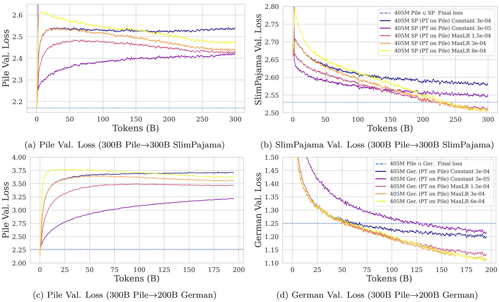

<b>图 3：重新预热和重新衰减学习率对新数据适应性和原数据遗忘的影响。我们考虑了两种恒定基线和三种重新预热及重新衰减的模型。其中一个基线从预训练的η_{min}（3×10^-5）继续训练，而另一个基线重新预热到预训练的η_{max}（3×10^-4）。对于那些重新预热和重新衰减的模型，我们改变了η_{max}的值，使其等于{1.5×10^-4, 3×10^-4, 6×10^-4}。除了η_{min}基线之外的所有模型都在1%的训练迭代中使用线性热身。非基线模型将学习率按照余弦衰减的方式降低，以便在训练结束时达到0.1·η_{max}。我们观察到，为了最好地适应新数据集，重新预热和重新衰减学习率是必要的。η_{max}的小幅度增加或减少可以用于在更多或更少新数据的适应性之间进行权衡。更强的分布偏移似乎同时加速了遗忘和适应的过程。</b> 

总之，增量预训练LLM、重新预热和重新衰减都是必要的，以最大限度地适应新的数据集；$\eta_{max}$的轻微增加或减少允许在更多或更少的新数据适应性之间进行权衡；$D_0$ 和$D_1$之间更强的分布转变会加剧原数据遗忘并增强新数据适应性；线性预热阶段的持续时间似乎不会对原数据遗忘或新数据适应产生影响。

### Replay的效果

在本小节中，我们将探讨在增量预训练模型并重新预热和重新降低学习率时compute-equivalent replay（保持计算量相等的情况下添加原数据）效果。

鉴于在重新预热和重新衰减时需要减轻遗忘的需求，我们接下来研究在弱分布偏移和强分布偏移的增量预训练情景中添加原数据（replay）的效果。具体来说，我们使用compute-equivalent replay（请参见第4.2节以获取详细信息），其中来自$D_0$的数据tokens以等量移除$D_1$ tokens的成本被添加到计算量中。遵循相同的数据集设置，模型首先在$D_0$（The Pile）上预训练300B tokens。随后，在SlimPajama（弱分布偏移）或German Common Crawl（强分布偏移）上进行增量预训练。有关配置的更多细节，请参阅第5.2节。我们的增量预训练是在各自数据集的全规模上进行的，即SlimPajama（弱分布偏移）为300B tokens，German Common Crawl（强分布偏移）为200B tokens。我们考虑了1%、5%、10%和50%的原数据添加（Replay）比例，对于弱分布偏移我们还增加了0.5%的原数据，对于强分布偏移则增加了25%的原数据。我们考虑了两个基线模型以将这些结果置于更广泛的上下文中。第一个基线模型是在$D_1$上训练且没有replay的模型。第二个基线模型是从随机初始化开始，在$D_0$和$D_1$的联合数据集上训练，对于SlimPajama为600B tokens（300B + 300B），对于German Common Crawl为500B tokens（300B + 200B）。后一个基线反映了完全重新训练模型以更新模型而不是增量预训练现有模型的做法。所有模型都使用与在$D_0$上预训练时相同的$\eta_{max}(3×10^{-4})$和$\eta_{min}(3×10^{-5})$值，采用余弦衰减的学习率调度策略，并进行重新预热和重新衰减。

验证损失对比：图4（a、b、c、d）中的结果显示了在各自的$D_1$数据集上增量预训练期间验证损失的变化。表2展示了这些模型的平均最终验证损失。最终损失是基于训练最后100次迭代的平均值，这些迭代每隔10次采样一次。我们在两种分布偏移的情况下一致地观察到，即使是最低的1%replay也显著减少了在The Pile上的遗忘，与没有replay的基线相比。这种效应在强分布偏移的情况下更为明显，因为在这种配置下遗忘的程度更大。我们观察到，当与0%的基线相比时，1%、5%和10%的重放对下游性能的影响很小，这表明在我们的设置中，重放带来的遗忘缓解效果几乎不需要付出代价。然而，当使用极端数量的重放（50%）时，我们观察到模型对$D_0$的适应性减少。有趣的是，对于两个数据集而言，50%replay的模型达到了或超过了在$D_1 \bigcup D_0$上训练的基线的最终平均验证性能。这是令人好奇的，因为这些模型看到的$D_1$ tokens分别比它们各自的基线少了150B和100B个。

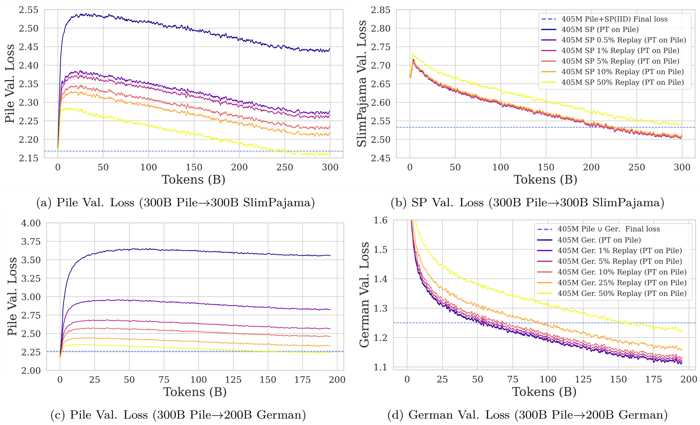

<b>图 4：在405M参数规模下，replay对弱分布偏移和强分布偏移的效果。我们展示了在训练过程中的The Pile验证损失（左侧）和SlimPajama/German验证损失（右上方/下方）。每个模型都是从一个在The Pile上预训练了300B tokens的检查点开始训练的。蓝色虚线报告了在The Pile U SlimPajama或The Pile U German数据上训练的模型的最终验证损失，这两个数据集分别总共包含600B和500B tokens。我们观察到，replay在两种分布偏移下都能显著减少遗忘，但是强分布偏移需要更多的replay才能将遗忘减少到同样的程度。</b> 

<b>表 2：405M参数模型的最终损失，这些模型使用不同数量的replay进行训练。损失是基于训练最后100次迭代的平均值，这些迭代每隔10次采样一次。这些数据的标准误差已经计算出来，但由于所有模型的标准误差均小于0.001，因此未展示。我们观察到，使用更多replay的模型实现了更好的适应-遗忘权衡（平均损失）。有趣的是，使用50%重放的模型在看到比基线少150B tokens的情况下，几乎获得了相同损失值。</b> 

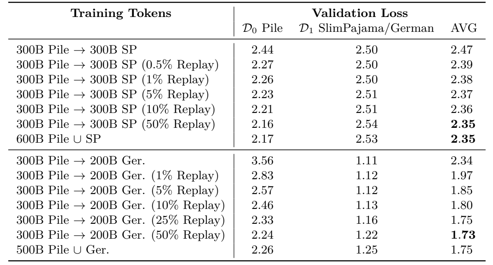

### 弱分布和强分布偏移的增量预训练最终性能

在本小节中，我们将两个增量预训练的405M参数模型与几个基线模型在两个数据集弱偏移（Pile -> SlimPajama）情况和两个数据集强偏移（Pile -> German）情况下进行比较。我们的主要目标是确定分布偏移的差异如何影响最终性能。

**增量预训练模型**：为了评估LR重预热和重衰减与relpay相结合的性能，我们选择训练一个只对学习率进行重预热和重衰减的模型，以及另一个将两种技术相结合的模型。鉴于上一节中弱分布偏移的结果，我们在弱偏移配置中选择5%的replay，在强偏移配置中选择25%的replay。对于这两种模型，我们都会replay至预训练的$\eta_{max}(3\times10^{-4})$，并使用余弦衰减策略，以便在增量预训练结束时达到$\eta_{min}$。更多的超参数见附录表13。

**基线**：我们还训练了几个基线模型。两个基线分别在$D_0$和$D_1$上进行训练，第三个基线在$D_0 \bigcup D_1$的组合上进行训练。我们认为在 $D_0 \bigcup D_1$上训练的模型是性能的上限，因为它代表了昂贵的全面重新训练。在单个数据集上训练的基线可被视为与增量预训练计算等价的替代方案（例如，可以选择在$D_1$上从随机初始化开始训练模型，而不是对其进行增量预训练）。

#### 按损失评估最终效果

图5展示了405M参数模型在弱偏移（图a、b）和强偏移（图c、d）增量预训练过程中的验证损失。表3展示了这些模型的平均（最后 100 次迭代）最终损失值。由于从英语到德语的转变比从Pile到SlimPajama的转变代表了更明显的分布偏移，因此对于没有replay的增量预训练模型来说，在德语上进行训练会导致对Pile（$D_0$）的遗忘明显增加（弱偏移和强偏移的遗忘分别为0.27和 1.39）。然而，选择25%的重放来处理更明显的偏移会显著减少Pile上的遗忘量，最终损失减少了1.23。将增量预训练模型与完全基于$D_1$训练的基线模型进行比较时，我们发现增量预训练模型在两种分布偏移中的验证损失总是更低。将增量预训练模型与$D_0 \bigcup D_1$ 基线进行比较时，我们发现这两种模型都获得了几乎相同（弱偏移）或相似（强偏移）的平均最终验证损失。这表明，对于强和弱的分布偏移，LR再预热、LR再衰减和replay的简单可扩展组合可以实现与$D_0 \bigcup D_1$ 基线相似的性能。

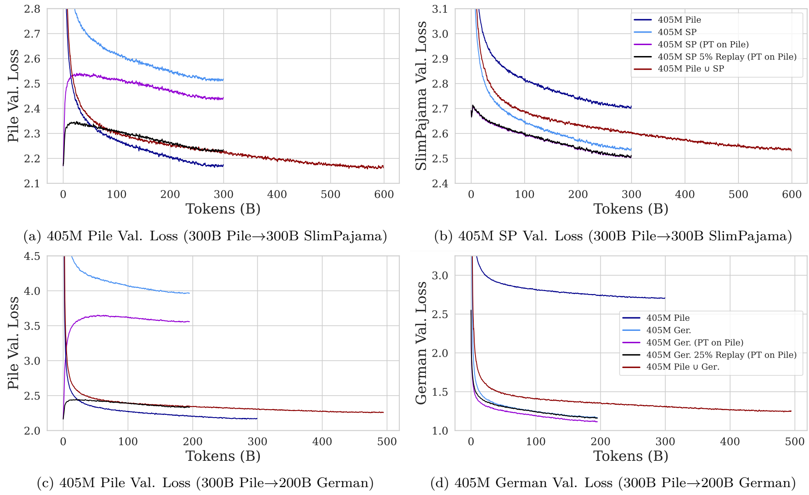

<b>图 5：根据两次分布偏移训练的405M参数模型的最终损失。为了方便比较，图（a）和（b）与图 6 重复。我们提供了三个基线和两个增量预训练模型。基线（浅蓝色、深蓝色和栗色）是在SlimPajama的300B tokens、Pile的300B  tokens以及两个数据集的结合（600B tokens）上从随机初始化开始训练的。 增量预训练模型（黑色和紫色）从在300B Pile tokens（深蓝色曲线）上预训练的检查点开始，分别使用0%和5%的replay。我们观察到，对于这两种分布变化，重预热学习率和使用小比例replay的组合有助于在遗忘和适应之间取得平衡。重要的是，我们注意到，与使用0%重放的模型相比，使用重放对下游性能的影响微乎其微。</b> 

<b>表 3：增量预训练英语->英语和英语->德语模型的最终损失。所有模型都有405M参数。损失是最后100 次迭代训练的平均值，每10次迭代取样一次。我们计算了这些测量值的标准误差，但由于所有模型的标准误差均小于0.001，因此未予展示。我们观察到，即使对于较明显的分布偏移，LR预热和5%replay的组合也有助于接近Pile U German模型的平均性能。</b> 

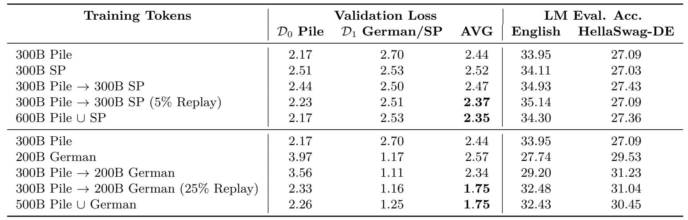

#### 通过在常用LM基准上的Zero-shot和Few-shot结果评估最终性能

虽然最终准确率可以很好地衡量预训练目标的性能，但LLM的能力通常是通过它们在评估任务中的表现来判断的。需要注意的是，我们使用的是基础模型，即我们的模型没有经过指令调整、微调或以任何方式适应人类偏好，因此我们在本节中介绍了它们在流行基准上的评估结果。此外，我们还对使用德语训练（German-trained）的模型进行了定性评估。关于所选评估任务的详细说明，请参阅主稿第 5.4 节和附录第 A.5 节。

表 3 展示了每个模型在英语评估任务中的平均准确率，以及在德语 Hella Swag 评估任务中的归一化准确率。我们没有报告德文评估的平均得分，因为它的信息量不大，评估的准确率几乎是随机的（见表 11）。我们注意到，在英语评估中，英语模型的表现始终优于德语模型。不过，25% replay的德语模型所使用的强replay功能有助于缩小这一差距。英语模型的英语评估性能非常相似，最高值和最低值之间的差距仅为 1.19。我们怀疑，对于这种规模的基础模型，评估过程中存在很大的噪音，因此认为差异可能并不显著。尽管如此，采用 LR重预热、LR重衰减和replay的增量预训练模型确实比$D_0 \bigcup D_1$模型有所提高。在对英语评估任务中的德语训练模型进行评估时，我们发现使用更多重放的模型始终都有进步。我们注意到，使用LR重预热、LR重衰减和replay训练的模型再次比$D_0 \bigcup D_1$模型有所改进。转到德语 Hella Swag 结果，我们发现德语模型始终优于英文模型。在德语训练的模型中，增量训练的模型优于$D_0 \bigcup D_1$训练的模型和只用德语训练的模型。

鉴于德语模型在除 HellaSwag 之外的所有德语评估任务中表现不佳（平均与英语模型相同），我们通过对模型生成进行简短的定性研究，进一步调查了他们对德语的理解。在附录的 A.4 节中，我们选择了五条包含各种德语特点的德语提示（见附录的表 8）。然后，我们为每个经过训练的模型生成一个固定标记长度的German Common Crawl。我们还评估了仅在 Pile 上训练的模型，作为基线。尽管在模型规模较小的情况下生成质量较差，但我们发现，与 Pile 基线相比，在 German Common Crawl 上训练的模型的德语输出生成质量有了明显改善，因为 Pile 基线往往会系统性地偏离主题。这表明，虽然我们的德语训练模型已经学习了德语，但评估任务过于困难，无法在 405M 参数规模下识别德语。另一个原因是德语数据集比英语数据集要小，而且只包含网络抓取的数据，而本研究中使用的英语数据集更为复杂。

总之，对于较弱和较强的分布偏移，通过利用简单而可扩展的LR重预热、LR 重衰减和replay组合，都有可能获得能与在$D_0 \bigcup D_1$​上训练的模型竞争的性能。 最终验证损失和语言模型评估分数都是如此，这表明这种简单技术的强大组合可以为语言模型提供新知识，而对现有知识的损害很小。

### 不同模型尺度下的增量预训练最终表现

在本小节中，我们将确定参数数量增加一个数量级对增量预训练最终性能的影响。为此，我们比较了在两个数据集弱偏移（Pile → SlimPajama）和两个数据集强偏移（Pile → German）情况下，在405M和10B参数模型大小下，两个增量预训练模型与几个基线模型的性能。

**增量预训练模型**：为了评估LR重预热和重衰减与replay相结合的性能，我们选择训练一个只对学习率进行重预热和重衰减的模型，以及另一个结合两种技术的模型。考虑到（第 6.2 节）弱分布偏移的结果，我们为两个模型规模都选择了5%的replay。对于这两种模型，我们都replay至增量预训练的$\eta_{max}(3\times10^{-4})$，并使用余弦退火，以便在增量预训练结束时达到$\eta_{min}$。更多的超参数见附录表 13。

**基线**：我们还训练了几个基线模型。两个基线模型分别在$D_0$和$D_1$上训练，第三条基线在$D_0 \bigcup D_1$上训练。我们认为在$D_0 \bigcup D_1$ 上训练的模型是性能的上限，因为它代表了昂贵的全面重新训练。在单个数据集上训练的基线可以被看作是增量预训练的计算等价替代方案（例如，我们可以选择在$D_1$上从随机初始化开始训练模型，而不是对其进行增量预训练）。

#### 按损失评估最终效果

图 6 展示了405M和10B模型在增量预训练过程中的验证损失，而表 4 则展示了每个模型的平均（最后 100 次迭代）最终损失值。不出所料，我们观察到所有基线模型和增量预训练模型在两个数据集上的困惑度（PPL）都随着参数数量的增加而持续降低（效果越来越好）。对于405M模型，我们观察到$Pile \bigcup SP$在每个数据集上的验证损失与单独训练的基线模型完全相同。相比之下，在$Pile  \bigcup SP$上训练的10B参数模型则优于在每个数据集上单独训练的模型。我们假设，出现这种情况的原因是较大的模型具有更大的容量，因此能够以更高的速率学习更长的时间。我们观察到，当继续在SlimPajama上进行增量预训练时，replay5%的原数据会使 10B和405M参数模型在验证集上的遗忘分别减少0.19和0.21。尽管两个模型的参数相差一个数量级，但replay所减少的遗忘差异却可以忽略不计，这表明模型规模对replay所减少的遗忘负面影响有限。我们认为这是因为较大的模型默认遗忘较少。事实上，对于10B和405M模型，在没有replay的情况下，根据预先训练的Pile检查点训练的模型分别遗忘了0.23和0.27的Pile。虽然差异很小，但这表明较大的模型遗忘较少，证实了我们的假设。在比较 5%replay模型和基线模型的平均最终验证损失时，我们注意到两种大小的模型仅有0.02的差异。这表明，对于两种模型规模下微弱但现实的分布偏移，增量预训练可以达到与昂贵的重新训练基线相似的性能。

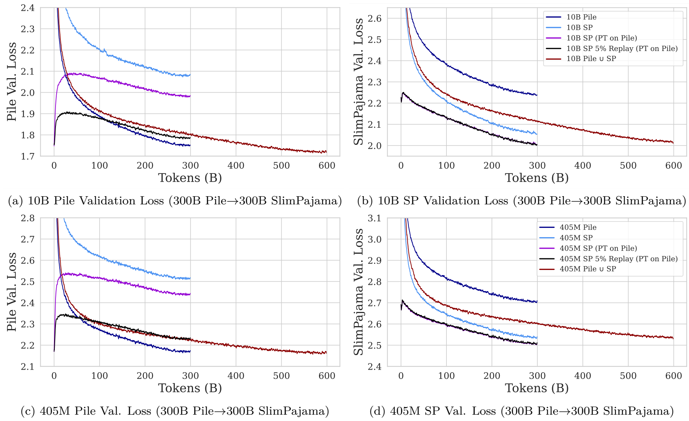

<b>图 6：10B（a、b）和 405M（c、d）参数模型增量预训练期间的验证损失。在每个模型规模下，我们提供了三个基线和两个增量预训练模型。 基线模型（浅蓝色、深蓝色和栗色）是在SlimPajama的300B tokens、Pile的300B tokens以及两个数据集的结合（600B tokens）上通过随机初始化训练出来的。增量预训练模型（黑色和紫色）从在300B Pile tokens（深蓝色曲线）上预训练的检查点开始，分别使用0%和5%的replay。我们观察到，对于这两种规模的模型，LR重预热、LR 重衰减和使用小比例replay的组合有助于在遗忘和适应之间取得平衡。重要的是，我们注意到，与使用0%replay的模型相比，使用replay对下游性能的影响微乎其微（图（b）和（d）中黑色和紫色曲线重叠）。</b> 

<b>表 4：10B和405M参数模型的最终损失。损失是最后100次迭代训练的平均值，每10次迭代取样一次。我们计算了这些测量值的标准误差，但由于所有模型的标准误差都小于0.001，因此没有展示。我们观察到，在这两种模型规模下，学习率预热与5%的replay相结合，都接近联合（Pile U SP）训练的平均损失值。</b> 

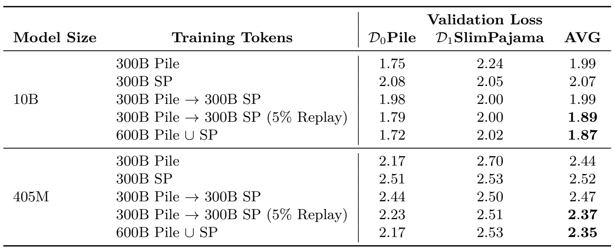

#### 通过在常用LM基准上的Zero-shot和Few-shot结果评估最终性能

虽然最终准确率可以很好地衡量预训练目标的性能，但 LLM 的能力通常是通过它们在评估任务中的表现来判断的。需要注意的是，我们使用的是基础模型，即我们的模型没有经过指令调整、微调或以任何方式适应人类偏好，因此我们在本节中介绍了它们在流行基准上的评估结果。关于所选评估任务的更详细说明，请参阅主稿第 5.4 节和附录第 A.5 节。

表 5 展示了我们增量预训练LLM的英语LM评估结果。HellaSwag报告了归一化准确率，NaturalQuestions和TriviaQA报告了精确匹配 (EM)。所有其他任务报告的都是非规范化准确率。不出所料，我们发现大型（10B）模型的性能要强于小型模型，而且在更多tokens上训练的模型总是比在较少tokens上训练的模型性能更好。对于这两种模型规模，我们观察到，在平均准确率方面，使用增量训练和 5%replay相结合的方法增量预训练的模型接近（10B）或超过（405M）在两个数据集的合集上训练的模型的性能。在比较联合训练模型和增量预训练模型在不同任务上的表现时，我们观察到，对于10B参数模型，5% replay模型和联合训练模型在不同任务上交替了最佳表现，显著差异是OpenBookQA有利于replay模型，而MMLU有利于联合模型。对于405M参数模型，5%的replay模型和联合训练模型在不同任务上的性能，没有明显差异。在两种模型尺度上，replay模型都比仅使用重预热的模型有所改进，但差异很小，可能是由于噪声造成的。

<b>表 5：在流行的LM基准上取得的所有 “zero-shot”和 “few-shot”结果。HellaSwag报告的是归一化精度，NaturalQuestions和TriviaQA报告的是精确匹配 (EM)。所有其他任务报告的都是非规范化准确率。MMLU和TriviaQA的评估为5次，而所有其他任务均为0次。我们平均观察到，正如预期的那样，10B参数模型优于405M模型，而纯英语的405M模型优于经过德语训练的模型。</b> 

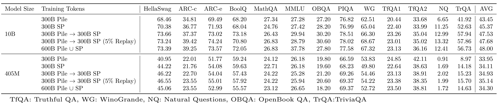

总之，我们发现，结合 LR重预热、LR重衰减和replay进行持续增量预训练的模型，其平均性能（如最终验证损失和评估精度）超过了在单个数据集上随机初始化训练的基线模型，并且平均评估性能与昂贵的重新训练基线模型（在两个数据集的联合上训练）相当。这些结果表明，增量预训练的优势在10B参数规模下仍然存在，这表明对于参数数量级更高的模型（例如100B以上参数）来说，情况可能也是如此。

## 了解和避免重预热的糟糕现象

在本节中，我们发现LR重预热会导致不必要的遗忘，引入了无限学习率策略（infinite learning rate schedules）作为一种有希望避免遗忘的方法，并将这些策略与文献中的基线进行了比较。

### 使用相同的数据进行预热

在第 6.1 节中，我们已经看到，继续对新数据进行增量预训练最初会导致对过去数据的损失迅速增加，这也是使用replay的原因。特别是，当$\eta_{max}$值越大时，损失的增加就越明显。损失增加的一个假设是，由于预训练数据集之间的分布变化以及相关的负迁移造成的。为了评估这一假设，我们在没有分布偏移的情况下对超过300B的tokens进行了重预热和重衰减。也就是说，我们采用与图 3 实验类似的方法，但继续在Pile上进行$D_1$的增量预训练。

如图 7 所示，与分布偏移无关，当开始继续增量预训练时，学习率的预热似乎是导致图 3 中之前看到的损失增加的一个重要原因，这一点可以从在同一分布上训练时学习率的预热导致的困惑度增加得到证明。例如，当我们在Pile上进行增量预训练时，$\eta_{max} = 3 \times 10^{-4}$会导致 Pile 验证损失比初始值增加 0.1，这与图 3 中在SlimPajama上进行继续预训练时，在相同学习率策略下 Pile 验证损失增加 0.35 形成鲜明对比。值得注意的是，预热程度越高，这种影响就越明显，如在 Pile 上进行增量预训练时的$\eta_{max} = 6 \times 10^{-4}$ 曲线（峰值损失增加 0.2）与在SlimPajama上进行增量预训练时的$\eta_{max} = 6 \times 10^{-4}$曲线（峰值损失增加 0.45）。

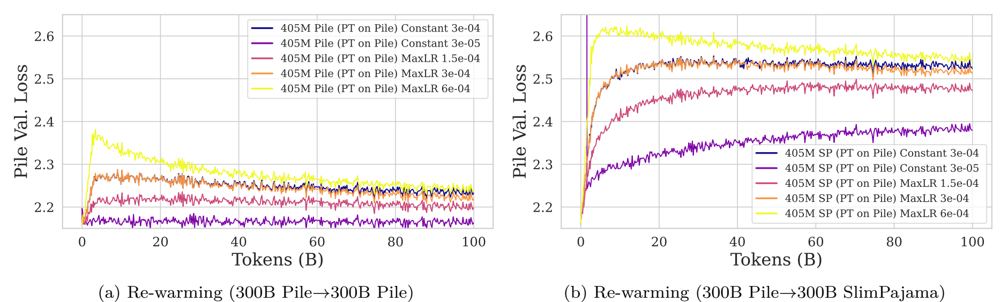

<b>图 7：在 Pile（a）和 SlimPajama（b）上进行增量预训练时的Pile验证损失。每条曲线都从相同的检查点开始，在Pile的300B tokens上进行预训练，但训练时使用了不同的最大学习率。由于我们重点关注的是预热学习率的效果，因此我们只显示了前100B tokens的曲线。我们观察到，从初始预训练的最小学习率重新提高学习率的每个模型（例如，除常数外的所有模型）的损失都会增加。</b> 

特别是在重预热后，即使在同一数据集上进行训练，模型也无法从重预热学习率所造成的性能打击中迅速恢复。这就促使我们寻找需要重预热学习率策略的替代方案，以提高增量预训练的效率。

### Infinite Learning Rate Schedules

在本小节中，我们将研究本质上可能不需要重预热的学习率策略。动机有两个方面。一方面，余弦衰减策略要求我们提前知道我们想要预训练的tokens总数。这就限制了继续对已收敛的检查点进行增量预训练的能力。另一方面，我们在上一节中看到，当增量预训练一个最初以余弦衰减策略结束预训练、学习率较小的模型时，需要将学习率从最小值重新预热，以最好地适应新的数据集。然而，正如上一小节所述，我们发现重新加热学习率会加剧遗忘。

因此，我们探索了 “无限学习率策略”（Zhai 等人，2022 年），在所有新任务中将学习率保持在一个恒定值。这可以避免在新任务中重预热学习率，从而有助于防止遗忘。此外，这种策略与tokens总数无关，因此与针对每个新数据集循环重复余弦衰减策略相比，它更适用于增量训练设置。正如我们所看到的，由于高恒定学习率也是次优的，因此我们选择在预训练结束时，在有限的tokens数量上对学习率进行快速退火。我们希望这样能恢复学习率重衰减的性能优势，同时允许在继续进行预训练时使用预退火检查点。

我们考虑的无限学习率策略有 4 个阶段：

- 线性预热阶段：与之前一样，学习率最初会在$T_{warmup}$ 时间步长内增加到某个最大值$\eta_{max}$，或者等同于直到时间步长$t_{cd} = T_{warmup}$。学习率只进行一次预热（在第一个任务期间），以后的任务不需要再预热。
- 退火阶段：在这一阶段中，学习率会经历一个退火阶段，即从时间步$t_{cd}$到$t_{const} = t_{cd} + T_{cd}$，学习率会根据某个衰减函数$f_{cd}$在$ T_{cd}$ 时间步上逐渐衰减到恒定值$\eta_{const}$。这一阶段也只在第一个任务中出现一次。
- 恒定阶段：然后，在从时间步$t_{const}$到$t_{ann} = t_{const} + T_{const}$的$T_{const}$时间步中，所有未来任务的学习率保持不变。在这一阶段结束时获得的检查点，就是继续在新数据集上进行预训练时应该恢复的检查点。
- 退火阶段：学习率在一个时间段$T_{ann}$内从时间步$t_{ann}$ 到$t_{end}=t_{ann}+T_{ann}$逐渐减小至一个小值$\eta_{min}$，这有助于在模型部署前将其训练至收敛。

因此，无限学习率策略可以被描述为：
$$
\eta_t
\begin{cases}
\eta_{max} \cdot \frac{t}{T_{warmup}} \qquad \qquad\qquad t \in [0,t_{cd}]\qquad\qquad(warm-up)\\
f_{cd}(t) \qquad \qquad \qquad \qquad \ \ \ \ t \in (t_{cd},t_{const}]\qquad\ \ (cooldown)\\
\eta_{const} \qquad \qquad \qquad \qquad \ \ \ \ t \in (t_{const}, t_{ann}]\qquad(constant)\\
\eta_{const} \cdot \left(\frac{\eta_{min}}{\eta_{const}}^{\frac{t - t_{ann}}{t_{end} - t_{ann}}}\right) \qquad t \in (t_{ann},t_{end}] \qquad \ \ \ (annealing)
\end{cases}
$$

在这项工作中，我们考虑了以下两种函数来描述退货阶段的学习率衰减 $f_{cd}$：

- 余弦衰减：

$$
f_{cd}(t) = \eta_{const} + \frac{\eta_{max} - \eta_{const}}{2} \cdot \left(1 + cos\left(\pi\left(\frac{t-t_{cd}}{t_{const} - t_{cd}}\right)\right)\right)
$$

- 反平方根衰减：

$$
f_{cd}(t) = \eta_{max} + \frac{\eta_{const}-\eta_{max}}{h(1)} \cdot h\left(\frac{t-t_{cd}}{t_{const} - t_{t_{cd}}}\right)
$$

其中：
$$
h(x) = \frac{1}{\sqrt{1 + \alpha x}}-1
$$
其中，$\alpha$控制着反平方根衰减的陡峭程度。我们将反平方根衰减进行平移和拉伸以适应区间$(t_{cd},t_{const}]$。三种不同的策略如图 8(b) 所示。 我们现在将无限学习率策略与余弦衰减策略进行比较。我们先探索了一个简单的单数据集预训练配置，以评估该调度对于大型语言模型预训练的可行性。随后，我们在三个无偏移的数据集中探索其优势。

## 余弦衰减与无限调度（包括变体）策略比较

我们在常见的单数据集预训练配置中，将余弦衰减策略与无限学习率策略进行了比较。这些实验的目的在于测试无限学习率调度是否能够产生与使用传统余弦衰减调度训练的模型表现相当的模型。 

这些模型是从随机初始化开始，在 300B  SlimPajama tokens上进行预训练的。图 8 显示了使用不同学习率策略在 SlimPajama 上训练的3个405M参数模型的训练曲线。我们观察到所有方法都达到了类似的最终验证损失，这表明无限学习率策略也可以用于常见的预训练情况。此外，无限学习率策略还有一个优点，即可以在恒定阶段的任何时候开始退火，以有效地改善损失，当决定结束预训练时，可以从预退火检查点加载继续预训练。

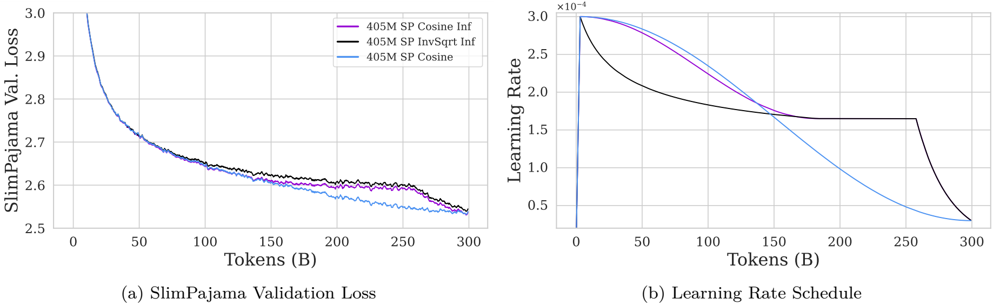

<b>图 8：无限学习率策略与余弦衰减策略的对比。我们使用两种新的策略，Cosine Inf 和 InvSqrt Inf，从随机初始化开始在300B SlimPajama tokens上训练一个405M参数的模型，并将这两种策略与余弦衰减基线进行比较。Cosine Inf 和 InvSqrt Inf 首先衰减到一个固定的常数学习率值，并在此之后保持不变，直到最后急剧衰减。因此，这些策略具有可以在不同的预训练阶段之间平滑过渡的优点，无需重新加热（re-warming）。我们发现所有方法都达到了类似的最终验证损失，这表明余弦衰减并不是获得良好性能的必要条件。</b> 

### 无限学习率策略：扩展到未来无限的更新

我们现在探讨在增量学习设置中，当多个新数据集出现时，无限学习率策略的作用。这些模型从随机初始化开始，使用不同的学习率调度在 3 个独立同分布（IID）的SlimPajama的100B子集上进行训练（例如，我们的三个数据集无偏移设置；参见第 5.2 节）。在这些初步实验中，我们专注于无偏移设置，并将弱偏移和强偏移的情况留待未来的工作。这个任务模拟了一种场景，在该场景中，来自相同分布的大量数据随着时间的增量接收，我们希望继续使用这些数据预训练我们的模型（例如，继续使用最新的网络爬虫抓取数据预训练模型）。为了使我们的结果适用于无法获得先前优化器状态的情况，我们在不同数据集之间不保留优化器的状态。图 9 报告了405M参数模型的训练曲线。

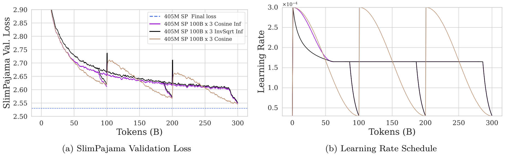

<b>图 9：在 3 个独立同分布（IID）的100B SlimPajama tokens子集上评估的无限学习率策略。该实验模拟了一种场景，即随着时间的推移，来自同一分布的新数据不断到达，研究人员希望在其模型上更新这些新数据。这些模型是从随机初始化开始训练的。我们注意到，在图 (b) 中，黑色和紫色的调度在大约80B tokens后重叠。</b> 

我们观察到所有的策略表现相对类似，但是两种无限学习率策略有一个优势，即我们可以在每个数据分割的恒定学习率阶段的任何时间开始退火，而余弦衰减策略则需要提前知道tokens的数量。此外，我们看到对于无限学习率调度，在不同数据集之间几乎不存在遗忘现象。虽然由于重新初始化优化器状态导致初始损失急剧增加，但无限学习率调度的模型能立即从中恢复过来。

在未来的工作中，研究无限学习率策略在存在分布偏移的增量学习情况中的影响将是有趣的，并探究在长时间的恒定学习率阶段下，使用大量tokens进行训练的稳定性。

总之，我们看到即使在相同的分布上训练，重新预热（re-warming）也可能损害性能，但替代余弦衰减的学习率策略的无限学习率策略可能会避免这些问题。此外，无限学习率策略提供了一种简单的方法来结束或恢复预训练，而不受特定tokens数量的限制。后面，我们应该会探索存在分布偏移的情况，以验证策略的有效性。

## 研究的局限性

总而言之，虽然我们对大型语言模型（LLMs）的增量预训练进行了全面的经验评估，但我们的工作还有一些局限性。以下是几个主要局限：

- 我们只研究了两种模型规模（405M参数和10B参数）；
- 我们没有在从德语通用爬虫抓取创建的德国训练和验证数据集之间进行去重；
- 我们主要研究了两个连续任务之间的转换；
- 我们没有在多个随机种子上运行实验；
- 我们关于无限学习率策略的实验仅限于405M参数规模，并且没有涉及分布偏移。

更明确地说，第1个局限是我们考虑的模型规模数量有限。虽然我们确实考虑了405M参数和10B参数的模型（比大多数研究都要大得多），但由于计算资源的限制，我们无法扩展到另一个数量级（例如，100B参数规模）。第2个局限是我们的德语验证集没有从德语训练数据中去重。尽管我们在选择训练和验证集时已经很小心地选取了不同的数据块，但两组数据之间可能存在一定的污染。然而，鉴于所有基线模型都能访问相同的数据集，我们认为我们的结果仍然是有效的。第3个局限是我们没有运行在多个连续任务上更新模型的实验。虽然我们认为研究这一点很重要，但我们旨在集中计算资源于不同的分布偏移和研究在大数据集间的转换，而不是使用大量的数据集。第4个局限是没有在多个随机种子上运行实验，因为这样做成本非常高，这意味着某些结果可能具有随机成分。也就是说，我们的LLM使用了很大的batch size（200M以上的tokens），因此梯度估计的方差很小。再加上从每个数据集抽取的样本在所有情况下都是按照相同的顺序处理的，我们认为我们的结果应该对由种子指定的随机初始化的变化相对稳定。第5个局限是，如果处理的tokens数量足够多，无限学习率策略可能最终变得次优，因为它们只有一个预热和冷却阶段，后续所有数据集上的学习可能等同于使用恒定的学习率，而这已被证明是次优的（参见图 3）。虽然图 9 显示，在相同数据集的独立同分布（IID）分割的情况下，退火阶段有助于从这种次优状态中恢复，但在更多的tokens或不同数据集之间存在分布偏移的情况下，这种情况是否依然成立还不清楚。因此，涉及分布偏移的实验以及更大规模的模型和数据集对于进一步测试这些无限学习率策略非常重要。最后，另一个重要的考量是在更大规模上探索使用此类策略进行预训练的稳定性（特别是，在没有微调的恒定学习率阶段）。

## 结论

在大型语言模型（LLMs）增量预训练背景下，我们已经看到学习率的重预热和重衰减对于新数据的适应性至关重要，并且发现在这个配置中，通过replay很容易减轻遗忘，似乎不会对适应性造成太大成本。鉴于它们强大的能力，可以同时增强模型对新数据的适应性和缓解原数据的遗忘，我们提出了简单且可扩展的组合策略，包括学习率重预热、学习率重衰减和replay，用于大规模增量预训练 LLMs。我们展示了这些策略使增量预训练能够在两种分布偏移（弱和强）以及两种模型规模（405M和10B参数）下实现与从头开始在所有数据上重新训练的模型平均性能相媲美的效果。经过进一步分析，我们认识到了学习率重预热的一个问题，并受到之前工作的启发，提出了无限学习率策略用于增量预训练LLMs。在初步实验中，我们的策略实现了与余弦衰减相当的性能，同时避免了学习率重预热的需求。

我们的发现表明，相较于从头开始重新训练，增量预训练是在新数据上更新大型语言模型（LLMs）的一种高效且有前景的替代方案。借助我们的策略，研究人员可以高效地在新创建的高质量数据集上更新他们现有的模型。这些策略也可能适用于像Gemma团队使用的预训练课程。随着社区强烈激励继续创建质量不断提高的数据集，我们预计对增量预训练的需求只会增加。

在后续工作中，深入研究无限学习率策略、在持续预训练期间扩展模型（例如，专家混合或块扩展），以及调整分词器以应对数据分布的重大变化将非常重要。此外，我们还想探索在多模态或视觉语言模型以及其他基于文本的生成模型中的增量预训练。我们注意到最近 Garg 等人（2023）在同一时期复制了本工作中讨论的技术的成功，但应用的是CLIP模型而非大型语言模型。我们也想探索在增量预训练设置下的replay缓冲区构建，但开源模型不会公开其训练数据集；我们猜测使用模型生成合成数据或进行知识蒸馏可能是构建replay缓冲区的一个有前景的方向。

## 更广泛的影响声明

大型语言模型在相关数据集上训练后能够表现优异，因此已在各行各业得到广泛采用。此外，数据集的改进（更好的过滤、更新知识等）对于提高 LLM 输出质量至关重要。因此，可以预料到，企业或机构将会投入大量的计算能力和能源来创建更强大的模型。这些能源的一部分可能会来源于非可再生资源。虽然本文中展示的实验从环境角度来看成本高昂，但正如文中所论述的，增量预训练是一种很有前景的方法，它能够显著减少更新模型所需的计算量，从而降低维护基础模型所需的能源消耗。
