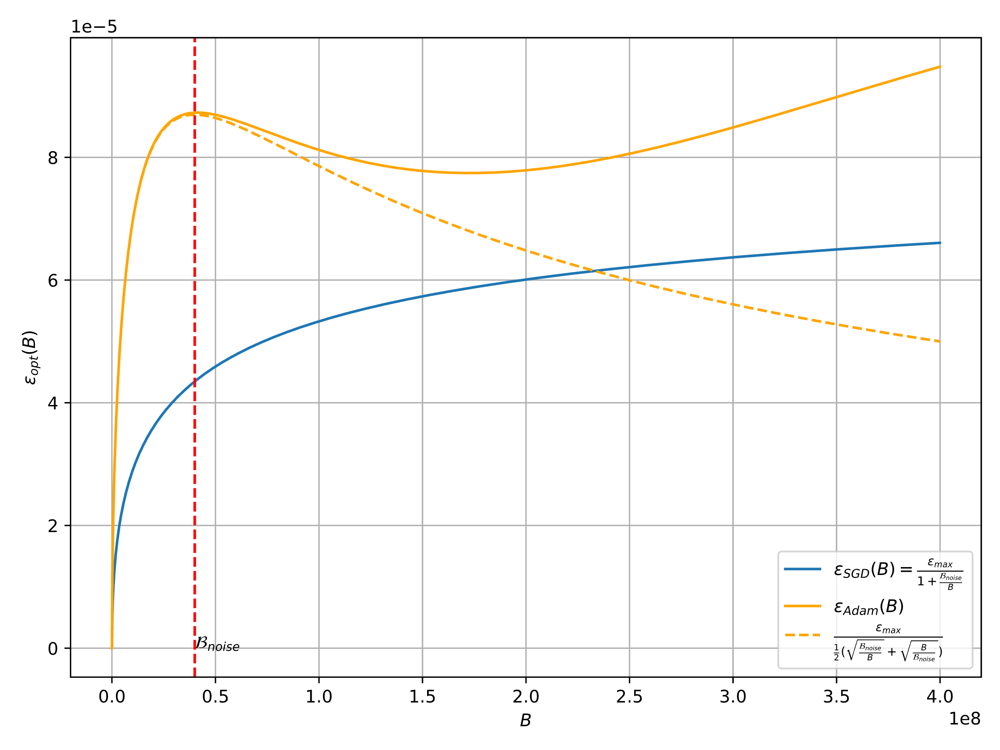
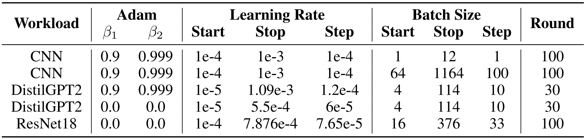
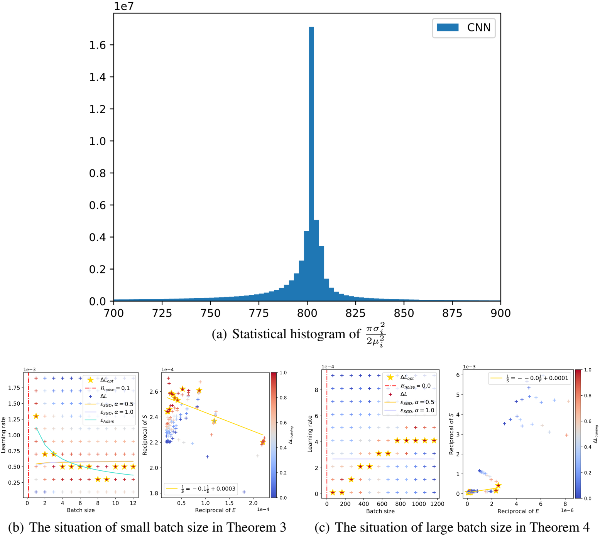
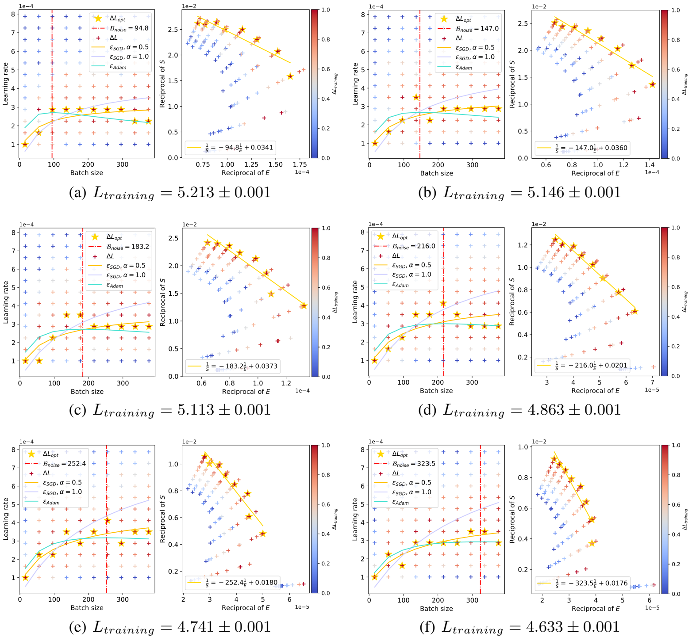
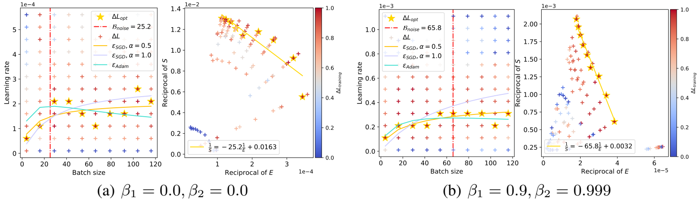

# 最佳学习率和Batch Size缩放中的激增现象

## 摘要

在当前的深度学习任务中，`Adam`类优化器（如`Adam`、`Adagrad`、`RMSprop`、`Adafactor`和`Lion`）作为`SGD`类优化器的替代品被广泛使用。这些优化器通常使用梯度的符号（梯度的正负方向）更新模型参数，从而产生更稳定的收敛曲线。学习率和`Batch Size`是优化器最关键的超参数，需要仔细调整才能有效收敛。以往的研究表明，对于`SGD`类型的优化器，最佳学习率会随着`Batch Size`的增加而线性增加（或遵循类似的规则）。然而，这一结论并不适用于`Adam`优化器。本文通过理论分析和大量实验，阐明了`Adam`类优化器的最佳学习率与批量大小之间的联系。首先，我们提出了使用梯度符号情况下`Batch Size`与最优学习率之间的比例规律，证明了随着`Batch Size`的增加，最优学习率会先上升后下降。而且，随着训练的进行，激增的峰值会逐渐向`Batch Size`大的方向移动。最后，我们在各种CV和NLP任务上进行了实验，验证了缩放规律的正确性。

## 引言

由在大型数据集上进行随机梯度下降（`SGD`）学习所引发的深度学习技术，极大地改变了现实时间中的各种应用。在过去十年中，为了稳定迭代学习过程并加快收敛速度，人们引入了许多优化器，如`momentum`、`Adagrad`、`ADADELTA`、`RMSprop`、`Adam`、`Adafactor` 和`Lion`。其中，`Adam`优化器在计算机视觉（CV）、自然语言处理（NLP）等多个领域得到了最广泛的应用。它保留了参数的第一矩估计（梯度的指数移动平均）和第二矩估计（梯度平方指数移动平均），便于调整自适应学习率。与使用原始梯度来确定学习方向和学习率不同，Adam及其变体（`Adagrad`、`RMSprop`、`Lion`等）采用梯度符号来确定学习方向和步长，从而确保了更高的稳健性。

除了优化器配置中的特定超参数外，`Batch Size`和学习率是影响收敛性的最关键超参数。随着各种Wrokloads（如CV、NLP等）中训练数据集规模的不断扩大，对跨多个数据并行工作进行大`Batch Size`训练的需求日益增加。然而，大`Batch Size`训练对训练稳健性和精细化调整提出了巨大挑战。学习率决定了每次学习迭代的实际步长，它与所使用的`Batch Size`密切相关。之前的研究探索了在使用`SGD`优化器的情况下，根据`Batch Size`确定最佳学习率的方法，包括平方根缩放、线性缩放等。其中，以大`Batch Size`训练为重点的模型在理论和实证方面都取得了令人信服的结果，并提出了以下规则来描述最佳学习率与`Batch Size`之间的关系：
$$
\epsilon_{opt}(B) = \frac{\epsilon_{max}}{1 + \frac{B_{noise}}{B}}
$$

对于Adam类优化器，虽然现有研究也提供了一些近似值，但它们未能捕捉到最佳学习率随`Batch Size`变化的真实缩放规律。如图 1 所示，我们给出了一条模拟Adam优化器真实最优学习率的曲线，它并不随`Batch Size`单调增加，而是先上升后下降，就像大海中的浪潮。本文旨在阐明Adam类优化器的最佳学习率与`Batch Size`之间的联系。通过沿用经验模型的符号并进行更深入的理论分析，我们发现在上述参数更新公式中，最优学习率与批量大小之间的关系满足：
$$
\epsilon_{opt}(B) = \frac{\epsilon_{max}}{\frac{1}{2}(\sqrt{\frac{B_{noise}}{B}}+\frac{B}{B_{B_noise}})}
$$

<b>图 1 : Adam和SGD的最佳学习率与Batch Size的关系不同。橙色线表示当Batch Size足够大时，最佳学习率趋于非零值。</b> 

在这里，$B_{noise}$ 的含义与缩放定律的论文一致，代表训练速度和数据效率之间的权衡点。当`Batch Size`等于$B_{noise}$时，根据公式 2，最优学习率会达到局部最大值，然后逐渐收敛到非零值。我们还证明，之前关于训练速度和数据效率的结论对于`Adam`优化器仍然有效，变量$B_{noise}$ 会随着训练的进行而逐渐增大。值得注意的是，当$B\ll B_{noise}$​ 时，对于`SGD`，最佳学习率随`Batch Size`的缩放规律为线性缩放，这与之前的结论一致：
$$
\epsilon_{opt}(B) \approx \frac{\epsilon_{max}}{B_{noise}}B
$$
而对于`Adam`来说，这种关系转变为平方根缩放，与之前的近似值一致：
$$
\epsilon_{opt}(B) \approx \frac{2\epsilon_{max}}{\sqrt{B_{noise}}}\sqrt{B}
$$
 

除了理论分析，我们对各种CV和NLPWrokloads进行的广泛实证研究也进一步验证了上述结论。在不同的Adam 配置中，真正的最佳学习率在达到峰值后，随着`Batch Size`的增加呈现出明显的下降趋势。这种行为与之前的研究相矛盾，但证明了我们理论的正确性和可推广性。实验还显示，随着训练的进行，与峰值最佳学习率相对应的变量$B_{noise}$也在逐渐增加。

## 理论研究

### Batch Size和最佳学习率

在本节中，我们将从理论上推导出给定`Batch Size`的最佳学习率。首先，我们介绍`Adam`类优化器的近似值。通过研究`Adam`优化器及其变体，我们可以发现它们与`SGD`的主要区别在于每次迭代更新时使用的是梯度的符号，而不是梯度本身：
$$
\theta_{i+1} = \theta_i - \epsilon \cdot sign(G_{est})
$$
其中，$\theta_t$是时间$t$的参数，$G_{est}$是通过`Mini Batch`估计的梯度，$\epsilon$是学习率。随着`Batch Size`的增加，随着`Batch Size`增加，更新量的预期值趋于饱和。例如，假设梯度的平均值为正，当`Mini Batch`的累积梯度为正时，增加`Batch Size`对有符号的更新量没有贡献。这与`SGD`的行为明显不同，在`SGD`中，`Batch Size`越大，梯度估计就越精确。在附录A中，我们将详细讨论`Adam`优化器的近似值。接下来，我们将推导出能使损失改善最大化的最优学习率。然后，我们建立了一个引理，解决了在估算出`Mini Batch`梯度的情况下的最优学习率问题：

**引理 1**。假设我们使用`Mini Batch`梯度$V$更新参数$\theta$，真实梯度为$G$，真实Hessian矩阵为$H$。那么，使损失减少最大化的最优学习率是：
$$
\epsilon_{opt} = argmax_{\epsilon}E[\Delta L] = \frac{G^TE[V]}{tr[H \cdot cov(V)] + E[V]^{T}HE[V]}
$$
相应的loss改善$\Delta L$为：
$$
\Delta L_{opt} = \frac{G^tE[V]}{2}\epsilon_{opt}
$$
证明见附录B

现在让我们考虑$V = sign(G_{est})$的情况，并假设估计梯度$G_{est}$遵循高斯分布。高斯分布假设的动机如下：如果`Mini Batch`的规模足够大，我们可以引用中心极限定理（CLT），将分布近视为高斯分布——这是以往研究中的一个常见假设。我们有如下定义：

**定理 2**假设每个样本参数$i$的梯度服从均值为$\mu_i$，方差为$\sigma_i^{2}$的高斯分布，且预期损失改善为：
$$
\Delta L_{opt} = \frac{1}{2} \frac{\sum_i\sum_j\xi_{i}\xi_j\mu_i\mu_j}{\sum_i(1 - \xi_i^2)H_{i,i} + \sum_i\sum_j\xi_i\xi_jH_{i,j}}
$$
相应的最佳学习率为：
$$
\epsilon_{opt} = \frac{\sum_i\xi_i\mu_i}{\sum_i(1-\xi_i^2)H_{i,i} + \sum_{i}\sum_{j}\xi_i\xi_jH_{i,j}}
$$
其中，$\xi_i$是一个与`Batch Size`$B$有关的函数（源自高斯误差函数）：
$$
\xi_i(B) = \frac{2}{\sqrt{\pi}}\int_0^{\sqrt{\frac{B}{2}}\frac{\mu_i}{\sigma_i}}e^{-t^2}dt \approx \frac{\frac{\mu_i}{\sigma_i}}{\sqrt{\frac{\pi}{2B} +(\frac{\mu_i}{\sigma_i})^2}{}}
$$
我们将在附录C中证明上述定理。

证明中的一个重要结论是，不仅$sign(G_{est})$的协方差矩阵与$B$有关，而且其期望值也取决于$B$。这意味着在公式6中，分子是关于$B$的函数的一阶形式，而分母是关于$B$的函数的二阶形式：
$$
\epsilon(B) = \frac{\beta f(B)}{f(B)^2 + \gamma} = \frac{\beta}{f(B) + \frac{\gamma}{f(B)}}
$$
因此，在$Adam$的案例中，不能简单地按照上文提到的形式得出结论：
$$
\epsilon(B) \neq \frac{\epsilon_*}{(1 + \frac{B_{nosie}}{B})^{\alpha}}
$$

然后，我们旨在通过以下定理推导出与`Batch Size`相关的最佳学习率的具体表达式。

**定理 3**。当$B \ll \frac{\pi\sigma_i^2}{2\mu_i^2}$时，最佳学习率是一个关于`Batch Size`$B$的函数：
$$
\epsilon_{opt}(B) \approx \frac{1}{\frac{1}{2}(\sqrt{\frac{B_{noise}}{B}}+\frac{B}{B_{noise}})} \frac{\sqrt{\frac{B_{noise}}{2\pi}}\sum_i\frac{\mu_i^2}{\sigma_i}}{\sum_iH_{i,i}} \leq \frac{\sqrt{B_{noise}\sum_i\frac{\mu_i^2}{\sigma_i}}}{\sum_iH_{i,i}}
$$
其中，$B_{noise}$是一个与`Batch Size`$B$无关的变量：
$$
B_{noise} = \frac{\pi\sum_iH_{i,i}}{2\sum_i\sum_j
\begin{cases}
\frac{\mu_i\mu_j}{\sigma_i\sigma_j}& i \neq j\\
0& i=j
\end{cases}}
$$
如果把$B_{peak}$定义为最佳学习率达到峰值时的`Batch Size`，那么很明显，$B_{peak}$就是最佳学习率达到峰值时的`Batch size`：
$$
B_{peak} = B_{noise}
$$
`peak`值为：
$$
\epsilon_{max} = \frac{\sqrt{\frac{B_{noise}}{2\pi}}\sum_i\frac{\mu_i^2}{\sigma_i}}{\sum_iH_{i,i}}
$$
我们将在附录D中证明该定理。根据该定理，我们最终可以得到公式2，这意味着存在一个区间，在该区间内，`Batch Size`变大，最佳学习率需要降低。考虑到$\frac{\pi\sigma_i^2}{2\mu_i^2}$远远大于科研和工业领域的正常`Batch Size`（如图 2 所示），该定理可以涵盖大多数情况。为了使结论更加全面，我们还推导出以下定理：

**定理 4**。当$B \gg \frac{\pi\sigma_i^2}{2\mu_i^2}$，最优学习率变为：
$$
\epsilon_{opt} = \frac{\sum_i|\mu_i|}{\sum_i\sum_jsign(\mu_i)sign(\mu_j)H_{i,j}}
$$
附录E提供了证明过程。

因此，当$B$无限增大时，最佳学习率最终会收敛到一个非零值。

如果我们对$\frac{\mu_i}{\sigma_i} \approx sign(\mu_i)$做一个（不切实际的）假设，就会发现定理3中的$\epsilon_{max}$下界将变成定理4中的$\epsilon_{max}$下界，这意味着最优学习率的局部峰值大于最终收敛值。但考虑到训练后期的梯度方差很小，使得上述结论$\frac{\mu_i}{\sigma_i} \approx sign(\mu_i)$难以成立，所以训练后期的稳定值更有可能难以成立，所以训练后期的稳定值更有可能超过局部最大值。我们在图 1 中提供了一条参考曲线。

### 数据/时间效率权衡

根据大`Batch Size`训练模型的经验，我们还回顾了在选择`Batch Size`时数据和时间效率之间的权衡。我们有如下定理：

**定理 5**。当$B \ll \frac{\pi\sigma_i^2}{2\mu_i^2}$，与$Batch Size$相关的Loss改善结果为：
$$
\Delta L_{opt}(B) = \frac{\Delta L_{max}}{1 + \frac{B_{noise}}{B}}
$$
其中$\Delta L_{max}$定义为：
$$
\Delta L_{max} = \frac{\sum_i\sum_j\frac{\mu_i^2\mu_j^2}{\sigma_i\sigma_j}}{2\sum_i\sum_j\begin{cases}
\frac{\mu_i\mu_j}{\sigma_i\sigma_j}& i \neq j\\
0& i=j
\end{cases}}
$$

我们在附录F中证明了这一定理。这一结果与`SGD`情况下得出的结论一致，表明许多相关结论也仍然有效。

从`SGD`优化器中得出的训练速度和数据效率之间的关系仍然成立（详见公式 2.11 和附录 D）：
$$
(\frac{S}{S_{min}}-1)(\frac{E}{E_{min}}-1)=1
$$
这里，$S_{(min)}$代表训练速度，即达到指定模型性能所需的实际（最少）步数；$E_{(min)}$代表数据效率，即达到相同性能水平所需的实际（最少）训练实例数。因为：
$$
B_{peak} = B_{noise} \approx B_{crit} = \frac{E_{min}}{S_{min}}
$$
$B_{noise}$不仅是最佳学习率的局部最大值，也是训练速度和数据效率之间的平衡点。此外，随着训练的进行，损失会逐渐减少，$B_{peak}$ 也会逐渐变大。

### 结论

在本节中，我们从理论分析中得出了以下几个结论：

1. 随着`Batch Size`的增大，最佳学习率在一定范围内呈下降趋势（公式 2）。
2. 与局部最大最优学习率相对应的`Batch Size`符合训练速度和数据效率的平衡点（公式 21）。随着训练的进行和损失的减少，$B_{peak}$ 会逐渐变大。

## 实验

在本节中，我们将进行一系列实验来证实我们在第 2 节中提出的理论缩放规律，并在第 3.1 节中详细介绍实验Wrokloads和配置。第 3.2 节阐明了根据我们的理论推导出估计变量的过程。我们还在第 3.3 节中展示并剖析了我们的缩放定律在各种Wrokloads中的适用性。

### 实验设置

**Workloads**。在实证研究中，我们采用了三种广泛使用的开源Wrokloads：(1) 在Fashion-MNIST数据集上训练一个 5层CNN模型，该数据集包含 10 个类别的 60000 张 28x28 灰度图像，这是一个典型的 CV 测试用例；(2) 在Tiny-ImageNet数据集上训练一个ResNet-18模型，该数据集包含100000张200个类别的图像（每个类别500 张），并缩小为64×64彩色图像。在每个`epoch`中，我们使用随机的10k个样本来训练模型，以降低整体复杂度；(3) 在ELI5-Category数据集上训练一个Transformer模型（简化的DistilGPT2），该数据集是原始ELI5数据集的一个较小但较新的分类版本。该数据集包含10.5k个复杂多样的问题，需要解释性的多句子答案。这些Wrokloads在学术界和工业界都很流行，涵盖了CV和NLP领域的典型深度学习任务。

**Batch Size和学习率**。为了展示每种Batch Size配置的最佳学习率，我们利用了网格搜索式实验集。网格搜索中的每个点都对应于具有相同配置但不同随机数种子的某一轮。表 1 列出了不同的Wrokloads起始点、停止点和时间间隔。

<b>表 1 : 网格搜索参数</b> 

**超参数**。由于我们是在`Adam`类优化器上得出这些定理的，因此我们使用`Adam`优化器进行了实验。我们对 ”梯度符号“配置$(\beta_1=0, \beta_2=0)$和默认超参数$(\beta_1=0.9,\beta_2=0.999)$进行了实验 ，结果如表1所示。

**硬件环境**。我们使用NVIDIA A100显卡执行每一轮实验。Fashion-MNIST数据集的每轮训练时间约为1小时，TinyImageNet约为1.5小时，ELI5-Category约为2小时。鉴于我们主要关注的是收敛过程，特定的硬件环境在我们的实验中并不重要。我们的理论分析和实证研究可以推广到其他硬件环境。

### 变量估计

我们试图通过曲线拟合来估计$B_{noise}$值和$\epsilon_{max}$的期望值。利用公式21简化公式20后（详见附录 G），我们可以算出达到与网格搜索结果中各`Batch Size`的最佳学习率相对应的指定性能水平而实际可能采取的步骤数$S $和实际可能处理的训练示例数$E$，然后进行线性拟合以获得$B_{noise}$的估计值：
$$
\frac{1}{S} = -B_{noise}\frac{1}{E} + \frac{1}{s_{min}}
$$
随后，我们利用网格搜索结果的最优学习率和`Batch Size`来估计Adam类的最大最优学习率期望$E[\epsilon_{max}]Adam$：
$$
E[\epsilon_{max}]Adam = E[\frac{\epsilon_{opt}}{2}(\sqrt{\frac{B_{noise}}{B}}+ \sqrt{\frac{B}{B_{noice}}})]
$$
`SGD`类优化器的期望$E[\epsilon_{max}]SGD$：
$$
E[\epsilon_{max}]SGD = E[\epsilon_{opt}(1 + \frac{B_{noise}}{B})^\alpha]
$$
以前的研究用公式分别表示了$\alpha = 1$和$\alpha=0.5$的`SGD`优化器和`Adam`优化器。我们将这些拟合曲线纳入下一节进行比较。

### 结果

根据第3.2节，我们首先利用观测数据估计变量并拟合曲线，然后对学习率和`Batch Size`进行网格搜索式实验。图2、图3和图4分别展示了CNN-FashionMNIST、ResNet18-TinyImageNet和DistilGPT2-ELI5Category的实验结果。每张图都分为两部分：右边的子图展示了估算结果，左边的子图描述了网格搜索结果。为了估算变量，我们使用不同的学习率和`Batch Size`从头开始训练模型，然后记录每次实验中的步骤数$S$和示例数$E$，以获得等效的训练损失。利用记录的$S$和$E$，我们拟合右侧子图中的曲线，得到估计的$B_{noise}$。在左侧子图中，在达到所需的训练损失后，所有实验继续以相同的步数进行训练。随后训练损失的任何减少都会以不同的颜色表示，如颜色条所示。对于每种`Bath Size`，我们都会突出显示能显著减少训练损失的最佳学习率。我们还绘制了与最佳学习率峰值相对应的$B_{noise}$、根据先前研究得出的$\alpha = 0.5$和$\alpha = 1$​的拟合`SGD`曲线，以及根据我们的定理得出的拟合`Adam`曲线。

<b>图 2 : 在FashionMNIST上训练的CNN模型的Batch Size与最佳学习率的关系</b> 

对于CNN-FashionMNIST Workloads，我们在达到所需的训练损失后再训练10步。如图2 (a) 所示，在该任务中，定理3的`Batch Size`约束$\frac{\pi\sigma_i^2}{2\mu_i^2}$约为 800。鉴于 CNN-FashionMNIST Workloads的简单性，常用的`Batch Size`通常小于`Batch Size`约束。我们在图2(b)和(c)中分别绘制了与定理3和定理4相对应的情况。在这两种情况下，我们的理论所预测的趋势与实际的最佳学习率性能是一致的，在`Batch Size`较小的情况下，学习率呈下降趋势，而在`Batch Size`较大的情况下，学习率呈饱和趋势。对于ResNet18-TinyImageNet Workloads，我们在达到理想的训练损失后再训练 50 步。如图3所示，我们绘制了定理3在不同训练损失下的数据，这些数据代表了训练的进度。观察到的最佳学习率主要在`Batch Size`超过估计的$B_{noise}$之后呈现下降趋势。虽然有工作声称$\alpha = 0.5$的`SGD`曲线代表`Adam`优化器在某些情况下是一个很好的近似值，但它无法像我们的`Adam`曲线那样捕捉到峰值最佳学习率。比较不同图中的红色虚线，我们可以发现，随着训练的进行，估计的$B_{noise}$会逐渐增加（即训练损失减少），这也印证了第 2.3 节中的第二个结论。

<b>图 3 : 在TinyImageNet上训练的ResNet-18模型，Batch Size与最佳学习率之间的关系。红色虚线准确预测了峰值，随着训练损失的减少，峰值逐渐右移。</b> 

对于DistilGPT2-Eli5Category Workloads，我们在达到所需的训练损失后再训练50步。如图4所示，我们针对定理3测试了两种不同的`Adam`配置：第一种配置为$\beta_1 = 0.0$，$\beta_2 = 0.0$；第二种配置为$\beta_1 = 0.9$，$\beta_2 = 0.999$。在这两种情况下，学习率都有希望导致损失大幅减少，这与我们的`Adam`曲线是一致的。值得注意的是，$\alpha = 0.5$​的另一条曲线`SGD`在这种情况下也提供了合适的近似值。这些实验证明，我们的定理可以推广到不同的优化器配置，从而验证了附录 A 中的分析。

<b>图 4 : 在以Eli5Category为基础进行训练的DistilGPT2中，Batch Size与最佳学习率之间的关系。</b> 

## 讨论

我们使用`Adam`优化器对具有代表性的Workloads进行了实证研究。在实际应用中，有许多不同的Workloads。本文讨论范围之外的其他因素也可能影响学习过程——所使用的特定优化器、权重衰减、梯度剪切等。虽然我们认为我们的定理可以应用于许多实际场景，但它可能无法完全涵盖涉及复杂训练配置的所有情况。

正如我们的结论之一所指出的，随着训练的进行，变量$B_{noise}$会逐渐增加。在可能的情况下，自然要采用自适应学习率（和$Batch Size$），以加快训练过程。正如文献中提到的，使用自适应`Batch Size`和预热学习率会带来相当大的好处。要充分发掘$Batch Size$和学习率调度的潜力，需要精心设计，这也是我们今后的工作重点。

## 相关工作

为了加快收敛速度，我们的工作分析了`Adam`优化器的最佳学习率与`Batch Size`的缩放规律。为了提高深度学习任务的收敛性，人们提出了许多相关研究，如研究最佳学习率、开发新的优化器、分析梯度噪声等。

早期的研究提出了各种缩放规律来调整`SGD`式优化器的学习率，包括平方根缩放、线性缩放等。他们还通过近似得到了`Adam`类优化器的缩放规律，揭示了一种类似平方根的关系，即最佳学习率随批量大小单调增加。然而，正如第1节和第2节所示，他们的分析仅适用于较小的批次规模，而真正的缩放规律则表现出更大的复杂性，最佳学习率在`Batch Size`平衡时达到峰值。

有许多针对不同任务和场景精心设计的优化器。一阶优化器在目前的深度学习模型中占主导地位，包括自适应方法、基于符号的方法、层智方法（用于大批量训练）。二阶优化器虽然有更强的理论保证，但由于与参数数量相关的二次方复杂性，对于大规模模型来说并不高效。尽管新的优化器不断涌现，但经验证据证实，在过去十年中，`Adam`仍然是使用最广泛、最有效的优化器。

我们的分析受到大`Batch Size`训练模型经验的启发，该模型利用梯度噪声尺度预测有效的。梯度噪声有助于确定学习率、选择`Batch Size`，以及深入了解收敛过程。

## 结论

在本文中，我们建立了`Adam`类优化器的最佳学习率与`Batch Size`之间的比例规律。我们从理论上证明，最佳学习率最初会随着批量大小的增加而增加，然后减小，而激增的峰值代表了训练速度和数据效率之间的权衡点。通过大量实验，我们在不同的深度学习模型和数据集上验证了我们的理论。