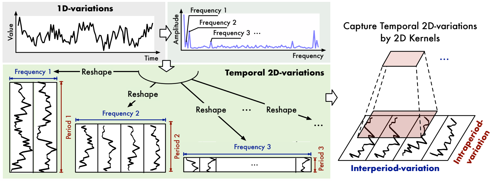

# TimesNet：用于一般时间序列分析的时间二维变化模型

## 摘要

时间序列分析在天气预报、异常检测和动作识别等广泛应用中具有极其重要的意义。本文重点研究时间变量建模，这是广泛分析任务的共同关键问题。以前的方法试图直接从一维时间序列完成此操作，由于错综复杂的时间模式，这极具挑战性。基于对时间序列中多周期的观察，我们将复杂的时间变化拆分为多个周期内（``intraperiod``）和周期间变化（``interperiod-variation``）。为了解决一维时间序列在表达能力上的局限性，我们将时间变化的分析扩展到二维空间，将一维时间序列转换为一组基于多周期的二维张量。这种转换可以将周期内和周期间的变化分别嵌入到二维张量的列和行中，使得二维变化很容易被二维核所模拟。在技术上，我们提出用``TimesNet``和``TimesBlock``作为时间序列分析的通用骨干。TimesBlock可以自适应地发现多周期性，并通过一个起始块从转换后的二维张量中提取复杂的时间变化。我们提出的TimesNet在5个主流的时间序列分析任务中取得了最先进的效果，包括短期和长期预测、插补、分类和异常检测。

## 简介

时间序列分析被广泛地应用于现实世界中，如用于天气预报的气象因子预测，数据挖掘的缺失数据插补，监测数据的异常检测用于工业维护和用于动作识别的轨迹分类。由于其巨大的实用价值，时间序列分析受到了极大的关注。

与语言或视频等其他类型的时序数据不同，时间序列是连续记录的，每个时间点只保存一些标量。由于单个时间点通常不能为分析提供足够的语义信息，因此许多工作着眼于时间变化，它的信息量更大，更能反映时间序列的内在属性，如连续性、周期性、趋势等。然而，现实时间时间序列的变化总是涉及复杂的时间模式，其中多种变化（例如上升、下降、波动等）相互混合和重叠，使得时间变化建模极具挑战性。

特别是在深度学习社区中，收益与深度模型强大的非线性建模能力，已经提出了许多工作来捕捉现实世界时间序列中的复杂时间变化。一类方法采用循环神经网络（RNN）对基于马尔可夫假设的连续时间点进行建模。然而，这些方法通常无法捕获长期依赖关系，并且它们的效率受到顺序计算范式的影响。另一类方法利用时间维度（TCN）上的卷积神经网络提取变化信息。此外，由于一维卷积核的局限性，它们只能模拟相邻时间点之间的变化，因此仍然无法解决长期依赖性问题。最近，具有注意力机制的Transformer被广泛用于序列建模。在时间序列分析中，许多基于Transformer的模型采用注意力机制或其变种来捕获时间点之间的成对时间依耐性。但是注意力机制很难直接从分散的时间点中找出可靠的依赖关系，因为时间依赖关系在复杂的时间模式中可能会被深深的掩盖。

在本文中，为了解决复杂的时间变化，我们从多周期性的新维度分析时间序列。首先，我们观察到现实时间序列通常呈现多周期性，例如天气观测的每日和每年变化，电力消耗的每周和季度变化。这些多个时期相互重叠和相互作用，使得变化建模变得棘手。其次，对于每个时期，我们发现每个时间点的变化不仅受其相邻区域的时间模式影响，而且与其相邻时期的变化高度相关。为了清晰可见，我们将这两种类型的时间变化分别命名为周期内变化和周期间变化。前者表示一段时间内的短期时间模式。后者可以反映连续不同时期的长期趋势。请注意，对于没有明确周期性的时间序列，变化将以周期内变化为主，相当于具有无限周期长度的时间序列。

由于不同时期会导致不同的周期内和周期间变化，多周期性自然可以推导出一种用于时间变化建模的模块化架构，我们可以在一个模块中捕获特定时期推导的变化。此外，这种设计使复杂的时间模式解开，有利于时间变化建模。然而，值得注意的是，一维时间序列很难同时明确地呈现两种不同类型的变化。为了解决这个障碍，我们将时间变化的分析扩展到2维空间。具体来说，如下图所示，我们可以将一维时间序列reshape为二维张量，其中每一列包含一个周期内的时间点，每一行包含不同周期之间同一阶段的时间点。因此，通过将一维时间序列转化为一组二维张量，我们可以打破一维空间中表达能力的瓶颈，成功的同一二维空间中周期内和周期间的变化，得到时间上的二维变化。

图1：时间序列的多周期性和时间二维变化。每个周期都包含周期内和周期间变化。我们将原始的一维时间序列转换为一组基于多个周期的二维张量，可以统一周期内和周期间的变化。

从技术上讲，基于上述动机，我们超越了以前的主干，提出了TimesNet作为时间序列分析的新任务通用模型。在TimesBlock的支持下，TimesNet可以发现时间序列的多周期性，并在模块化架构中捕获相应的时间变化。具体来说，TimesBlock可以根据学习的周期自适应地将一维时间序列转换为一组二维张量，并通过初始块进一步捕获二维空间中的周期内和周期间变化。在试验上，TimesNet在短期和长期预测、插补、分类和异常检测等5个主流分析任务中实现了一致的最新技术水平。我们的贡献总结为三方面：
 - 受时期内和时期之间的多周期性和复杂相互作用的推动，我们找到了一种用于时间变化建模的模块化方法。通过将一维时间序列转化到二维空间，我们可以同时呈现周期内和周期间的变化。
 - 我们建议带有TimesBlock的TimesNet来发现多个周期并通过初始块从转换后的二维张量中捕获时间二维变化。作为任务通用基础模型，TimesNet在五个主流时间序列分析任务中实现了最先进的效果。包括详细和有洞察力的可视化。

## 相关工作

作为时间序列分析的关键问题，时间变化建模得到了很好的探索。

许多经典方法假设时间变化遵循预定义的模式，例如ARIMA、Holt-Winter和Prophet。然而，现实时间时间序列的变化通常过于复杂，无法被预定义的模式所涵盖，从而限制了这些经典方法的实际适用性。

近年来，已经提出了许多用于时序建模的深度模型，例如基于MLP、TCN、RNN的模型。从技术上讲，基于MLP的方法沿时间维度采用MLP，并将时间依耐性编码为固定的MLP层数。基于TCN的方法通过沿着时间维度滑动的卷积核捕获时间变化。基于RNN的方法利用循环结构并通过时间步长之间的状态转换隐含的捕获时间变化。请注意，这些方法均未考虑本文提出的由周期性导出的时间二维变化。

此外，Transformers在时间序列预测方面边线出色。通过注意力机制，他们可以发现时间点之间的时间依耐性。特别是Autoformer提供自动关联机制，以根据学习的周期捕获时间序列依耐性。

此外，为了解决复杂的时间模式，Autoformer还提出了一个深度分解架构来获取输入序列的季节性和趋势部分。随后FEDformer采用混合专家设计来增强季节性趋势分解，并在频域内呈现稀疏注意力。与以前的方法不同，我们通过探索时间序列的多周期性来阐明复杂的时间模式，并首次通过计算机视觉主干捕捉2维空间中的时间变化。

同样值得注意的是，与以往的方法不同，我们不再局限于特定的分析任务，而是试图提出一个用于时间序列分析任务的通用基础模型。

## TimesNet

如上所述，基于时间序列的多周期性，我们提出了具有模块化架构的TimesNet来捕获从不同时期派生的时间模式。对于每个周期，为了捕获相应的周期内和周期间变化，我们在TimesNet中设计了一个TimesBlock，它可以将1维时间序列转换为2维空间，并通过初始模块同时对两种类型的变化进行建模。

### 将一维变化转化为二维变化

如图1所示，每个时间点同时涉及与其相邻区域和不同周期之间的同一相位的两类时间变化，即周期内变化和周期间变化。然而，这种原始的一维时间序列结构只能呈现相邻时间点之间的变化。为了解决这个限制，我们探索了时间变化的二维结构，它可以明确的呈现周期内个周期间之间的变化，从而在表达能力上更具优势，并有利于后续的表征学习。

具体的，对于长度为$T$的时间序列，记录了$C$个特征，原始的一维组织是$X_{1D} \in \mathbb{R}^{T \times C}$，为了表示周期间的变化，我们需要先发现周期。从理论上讲，我们通过快速傅里叶变换（FFT）分析频域中的时间序列如下：

$$
\mathbf{A}=\operatorname{Avg}\left(\operatorname{Amp}\left(\operatorname{FFT}\left(\mathbf{X}_{1 \mathrm{D}}\right)\right)\right),\left\{f_{1}, \cdots, f_{k}\right\}=\underset{f_{*} \in\left\{1, \cdots,\left[\frac{T}{2}\right]\right\}}{\arg \operatorname{Topk}}(\mathbf{A}), p_{i}=\left\lceil\frac{T}{f_{i}}\right\rceil, i \in\{1, \cdots, k\}
$$

其中$FFT(\cdot)$和$Amp(\cdot)$表示FFT和振幅值的计算。$A \in R$表示每个频率的计算振幅，它是从$C$维度通过$Avg(\cdot)$平均得到的。请注意，第$j$个值$A_j$表示频率为$j$的周期性基函数的强度，对应于周期长度$j$。考虑到频域的稀疏性，避免无意义的高频带来的噪声，我们只选择$top-k$振幅值，得到最显著的频率${f1,\cdots,f_k}$具有非归一化振幅$\{A_{f_1},\cdots,A_{f_k}\}$，其中$k$是超参数，这些选定的频率也对应于$k$个周期长度${p_1,\cdots,p_k}$。由于频域的共轭性，我们只考虑$\{1,\cdots, [\frac{T}{2}]\}$。我们将上述等式总结如下：
$$
\mathbf{A},\left\{f_1, \cdots, f_k\right\},\left\{p_1, \cdots, p_k\right\}=\operatorname{Period}\left(\mathbf{X}_{1 \mathrm{D}}\right)
$$
基于选择的频率$\{f_1,\cdots,f_k\}$和相应周期长度$\{p_1,\cdots, p_k\}$，可以重塑一维时间序列$X_{1D} \in \mathbb{R}^{T \times C}$通过以下等式转换为多个二维张量：
$$
\mathbf{X}_{2 \mathrm{D}}^i=\operatorname{Reshape}_{p_i, f_i}\left(\operatorname{Padding}\left(\mathbf{X}_{1 \mathrm{D}}\right)\right), i \in\{1, \cdots, k\},
$$
其中$Padding(\cdot)$将时间序列沿时间维度补0，使其兼容$\operatorname{Reshape}_{p_i, f_i}(\cdot)$，其中$p_i$和$f_i$分别表示变换后的二维张量的行数和列数。注意$X_{2D}^{i} \in \mathbb{R}^{p_i \times f_i \times C}$表示第$i$个基于频率$f_1$变换的时间序列，其列和行分别表示相应周期长度$p_i$下的周期内变化和周期间变化。最终，如图2所示，根据选定的频率和估计的周期，我们获得了一组二维张量$\{X_{2D}^1,\cdots,X_{2D}^k\}$，它表示由不同周期导出的$k$个不同的时间二维变化。

图二：说明时间序列中二维结构的单变量示例。通过发现周期性，我们可以将原始的一维时间序列转换为结构化的二维张量，二维核可以方便的对其进行处理。通过对时间序列的所有变量相同的重塑操作，我们可以将上述过程扩展到多变量时间序列。

还值得注意的是，这种变换给变换后的二维张量带来了两种类型的局限性，即相邻时间点（列，周期内变化）和相邻周期（行，周期间变化）之间的局部性。因此，时间二维变化可以很容易的由二维内核处理。

### Times Block

如图3所示，我们以残差连接的方式组织TimesBlock。具体来说，对于长度为T的一维输入时间序列$X_{1D} \in \mathbb{R}^{T \times C}$，我们在一开始就通过嵌入层$X_{1D}^{0} = Embed(X_{1D})$将原始输入投射到深度特征$X_{1D}^0 \in \mathbb{R}^{T \times d_{model}}$。对于TimesNet的第$l$层，输入是$X_{1D}^{l-1} \in \mathbb{R}^{T \times d_{model}}$，这个过程可以被正式描述为:
$$
\mathbf{X}_{1 \mathrm{D}}^l=$ TimesBlock $\left(\mathbf{X}_{1 \mathrm{D}}^{l-1}\right)+\mathbf{X}_{1 \mathrm{D}}^{l-1}
$$
如图3所示，对于第$l$个TimesBlock，整个过程包括两个连续的部分：捕捉时间上的二维变化和适应性地聚合不同时期的表征。

捕捉时间上的二维变化：与上述方程类似，我们可以通过$period(\cdot)$来估计深层特征$X_{1D}^{l-1}$的周期长度。基于估计的周期长度，我们可以对一维时间序列进行转换到二维空间，并得到一组二维张量，我们可以通过参数有效的入座块方便地从这些张量中获得信息表示。这个过程形式化为：
$$
\begin{aligned} & \mathbf{A}^{l-1},\left\{f_1, \cdots, f_k\right\},\left\{p_1, \cdots, p_k\right\}=\operatorname{Period}\left(\mathbf{X}_{1 \mathrm{D}}^{l-1}\right) \\ & \mathbf{X}_{2 \mathrm{D}}^{l, i}=\text { Reshape }_{p_i, f_i}\left(\operatorname{Padding}\left(\mathbf{X}_{1 \mathrm{D}}^{l-1}\right)\right), i \in\{1, \cdots, k\} \\ & \widehat{\mathbf{X}}_{2 \mathrm{D}}^{l, i}=\operatorname{Inception}\left(\mathbf{X}_{2 \mathrm{D}}^{l, i}\right), i \in\{1, \cdots, k\} \\ & \widehat{\mathbf{X}}_{1 \mathrm{D}}^{l, i}=\operatorname{Trunc}\left(\operatorname{Reshape}_{1,\left(p_i \times f_i\right)}\left(\widehat{\mathbf{X}}_{2 \mathrm{D}}^{l, i}\right)\right), i \in\{1, \cdots, k\} \\ & \end{aligned}
$$
其中，$X_{2D}^{l,i} \in \mathbb{R}^{p_i \times f_i \times d_{model}}$是第i个转化的二维张量。变换后，我们通过初始模块其中，$X_{2D}^{l,i} \in \mathbb{R}^{p_i \times f_i \times d_{model}}$是第i个转化的二维张量。变换后，我们通过parameter-efficient inception模块对二维张量进行处理，即$Inception(\cdots)$，它涉及多尺度的二维核，是最被公认的视觉主干之一。那么我们将学到的二维表征$\hat{X}^{l,i}_{2D}$转回一维空间$\hat{X}^{l,i}_{1D} \in \mathbb{R}^{T \times d_{model}}$进行聚合，其中我们使用$Trune(\cdot)$将长度为$(p_i \times f_i)$的填充序列截断为原始长度$T$。

需要注意的是，受益于一维时间序列的转换，起始块中的二维内核可以同时聚合多尺度的周期内变化（列）和周期间变化（行），覆盖相邻的时间点和相邻的时期。此外，我们对不同的重塑二维张量$\{X_{2D}^{l,1},\cdots,X_{2D}^{l,k}\}$采用共享权重的起始块，以提高参数效率，使模型大小不受超参数$k$的选择。

自适应聚合，最后，我们需要融合$k$个不同的一维表达$\{\hat{X}_{1D}^{l,1},\cdots,\hat{X}_{1D}^{l,k}\}$给下一层。受自动相关的启发，振幅A可以反映选定频率和周期的相对重要性，从而对应于每个转换的二维张量的重要性。因此，我们根据振幅来汇总一维表达：

$$
\hat{A}_{f_1}^{l-1}, \cdots, \hat{A}_{f_k}^{l-1} = Softmax\left(A_{f_1}^{l-1},\cdots,A_{f_k}^{l-1}\right)\\
X_{1D}^{l} = \sum^{k}_{i = 1}\hat{A}^{l-1}_{f_i} \times \hat{X}_{1D}^{l,i}
$$

由于周期内和周期间的变化已经涉及多个高度结构化的二维张量，TimesBlock可以完全捕获多尺度时间二维变化，因此，与直接从一维时间序列相比，TimesNet可以实现更有效的表征学习。

2D视觉主干的通用性受益于从1D时间序列到时间2D变化的转换，我们可以选择各种计算机视觉主干来代替用于标识学习的初始块，例如广泛使用的ResNet和ResNeXt、advanced ConvNeXt和基于注意力的模型。因此，我们的时间2D变化设计也将1D时间序列与蓬勃发展的2D视觉骨干连接起来，使时间序列分析利用计算机视觉社区额的发展。一般来说，用于标识学习的更强大的2D主干将带来更好的性能。考虑到性能和效率（图4 右），我们基于parameter-efficent inception块进行主要实验，如上述等式所示。

图4：模型性能比较（左）和不同视觉主干中的通用性（右)

## 实验

为了验证TimesNet的通用性，我们在五个主流任务上进行了广泛的实验，包括短期和长期预测、插补、分类和异常检测。

实施，下表是基准的总结。有关数据集、实验实施和模型配置的更多详细信息，请参见附录。

基准，由于我们试图为时间序列分析提出一个基础模型，我们在所有五个任务中广泛地比较了公认的先进模型，包括基于RNN的模型以及其变种：LSTM、LSTNet和LSSL；基于CNN的模型：TCN；基于MLP的模型：LightTS和DLinear；基于Transformer的模型：Reformer、Informer、Pyraformer、Autoformer、FEDformer、Non-stationary Transformer和ETSformer。此外，我们还比较了每个具体任务的最先进的模型，如短期预测的N-HiTS和N-BEATS，异常检测的Anomaly Transformer，分类的Rocket和Flowformer等等。总的来说，包括15个以上的基线来进行综合比较。

### 主要结果

作为基础模型，TimesNet与其他定制模型相比，在五个主流分析任务上取得了一致的最先进性能（图4 左）。完整的效率比较见附录。此外，通过用更强大的视觉骨干来替代初始块，我们可以进一步提升TimesNet的性能（图4 右），证实了我们的设计可以使时间序列分析利用蓬勃发展的视觉骨干的优势。

### 短期和长期预测

设置：时间序列预测在天气预报、交通和能源消耗规划中是必不可少的。为了全面评估模型在预测中的表现，我们采用了两类基准，包括长期预测和短期预测。特别是对于长期预测设置，我们遵循Autoformer中使用的基准，包括ETT、Electricity、Traffic、Weather、Exchange和ILI，覆盖五个真实世界的应用。对于短期数据集，我们采用M4，它包含了每年、每季度和每月收集的单变量营销数据。请注意，长期预测设置中的每个数据集只包含一个连续的时间序列，我们通过滑动窗口获得样本，而M4涉及100000个以不同频率收集的不同时间序列。

结果，TimesNet在长期和短期设置中都表现出了很好的性能。具体来说，在长期预测中，TimesNet在80%以上的情况下达到了最先进的水平。对于M4数据集，由于时间序列是从不同的来源收集的，时间上的变化可能是相当多样的，使预测更具挑战性。我们的模型在这项任务中仍然表现最好，超过了广泛的基于MLP和基于Transformer的先进模型

### 插补

设置，现实世界的系统总是连续工作，并由自动观测设备监测。然而，由于故障，收集的时间序列可能部分缺失，使得下游的分析变得困难。因此，归因法在实际应用中被广泛使用。在本文中，我们选择了电力和气象场景中的数据集作为基准，包括ETT、UCI、Weather，这些数据集的缺失问题普遍存在。为了比较不同比例的数据缺失下的模型能力，我们按照{12.5%、25%、37.5%、50%}的比例随机屏蔽时间点。

结果，由于时间点的缺失，估算任务要求模型从不规则和部分观察的时间序列中发现内在的时间模式。如表4，我们提出的TimesNet在这个困难的任务重仍然达到了一致的最先进水平，验证了模型从极其复杂的时间序列中捕捉时间变化的能力。

### 分类

设置，时间序列分类可用于识别和医疗诊断。我们采用序列级分类来验证模型在高级代表学习中的能力。具体来说，我们从UEA时间序列分类档案中选择了10个多变量数据集，涵盖了手势、动作和音频识别，通过心跳监测进行医疗诊断和其他实际任务。然后，我们按照Zerveas论文中的描述对数据集进行预处理，其中不同的子集有不同的序列长度。

图5：分类中的模型比较，Transformer中的“*”标识 *former模型的名称，结果是来自10个UEA子集的平均数。

结果，如图5所示，TimesNet取得了最好的成绩，平均准确率为73.6%，超过了之前最先进的经典方法Rocket（72.5%）和深度模型Flowformer（73.0%）。另外，基于MLP的模型DLinear在这项分类任务中也失败了（67.5%），它在一些时间序列预测数据集中表现良好。这是因为DLinear在时间维度上只采用了一个单层MLP模型，这可能适用于一些具有固定时间的自动渐进任务。但在学习高层表征时，会有很多退化，相比之下，TimesNet将时间上的二维变化整合到二维空间中，便于通过二维核学习信息表征，从而有利于需要分层表征的分类任务。

### 异常检测

设置，从监测数据中检测出异常情况对工业维护至关重要。由于异常情况通常隐藏在大规模的数据中，使得数据标记变得很困难，因此我们专注于无监督的时间序列异常检测，也就是检测异常的时间点。我们在五个广泛使用的异常检测基准上比较模型：SMD、MSL、SMAP、SWaT、PSM，涵盖服务监测、空间和地球探索以及水处理应用。按照Anomaly Transformer的预处理方法，我们通过滑动窗口将数据集分割成连续的非重叠段。在以前的工作中，重建是无监督的点式表征学习的一个经典任务，其中重建误差是一个自然的异常标准。为了进行公平的比较，我们只改变了重建的基础模型，并将经典的重建误差作为所有实验的共同异常标准。

结果，表5显示，TimesNet在异常检测方面仍然取得了最好的性能，超过了基于Transformer的高级模型FEDformer和Autoformer。经典的Transformer在这项任务中表现较差（平均F1分数为76.88%）。这可能来自于异常检测要求模型找出罕见的异常时间模式，而虚无的注意力机制计算每对时间点之间的相似性，这可能会被主导的正常时间点所干扰。此外，通过考虑到周期性，TimesNet、FEDformer和Autoformer都取得了很好的性能。因此，这些结果也证明了周期性分析的重要性，它可以突出违反周期性的隐形变化，进一步有利于异常情况的检测。

### 模型分析

表征分析，我们试图从表征学习方面来解释模型性能从图6中，我们可以发现，预测和异常检测中较好的性能对应于较高的CKA相似度，这与插补和分类任务相反。请注意，较低的CKA相识度意味着不同层之间的表征是有区别的，即分层特征。因此这些结果也表明了每个任务所需要的表征属性。如图6所示，TimesNet可以为不同的任务学习适当的表征，例如在异常检测中用于预测和重建的低层次表征，以及用于归纳和分类的层次表征，相比之下，FEDformer在预测和异常检测任务中表现良好，但在学习分层表征方面却失败了，导致在插补和分类表现不佳。这些结果也验证了我们提出的TimesNet作为基础模型的任务通用性。

图6：四个任务中的表征分析。对于每个模型，我们计算第一层和最后一层的表征之间的中心核对齐（CKA）相似度。更高的CKA相似度表示更多的相识表征。TimesNet用红星标记。

时间二维变化，我们在图7中提供了一个时间性二维变化的案例研究。我们可以发现，TimesNet可以准确地捕捉到多周期性的特征。此外，转换后的二维张量具有高度的结构性和信息性，其中的列和行可以分别反映周期内和周期间之间的局部性，支持我们采用二维核进行表示学习的动机。更多可视化信息见附录

## 结论和未来工作

本文介绍了TimesNet，作为时间序列分析的一个任务通用基础模型，在多周期性的激励下，TimesNet可以通过一个模块化的结构来揭示复杂的时间变化，并通过一个parameter-efficient inception来捕捉二维空间中周期内和周期间变化。实验表明，TimesNet在五个主要数据流分析任务重展现出很好的通用性和性能。在未来，我们将进一步探索大规模的时间序列预训练方法，这些方法利用TimesNet作为骨干，可以普遍惠及广泛的下游任务