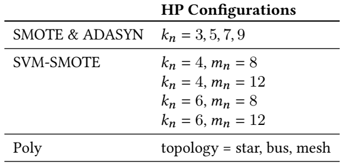

# To SMOTE, or not to SMOTE

## 摘要

在训练分类模型之前平衡数据是解决表格数据中不平衡二元分类任务的流行技术。平衡通常是通过复制少数样本或生成合成少数样本来实现的。虽然众所周知，平衡对每个分类模型的影响不同，但大多数先进的实证研究并未将强大的最先进（SOTA）分类模型作为基线。在这项工作中，我们研究了平衡技术是否有益，特别是在SOTA分类模型的背景下。因此，我们考虑了以前研究中使用的较弱学习器的三个SOTA分类模型进行实验。此外，我们仔细辨别适当的指标、一致和不一致的算法以及超参数选择方法，并证明了这些对预测质量和平衡技术的有效性有重大影响。我们的结果支持弱分类器平衡技术的已知下过。然而，我们发现平衡技术并不能提高强分类模型的预测性能。我们进一步确定了平衡技术有效的其他几种场合。

## 引言

在二元分类问题中，分类器的任务是将每个样本分类到两个类别之一。当多数类中的样本数量远大于少数类中的样本数量时，数据集被认为是不平衡的。这种偏度被认为是具有挑战性的，因为分类器训练过程和用于评估分类质量的通用指标往往偏向于大多数类别。

人们提出了许多指标来解决不平衡二元分类的问题，例如Brier分数、AUC、$F_\beta$和AM。它们都是非对称的，并且与多数样本相比，将少数样本错误分类会导致更高的损失。根据用于计算这些指标的基础预测，这些指标可以分为两组：（1）使用预测的类别概率（例如AUC和Brier分数）计算概率指标；（2）基于预测标签（例如$F_\beta$、balanced-accuracy和Jaccard相似系数）

机器学习分类模型通常优化对称目标函数，该函数将相同的损失与少数和多数样本相关联。因此，考虑到不平衡的分类问题，如前所述，分类模型的对称优化和非对称分数之间似乎存在差异，这可能会导致最终训练模型中存在偏差。

另一方面，对指标和算法的理论研究表明，上述差异可能根本不会妨碍预测性能；请参阅第 2 节。总而言之，这些理论结果表明，当考虑指标或分类模型时，优化对称目标函数（通常是对数损失）会导致优化非对称指标，这表明不需要处理数据不平衡。此外，一些研究提出，偏态类别分布并不是阻碍不平衡数据集预测质量的唯一（甚至主要）因素，而是由于不平衡数据中常见的其他现象而产生的困难。这些其他影响因素可能是样本量小、类别可分离性问题、噪声数据、数据漂移等。

根据这些理论结果和想法，我们重新审视了对解决不平衡数据挑战所提出的技术的实证评估。这些技术大致可分为三种：（1）预处理，在训练分类器之前增强数据，通常是为了更加平衡；（2）专门针对不平衡数据的分类模型。在许多情况下，这是通过增加目标函数中少数样本的权重来实现的；（3）后处理，其中分类模型预测在推理过程中得到增强。由于情况（1）广泛流行，我们专注于重新评估预处理的效用。

最简单的平衡方法是通过复制少数样本对少数类进行过采样，或者通过随机删除多数样本对多数类进行欠采样。将合成少数样本添加到表格数据中的想法首先在 SMOTE中提出，其中合成少数样本是通过对原始少数点进行插值来创建的。 SMOTE 非常受欢迎，并且还提出了超过100个SMOTE扩展和变体。请参阅（Fernández 等人，2018）对类似 SMOTE 方法的全面调查，以及（Tarawneh 等人，2022）了解平衡在社区中受欢迎程度的其他统计数据。

为了评估平衡和类似SMOTE方案的实用性，我们进行了广泛的实验，除其他技术细节外，还辨别适当的指标、分类模型；考虑几种超参数（HP）调整方案；并包括强大的 SOTA 分类器。虽然众所周知，平衡对每个分类器的影响不同，但据我们所知，这是第一次大规模的平衡评估，其中包括强大的现代分类器作为基线。此外，包含这些强大的分类器很重要，因为它们在所有测试的方法中产生最佳的预测质量。

我们的主要成果和贡献是：
 - 据我们所知，这是第一个以SOTA 分类器作为基线的大规模平衡研究。具体来说，我们使用lightGBM、XGBoost和Catboost。

我们的实验表明：
 - 平衡技术可以提高弱分类器的预测性能，但不能提高 SOTA 分类器的预测性能。
 - 强分类器（不使用平衡技术）比使用平衡技术的弱分类器能产生更好的预测质量。

当目标使用标签度量时，根据实验表明，对于强分类器：
 - 我们确定了类似SMOTE 过采样可以提高预测性能并且应该应用的几种场景。
 - 我们将实证结果与理论基础联系起来，并表明在常见假设下，AUC是较为合适的目标函数。虽然这是之前工作的直接推论，但据我们所知，我们是第一个明确声明这一点的人。

## 指标和模型

在本节中，我们讨论指标和算法，它们对性能特别是平衡的有效性有很大影响。然后我们证明，在常见假设下，AUC 指标是合适的。

现代机器学习分类器通常旨在通过优化对称逻辑损失（logloss）来预测潜在概率。例如，流行的增强森林方法 XGBoost、Catboost和LightGBM默认优化对数损失。神经网络方法通常优化softmax损失，当类别数为2时，其相当于对数损失。因此，当使用标签度量时，需要将预测的类概率转换为类预测。这通常是通过使用决策阈值来完成的，即，如果预测为正的概率高于预定阈值，则样本被预测为正，否则为负。正如我们将在下面讨论的，决策阈值可以显着影响性能，正确选择它非常重要。

### ROC-AUC

在机器学习中，通常假设组成数据集的观测值是从未知分布中 i.i.d.（独立同分布） 抽样的。虽然 AUC 通常并不合适，但下面的定理 1 指出，在该假设条件下，AUC 是合适的。

定理 1 （AUC是合适的）：预测真实概率$Pr[y_i=1|x_i]$的模型可优化从分布中取样的$N$组观测值$(x_i,y_i)_{i=1}^N$的预期 AUC。

证明：从分布中 i.i.d. 取样获得大小为$N$的数据集的过程可分为两个阶段：（1）从分布中 i.i.d. 取样$N$个特征向量$\{x_i\}_{i=1}^N$；（2）从相应的边际分布$y_i|x_i$中独立地取样每个标签$y_i$。考虑到这一过程，定理1 是（Byrne，2016 年）定理 7 的直接推论，下文重述为定理 2。

定理 2 ：预测真实概率$Pr[y_i=1|x_i]$的模型可以优化任意$N$个特征向量集合$(x_i)_{i=1}^N$的预期AUC，其中标签$y_i$均为 i.i.d 采样。

## 实验设置

在本节中，我们描述研究中使用的实验设置。

### 数据

我们考虑了Kovács的104个数据集和不在Kovács中不平衡学习的24个数据集。我们删除了Catboost获得AUC分数非常高的48个数据集。对于其中的19个数据集，AUC分数为1，对于其中的29个数据集，得分高于0.99。我们删除了这些数据集，因为我们的目标是测试提高预测性能的平衡方法，对AUC分数几乎完美的数据集进行改进是不合理的。由于各种技术原因，另外的7个数据集被删除：数据集winequality-white-9_vs_4、zoo-3 和 ecoli-0-1-3-7_vs_2-6 的数据少于8个样本导致 SMOTE 失败。在 keel 存储库中未找到数据集 habarman，而 winequality-red-3_vs_5 的AUC分数为0。SVM-SMOTE对于winequality-red-8_vs_6-7和poker-9_vs_7 失败，因此它们也被删除。最后，我们对剩余的73个数据集进行了实验。

### 预处理

字符串特征被编码为序数整数。没有对数字特征进行预处理。目标多数类用0编码，少数用1编码。

### 过采样器

我们尝试了以下常见的过采样器：

**Random Oversampling（Random）**，其中少数样本是随机重复的。

**SMOTE**

**SVM-SMOTE（SVM-SM）**，SMOTE变体旨在使用和方法在决策线附近合成少数样本。

**ADASYN**，一种自适应合成过采样方法，旨在难以预测的特征空间区域中创建少数样本。

**Polynomfit SMOTE（Poly）**，SMOTE的一个变体，因其在实验中的卓越性能而被选中。

### 分类模型

我们对7个分类模型进行了实验。使用简单的决策树是因为它与许多其他SMOTE研究中使用的C4.5算法相似。根据（Kovács，2019；López 等人，2013）的实证研究，考虑了支持向量机（SVM）和多层感知器（MLP）分类器。 Adaboost（Schapire，1990）被包含在内，因为许多不平衡数据的增强方法都是基于它的（Galar et al.，2011；López et al.，2012）。最后，使用了三种 SOTA boosted 森林算法：XGBoost（Chen 和 Guestrin，2016）、Catboost（Prokhorenkova 等人，2018）和 lightGBM（Ke 等人，2017）。对于每个分类器，考虑了四种 HP 配置，请参见表 1。

表1：实验中使用的分类模型HP配置。

### 评价指标

我们尝试了适当的概率指标：AUC、对数损失和Brier分数；并具有以下标签指标： $F_1$、$F_2$ 、Jaccard相似系数和balanced accuracy。对于标签指标，我们通过使用固定决策阈值0.5来评价分类模型，并通过优化验证集上的决策阈值来评价分类模型。

### 超参数

所有的平衡技术都有一些需要设置的HP。例如，所有平衡技术共有的一个重要特征是正样本和负样本之间的期望比率，换句话说，即生成多少少数样本。常见的HP选择实践是使用在测试数据上产生最佳结果的HP集。例如，在 (Kovács, 2019) 的大型实证研究中以及首次提出SMOTE时，就使用了这种做法。当科学家以前有类似数据的经验并且知道如何正确设置HP时，这可能是合理的。当不存在此类先验知识时，通常会在验证集上优化HP。我们将表示前者的实践先验HP和后者的验证 HP。我们实验中使用的过采样器HP详细信息如表 2 所示。

表2：实验中使用的过采样器HP配置。

### 方法

每个数据集被随机分为训练、验证和测试部分，比例分别为 60%、20% 和 20%。为了评估过采样方法，使用每个过采样器对训练集进行过采样。每个分类模型都在增强后的训练集上进行训练，并在适用时提前停止（未增强）验证集。对于标签指标，为了使分类模型保持一致，根据（Menon et al., 2013）中的建议，在验证集上优化了阈值。最后，计算验证和测试集的指标。对于每组（数据集，过采样器，过采样器-HP，分类器，分类器-HP），使用不同的随机种子和不同的数据分割重复实验七次。

## 实验结果

接下来，展示实验结果，这些结果是使用第3节中描述的实验设置获得的。在我们的研究中，我们试图了解平衡技术对预测性能的影响，考虑几个因素，包括 (i) 弱分类器与强分类器； (ii) 先验 HP 与验证 HP； (iii) 平衡技术与优化标签指标的决策阈值。

### 先验HP与验证HP

首先我们研究HP对过采样器性能的影响。为了避免标签指标带来的复杂性以及选择决策阈值的需要，我们使用 AUC，这是合适的（也是流行的）指标。图 1(a) 和 1(b)分别展示了先验HP和验证HP的AUC结果。紫色点代表平均AUC，橙色三角形对应平均排名（越低越好），两者都是在所有数据集和随机种子上得到的。误差线对应于随机种子平均值或排名的一个标准差。我们遵循（López et al., 2013）并展示排名，因为对平均分数的分析可能对异常值很敏感：分数非常高或低的单个数据集可能会对平均分数产生很大影响。该图垂直分为七个部分，每个部分对应一个分类模型。在每个图中，第一个值标记为“+Default”，是在没有任何数据增强的情况下训练的默认HP的分类模型。这是作为健全性检查添加的，以验证我们的HP优化流程的有效性。第二个值是基线，即具有优化HP且没有使用平衡技术的分类模型。其余五个值对应于使用各种方法对训练数据进行过采样得到的分数。

图1：平均AUC和排名（a）使用先验HP和（b）使用验证HP。紫色点代表所有数据集的平均AUC，橙色三角形对应于排名（越低越好）。正如上面所说明的，在考虑验证HP时，对数据进行过采样并不会为强分类模型带来显著改进。

借助图1（a）所示的先验HP，四种SMOTE变体都实现了比各自基线更好的预测质量。它们也比简单的随机过采样器更好。根据（Kovács，2019）的结果，在四种 SMOTE 变体中，Poly的表现稍好一些。值得注意的是，平衡技术会大大增加样本的数量。因此，在调整时过度拟合它们的风险更大，因此，在我们的实验中观察到的使用先验 HP进行过采样的好处可以归因于过度拟合HP。我们的研究中包含这些实验有两个原因：首先，我们相信特别好的 HP可以从领域专业知识中产生，其次，这是以前调查中的常见做法。

考虑到验证 HP，如图1（b）所示，平衡技术显着改进了弱分类模型预测质量：MLP、SVM、决策树、Adaboost 和 LGBM。然而，对于更强的分类模型XGBoost和Catboost来说，却没有。对于 XGBoost，没有任何过采样器能够实现超过一个标准差的平均或排名改进。强大的Catboost基线产生了总体上最佳的平均 AUC，并且在使用 SVM-SMOTE进行过采样的Catboost后排名第二。

因此，在常见场景中，良好的过采样器HP不是先验已知时，通过使用强分类模型来实现最佳预测，并且平衡技术是没有好处的。然而，当使用弱分类器或先验地提供特别好的HP时，平衡是有效的。

### 平衡技术对AUC和logloss的影响

要进一步了解平衡技术，请参阅表 4，其中详细介绍了在具有验证HP的测试集上实现的对数损失和AUC。从对数损失分数来看，Catboost卓越的AUC性能似乎是通过更好地预测潜在概率（即更低的对数损失）来实现的。换句话说，通过更好地优化对称损失（对数损失）来实现适当的非对称目标（AUC）的高级模型。

平衡技术的效果可以在两个中心列中观察到，分别为少数类和多数类提供对数损失分数。在所有情况下，平衡数据都会导致少数样本的对数损失更好，大多数样本的对数损失更差，整体对数损失更差。因此，平衡成功地将分类模型的焦点转移到少数类别。然而，虽然对于较弱的分类器（MLP、SVM、决策树、Adaboost 和 LGBM），这种转变与更好的AUC性能相关，但对于较强的分类器则不然。我们将在未来的工作中解释弱分类器和强分类器之间的差异。请注意，（Weiss 和 Provost，2003）中进行了类似的分析，但仅考虑了决策树分类器。

表4：平均对数损失（越低越好）和AUC以及验证HP。我们展示（从左到右）对数损失：少数群体和多数群体的对数损失，以及平均AUC和排名。括号中报告的数字是与基线的差异（百分比）。对数损失和AUC分数乘以$10^3$

### 平衡技术与阈值优化

正如第2节中所讨论的，当使用固定决策阈值时，对数损失优化与流行的$F_1$指标不一致。然而，可以通过优化决策阈值来使其保持一致。虽然优化决策阈值并不是一种常见的做法，但在下文中，我们通过经验证明，优化决策阈值可能会对预测性能产生重大影响，也会对是否应采用平衡技术的问题产生重大影响。

与AUC实验类似，我们首先评估平衡技术的好处。

图2：平均$F_1$得分和先验HP排名（a）使用固定决策阈值0.5和（b）在验证集上优化决策阈值。如上所述，虽然在使用固定阈值时对数据进行过采样是有益的，但在优化阈值时它不会提高预测质量。

显示了使用（a）0.5 固定判定阈值和（b）优化判定阈值时的平均$F_1$分数和排名，这两种判定阈值都有验证HP。使用固定阈值时，平衡大大提高了所有分类器的预测性能。但要注意的是，类似SMOTE的方法并没有明显优于简单的随机过采样器。另一方面，当优化阈值时，平衡技术只对弱分类模型MLP和SVM有效。

为了比较平衡技术和优化决策阈值，我们比较使用平衡技术和优化阈值获得的$F_1$分数，如表3所示。

表3：通过平衡数据和优化决策阈值获得的平均$F_1$分数。如上文所述，除了非常弱的分类器（MLP和SVM）之外，平衡数据和优化决策阈值会产生可比

**MLP&SVM**：对于弱 MLP 和 SVM，通过 SMOTE 过采样实现了最佳预测。此外，与优化决策阈值相比，预测质量要好得多。

**Decision tree, Adaboost & LGBM**：最佳$F_1$是通过 SVM-SMOTE 或 Poly 实现的。然而，该分数仅比优化阈值所获得的分数稍好一些。

**XGBoost & Catboost:  XGBoost 和 Catboost**：对于强分类模型，通过优化阈值（并且不使用平衡技术）来实现最佳预测。尽管如此，该分数并没有明显好于通过平衡获得的分数。

总而言之，除了非常弱的分类模型（MLP 和 SVM）外，平衡数据和优化决策阈值都能获得相当的预测性能。

### 附加实验

为了验证我们结果的稳健性以及对特定实验设计选择的不敏感性，我们进行了额外的实验，同时稍微修改了我们的设置。其中包括在过采样之前对数据应用归一化，使用两种验证折叠（一种用于早期停止，一种用于 HP 选择）以及使用5折叠交叉验证。所有其他实验都会产生与此处报告的结果类似的结果。这些额外的实验以及所有指标的完整结果（AUC、对数损失、Brier分数、$F_1$、$F_2$、Jaccard相似系数和平衡准确性）可以在Github上找到。

## 讨论与建议

我们首先讨论一般情况下如何实现最佳预测性能，然后描述需要不同方法的特定场景。通常，最佳过采样器HP不是先验已知的，必须从数据中学习。为了避免文本重复，我们假设HP不是先验已知的，除非另有说明。

### 一般建议

通常情况下，不建议进行平衡。不过，不同评价指标原因有所不同：

基于概率指标：当指标合适时，使用强大的分类器就能实现最佳预测，而平衡数据既无必要，也无益处。

基于标签指标：使用标签指标时，必须以某种方式设置决策阈值。常见的方法是使用固定阈值0.5。一种已知但不太常见的技术是在模型训练后优化验证数据的决策阈值。我们的实验表明，优化决策阈值会产生与平衡数据相似的预测质量。但是，建议优化决策阈值，因为它的计算效率更高：优化决策阈值时，模型会被训练一次，并为验证集推断概率预测。然后，优化决策阈值仅涉及根据优化方法的要求使用多个阈值重新计算客观度量。另一方面，优化过采样器HP需要多次重新训练分类模型，这会增加计算成本。此外，优化阈值允许调整单个训练模型以优化多个目标指标。

### 建议使用平衡技术的场景

尽管通常不建议进行平衡，但有一些场景应该应用过采样：

**使用标签指标和阈值优化是不可能的**。在某些情况下，无法优化决策阈值，例如在使用传统分类器时或由于其他系统限制。我们通过经验证明，当使用固定阈值时，平衡是有益的。不过，对于强分类器，复杂的SMOTE变体并不比简单的随机过采样器更有效。因此，在使用强分类模型时，建议使用简单的随机过度采样器来增加数据。

**弱分类模型**。我们已经看到，类似SMOTE的方法可以提高MLP、SVM、决策树、Adaboost和LGBM等弱分类模型的性能。因此，当无法使用强分类器时，建议使用类似SMOTE的技术来扩充数据。然而，与使用强分类器（没有过采样）相比，最终的预测质量会明显较差。

**先验HP**。当已知非常好的HP时，使用SMOTE变体进行过采样可以提高所有分类器的预测性能。请注意，这无法通过调整验证集上的HP来实现。相反，我们指的是先验已知可以产生良好结果的HP，例如，根据以前使用类似数据的经验。这并不常见，通常来自领域专业知识。此外，由于平衡大大增加了需要调整的HP数量，目前尚不清楚使用在测试数据上产生最佳结果的HP所展示的收益有多少可归因于它们的过度拟合。

### 其他因素

正如第1节中提到的，一些研究提出，倾斜的类别分布并不是不平衡分类挑战的根源，困难源于这种情况下常见的其他现象（López et al., 2013; Stefanowski, 2016; Sun等人，2009）。我们想强调的是，我们的实验结果是使用大量现实生活中的不平衡数据集获得的，这些数据集可能表现出许多其他影响困难的因素。因此，我们的研究结果适用于真正不平衡的数据，无论困难的根源是倾斜的类别分布本身还是其他现象。

## 相关工作

我们的研究结果似乎与之前证明平衡效益的研究结果相矛盾。这是因为之前的大多数实证工作都集中在第 5.2 节中概述的平衡有益的情况。仔细观察就会发现，我们的结果其实与之前的大多数研究结果是一致的。特别是，之前的大多数研究都没有将 SOTA 分类器作为基线（其中一些研究是在我们今天可用的强提升方法发明之前进行的）。例如，关于SMOTE的最初研究（Chawla，2002 年）考虑了弱C4.5（决策树）和Ripper算法；Nguyen 等人和Gazzah、Amara只试验了支持向量机分类模型；He 等人考虑了决策树。关于平衡方案的大规模实证研究很少：Kovács比较了使用数据集的平衡方法。在该研究中，由于使用了弱分类模型和先验HP，平衡是有益的。López等人的研究比较了几种平衡方法和几种专用于不平衡数据的分类器的AUC性能，发现几种类似SMOTE的方法对SVM、决策树和KNN分类器有利。Batista研究了几种 SMOTE 变体，结果表明它们提高了C4.5的性能。Weiss 和 Provost中的Bootstrapping技术提高了 C4.5 的预测质量。

包含 SOTA 分类器的平衡研究并不多见。例如，AL-Shatnwai and Faris展示了在使用固定决策阈值时，SMOTE 如何提高XGBoost的F1分数。针对不平衡数据提出了几种专门的提升方案，请参见Galar、Sun 等人、Tanha 等人。不过，这些方案都基于弱 Adaboost，并与之进行了比较。

据我们了解，在大多数考虑标签指标的平衡研究中，都使用了0.5的固定判定阈值。其他研究考虑了优化决策阈值或类似方法，但没有与平衡进行比较。需要注意的是，优化决策阈值以考虑不平衡性类似于在SVM中拟合偏差。

有几篇论文对平衡的实用性提出了质疑。最近，Tarawneh 等人的研究表明，由多个SMOTE变体生成的一些合成少数样本应该属于多数类——这可能会影响在此类数据上训练的分类模型的性能。Maloof的实验表明，优化决策阈值与随机超采样一样有效。不过，这项研究没有考虑 SMOTE，而只考虑了基本的随机超采样和欠采样。此外，该研究只考虑了单一数据集。

## 结论

在这项工作中，我们通过大量实验，并将强SOTA分类器作为基线，评估了平衡技术对不平衡二元分类任务的有效性。我们通过实验证明，平衡技术对弱分类器有益，但对强分类器无益。此外，使用强Catboost分类器并在不使用平衡技术的情况下实现了最佳预测性能。虽然平衡技术一般不被推荐，但我们讨论了几种应该应用平衡技术的情况。这澄清了我们的研究结果与以往研究中证明的超采样优势之间的差距（在这些情况下，平衡是有益的）。

我们通过经验证明，平衡技术可以有效地将分类模型的重点转向少数群体，从而提高对少数群体样本的预测能力，降低对多数群体样本的预测能力。这与弱分类器更好的预测性能有关，但与强分类器无关。我们认为，了解这种差异是未来工作的一个有趣方向。另一个有趣的研究方向是使用SOTA分类模型评估专门的不平衡分类模型方案和后处理技术的实用性。