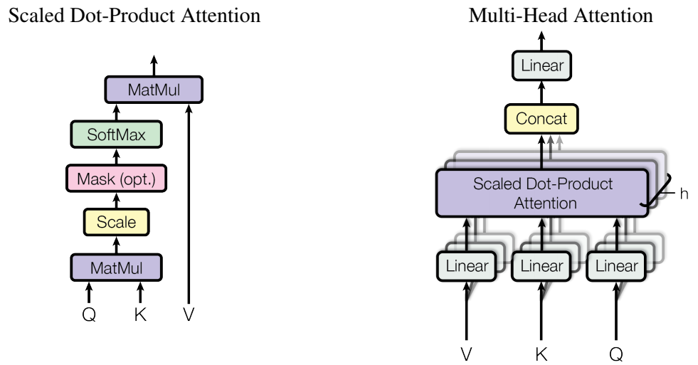
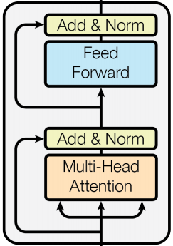
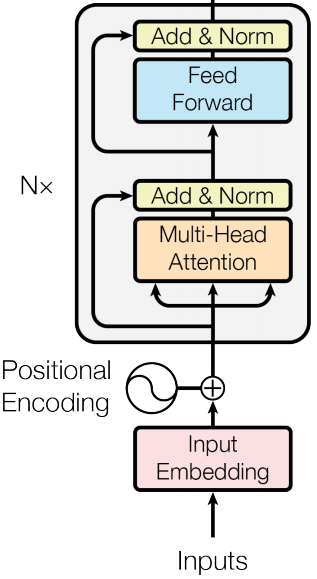
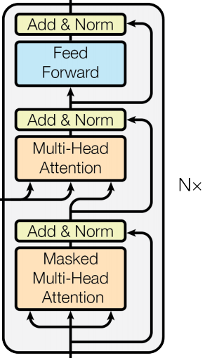
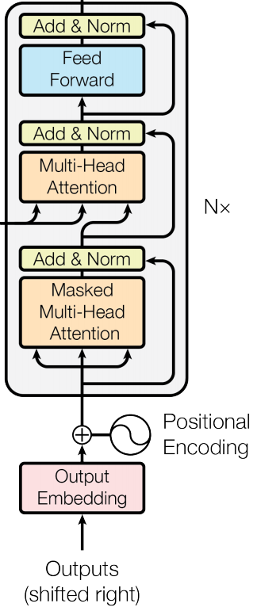
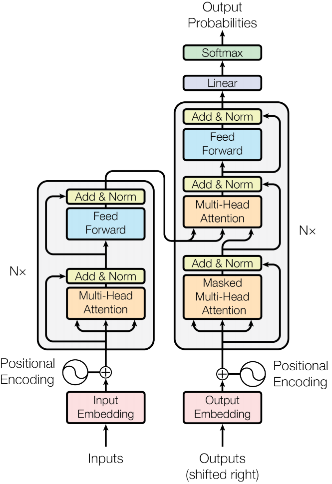

# 使用PyTorch从头实现Transformer

## 前言

 - 本文使用`Pytorch`从头实现`Transformer`，原论文[Attention is all you need paper](https://arxiv.org/abs/1706.03762)，最佳[解读博客](https://peterbloem.nl/blog/transformers)，学习[视频](https://www.youtube.com/watch?v=U0s0f995w14)
- GitHub项目地址[Some-Paper-CN](https://github.com/ytzfhqs/Some-Paper-CN)。本项目是译者在学习长时间序列预测、CV、NLP和机器学习过程中精读的一些论文，并对其进行了==中文翻译==。还有==部分最佳示例教程==。
- 如果有帮助到大家，请帮忙==点亮Star==，也是对译者莫大的鼓励，谢谢啦~

## SelfAttention

 - 整篇论文中，最核心的部分就是`SelfAttention`部分，`SelfAttention`模块架构图如下。



规范化公式：
$$
Attention(Q,K,V) = softmax(\frac{QK^T}{\sqrt{d_k}})V
$$

```python
class SelfAttention(nn.Module):
    def __init__(self, embed_size, heads):
        super(SelfAttention, self).__init__()
        self.embed_size = embed_size
        self.heads = heads
        self.head_dim = embed_size // heads

        self.values = nn.Linear(self.head_dim, self.head_dim, bias=False)
        self.keys = nn.Linear(self.head_dim, self.head_dim, bias=False)
        self.queries = nn.Linear(self.head_dim, self.head_dim, bias=False)
        self.fc_out = nn.Linear(heads * self.head_dim, embed_size)

    def forward(self, values, keys, query, mask):
        # batch_size
        N = query.shape[0]
        value_len, keys_len, query_len = values.shape[1], keys.shape[1], query.shape[1]

        values = values.reshape(N, value_len, self.heads, self.head_dim)
        keys = keys.reshape(N, keys_len, self.heads, self.head_dim)
        queries = query.reshape(N, query_len, self.heads, self.head_dim)
        # values, keys, queries shape:(N, seq_len, heads, head_dim)

        values = self.values(values)
        keys = self.keys(keys)
        queries = self.queries(queries)

        energy = torch.einsum("nqhd,nkhd->nhqk", [queries, keys])
        # queries shape:(N, query_len, heads, heads_dim)
        # keys shape:(N, key_len, heads, heads_dim)
        # energy shape:(N, heads, query_len, key_len)

        if mask is not None:
            energy = energy.masked_fill(mask == 0 ,float("-1e20"))

        attention = torch.softmax(energy / (self.embed_size ** (1/2)), dim=3)
        # attention shape:(N, heads, seq_len, seq_len)
        out = torch.einsum("nhql,nlhd->nqhd", [attention, values]).reshape(
            N, query_len, self.heads*self.head_dim
        )
        # attention shape:(N, heads, query_len, key_len)
        # values shape:(N, values_len, heads, head_dim)
        # after einsum (N, query_len, heads, head_dim) then flatten lash two dimensions

        out = self.fc_out(out)
        return out
```

- 请注意`values`、` keys`和 `query`的`Linear`层是==不带偏置==的！
- 上述代码中，较难理解的是`torch.einsum()`，爱因斯坦求和约定，``nqhd,nkhd->nhqk``可以理解为维度是 $ (n,q,h,d) $ 的张量与 $ (n,k,h,d) $ 的张量沿着维度$d$相乘，得到维度 $ (n,q,d,h) $ 重新排列后变成 $ (n,h,q,k) $ 。
- 传入`mask`矩阵是因为每个句子的长度不一样，为了保证维度相同，在长度不足的句子后面使用`padding`补齐，而`padding`是不用计算损失的，所以需要`mask`告诉模型哪些位置需要计算损失。被`mask`遮掩的地方，被赋予无限小的值，这样在`softmax`以后概率就几乎为0了。
- `mask`这个地方后面也会写到，如果不理解的话，先有这个概念，后面看完代码就会理解了。

## TransformerBlock

- 实现完`SelfAttention`，开始实现基本模块`TransformerBlock`，架构图如下。



```python
class TransformerBlock(nn.Module):
    def __init__(self, embed_size, heads, dropout, forward_expansion):
        super(TransformerBlock, self).__init__()
        self.attention = SelfAttention(embed_size, heads)
        self.norm1 = nn.LayerNorm(embed_size)
        self.norm2 = nn.LayerNorm(embed_size)

        self.feed_forward = nn.Sequential(
            nn.Linear(embed_size, forward_expansion * embed_size),
            nn.ReLU(),
            nn.Linear(forward_expansion * embed_size, embed_size)
        )

        self.dropout = nn.Dropout(dropout)

    def forward(self, value, key, query, mask):
        attention = self.attention(value, key, query, mask)
        # attention shape:(N, seq_len, emb_dim)
        x = self.dropout(self.norm1(attention + query))
        forward = self.feed_forward(x)
        out = self.dropout(self.norm2(forward + x))
        return out
```

- `Feed Forward`部分由两层带偏置的`Linear`层和`ReLU`激活函数

- 注意，`Norm`层是`LayerNorm`层，不是`BatchNorm`层。原因主要有：
  - 在进行`BatchNorm`操作时，同一个`batch`中的所有样本都会被考虑在内。这意味着一个样本的输出可能会受到同一批次其他样本的影响。然而，我们在处理文本数据时，通常希望每个样本(在此例中，是一个句子或一个句子段落)都是独立的。因此，`LayerNorm`是一个更好的选择，因为它只对单个样本进行操作。
  - 文本通常不是固定长度的，这就意味着每个`batch`的大小可能会有所不同。`BatchNorm`需要固定大小的`batch`才能正常工作，`LayerNorm`在这点上更为灵活。
- `forward_expansion`是为了扩展`embedding`的维度，使`Feed Forward`包含更多参数量。

## Encoder

- 实现完`TransformerBlock`，就可以实现模型的`Encoder`部分，模块架构图如下。



```python
class Encoder(nn.Module):
    def __init__(
            self,
            src_vocab_size,
            embed_size,
            num_layers,
            heads,
            device,
            forward_expansion,
            dropout,
            max_length
    ):
        super(Encoder, self).__init__()
        self.embed_size = embed_size
        self.device = device
        self.word_embedding = nn.Embedding(src_vocab_size, embed_size)
        self.position_embedding = nn.Embedding(max_length, embed_size)

        self.layers = nn.ModuleList(
            [
                TransformerBlock(
                    embed_size,
                    heads,
                    dropout=dropout,
                    forward_expansion=forward_expansion
                ) for _ in range(num_layers)
            ]
        )
        self.dropout = nn.Dropout(dropout)

    def forward(self, x, mask):
        N, seq_length = x.shape
        positions = torch.arange(0, seq_length).expand(N, seq_length).to(self.device)
        # positions shape:(N, seq_len)
        out = self.dropout(self.word_embedding(x) + self.position_embedding(positions))
        # out shape:(N, seq_len, emb_dim)
        for layer in self.layers:
            out = layer(out, out, out, mask)
        return out
```

- 为了更好的理解`positions`并没有按照论文中使用`sin`和`cos`构造，但这一部分并不困难，后面大家有兴趣可以进行替换。
- `positions`是为句子的每个字从0开始编号，假设有2个句子，第一个句子有3个字，第二个句子有4个字，即`positions = [[0,1,2],[0,1,2,3]]`
- `positions`和`x`进入`embedding`层后相加，然后进入`dropout`层

- 因为`TransformerBlock`可能有多个串联，所以使用`ModuleList`包起来
- 注意残差连接部分的操作。

## DecoderBlock

- 实现完`Encoder`部分，整个模型就已经完成一半了，接下来实现`Decoder`基本单元`DecoderBlock`，模块架构图如下。



```python
class DecoderBlock(nn.Module):
    def __init__(self, embed_size, heads, forward_expansion, dropout, device):
        super(DecoderBlock, self).__init__()
        self.attention = SelfAttention(embed_size, heads)
        self.norm = nn.LayerNorm(embed_size)
        self.transformer_block = TransformerBlock(
            embed_size, heads, dropout, forward_expansion)
        self.dropout = nn.Dropout(dropout)

    def forward(self, x, value, key, src_mask, trg_mask):
        attention = self.attention(x, x, x, trg_mask)
        query = self.dropout(self.norm(attention + x))
        out = self.transformer_block(value, key, query, src_mask)
        return out
```

- 注意！这里有两个`Attention`模块，首先输入`x`要进入`Masked Attention`得到`query`，然后与`Encoder`部分的输出组成新的`v,k,q`。
- 第二部分是基本单元`transformer_block`，可以直接调用。
- 注意残差连接部分即可。

## Decoder

- 实现完`Decoder`基本单元`DecoderBlock`后，就可以正式开始实现`Decoder`部分了，模块架构图如下。



```python
class Decoder(nn.Module):
    def __init__(
            self,
            trg_vocab_size,
            embed_size,
            num_layers,
            heads,
            forward_expansion,
            dropout,
            device,
            max_length,
    ):
        super(Decoder, self).__init__()
        self.device = device
        self.word_embedding = nn.Embedding(trg_vocab_size, embed_size)
        self.position_embedding = nn.Embedding(max_length, embed_size)

        self.layers = nn.ModuleList(
            [DecoderBlock(embed_size, heads, forward_expansion, dropout, device)
            for _ in range(num_layers)]
        )

        self.fc_out = nn.Linear(embed_size, trg_vocab_size)
        self.dropout = nn.Dropout(dropout)

    def forward(self, x, enc_out, src_mask, trg_mask):
        N, seq_length = x.shape
        positions = torch.arange(0, seq_length).expand(N, seq_length).to(self.device)
        x = self.dropout(self.word_embedding(x) + self.position_embedding(positions))

        for layer in self.layers:
            x = layer(x, enc_out, enc_out, src_mask, trg_mask)

        out = self.fc_out(x)
        return out
```

- `Decoder`部分的`embedding`部分和`Encoder`部分差不多，`word_embedding`和`position_embedding`相加进入`dropout`层。
- 基本单元`DecoderBlock`会重复多次，用`ModuleList`包裹。
- `enc_out`是`Encoder`部分的输出，变成了`value`和`key`。

## Transformer

- 在实现完`Encoder`和`Decoder`后，就可以实现整个`Transformer`结构了，架构图如下。



```python
class Transformer(nn.Module):
    def __init__(
            self,
            src_vocab_size,
            trg_vocab_size,
            src_pad_idx,
            trg_pad_idx,
            embed_size=256,
            num_layers=6,
            forward_expansion=4,
            heads=8,
            dropout=0,
            device='cpu',
            max_length=64
    ):
        super(Transformer, self).__init__()

        self.encoder = Encoder(
            src_vocab_size,
            embed_size,
            num_layers,
            heads,
            device,
            forward_expansion,
            dropout,
            max_length
        )

        self.decoder = Decoder(
            trg_vocab_size,
            embed_size,
            num_layers,
            heads,
            forward_expansion,
            dropout,
            device,
            max_length
        )

        self.src_pad_idx = src_pad_idx
        self.trg_pad_idx = trg_pad_idx
        self.device = device

    def mask_src_mask(self, src):
        src_mask = (src != self.src_pad_idx).unsqueeze(1).unsqueeze(2)
        # src_mask shape:(N, 1, 1, src_len)
        return src_mask.to(self.device)

    def mask_trg_mask(self, trg):
        N, trg_len = trg.shape
        trg_mask = torch.tril(torch.ones((trg_len, trg_len))).expand(
            N, 1, trg_len, trg_len
        )
        # trg_mask shape:(N, 1, 1, trg_len)
        return trg_mask.to(self.device)

    def forward(self, src, trg):
        src_mask = self.mask_src_mask(src)
        trg_mask = self.mask_trg_mask(trg)
        enc_src = self.encoder(src, src_mask)
        # enc_src shape:(N, seq_len, emb_dim)
        out = self.decoder(trg, enc_src, src_mask, trg_mask)
        return out
```

- 需要注意的是输入的`mask`构造方法`mask_src_mask`，和输出的`mask`构造方法`mask_trg_mask`。`mask_src_mask`是对输入的`padding`部分进行`mask`。`mask_trg_mask`根据输出构建下三角矩阵想象一下，当模型预测第一个字的时候，后面的所有内容都是不可见的，当模型预测第二个字的时候，仅第一个字可见，后面的内容都不可见...

## 检验

- 构建完成后，使用一个简单的小例子检验一下模型是否可以正常运行。

```python
if __name__ == "__main__":
    device = 'cpu'
    # x shape:(N, seq_len)
    x = torch.tensor([[1, 5, 6, 4, 3, 9, 5, 2, 0],
                      [1, 8, 7, 3, 4, 5, 6, 7, 2]]).to(device)
    trg = torch.tensor([[1, 7, 4, 3, 5, 9, 2, 0],
                        [1, 5, 6, 2, 4, 7, 6, 2]]).to(device)

    src_pad_idx = 0
    trg_pad_idx = 0
    src_vocab_size = 10
    trg_vocab_size = 10

    model = Transformer(src_vocab_size, trg_vocab_size, src_pad_idx, trg_pad_idx).to(device)
    out = model(x, trg[:, :-1])
    print(out.shape)
```

- 输出：(2, 7, 10)

