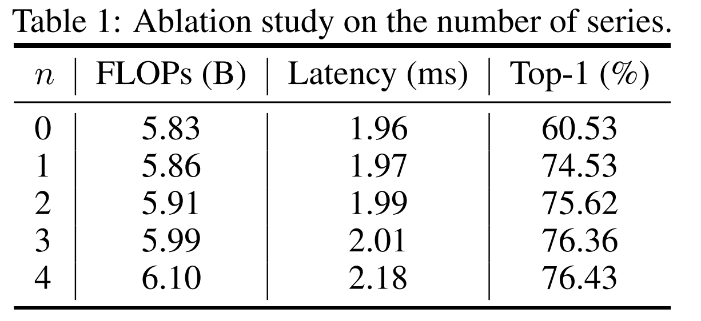
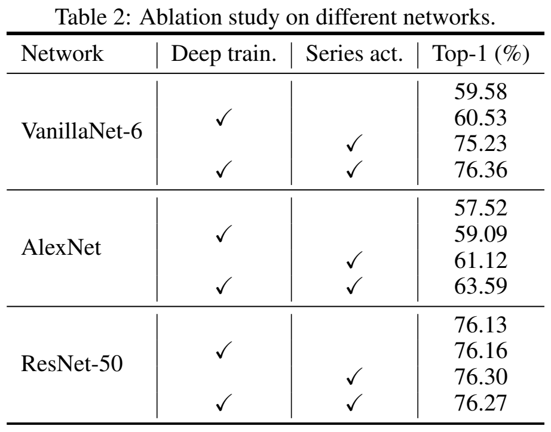
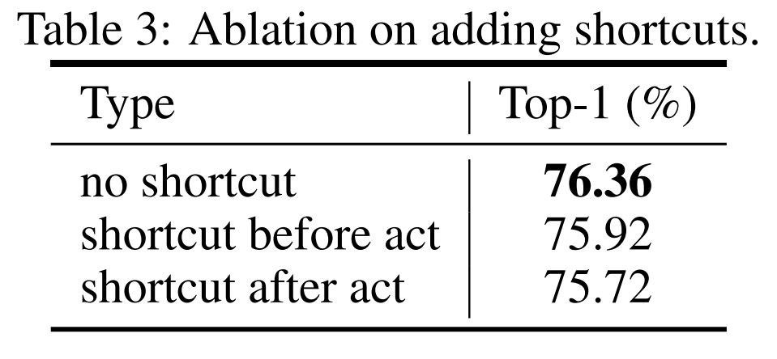
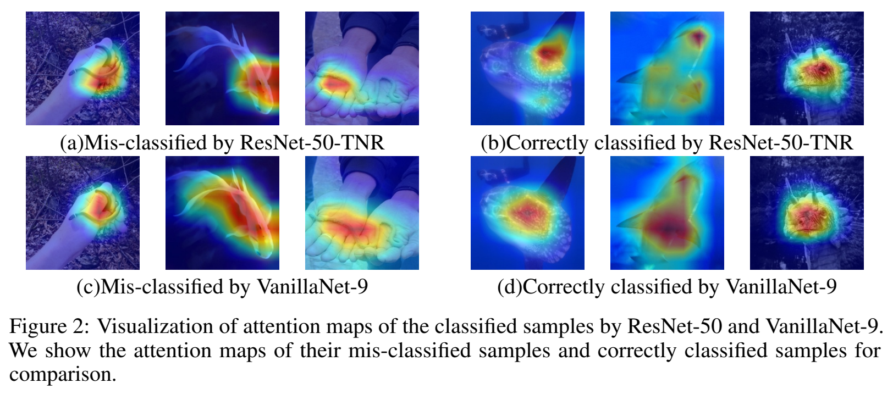
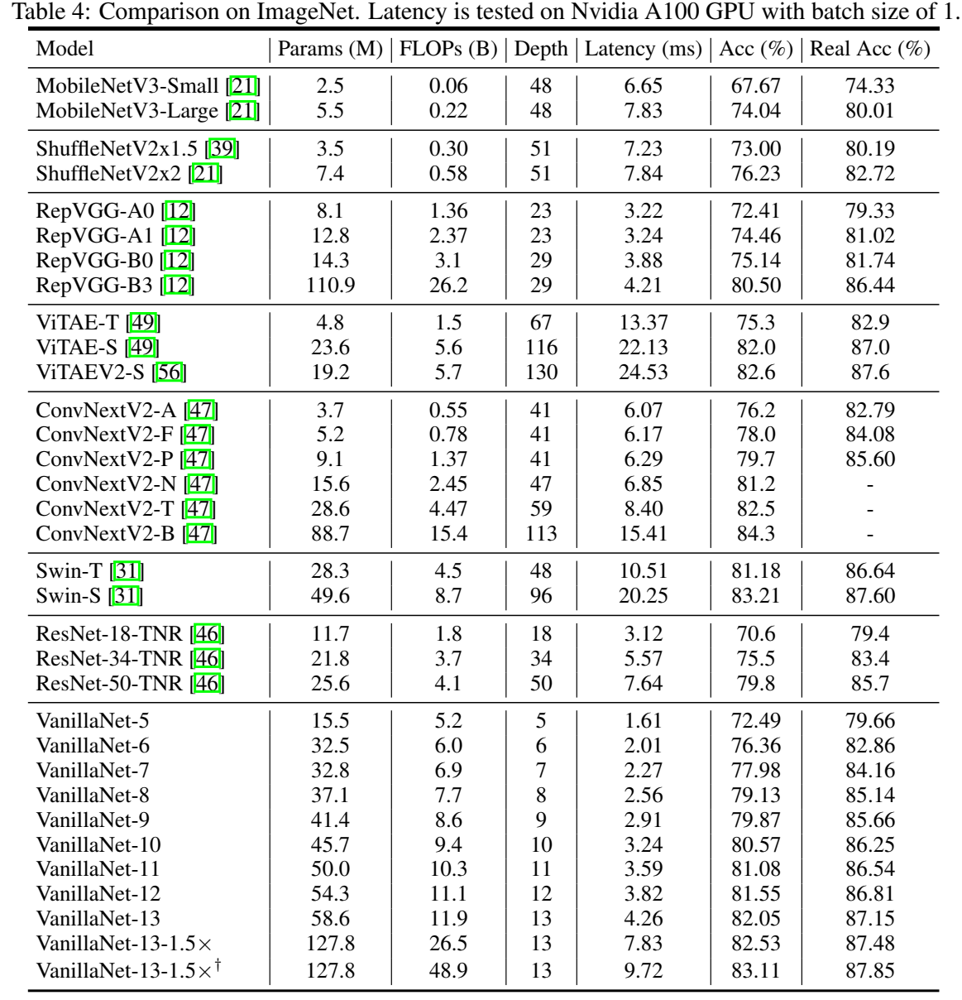
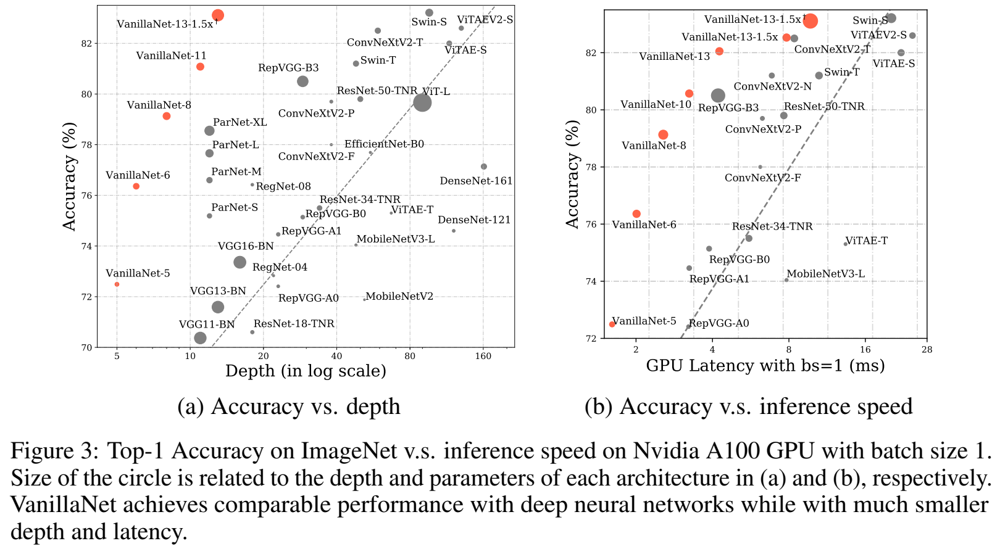

# VanillaNet：深度学习极简主义的力量

## 摘要

基础模型的核心是“更多不同”的理念，计算机视觉和自然语言处理方面的出色表现就是例证。然而，Transformer模型的优化和固有复杂性的挑战要求范式向简单性转变。在本文中，我们介绍了VanillaNET，这是一种设计优雅的神经网络架构。通过避免高深度、shortcuts和自注意力等复杂操作，VanillaNet简洁明了但功能强大。每一层都经过精心设计，非线性激活函数在训练后被修剪以恢复原始架构。VanillaNet克服了固有复杂性的挑战，使其成为资源受限环境的理想选择。其易于理解和高度简化的架构为高效部署开辟了新的可能性。广泛的实验表明，VanillaNet提供的性能与著名的深度神经网络和vision transformers相当，展示了深度学习中极简主义的力量。VanillaNet的这一富有远见的旅程具有重新定义景观和挑战基础模型现状的巨大潜力，为优雅有效的模型设计开辟了一条新道路。

## 简介

在过去的几十年里，人工神经网络取得了显著进步，其驱动因素是增加网络复杂性可以提高性能。这些网络具有大量神经元或Transformer块组成，能够执行各种类似人类的任务，例如人脸识别、语音识别、目标检测、自然语言处理和内容生成。现代硬件令人印象深刻的计算能力使神经网络能够以高精度和高效率完成这些任务。因此，人工智能嵌入式设备在我们的生活中变得越来越普遍，包括智能手机、人工智能相机、语音助手和自动驾驶。

不可否认，这一领域的一个显著突破是AlexNet的发展，它由12层组成，在大规模图像识别基准上实现了最先进的性能。在此成功的基础上，ResNet通过残差连接引入原始映射，从而能够在广泛的计算机视觉应用程序中训练具有高性能的深度神经网络，例如图像分类、对象检测和语义分隔。在这些模型中加入人工设计的模块，以及网络复杂性的持续增加，无疑增强了深度神经网络的表达能力，导致关于如何训练具有更复杂架构的网络以实现更高性能的研究激增。

除了卷积架构，Dosovitskiy将Transformer引入图像识别任务中，展示了其利用大规模训练数据的潜力。Zhai等研究了vision transformers架构的缩放定律，在ImageNet数据集上实现了令人印象深刻的90.45%（top-1）准确率，这表明更深层次的transformers架构，如卷积网络，往往表现出更好的性能。wang等进一步建议将Transformer深度扩展到1000层以获得更高的精度。liu等重新审视了神经网络的设计空间并引入了ConvNext，实现了与最先进的变压器架构相似的性能。

尽管经过良好优化的深度和复杂神经网络实现了令人满意的性能，但它们日益增加的复杂性给部署带来了挑战。例如，ResNets中的shortcuts操作在合并来自不同层的特征时会消耗大量的片外内存。

此外AS-MLP中的轴向位移和Swin Transformer中的位移窗口、自我注意力等复杂机制需要复杂的工程实现，包括重写CUDA代码。

这些挑战要求在时间网络设计中向简单转变范式。然而，ResNet的发展似乎导致放弃了具有纯卷积层的神经架构。。这主要是由于通过添加卷积层实现的性能提升没有达到预期，正如其他论文中所讨论的，没有shortcuts的普通网络会遭遇梯度消失，导致34层普通网络的性能低于18层的网络。此外像AlexNet和VGGNet这样的简单网络的性能在很大程度上呗深度复杂的网络所超越，比如ResNets和Vit。因此很少有人关注具有简单架构神经网络的设计和优化。解决这个问题并开发具有高性能的简洁模型将具有很大的价值。

为此，我们提出了VanillaNet，一种新颖的神经网络架构，强调设计的优雅和简单，同时在计算机视觉任务中保持卓越的性能。VanillaNet通过避免过多的深度、shortcut和复杂的操作（如自注意力）来实现这一点，从而产生一系列简化的网络，这些网络解决了具有的复杂性问题，非常适合资源有限的环境。为了训练我们提出的VanillaNets，我们对其简化架构相关的挑战进行了全面分析，并设计了“深度训练”策略。这种方法从包含非线性激活函数的几个层开始，随着训练的进行，我们逐渐消除这些非线性层，以便在保存推理数据的同时轻松合并。为了增强网络的非线性，我们提出了一种有效的、基于序列的激活函数，结合了多个可学习的仿射变换。应用这些技术已被证明可以显著提高不太复杂神经网络的性能。如图3所示，VanillaNet超越了现代网络，其复杂的架构涉及效率和准确性，突出了深度学习中极简主义方法的潜力。这项对VanillaNet的开创性研究为神经网络设计的新方向铺平了道路，调整了基础模型的既定规范，并为高效精致的模型框架建立了新的轨迹。

## VanillaNet结构

在过去的几十年里，研究人员在神经网络的基本设计上达成了一些共识。大多数最先进的图像分类网络架构应该由三部分组成：一个主干块，用于将输入图像从3个通道转换为多个通道，并进行下采样，一个学习有用的信息主题，一个全连接层分类输出。主体通常有四个阶段，每个阶段都是通过堆叠相同的块来派生的。在每个阶段之后，特征的通道将扩展，而高度和宽度将减小。不同的网络利用和堆叠不同种类的块来构建深度模型。

尽管现有的深度网络取得了成功，但它们利用大量复杂层来为以下任务提取高级特征。例如，著名的ResNet需要34或50个带shortcat的层才能在ImageNet上实现超过70%的top-1精度。Vit的基础版本由62层组成，因为自注意力中的K、Q、V需要多层来计算。

随着AI芯片雨来越大，神经网络推理速度的瓶颈不再是FLOPs或参数，因为现代GPU可以很容易地进行并行计算。相比之下，它们复杂的设计和较大的深度阻碍了它们的速度。为此我们提出了Vanilla网络，即VanillaNet，其框架图如图一所示。我们遵循流行的神经网络设计，包括主干、主体和全连接层。与现有的深度网络不同，我们在每个阶段只使用一层，以建立一个尽可能少的层的极其简单的网络。

图1：VanillaNet-6的模型架构，它仅包含6个卷积层，很容易在任何现代硬件上使用。输入特征的大小被下采样，同时通道在每个阶段加倍，这借鉴了AlexNet和VGGNet等经典神经网络的设计

这里我们详细展示了VanillaNet的架构，以6层为例。对于主干，我们使用步长为4的$4 \times 4 \times 3 \times C$卷积层，遵循流行设置，将具有3个通道的图像映射到具有C个通道的特征。在1、2和3阶段，使用步幅为2的最大池化层来减小尺寸和特征图，并将通道数增加2。在第4阶段，我们不增加通道数，因为它使用平均池化层。最后一层是全连接层，输出分类结果。

每个卷积核的内核大小为$1 \times 1$，因为我们的目标是在保留特征图信息的同时对每一层使用最小的计算成本。在每个$1 \times 1$卷积层之后应用激活函数。为了简化网络的训练过程，还在每一层之后添加了批量归一化。VanillaNet没有shortcut，因为我们凭经验发现添加shortcut几乎没有提高性能。

这也带来的另一个好处，即所提出的架构非常容易实现，因为没有分支和额外的块，例如squeeze和excitation block。虽然VanillaNet的体系结构简单且相对较浅，但其弱非线性导致性能受到限制，因此，我们提出了一系列技术来解决该问题。

## 训练Vanilla网络

在深度学习中，通过在训练阶段引入更强的容量来增强模型的性能是很常见的。为此，我们建议利用深度训练技术来提高所提出的VanillaNet在训练期间的能力，因为深度网络比浅层网络具有更强的非线性。

### 深度训练策略

深度训练策略的主要思想是在训练过程开始时训练过程开始时训练两个具有激活函数的卷积层而不是单个卷积层。激活函数随着训练次数的增加，逐渐减少为身份映射。在训练结束时，两个卷积可以很容易地合并到一个卷积中，以减少推理时间。这种想法也广泛用于CNN。然后，我们将详细描述如何执行此技术。

对于激活函数$A(x)$（可以是ReLU和Tanh等常用函数），我们将其与恒等映射相结合，可以表示为:
$$
A^{\prime}(x) = (1-\lambda)A(x) + \lambda x
$$

其中$\lambda$是一个超参数，用于平衡修改后的激活函数$A^{\prime}(x)$的非线性。将当前时期和深度训练时期的数量分别表示为$e$和$E$。我们设置$\lambda = \frac{e}{E}$。因此，在训练开始时$(e=0)$，$A^{\prime}(x) = A(x)$，这意味着网络具有很强的非线性。当训练收敛时，我们有$A(x) = x$，这意味着两个卷积层在中间没有激活函数。我们进一步演示了如何合并这个卷积层。

我们首先将每个批量归一化层及其前面的卷积转换为单个卷积。我们用$W \in \mathbb{R}^{C_{out} \times (C_in \times k \times k)}$，$B \in \mathbb{R}^{C_{out}}$表示有$C_{in}$个输入通道，$C_{out}$个输出通道和内核大小$k$卷积核的权重和偏置矩阵。批量归一化中的scale、shift、mean和variance分别表示为$\gamma,\ \beta,\ \mu,\ \sigma \in \mathbb{R}^{C_{out}}$。合并的权重和偏置矩阵是：
$$
W_{i}^{\prime} = \frac{\gamma_i}{\sigma_i}W_i,\ B_{i}^{\prime} = \frac{(B_i - \mu_i)\gamma_i}{\sigma_i} + \beta_i
$$
其中下标$i \in \{1,2,...,C_{out}\}$表示第i个输出通道中的值。将卷积与批归一化合并后，我们开始合并两个1 \times 1卷积。用$x \in R^{(C_{in} \times 1 \times 1) \times (H^{\prime} \times W^{\prime})}$表示输出和输入特征，卷积可以表示为：
$$
y = W * x = W \cdot im2col(x) = W \cdot X
$$
其中$*$表示卷积运算，$\cdot$表示矩阵乘法，$X \in \mathbb{R}^{(C_{in} \times 1 \times 1) \times (H^{\prime} \times W^{\prime})}$从im2col操作导出，将输入转换为对应于内核形状的矩阵。幸运的是，对于$1 \times 1$卷积，我们发现im2col操作变成一个简单的整型操作，因为不需要重叠的滑动内核。因此，将两个卷积层的权重矩阵分别表示为$W^1$和$W^2$，没有激活函数的两个卷积层表示为：
$$
y = W^1 * (W^2 * x) = W^1 \cdot W^2 \cdot im2col(x) = (W^1 \cdot W^2) * X
$$
因此可以合并$1 \times 1$卷积而不增加推理速度。

### Series  Informed Activation Function

深度神经网络提出了深度神经网络提出了几种不同的激活函数，包括最流行的整流线性单元(ReLU)及其变体(PReLU、GeLU和Swish)。他们专注于使用不同的激活函数来提升深度复杂网络的性能，然而，正如现有工作的理论证明，简单和浅层网络的有限功率主要是由较差的非线性引起的，这与深层和复杂网络不同，因此尚未得到充分研究。

实际上，改善神经网络的非线性有两种方法：堆叠非线性激活层或增加每个激活层的非线性，而现有网络的趋势选择前者，导致并行计算能力过剩时的高延迟。

改善激活层非线性的一种直接想法是堆叠。激活函数的串行堆叠是深度网络的关键思想。相反，我们转向并发堆叠激活函数。将神经网络中输入$x$的单个激活函数表示为$A(x)$，可以是$ReLU$和$Tanh$等常用函数。$A(x)$的并发堆叠可以表示为：
$$
A_s(x) = \sum^{n}_{i=1}a_iA(x+b_i)
$$
其中n表示堆叠激活函数的数量，$a_i$ , $b_i$是每个激活的规模和偏置，以避免简单的累积。通过并发堆叠可以大大增强激活函数的非线性。

为了进一步丰富序列逼近能力，我们使用基于序列的函数能够通过改变其相邻的输入来学习全局信息，这与BNET类似。具体来说，给定一个输入特征$x\in \mathbb{R}^{H×W×C}$，其中$H$、$W$和$C$是其宽、 高和通道的数量，激活函数被表述为：
$$
A_s(x_h,w,c) = \sum_{i,j\in{-n,n}}a_{i,j,c}A(x_{i+h,j+w,c}+b_c)
$$
其中$h \in \{1,2,\cdots,H\}$，$w \in \{1,2,\cdots,C\}$。很容易看出，当$n=0$时，基于序列的激活函数$As(x)$退化为普通激活函数$A(x)$，这意味着所提出的方法可以视为现有激活函数的一般扩展。我们使用ReLU作为基本激活函数来构造我们的系列，因为它对于GPU中的推理非常有效。

我们进一步分析了所提出的激活函数与其相应的卷积层相比的计算复杂度。对于内核大小为$k$，$C_{in}$为输入通道和$C_{out}$为输出通道的卷积层，计算复杂度为：
$$
O(CONV) = H \times W \times C_{in} \times C_{out} \times k^2
$$

而序列激活层的计算成本是：
$$
O(SA) = H \times W \times C_{in} \times n^2
$$
因此我们有：
$$
\frac{O(CONV)}{O(SA)} = \frac{H \times W \times C_{in} \times C_{out} \times k^2}{H \times W \times C_{in} \times n^2} = \frac{C_{out} \times k^2}{n^2}
$$
以VanillaNet-B中的第4阶段为例，其中C_{out} = 2048,k=1和n=7，比率为84。总之，所提出的激活函数计算成本仍然远低于卷积层。更多的实验复杂性分析将在下一节中展示。

## 实验

在本节中，我们进行实验来验证所提出的VanillaNet在大规模图像分类上的性能。提供消融实验以调查拟议的VanillaNet每个组件的有效性。我们还将VanillaNet的特征可视化，以进一步研究所提出的网络如何从图像中学习。

### 消融实验

在本节中，我们进行消融实验以研究所提出模块的有效性，包括序列激活函数和深度训练技术。此外，我们分析了在提议的VanillaNet中添加shortcuts操作的影响。

Informed Activation Function：在上一节中，我们提出了序列激活函数来增强普通激活函数的性能并实现特征图中的全局信息交换。

表1显示了所提出的VanillaNet在上述等式中使用不同数量$n$的性能。当$n=0$时，激活函数将生成普通ReLU激活函数。

虽然这个网络推理速度比使用序列激活函数要高，但该网络在ImageNet数据集上只能达到60.53%的top-1精度，无法应用于实际应用。它证明了激活函数的不良非线性导致普通网络的性能不佳。

为此，我们提出了序列激活函数。当$n=1$时，网络可以达到74.53%的准确率，与60.53%相比有了巨大的进步。结果证明了所提出的激活函数的有效性。当n的数量增加时，网络的性能会提高。我们发现$n=3$在top-1准确性和延迟方面取得了很好的平衡。

因此，我们在其余实验中使用n=3。需要注意的是，与原始网络相比，所提出的激活函数的FLOPs非常小，这与我们上上述等式中得出的结论相同。

深度训练的影响：由于VanillaNet非常浅，我们建议增加训练非线性以提高其性能。然后我们分析了所提出的深度训练技术的有效性。表2显示了使用VanillaNet-6深度训练技术的结果。结果原始VanillaNet达到了75.23%的top-1准确率，这是基准。通过使用深度训练技术，所提出的VanillaNet可以达到76.36%的准确率。结果表面，所提出的深度训练技术对浅层网络很有用。

此外，我们进一步在其他网络中应用深度训练和系列激活函数来展示这两种技术的泛化能力。表2报告了AlexNet和ResNet-50这两个经典的深度神经网络在ImageNet数据集上的结果。原始的AlexNet在12层的情况下只能达到57.52的准确率。通过应用所提出的深度训练和序列激活函数，AlexNet的性能可以大大提升约6%，这表明所提出的技术对浅层网络非常有效。当转向架构相对复杂的ResNet-50时，性能提升很小。这一结果表明，在没有所提出的技术情况下，深度复杂的网络已经具有足够的非线性。

shortcuts的影响：在深度神经网络中，一个常识是添加shortcuts可以在很大程度上简化训练过程并提高性能。为此，我们研究了shortcut方式是否有利于浅层网络和ximple网络的性能。我们建议使用两种shortcuts的位置，即激活函数之后的shortcuts和激活函数之前的shortcuts，它们分别在原始ResNet和PreAct-ResNet中提出。由于VanillaNet中的通道数很大而且原始卷积的内核大小为$1 \times 1$，因此，我们使用无参数shortcuts。值得注意的是，如果步幅为2，则无参数shortcuts将使用平均池化来减小特征图的大小，如果通道数量增加，则无参数shortcut将对后面的额外通道使用padding。

表3显示了添加shortcut的消融实验。我们惊奇的发现，尽管使用任何类型的快捷方式，但使用快捷方式对所提出的VanillaNet的性能几乎没有改进。我们认为普通网络的瓶颈是弱非线性。shortcut对于提高非线性是无用的，并且可能会降低非线性性，因为shortcut会跳过激活函数以降低普通网络的深度，从而导致性能降低。

### 注意力可视化

为了更好的理解所提出的VanillaNet，我们使用GradCam++进一步可视化特征，它利用最后一个卷积层生成的特征图的正偏导数的加权组合，生成关于特定类的很好的视觉解释。

图2显示了具有相似性能的VanillaNet-9和ResNets-50-TNR的可视化结果。红色表示该区域有较高权重，而蓝色表示预测类别的权重较弱。我们可以发现这两个网络对于不同的样本有不同的注意力图。可以很容易的发现，对于ResNet-50，活动区域的面积很小。对于深度只有9的VanillaNet，活动区域比深度网络大得多。我们认为VanillaNet在提取输入图像中的特征方面可能很强，并通过使用大量参数和FLOPs彻底提取它们的信息。相比之下，VanillaNet在分析部分有用区域时可能较弱，因为非线性度相对较低。

### 与SOTA架构的比较

为了说明所提出方法的有效性，我们在ImageNet数据集上进行了实验，该数据集由224 \times 224像素的RGN彩色图像组成。ImageNet数据集包含128万张训练图像和5万张具有1000个类别的验证图像。我们利用强正则化，因为所提出的VanillaNet在每一层都有大量参数，可以从具有优先非线性的图像中捕获有用信息。我们还报告了标签被细化的ImageNet Real结果。延迟是在Nvidia A100 GPU上测试的。

我们提出了具有不同层数的VanillaNet架构。表4显示了使用不同网络在ImageNet数据集上的分类结果。我们列出了参数数量、  FLOPs、深度、GPU延迟和准确性以进行比较。在过去的几十年里，研究人员专注于最大限度地减少便携式网络的ARM/CPU中的FLOP或延迟，因为他们假设边缘设备的计算能力是有限的。随着现代  AI  芯片的发展，无人驾驶汽车和机器人等多种移动设备需要能够携带多个具有巨大计算能力的  GPU，以寻求外部输入的实时反馈。因此，我们测试批量大小为  1  的  GPU  延迟，这意味着  AI  芯片有足够的计算能力来计算每个网络。在这种情况下，我们发现推理速度与FLOPs和参数的数量关系不大。以  MobileNetV3‑Large  为例，虽然它的FLOPs非常低（0.22B），但它的GPU延迟为7.83，甚至比我们的VanillaNet‑13的11.9BFLOPs还要大。事实上，这种设置下的推理速度与复杂度和层数高度相关。我们可以比较一下ShuffleNetV2x1.5和ShuffleNetV2x2的推理速度。实际上，它们的区别仅在于通道数。因此，虽然它们的参数个数和FLOPs相差很大（0.3B  vs  0.6B），它们的推理速度几乎相同（7.23  和  7.84）。我们还可以在表  4  中发现，简单的架构包括没有额外分支和复杂块（例如，squeeze和excitation  block或densely connects）的  ResNet、VGGNet和我们的VanillaNet实现了最高的推理速度。

为此，我们提出了  VanillaNet，它很简单，卷积层很少，没有任何分支（甚至没有捷径）。我们在VanillaNets  中设置不同的层数来构建一系列网络。如表  4  所示，VanillaNet‑9  在  GPU  中仅以2.91ms  的推理速度实现了  79.87%  的准确率，比具有类似性能的ResNet‑50  和  ConvNextV2‑P  快  50%  以上。令人惊讶的结果证明了  VanillaNet在现有深度网络上进行实时处理的潜力。我们还缩放通道数和池化大小以获得所提出的  VanillaNet‑13‑1.5׆ ，它在  ImageNet  上达到了  83.11%  的  Top‑1  准确率，这表明所提出的  vanilla  神经网络仍然有能力获得如此高的准确率大规模图像分类任务的性能。建议我们在图像分类上可能不需要深度和复杂的网络，因为扩展  VanillaNets  可以实现与深度网络相似的性能。

图  3  显示了不同架构的深度和推理速度。批量大小为1的推理速度与网络深度而非参数数量高度相关，这表明简单和浅层网络在实时处理方面具有巨大潜力。可以很容易地发现，所提出的VanillaNet在所有这些具有低  GPU  延迟的架构中实现了最佳的速度‑精度权衡，这证明了当计算能力足够时，所提出的VanillaNet的优越性。

### 在COCO上的实验

为了进一步证明所提出的VanillaNet在下游任务上的有效性，我们在COCO数据集中进行了评估。我们使用RetinaNet和Mask-RCNN作为框架来评估所提出的方法。FPS是在Nvidia A100 GPU上测得的。

表  5  显示了所提出的  VanillaNet  在  COCO  检测和分割方面的性能。提议的VanillaNet可以成功地实现与ConvNext和Swin主干相似的性能。尽管VanillaNet的FLOPs和参数远高于Swin和ConvNext，但它具有更高的FPS，这证明了vanilla架构在对象检测和实例分割任务上的有效性。

## 结论

本文充分研究了建立高性能神经网络的可行性，但没有复杂的架构，如快捷方式、高深度和注意层，这体现了设计向简单和优雅的范式转变。我们为VanillaNets提出了一种深度训练策略和系列激活函数，以增强其在训练和测试过程中的非线性并提高其性能。大规模图像分类数据集的实验结果表明，VanillaNet的性能与著名的深度神经网络和视觉转换器相当，从而突出了极简主义在深度学习中的潜力。我们将进一步探索更好的参数分配，以获得高性能的高效VanillaNet架构。总之，我们证明可以使用非常简洁的架构与最先进的深度网络和视觉转换器实现可比的性能，这将在未来释放普通卷积网络的潜力。

